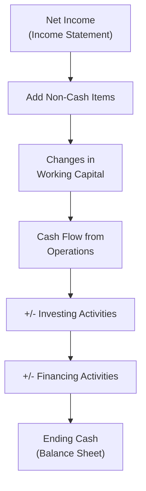

## Overview and Introduction

So, let’s say you’re sitting in a conference room, analyzing a company’s future finances. You’ve just wrapped up forecasts for the income statement—pretty thorough, right? But then your boss (or perhaps your client) says, “Great job, but can you also show us how the balance sheet and cash flow statement might evolve over the next three years?” At that point, you might think, “Uh, sure, that can’t be too hard… right?” And that’s exactly where a thorough and systematic approach to projecting the balance sheet and cash flow items becomes essential. In this section, we’ll unravel these steps, bridging our income statement projections with the rest of the financial statements.

We’ll cover working capital forecasts, intangible assets, capital expenditures, debt, equity, and how to tie everything into a comprehensive cash flow statement. Along the way, we’ll highlight IFRS vs. US GAAP nuances and discuss ratio checks, so your forecast stands on a solid foundation. 

## Linking Income Statement to Balance Sheet

### A Systematic Approach

Projecting the balance sheet relies on tying key items—like accounts receivable (AR), inventory, and accounts payable—back to income statement figures (such as revenue or cost of goods sold). By leveraging turnover ratios or “days-based” methodologies (like Days Sales Outstanding), you maintain consistency between how quickly you expect to sell products or collect from customers (as forecasted in your revenue assumptions) and how quickly you must pay suppliers (as reflected in payable days or turnover).

An example: if you forecast your revenue to grow by 10% next year, it generally implies AR might also expand—unless you drastically shorten or extend payment terms. So, if your Days Sales Outstanding is expected to remain stable, an increase in revenue typically means a proportionate growth in the AR balance.

### Working Capital Considerations

Working capital is basically current assets minus current liabilities. It’s a core indicator of short-term liquidity. If you get sloppy here, your projections might show an out-of-whack picture: maybe an exploding accounts receivable yet zero growth in inventories or payables, which rarely makes sense in the real world.

Consider applying standard turnover metrics:

• Days Sales Outstanding (DSO) for accounts receivable:  
  DSO = (Accounts Receivable ÷ Total Credit Sales) × 365  

• Days Inventory on Hand (DIH) for inventory balances:  
  DIH = (Inventory ÷ Cost of Goods Sold) × 365  

• Days Payables Outstanding (DPO) for accounts payable:  
  DPO = (Accounts Payable ÷ Purchases) × 365  

When you keep these metrics roughly consistent with historical or industry norms, you avoid unintentional leaps that can create unrealistic forecasts. Of course, if management signals a strategic change—like renegotiating supplier payment terms—then you’d adjust where needed.

## Projecting Asset Accounts

### Current Assets

Current assets are highly sensitive to sales and cost projections. For instance, if your sales are growing significantly, your cash, receivables, and inventory might rise—unless you anticipate collecting from customers more quickly or, perhaps, adopting just-in-time inventory practices. 

• Accounts Receivable: Often forecast using a turnover ratio or days-based approach linked to sales.  
• Inventory: Typically tied to cost of goods sold (COGS) using an assumed inventory turnover or days inventory measure.  
• Cash & Marketable Securities: This can be approached by forecasting minimum cash balances relative to monthly outflows or as a function of the company’s capital policy.  

### Long-Term Assets

Now, for your long-term assets, you’ll want to think about capital expenditures (CapEx) and depreciation. For example, let’s say the company invests heavily in new factory equipment next year. That CapEx figure flows onto the balance sheet as an increase in property, plant, and equipment (PP&E). The depreciation expense over the asset’s useful life lowers the net PP&E balance each year and hits the income statement as well.

You might create a schedule that, for each year, sums:

• Opening PP&E  
• Plus: New CapEx  
• Less: Depreciation  
• Less: Disposals (if any)  
• Equals: Ending PP&E  

It also helps to reflect intangible investments: maybe the company invests in a new patent or undertakes an R&D project that yields intangible capital. Under IFRS, you might capitalize some development costs, while US GAAP may require more immediate expensing. 

### Intangible Assets and Goodwill

Goodwill often arises from acquisitions, representing the premium paid above the fair value of net assets. Forecasts for goodwill might remain static if there’s no new M&A activity. On the other hand, major acquisitions or reorganizations could trigger revaluations of intangible assets. Also, be mindful of impairment or amortization possibilities:

• IFRS typically tests goodwill for impairment annually or whenever there’s an indication of impairment.  
• US GAAP uses a two-step impairment test for goodwill (though it’s sometimes simplified in practice).  

Heartbreak can follow if an over-optimistic forecast shows no impairment, while real-world circumstances would require taking a hit. So, carefully consider management’s guidance and your own analysis of synergy assumptions.

## Projecting Liabilities and Equity

### Short-Term Liabilities

Accounts payable is easiest to project with a days-payables approach, linking your purchase costs to your forecast for COGS. Additional short-term liabilities (like accrued expenses or short-term borrowings) typically depend on the company’s operating cycle, compensation policies, or short-term funding strategy. If the company historically draws on a line of credit to meet seasonal needs, factor that in once again.

### Long-Term Debt and Capital Structure

Imagine you’re the CFO, chatting with your banker about next year’s capital needs. If you’re projecting expansions, new acquisitions, or other significant outlays, you might decide to issue fresh debt or equity. Alternatively, you might plan a share buyback to manage your capital structure. So, in your forecast:

• Model new debt based on the amount of external funding required.  
• Incorporate expected changes in interest expense as part of the income statement forecasts.  
• Reflect how principal repayments reduce your outstanding debt balance over time.

Also, pay attention to the expected leverage ratio:


\text{Debt to Equity} = \frac{\text{Total Liabilities}}{\text{Equity}}


If your forecast implies a huge spike that’s out of line with your typical strategy, it may signal the need to adjust your assumptions.

### Equity Components

Equity forecasting involves retained earnings plus any new share issuance (or share repurchases). Retained earnings is basically the cumulative net income minus dividends. So, if net income is expected to rise, your retained earnings will follow—as long as you’re not paying out all of your earnings in dividends. 

Try to keep your forecast aligned with:

• Management’s dividend payout policy.  
• Proposed share buyback or share issuance programs.  
• Potential negative retained earnings if the company has a history of net losses or significant write-downs.

## Constructing the Cash Flow Statement (Indirect Method)

The cash flow statement is usually the final piece—though ironically, many analysts start there to see the “story” behind the numbers. The indirect method starts with net income, then adjusts for non-cash items (e.g., depreciation, amortization, and impairments), plus or minus changes in working capital, to reach Cash Flow from Operations (CFO).

### Basic Layout of the Indirect Method

Below is a rough guide for the structure, starting with Net Income:

1. Start with Net Income.  
2. Add back depreciation, amortization, impairments (non-cash items).  
3. Subtract gains (or add losses) on sales of assets (again, a non-operating item typically recognized on the income statement).  
4. Include changes in working capital: (AR, inventory, AP, etc.).  

   CFO = Net Income + Non-cash expenses − Non-cash gains ± Changes in working capital  

Then Cash Flow from Investing (CFI) captures outflows for CapEx or acquisitions and inflows from asset disposals. Cash Flow from Financing (CFF) includes new debt issuance, repayment of principal, issuance or repurchase of stock, and dividends paid.

### IFRS vs. US GAAP Differences

Under IFRS, interest paid or received, as well as dividends received, can be classified differently (operating, investing, or financing) depending on the company’s policy. Dividends paid may also land in either operating or financing, although most prefer financing. Under US GAAP, interest paid, interest received, and dividends received generally appear in operating flows, while dividends paid appear in financing flows.

Lease payments also differ somewhat: IFRS 16 capitalizes nearly all leases, while US GAAP offers classifications under ASC 842 for finance vs. operating leases, influencing how you record interest and principal components on the statement of cash flows.

### Reconciling and Validating

When you build a forecasted cash flow statement, do a quick ratio check:

• CFO to Net Income: High growth in net income with stagnant CFO might be a red flag.  
• CFO to Total Debt: If the company’s CFO is consistently less than its debt obligations, that’s a warning sign.  
• CapEx vs. Depreciation: If you’re expecting large expansions, CapEx should exceed depreciation; if not, you might be projecting a net shrinkage of productive assets.

Below is a simplified Mermaid diagram describing the high-level flow from Net Income (Income Statement) to Ending Cash (Balance Sheet):

Notice how the final Ending Cash must align back to the balance sheet’s forecasted cash total.

## Common Pitfalls and Best Practices

• Ignoring Operating Cycle Linkages: Failing to tie AR and inventory growth to revenue and COGS leaves you with inconsistent forecasts.  
• Forgetting Depreciation & CapEx Alignment: A big jump in PP&E with no matching depreciation expense is an instant red flag.  
• Mixing IFRS/US GAAP for Cash Flow Classification: Keep your classification consistent with whichever standard the company follows.  
• Overly Optimistic Growth: Sometimes, analysts assume huge sales growth that never translates into actual cash flow. Double-check that your CFO grows if your net income is also rising.  
• Omitting Possibly Inevitable Impairments: If an acquired asset underperforms, goodwill or intangible asset impairment might be needed.  

## A Brief Example: ACME Tools Plc.

Let’s say ACME Tools forecasts next year’s revenues at \$200 million (a 10% increase). They expect:

• DSO to remain around 55 days.  
• Inventory turnover to stay consistent at 4 times a year.  
• Payables to remain at 40 days.  

Quick math (approximate) for AR:

DSO = 55 days.  
Average daily sales = \$200 million ÷ 365 ≈ \$547,945.  
AR = 55 × \$547,945 ≈ \$30.1 million.

If previously AR was \$28 million, you see a projected climb that’s plausible with the revenue increase. Similarly, if inventory turnover is 4, then Cost of Goods Sold = 70% of revenue = \$140 million. Average Inventory = \$140 million ÷ 4 = \$35 million. Factor in these changes on the balance sheet, and you’ll see how your working capital evolves.

After you forecast net income, assume a certain depreciation expense tied to the historical rate. If last year’s depreciation was \$5 million, and CapEx is forecast at \$7 million, you might continue a slow growth in net PP&E after factoring out disposals.

Finally, wrap it up in the cash flow statement. ACME Tools might produce net income of \$12 million. They add back \$5 million in depreciation. If working capital grows by \$3 million, CFO becomes \$14 million. Then they spend \$7 million in CapEx, resulting in cash flow from investing (CFI) of -\$7 million. They decide to raise \$2 million in new debt, net of repayments, so CFF is \$2 million. Summing these yields an overall increase in cash of \$9 million, which should align with that year’s ending cash projection.

## Glossary

• Accounts Receivable (AR) Turnover: Measures how many times a company’s receivables are collected per period, i.e., total credit sales / avg. AR.  
• Working Capital: Difference between current assets and current liabilities, representing short-term liquidity.  
• Goodwill: The premium paid above the fair value of a target’s net identifiable assets in an acquisition.  
• Indirect Method (Cash Flow): A cash flow statement format starting with net income and adjusting for non-cash items and changes in working capital to compute CFO.  
• Debt/Equity Ratio: A leverage measure computed as total liabilities / total shareholders’ equity.  
• Lease Payments (IFRS 16 / ASC 842): IFRS 16 capitalizes most leases; ASC 842 differentiates between finance and operating leases under US GAAP.

## References & Further Reading

• Revsine, Collins, Johnson, and Mittelstaedt, “Financial Reporting & Analysis.”  
• IFRS 16 Leases: https://www.ifrs.org/issued-standards/list-of-standards/  
• FASB (ASC 842) for US GAAP Leases: https://www.fasb.org  

----------

## Test Your Knowledge: Projecting Balance Sheet and Cash Flow Items



### Which ratio is often used to project accounts receivable based on revenue forecasts?

- [ ] Debt/Equity Ratio
- [x] Days Sales Outstanding
- [ ] Inventory Turnover
- [ ] Times Interest Earned

> **Explanation:** Days Sales Outstanding (DSO) measures how long it takes the company to collect from its customers, making it the key ratio to link revenue to expected AR levels.

### What is a typical component of the indirect method for building the statement of cash flows?

- [ ] Calculating total credit sales directly from the balance sheet
- [ ] Starting with revenue and subtracting COGS
- [x] Starting with net income and adjusting for non-cash items
- [ ] Ignoring working capital changes

> **Explanation:** Under the indirect method, you begin with net income and reconcile it to operating cash flow by adjusting for non-cash expenses and changes in working capital.

### Under IFRS, how may a company classify dividends received in the statement of cash flows?

- [ ] Only in financing activities
- [x] Either operating or investing activities
- [ ] Only in operating activities
- [ ] Only in investing activities

> **Explanation:** IFRS provides flexibility; dividends received can appear in operating or investing activities depending on company policy. US GAAP, however, generally places dividends received in operating activities.

### Which of the following best describes the relationship between depreciation expense and capital expenditures for a growing company?

- [x] CapEx generally exceeds depreciation if the company is expanding
- [ ] Depreciation is always greater than CapEx
- [ ] Depreciation equals CapEx in a steady-state scenario
- [ ] They are unrelated and vary randomly each period

> **Explanation:** In a growth phase, CapEx typically exceeds the depreciation expense because the firm is acquiring new long-lived assets at a rate faster than they are being depreciated.

### Which of these items typically decreases when Days Sales Outstanding (DSO) is reduced?

- [x] Accounts Receivable
- [ ] Inventory
- [x] Working Capital
- [ ] Long-term Debt

> **Explanation:** If DSO is declining, it indicates the company is collecting cash more quickly, leading to lower AR and generally lower working capital requirements.

### When projecting current liabilities, which of the following methods is most common for accounts payable?

- [ ] Linking it to net income growth
- [ ] Using intangible asset amortization
- [ ] Arbitrarily setting a fixed amount each year
- [x] Employing a days-payables outstanding (DPO) approach

> **Explanation:** Accounts payable are frequently forecast using a DPO metric, correlating the timing of outgoing payments to the company’s purchases/COGS.

### How do you typically treat impairment of goodwill in forecasting financial statements?

- [x] Consider it if underlying business units are underperforming
- [ ] Always assume 0 impairment for future periods
- [x] Reflect changes based solely on the historical pattern
- [ ] Remove goodwill from the balance sheet entirely

> **Explanation:** Analysts should critically evaluate if the acquired businesses are underperforming, which may lead to a goodwill write-down. Goodwill is tested for impairment under IFRS and US GAAP.

### What’s a major difference between IFRS 16 and ASC 842 in projecting lease-related balance sheet items?

- [x] IFRS 16 capitalizes nearly all leases, whereas ASC 842 retains a distinction between operating and finance leases
- [ ] Both treat all leases as operating leases
- [ ] ASC 842 never capitalizes leases
- [ ] IFRS 16 classifies all leases as off-balance-sheet obligations

> **Explanation:** Under IFRS 16, most leases go on the balance sheet, while US GAAP under ASC 842 distinguishes between finance and operating leases, leading to different classification for interest and principal payments.

### Why might a company issue new equity according to your forecast?

- [x] To fund capital expansion or acquisitions
- [ ] Only to hide liquidity problems
- [ ] As a means to lower net income artificially
- [ ] To extinguish intangible assets

> **Explanation:** Issuing new equity is a typical strategy to raise capital for growth, acquisitions, or other corporate initiatives that exceed internal funding capacity.

### True or False: Under US GAAP, dividends received typically appear in investing activities on the cash flow statement.

- [ ] True
- [x] False

> **Explanation:** Under US GAAP, cash dividends received normally appear in operating activities, not investing.


