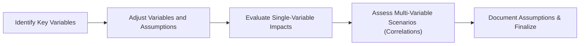

So, let’s talk about sensitivity analysis. You know, I used to think forecasting was pretty straightforward: pick a growth rate, project sales, net income, and voilà. But, um, the first time I was asked to present a forecast to my boss, I discovered the terrifying truth—if you mess up one or two “tiny” assumptions, your entire financial projection can go haywire. And that’s where sensitivity analysis becomes a lifesaver. By measuring how changes in critical assumptions (like revenue growth, interest rates, or exchange rates) can dramatically shift projected outcomes, you can avoid nasty surprises and communicate risks more effectively to stakeholders.

## Purpose and Scope of Sensitivity Analysis

Financial statement forecasting is essential for valuation, budgeting, and strategic decision-making. However, the biggest challenge is that each forecast rests on multiple assumptions—some more critical than others. Sensitivity analysis aims to:

• Identify the most influential variables (e.g., revenue growth rate, cost of capital, margins, exchange rates) that can drastically swing results.  
• Test how variations in these assumptions affect key financial outputs such as net income, operating cash flow, and free cash flow.  
• Equip analysts with tools to quickly pivot between different scenarios (best-case, base-case, worst-case) to gauge potential outcomes under diverse conditions.  

When preparing for the CFA Level II exam, you’ll often see vignettes that show partial forecast data, with some details about changes in assumptions—maybe related to IFRS vs. US GAAP differences or changes in macroeconomic elements. The question might ask you to identify which assumption is most critical, or how a small variation in, say, cost of goods sold or interest rates might cascade through the statements.

## Core Steps in Designing a Sensitivity Analysis

### Step 1: Pinpoint Key Variables
Focus on variables that have large impacts on your forecast model. These typically include:  
• Revenue Growth Rate.  
• Cost Structures (particularly gross margin or unit cost, especially in commodity businesses).  
• Exchange Rates (for multinational operations).  
• Interest Rates (for leveraged firms).  
• Discount Rate or Cost of Capital (for DCF-based projections).  

In a scenario that I worked on for a manufacturing client, we noticed that a 1% shift in the discount rate caused the firm’s valuation to jump by nearly 8%. That was an “Aha!” moment, showing how big an effect a seemingly minor tweak can have on your final numbers.

### Step 2: Build Adjustable Inputs
To analyze the sensitivity effectively, it’s helpful to set up your model using tools like spreadsheet data tables or scenario managers. This way, you can alter inputs—say, increase the revenue growth rate from 4% to 5.5%, or adjust the discount rate from 7% to 9%—and see the immediate corresponding changes in net income, operating margins, and other key lines.

#### Example Table
Let’s say you’re forecasting revenue over a three-year horizon. You might model three revenue growth scenarios:  
• Base: 5%  
• Optimistic: 8%  
• Pessimistic: 2%  

By linking these growth rate cells to your entire income statement, you can watch how net income morphs under each assumption. Then you can do the same for interest rates, capital expenditures, or foreign exchange rates.

### Step 3: Incorporate Multiple Scenarios
Scenario analysis is broader than just toggling a single variable. It’s about changing multiple factors in unison to reflect the realities of how financial drivers can move together (or in some cases, in opposite directions). For example:

• Best-Case Scenario: Higher-than-expected revenue growth, stable commodity prices, and favorable interest rates.  
• Base-Case Scenario: Reasonable assumptions aligned with historical performance and current market trends.  
• Worst-Case Scenario: Lower-than-expected revenue, higher interest costs, or a downturn in the economy—possibly accompanied by rising raw material costs.  

In some cyclical industries—like real estate or oil & gas—you might want to run even more elaborate scenarios, factoring in historical cyclical swings. That means adjusting your revenue growth for rising or falling commodity prices or occupancy rates.

### Step 4: Evaluate IFRS vs. US GAAP Differences
Analysts often overlook how different accounting standards capitalize or expense certain costs. Under IFRS, for instance, research costs for an internally developed intangible asset are typically expensed, whereas subsequent development costs may be capitalized if certain criteria are met. Under US GAAP, the threshold for capitalization may vary. These differences come into play when you:

• Capitalize vs. Expense R&D: Changing the approach to R&D can shift your operating expenses and, consequently, net income in a big way.  
• Treat Development Costs Differently: If you capitalize development costs under IFRS, you’ll incur future amortization expense but an immediate boost to reported earnings relative to immediate expensing under GAAP.  
• Recognize or Defer Revenue: IFRS 15 and ASC 606 (US GAAP) are mostly converged now, but subtle divergences still exist in judgments around performance obligations and variable considerations.  

Sometimes, what might seem like a 2% difference in intangible asset amortization can compound over multiple years, altering valuations significantly.

### Step 5: Document All Key Assumptions
One of the best ways to ensure transparency is to list out each assumption clearly. For instance, if you assume a stable exchange rate—or let’s say an appreciation of the euro against the dollar—that can affect revenue recognition for a European subsidiary. Have short notes describing:

• Why did you choose a particular revenue growth rate?  
• What historical data supports your margin assumptions?  
• Do you foresee any major regulatory changes that might alter your cost structure?  

You know, stating assumptions might feel tedious, but let me tell you, it’s saved me from more than a few disagreements in quarterly review meetings.

### Step 6: Evaluate the Combined Impact of Multiple Changes
Sure, changing one variable at a time is nice for insight, but real-world conditions rarely revolve around single-factor changes—exchange rates might shift at the same time as interest rates. Correlations between variables can amplify or mitigate the impact. Maybe as interest rates rise, the local currency strengthens, which softens the blow to net income. Or perhaps these changes create a double whammy that sinks margins.  

It’s a good idea to model these correlations if you’ve got the data. If you see that an uptick in the discount rate often coincides with a downturn in consumer confidence, then you might reflect that in your revenue forecast. Admittedly, it can get complicated, but even a simplified correlation-based approach helps keep you from being overly optimistic.

### Step 7: Review of Interest Rate Sensitivity in Leveraged Firms
For companies with significant debt, even a small interest rate movement can have an outsize impact on interest expense and free cash flow (FCF). If the firm’s floating-rate debt re-prices every six months, for instance, a 1% increase in short-term rates can swing your FCF by a wide margin. This is especially critical in industries like utilities, where stable cash flows encourage heavy leverage.

### Step 8: Recognize Cyclical and Seasonal Effects
Certain sectors—like agriculture, retail, and hospitality—can experience strong seasonal or cyclical swings. A short mild winter might reduce energy usage, hurting revenue for an energy company. Meanwhile, a strong holiday season could disproportionately boost Q4 sales for a retail chain. Incorporate these patterns into your base-case scenario, and then consider the extremes in your best- and worst-case scenarios.

### Step 9: Bringing It All Together—A Visual Overview

Below is a simple Mermaid flowchart representing how we might structure a sensitivity analysis process:

• Node A: Start by identifying the big drivers (like revenue).  
• Node B: Change the assumptions in your model.  
• Node C: Look at how each change affects net income, cash flow, etc.  
• Node D: Combine changes and note correlations.  
• Node E: Finalize the forecast and keep a record of everything.

If you maintain a well-structured spreadsheet or a specialized financial modeling tool, each step can be tested and iterated quickly.

## Real-World Example: Tech Startup Forecast

Imagine a fast-growing tech startup deciding whether to expand globally. Their forecast hinges on four main assumptions:  
• Revenue growth of 25% (base), rising to 30% in a best-case scenario with successful foreign market penetration, or dropping to 15% if expansion fails (worst-case).  
• Cost of capital currently at 8%, but it could climb to 10% if interest rates spike.  
• R&D capitalization rules under IFRS might significantly reduce operating expense in year one compared to US GAAP, but lead to higher amortization charges in subsequent years.  
• Strengthening home currency might reduce revenue from overseas operations if the global expansion is successful.

By plugging these variations into a sensitivity matrix, the CFO can see how the net present value (NPV) of the expansion changes under each scenario. A best-case scenario might show a robust NPV, while a worst-case scenario might show a negative NPV. If the “range” of outcomes is too wide, the CFO can propose mitigation strategies—like entering currency hedges or negotiating fixed interest rates on debt.

## Pitfalls and Best Practices

• Avoid Overcomplicating: Sometimes analysts try to map out every micro assumption. Focus instead on the big-ticket items that really move the needle.  
• Confirm Model Integrity: Double-check formulas when toggling variables. Small formula errors can misrepresent the effect of a 1% shift in an assumption.  
• Don’t Ignore External Factors: Macroeconomic conditions, brand new legislation, or competitor actions can abruptly change your forecast.  
• Revisit Regularly: Assumptions can (and probably will) change over time. Updating your sensitivity analysis in quarterly or semiannual intervals keeps forecasts relevant.

## Exam Tips for CFA Level II

• Keep an Eye on IFRS vs. US GAAP: If the vignette provides a note about capitalized vs. expensed costs, suspect that these differences might affect your net income, equity, or both.  
• Spot the Most Volatile Assumptions: The exam might ask which assumption would cause the largest deviation in net income or cash flow. Look for leverage, margin, or discount rate clues in the text.  
• Watch Out for Correlation Effects: If two variables move together, consider the interplay. The exam might set a trap by giving you data on correlated variables without calling attention to it directly.  
• Time Management: Sensitivity analysis questions can be detail-heavy. Outline your approach quickly, identify the key variables, and systematically recast any changes.  

In practice, the better you master sensitivity analysis, the more comfortable you’ll feel tackling complex item sets under exam constraints.

## References and Further Exploration

• “Scenario Analysis in Risk Management and Strategy Development,” an article from the Global Association of Risk Professionals (GARP).  
• “Damodaran on Valuation” by Aswath Damodaran – especially the sections on forecasting and sensitivity analysis in equity valuation settings.  
• Company Investor Relations Reports – Many large firms publish sensitivity cases (e.g., effect of interest rate or exchange rate changes) in their MRT (Market Risk Table) or risk disclosures.  

Anyway, the key takeaway is that sensitivity analysis is your chance to stress-test all those high-level assumptions you’ve made. It helps you see how resilient your forecast (and your business plan) might be under different market conditions. So, the next time you revise your forecast, maybe try tweaking a few variables and see how your net income or free cash flow leaps around.

## Test Your Knowledge: Sensitivity Analysis and Forecasting Quiz



### Which key variable is typically most critical in a forecast for a highly leveraged company?

- [ ] Revenue growth rate
- [ ] Depreciation expense ratio
- [x] Interest rate
- [ ] Foreign exchange rate

> **Explanation:** While revenue growth rate can be highly influential, a highly leveraged firm is particularly sensitive to interest rates due to the immediate impact on interest expense and free cash flow.

### In scenario analysis, how are best-case, base-case, and worst-case assumptions generally applied?

- [x] Adjusting multiple variables together to reflect favorable, normal, and adverse conditions
- [ ] Toggling only one variable at a time
- [ ] Focusing on historical patterns only
- [ ] Ignoring correlation among inputs

> **Explanation:** Scenario analysis typically involves adjusting multiple variables in tandem to capture a wide range of potential outcomes, including interactions among those variables.

### What is the primary difference between capitalizing and expensing R&D under IFRS?

- [ ] Under IFRS, all R&D costs must be capitalized.
- [x] Under IFRS, research is expensed, while development costs meeting certain criteria may be capitalized.
- [ ] Under IFRS, R&D is always expensed immediately.
- [ ] Under IFRS, development costs are forbidden from being capitalized.

> **Explanation:** IFRS allows development costs to be capitalized if the project meets specific technical and commercial feasibility criteria. Research costs, however, are usually expensed immediately.

### Which of the following best describes correlation in sensitivity analysis?

- [ ] The effect of macroeconomic policies on short-term rates
- [x] A statistical measure describing how two variables move together
- [ ] The profit margin resulting from interest rate fluctuations
- [ ] A technique used exclusively in worst-case scenarios

> **Explanation:** Correlation measures how changes in one variable are associated with changes in another. This concept is crucial when evaluating how multiple assumptions interact.

### If a firm’s revenue forecast is especially prone to foreign exchange fluctuation, which scenario assumption is likely most important?

- [ ] Varying the cost of capital
- [ ] Changes in regulatory environment
- [x] Different exchange rate assumptions (appreciation/depreciation)
- [ ] Adjusting fixed asset turnover

> **Explanation:** For firms with substantial international exposure, exchange rate movements can heavily affect reported revenue, making it a key variable in scenario forecasts.

### A minor 1% increase in the discount rate can sometimes lead to a large swing in a company’s valuation. Why?

- [x] Because discounting future cash flows at a higher rate severely reduces their present value.
- [ ] Because discount rate changes affect revenue growth directly.
- [ ] Because accounting standards force higher depreciation rates.
- [ ] Because intangible assets are automatically impaired when discount rates change.

> **Explanation:** A rise in the discount rate that is used in a DCF can significantly reduce the calculated present value of future cash flows, often resulting in outsized impacts on valuation.

### When documenting assumptions in a sensitivity analysis, which practice is considered best?

- [ ] Providing no justification, to promote flexibility
- [ ] Keeping the list of assumptions confidential
- [ ] Using historical data for all assumptions without any adjustments
- [x] Listing each major assumption and the rationale behind it

> **Explanation:** Listing each major forecast assumption with a clear rationale enhances transparency and helps stakeholders understand why certain inputs were chosen.

### In what situation do cyclical patterns become critical to a sensitivity analysis?

- [ ] When the company operates in multiple geographic regions
- [ ] When the company’s growth rate is flat
- [x] When the company is in an industry that experiences major cyclical swings (e.g., commodities)
- [ ] When interest rates remain constant over multiple periods

> **Explanation:** Companies in highly cyclical industries experience significant highs and lows linked to economic cycles or commodity prices, so factoring in those cycles is essential.

### Which of the following is a potential trap when performing a multi-variable sensitivity analysis?

- [ ] Overestimating R&D spending
- [x] Ignoring correlation among variables, leading to unrealistic scenario outcomes
- [ ] Including interest rate assumptions in equity valuation
- [ ] Using data tables in spreadsheet software

> **Explanation:** Failing to account for correlations can lead to scenarios that are inconsistent or unrealistic, missing how variables move together in real life.

### True or False: Under IFRS, a company can choose to either capitalise or expense R&D costs for each project at its discretion.

- [ ] True
- [x] False

> **Explanation:** IFRS stipulates that research costs are expensed, while development costs meeting specific criteria can be capitalized. It’s not simply left to a company’s preference without justification.


