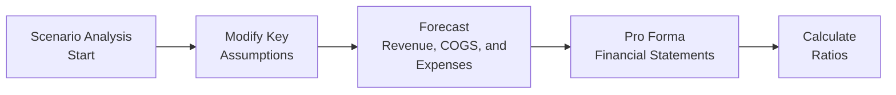

## Introduction to the Vignette

Let’s say you’re asked to craft a set of pro forma financial statements for a mid-sized manufacturing firm—call it GlobalGears Inc. GlobalGears produces specialized gears for automotive suppliers and has recently expanded its operations overseas. The management is eager to forecast how the next few years will look under different economic conditions. Trust me, I’ve been there before—sometimes you think you have everything nailed down, then you realize a spike in raw material prices can turn your happy forecast into a headache. 

In this vignette, we’ll walk through GlobalGears’ partial historical financials, incorporate expansions and IFRS vs. US GAAP classification nuances, then create multiple scenario-based forecasts: one adverse scenario (bumping up the cost of raw materials) and one favorable scenario (enjoying better foreign exchange rates). Along the way, we’ll see how liquidity, leverage, and coverage ratios can swing, and what that implies for the company’s cash flows and external financing needs.

## Historical Financials and Expansion Plans

Below is a simplified snapshot of GlobalGears’ recent financial information (in USD thousands). This data is condensed for illustration.

Historical Income Statement (Partial):
- Revenue: 100,000
- Cost of Goods Sold (COGS): 60,000
- Gross Profit: 40,000
- SG&A: 20,000
- Depreciation & Amortization: 5,000
- Operating Income (EBIT): 15,000
- Interest Expense: 2,000
- Income Before Tax: 13,000
- Tax Expense (25%): 3,250
- Net Income: 9,750

Historical Balance Sheet (Partial):
- Cash and Equivalents: 5,000
- Accounts Receivable: 20,000
- Inventory: 15,000
- PP&E (Net): 40,000
- Total Assets: 90,000
- Accounts Payable: 10,000
- Long-Term Debt: 20,000
- Total Liabilities: 35,000
- Total Equity: 55,000

Key Footnotes:
1. The company plans to expand into Southeast Asia with a newly leased production facility. Under IFRS 16, most leases must be capitalized as right-of-use assets. Under US GAAP (ASC 842), the classification could be operating or finance, potentially altering the balance sheet.
2. GlobalGears is about to invest in intangible assets by acquiring a small patent portfolio. These intangibles will require careful valuation and annual impairment testing.
3. The firm segments its operations by geography: North America, Europe, and Asia. (See “Segment Disclosures” in Chapter 22 for more on how these can affect reported margins.)

## Step-by-Step Forecasting: Laying the Foundation

Pro forma statements help us see where GlobalGears might stand in the future. We’ll construct them by:

1. Projecting Revenue:  
   • Management estimates a baseline 8% annual growth, assuming stable demand.  
   • The expansion in Asia might boost revenue by 2–3 percentage points, but that depends on exchange rates.  

2. Estimating Expenses:  
   • Historical gross margin is 40%. We’ll assume this stays relatively stable in normal conditions.  
   • We must account for the likely rise in labor costs or raw materials if we suspect inflationary pressures.  
   • SG&A might increase in line with the expansion, perhaps at the same 8% baseline growth.  

3. Considering Depreciation and Amortization:  
   • With new leased assets under IFRS 16, we’ll add both a right-of-use asset depreciation and an interest cost for the lease liability.  
   • Under US GAAP, the firm might classify the lease differently; in an operating lease, the expense will mostly show up as rent expense.  

4. Assessing Interest Expense and Capital Structure:  
   • GlobalGears has $20,000 of long-term debt. The new expansions may require additional external financing if internal cash flows aren’t sufficient.  
   • If the company takes on more debt, interest expense will rise, affecting coverage ratios.

5. Accounting for Taxes:  
   • We’ll keep the 25% effective tax rate assumption unless new incentives or changes are introduced.  

6. Forecasting Cash Flow and Working Capital:  
   • We’ll estimate changes in accounts receivable, accounts payable, and inventory proportionally to revenue or COGS changes.  
   • Capital expenditures (CapEx) for expansions can heavily influence our free cash flow (FCF).

## IFRS vs. US GAAP Nuances

One reason forecasting drives me a bit bonkers is that IFRS and US GAAP can treat certain items differently, drastically changing our financial picture:

• Lease Classification:  
  – IFRS 16: All material leases appear on the balance sheet, recognized as right-of-use assets and lease liabilities.  
  – US GAAP (ASC 842): A lease could be operating or finance. Operating leases still generate off-balance sheet illusions if you’re not careful with analyzing them, though you’d see them in footnotes.  

• Intangible Assets:  
  – If the patents the company acquires have unlimited life, IFRS demands annual impairment tests. Under US GAAP, indefinite-lived intangibles also require annual impairment reviews, but the methodology can differ (step testing, etc.).  
  – If intangible assets are finite, both IFRS and US GAAP require systematic amortization over their useful life.  

• Segment Disclosures:  
  – IFRS requires segment results based on internal management information, while US GAAP similarly demands an approach that mirrors what the chief decision maker uses. The difference can lie in the details of how transfer pricing or overhead allocations are reported.

## Building and Implementing Scenarios

We want to compare at least two alternative futures for GlobalGears:

1. Adverse Scenario: Raw Material Price Increase  
   • Suppose steel and related materials cost 10% more next year. This might shrink gross margin from 40% to 35%.  
   • Meanwhile, customers push back on price hikes, so revenue grows more slowly (maybe 5% instead of 8%).  
   • The expansion plan might still go ahead, but with costlier raw materials, inventory spending goes up.  

2. Favorable Scenario: Improved FX Rates  
   • Exchange rates in key Asian markets move in GlobalGears’ favor—say a 5% currency tailwind.  
   • Revenue grows 10% this time, thanks to a better environment and stable raw material costs.  
   • Production remains efficient, keeping the 40% gross margin alive (or possibly slightly increasing it if the local currency denominated costs are cheaper).

We’ll illustrate these different paths with a simple schematic:

### Applying It to the Income Statement

Let’s do a quick pass on how revenue and COGS might look under each scenario for the upcoming year:

• Baseline Forecast (No major changes)  
  – Revenue: $108,000 (8% growth from $100,000)  
  – COGS: $64,800 (60% of revenue)  
  – Gross Profit: $43,200  

• Adverse Scenario  
  – Revenue: $105,000 (5% growth)  
  – COGS: $68,250 (65% of revenue, reflecting higher raw material costs)  
  – Gross Profit: $36,750  

• Favorable Scenario  
  – Revenue: $110,000 (10% growth, boosted by FX)  
  – COGS: $66,000 (60% of revenue still)  
  – Gross Profit: $44,000  

As you can see, small changes in growth rates and margin assumptions produce very different operating results.

## Impact on Ratios

We can’t stop at the income statement. As we incorporate the new right-of-use assets or intangible acquisitions, the balance sheet changes can transform your ratio analysis. You might find that:

• Liquidity Ratios:  
  – The current ratio or quick ratio may worsen in the adverse scenario because inventory or payables might rise beyond the manageable range.  
  – In the favorable scenario, a higher cash balance and greater sales might improve liquidity.

• Leverage Ratios:  
  – Adding lease liabilities (finance leases under IFRS 16 or finance lease classification under US GAAP) can increase the debt-to-equity ratio.  
  – If raw materials spike and the firm needs external financing, the total debt might balloon, pushing up leverage.

• Coverage Ratios:  
  – Interest coverage (EBIT / Interest Expense) might shrink in the adverse case if EBIT falls and debt remains high.  
  – A favorable scenario might yield stronger EBIT, raising coverage metrics and impressing lenders.

## Implications for Cash Flow, CapEx, and Financing

Forecasting infiltration doesn’t end with the income statement. It seeps into your cash flow statement, too:

• Operating Cash Flow (CFO):  
  – If net income drops, CFO can suffer. But watch for changes in working capital (like a buildup in receivables or inventory) that might further lower CFO.  
  – Conversely, a favorable exchange rate scenario might help reduce local costs or push up revenue, thereby strengthening CFO.

• Capital Expenditures (CapEx):  
  – GlobalGears has expansion plans. Even if the outlook turns grim, some expansions are contractual. Management must spend on PP&E or intangible assets.  
  – A shortfall in CFO might force the company to tap additional debt or equity financing, potentially raising interest costs or diluting existing shareholders.

• External Financing:  
  – If your coverage ratios dip below covenants, lenders might impose stricter terms or higher interest rates.  
  – In a happy environment, strong CFO might reduce the firm’s reliance on external capital.

## Sensitivity to Depreciation Schedules and Share-Based Compensation

It’s easy to forget how smaller items—like changing depreciation schedules or adjusting the assumptions behind share-based compensation—can wreak havoc on your forecasts:

• Depreciation and Amortization:  
  – Extending the useful life of machinery by even two years can reduce annual depreciation expense, artificially inflating EBITDA.  
  – The difference in IFRS or US GAAP approaches to revaluation or impairment can create lumps in your net income.

• Share-Based Compensation:  
  – IFRS and US GAAP guidelines both require expensing stock options or restricted shares over the vesting period, but fair value assumptions can differ.  
  – If the share-based comp expense is large, it can significantly shrink net income and CFO, especially if the expense is not matched by a cash outflow in the same period.

## Best Practices in Presenting Scenario Results

It’s one thing to build scenarios for your own analysis, but presenting them to a board or investors requires clarity:

• Use a Range:  
  – Present key line items as a range, from conservative to aggressive. Show major breakpoints.  
  – This helps stakeholders visualize boundaries of possible outcomes.

• Probability Weighting:  
  – Consider assigning probabilities: 40% chance baseline, 30% chance adverse, 30% chance favorable.  
  – Create a weighted average net income or EBITDA figure.  

• Sensitivity Tables or “What-If” Analyses:  
  – Let stakeholders see how a 1% or 2% shift in revenue growth or COGS might skyrocket or slash net income.  
  – This approach reveals where the business is most vulnerable.

## Conclusion

Forecasting is never a cookie-cutter exercise. Each assumption you make—whether about raw materials, currency environment, or intangible asset valuation—can ripple through both the income statement and balance sheet. Under IFRS or US GAAP, you also need to watch how lease and intangible asset accounting modifies your final pro forma statements and ratios. In short, scenario analysis is your best friend: it helps you visualize the range of possibilities and ensures that you (and your firm’s stakeholders) are prepared for surprises.

**Glossary**  
• EBITDA: Earnings before interest, taxes, depreciation, and amortization. A handy metric that approximates operating cash flow.  
• Coverage Ratios (e.g., Interest Coverage): Measures how convincingly a firm can cover interest or other fixed payments.  
• Segment Disclosures: Breaking out financials by geographic region, product line, or other dimenstions to provide more clarity to investors.  
• Scenario Probability Weighting: Assigning likelihoods to each scenario, then calculating a weighted outcome.

**References & Further Reading**  
• “International Financial Statement Analysis” by Thomas R. Robinson et al. (CFA Institute Investment Series)  
• Chapter 2 of this Volume on IFRS vs. US GAAP—High-Level Differences  
• Chapter 22 of this Volume on Segment Reporting and Related-Party Transactions

---

## Test Your Knowledge: Scenario-Based Forecasting Quiz



### GlobalGears' revenue in the favorable scenario benefits primarily from which key factor?

- [ ] Decreased labor costs in Asia.
- [x] Improved exchange rates leading to stronger revenue growth.
- [ ] Lower taxes due to a new corporate tax relief.
- [ ] A higher corporate bond rating.

> **Explanation:** The favorable scenario describes better foreign exchange rates, which directly boost revenue from overseas markets.

### In the adverse scenario, which of the following is likely to occur regarding the firm's cost of goods sold?

- [ ] COGS will remain unchanged because raw material costs are typically fixed.
- [ ] COGS will decrease by 5% due to improved vendor pricing.
- [x] COGS will increase as higher raw material costs tighten gross margins.
- [ ] COGS is expected to become zero because of a switch to service-based revenue.

> **Explanation:** The adverse scenario explicitly mentions rising raw material prices, which drive up COGS and compress gross margins.

### Under IFRS 16, how are most leased production facilities recognized?

- [x] As a right-of-use asset and corresponding lease liability.
- [ ] Entirely off the balance sheet, disclosed only in footnotes.
- [ ] Only recognized as rent expense in the income statement.
- [ ] As intangible assets.

> **Explanation:** IFRS 16 requires that almost all leases over a trivial value be capitalized, creating a right-of-use asset and a lease liability.

### Which ratio is most directly affected when a new finance lease liability is added to the balance sheet?

- [x] Debt-to-equity ratio.
- [ ] Total asset turnover ratio.
- [ ] P/E ratio.
- [ ] Dividend payout ratio.

> **Explanation:** Adding lease liabilities to the balance sheet increases total liabilities, which directly impacts the debt-to-equity ratio.

### Which statement best describes “scenario probability weighting” in forecasting?

- [ ] Forecasting only extreme scenarios to judge possible worst cases.
- [x] Assigning likelihoods to multiple scenarios and calculating a weighted-average outcome.
- [ ] Eliminating one scenario in favor of the most probable one.
- [ ] Presenting a single scenario with disclaimers about unpredictability.

> **Explanation:** Probability weighting involves assigning a percentage likelihood to each scenario and deriving an expected or weighted average result, helping quantify risk.

### If depreciation schedules are extended by two more years, which financial metric is most likely inflated?

- [x] EBITDA.
- [ ] Tax rate.
- [ ] Interest coverage ratio.
- [ ] Operating cash flow from financing (CFF).

> **Explanation:** Lengthening asset lives lowers the annual depreciation expense, thus boosting earnings before interest, taxes, depreciation, and amortization.

### Which aspect of scenario analysis helps highlight the company’s vulnerabilities when growth or margin assumptions fluctuate?

- [x] Sensitivity tables or “what-if” analyses.
- [ ] Eliminating segment disclosures.
- [ ] Restricting the analysis to one forecast model.
- [ ] Removing intangible assets from the balance sheet.

> **Explanation:** “What-if” analyses illustrate how small changes in assumptions ripple through the financial statements, identifying where the firm is most exposed to risk.

### If GlobalGears experiences a favorable foreign exchange swing, which ratio might improve most significantly?

- [x] Interest coverage ratio (EBIT / Interest).
- [ ] Depreciation expense as a percent of assets.
- [ ] Share-based compensation expense.
- [ ] Inventory turnover as measured in days.

> **Explanation:** A favorable exchange rate typically boosts EBIT, which in turn increases interest coverage, assuming interest expense remains relatively fixed.

### In the adverse scenario, working capital demands might rise if which of the following occurs?

- [x] Inventory must be stocked more aggressively due to higher raw material prices.
- [ ] Accounts receivable decrease to zero.
- [ ] The firm suspends all payment to vendors.
- [ ] The firm receives advanced payments from customers.

> **Explanation:** With more expensive raw materials, the company may need to invest more in inventory, thereby tying up more working capital.

### A probability-weighted forecast requires an estimate of the likelihood of each scenario. Is this statement true or false?

- [x] True
- [ ] False

> **Explanation:** Probability weighting involves assigning a numerical probability to each scenario, then using those probabilities to compute an expected outcome.


