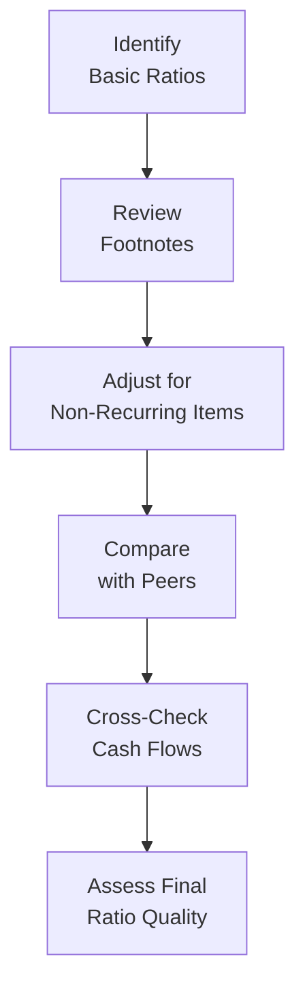

## Recognizing Reporting Quality

Sometimes, you look at a company’s annual report and think, “Wow, these numbers look fantastic.” But then—excuse the hesitation—you realize the net income might be propped up by a one-time asset sale. Or maybe revenue soared due to a new acceleration policy that might not last. As a Level II CFA candidate, you’re well aware that financial statements can hide an array of ephemeral, non-recurring, or manipulated items that distort the ratios we rely on to gauge performance. That’s why adjusting for quality issues in ratio computations isn’t optional; it’s crucial.

Reporting quality refers to how faithfully a company’s financials depict its actual economic position—no fluff, no concealed bombs. To get there, we must sniff out non-recurring items, aggressive accounting choices, or big “other comprehensive income” swings that don’t reflect a firm’s core operations. Sometimes, managers might not be maliciously manipulating statements; they could simply be making best-effort estimates in uncertain environments. Regardless, our job as analysts is to separate sustainable signals from all that noise.

## Spotting Key Problem Areas

Most reporting hiccups pop up in a few hotspots: revenue recognition, expense capitalization choices, inventory valuation, and one-time items. Let’s say you have a friend who invests mostly in retail stocks—he’s always telling you how revenue can be inflated through extended shipping terms shipped right at quarter-end, or how cost of goods sold might be understated if a company uses an advantageous LIFO-FIFO shift. The key is to look for red flags and see how they might show up in conventional ratios (e.g., net profit margin, ROE).

Revenue recognition might involve channel stuffing or bill-and-hold transactions (see also Chapter 19: Earnings Quality and Revenue Recognition). Expense capitalization can push real running costs to the balance sheet rather than the income statement. Inventory methods (FIFO, LIFO, Weighted Average) can alter reported cost of goods sold. Even small changes to these items can dramatically shift the numerator or denominator in key ratios.

## Focusing on Sustainable Earnings

If you’ve ever tried to analyze a company’s “true” earnings potential, you know—sometimes you’ve got to whip out your detective magnifying glass. The process typically involves removing non-recurring or transitory items, like restructuring charges or asset write-downs, to see what remains of a firm’s stable profitability. Essentially, you’re asking, “What would this company’s earnings look like if management had never recorded that big windfall gain or faced that major lawsuit?”

This method is about normalizing earnings to better reflect future expectations. For instance, if the company sold off a division, took big charges on old equipment, or recognized a big litigation settlement, the after-effects can cause large swings that won't necessarily repeat. When you’re computing ratios such as the profit margin or return on assets (ROA), you might exclude these noise elements to see a steadier trend of operational performance.  

## Tracking Cash Flow as a Cross-Check

Remember that expression: “Cash is king”? Well, it’s especially relevant here. Accrual-based earnings can be tricked up with estimates and discretionary accruals, but free cash flow (FCF) or cash flow from operations (CFO) offers a different perspective. If net income is consistently marching upward but operating cash flow is flat as a pancake, that may signal something’s off. Maybe the revenue is being booked without adequate allowances for returns, or maybe the giant jump in accounts receivable is a sign that not all that “revenue” will be collected.

Cross-checking the firm’s accrual-based metrics with its actual cash-based numbers can uncover dramatic discrepancies. A quick ratio check might combine accrual items, but if you also weigh CFO relative to total liabilities or consider how FCF yields compare to net income yields, you might see a more complete picture of the firm.

## Comparing Accounting Policies with Peers

Here’s a personal anecdote: I once looked at two companies in the same industry—both manufacturing specialized machinery. One recognized revenue at the point of shipment, while the other waited until the buyer accepted the machinery on-site (which could be weeks or months later). Turns out that the first company’s reported revenue was consistently “higher” (and earlier). But when I dug into their footnotes, the difference stemmed from a more aggressive policy. Naturally, the ratio computations based on that revenue stream looked better for them—until it didn’t.

So, we always want to see if a company’s accounting policies align with industry norms. If we detect big differences in estimating intangible asset lives, provisioning for doubtful accounts, or capitalizing development costs, it’s usually wise to make adjustments for apples-to-apples comparisons. The same goes for intangible amortization: if you back out intangible amortization for one firm’s normalized earnings, do it for the competitor as well (assuming they have similar intangible balances).

## Keeping an Eye on Other Comprehensive Income

OCI items might look innocuous, but they can seriously affect equity. Changes in foreign currency translation, pension actuarial gains/losses, or the fair value of certain securities can cause big swings that never show up in net income. If OCI is consistently negative, the company’s ratio of debt-to-equity might be creeping up faster than you’d think. If pension liabilities balloon due to changes in discount rates (tracked in OCI), that can alter your measure of the firm’s true financial leverage.  

## Dealing with Inventory Assumptions

Let’s talk LIFO vs. FIFO. If you’re analyzing a company under IFRS, you might see different allowed methods vs. a US GAAP-based firm (since IFRS prohibits LIFO). One reason we have to pay attention to inventory cost-flow assumptions is that it significantly impacts gross margin and inventory valuation. For instance, in inflationary environments, LIFO can produce a higher COGS and lower remaining inventory. Depending on your desired apples-to-apples viewpoint, you might restate a LIFO-based company’s inventory to FIFO equivalents to see how that changes the firm’s gross margin and inventory turnover.

Below is a quick Python snippet that demonstrates a simplified calculation of inventory and cost of goods sold under FIFO vs. LIFO. It’s obviously not a full-blown solution, but it can give you a sense of how a small code routine can help in your adjustments:

```python
def lifo_to_fifo_adjustment(lifo_inv, lifo_reserve, cogs):
    # Convert LIFO inventory to FIFO
    fifo_inventory = lifo_inv + lifo_reserve
    # Adjust COGS down by the change in LIFO reserve
    # if the reserve has increased over the period
    adjusted_cogs = cogs - lifo_reserve
    return fifo_inventory, adjusted_cogs

lifo_inventory = 100000
lifo_reserve = 20000
cogs = 500000

fifo_inv, adjusted_cogs = lifo_to_fifo_adjustment(lifo_inventory, lifo_reserve, cogs)
print("FIFO Inventory Estimate: ", fifo_inv)
print("Adjusted COGS under FIFO: ", adjusted_cogs)
```

In reality, you’d likely do more to refine changes in the LIFO reserve over multiple periods, but the core idea is: you want a consistent approach across your analyzed firms for comparative ratio work.

## Investigating Discretionary Accruals

Sometimes managers, well-intentioned or not, tweak accruals to smooth profitability. That might involve adjusting allowances for doubtful accounts, tweaking revenue recognition cutoffs, or rolling forward expense items—shockingly—right into the next period. Identifying suspicious patterns might require scanning footnotes or the MD&A for clues. Maybe the CFO says, “We recognized a surge in revenue because we extended credit terms to some new, less-established clients.” Red flag? Possibly.

Look at abnormal changes in certain accounts relative to revenue or cost structures. For instance, if accounts receivable is growing faster than revenue, that’s an immediate potential for questionable accruals. If accrued liabilities (like warranties or return reserves) drop out of sync with past patterns, that might be aggressive optimism about future returns or repairs.

## Checking for Off-Balance-Sheet Surprises

If you recall Chapter 6: Special Purpose and Variable Interest Entities, some companies historically used separate entities (SPEs or VIEs) to keep certain obligations from messing with their main financials. The result? Lower reported liabilities, artificially boosting leverage ratios and net profit margin. The same logic applies to operating leases that haven’t been capitalized (less of an issue under the newest standards, but still relevant in older statements or partial transitions). If you discover major off-balance-sheet items, try to fold them back into total liabilities or operating assets. This helps you compute more honest coverage ratios, debt-to-equity, or return measures.

## Cleaning Up for One-Off Items

To find core operating results, we typically exclude big litigation settlements, discontinued operations, large intangible write-downs, or outsize tax windfalls. For instance, if net income soared in 2024 because the firm sold a piece of land for a massive gain, you’d either remove that gain from your operating income or place it below the line in your ratio computations. This helps keep your comparison fair across time or against other companies that didn’t have a similar boon or bust that year.

EBITDA is a popular metric for measuring a company’s recurring performance. But, ironically, “Adjusted EBITDA” can become a black box if the company lumps each complex item under the “non-recurring” label without strong justification. An analyst can’t just accept that at face value. We want full clarity: which items are truly non-recurring, and which ones might be part of normal fluctuations?

## Accounting Standards Considerations

IFRS vs. US GAAP can lead to different net incomes, equity balances, or even subtle differences in revenue recognition timing. We’re not here to judge which standard is “best,” but we do want to ensure comparability. If you’re analyzing a multinational group with subsidiaries across IFRS and US GAAP jurisdictions, you might find yourself re-categorizing certain items to keep the ratios consistent. Typically, that means diving into reconciliations or footnotes if the company (or its auditors) provide them.

## Observing Trend Consistency

Don’t forget to look beyond a single period. If you see small upward “adjustments” (like slightly lower depreciation or slightly more favorable inventory assumptions), you might think, “Ah, that’s tiny. Probably no big deal.” But multiplied over three to five years, that can morph into a huge difference. Monitoring ratio trends—especially around net margin, CFO margin, or asset turnover—helps you detect illusions that might only become evident as they accumulate.

## Aligning Ratios with Real Operations

An improvement in return on equity (ROE) is excellent if it corresponds to real operational efficiencies, expansions in market share, or better product pricing. But maybe you notice that the improvement is anchored in intangible asset reclassifications or under-reserving for potential losses. A neat trick is to cross-reference ratio changes with operational data, like production volumes, capacity utilization, or customer churn rates. If the ratio is saying “All is well,” but the operational data says “We’re losing ground,” it’s time to dig deeper.

## Creating a Personal “Cheat Sheet”

There’s a lot to consider—trust me, it can be overwhelming. Personally, I like to keep a short checklist or “cheat sheet” near me when diving into a new set of financial statements. It might include lines like:

- Check if any significant one-time items were recorded (e.g., asset sales, large write-downs).  
- Compare revenue recognition policy to industry norms.  
- Evaluate inventory methods (LIFO vs. FIFO) for potential adjustments.  
- Examine changes in intangible assets or goodwill.  
- Review statement of cash flows for unusual differences vs. net income.  
- Factor in off-balance-sheet leases or special purpose entities.  
- Assess changes in share-based compensation.  
- Review other comprehensive income items for big equity changes.  

Following a consistent “rules of thumb” approach across all your analyses ensures that each ratio is as comparable and meaningful as possible.

## Visual Overview: Adjustment Workflow

Below is a simple Mermaid diagram illustrating a typical workflow for adjusting ratios when concerned about reporting quality.



This is, of course, just a high-level view. In practice, you might loop back to earlier steps as you uncover new information in the footnotes or from management commentary.

## Final Thoughts

Adjusting for quality issues in ratio computations is not a matter of cynicism; it’s about realism. We’re not trying to catch management playing dirty every time—though that can happen. Instead, we’re responsibly recognizing that accounting statements often include estimates, judgments, and even honest mistakes. As a keen observer, your role is to refine the numbers so they best represent ongoing, sustainable performance. And that’s where you, as a future CFA charterholder, stand out—knowing the difference between just reading a company’s reported metrics and truly understanding what’s behind them.

References & Further Reading  
• CFA Institute (Official Curriculum) – Financial Reporting Quality section for deeper case studies on earnings manipulation.  
• International Accounting Standards Board (IASB) website: https://www.ifrs.org  
• Financial Accounting Standards Board (FASB) website: https://www.fasb.org  
• Schilit, Howard. “Financial Shenanigans.”  
• O’glove, Thornton L. “Quality of Earnings.”  

## Practice Questions: Advanced Financial Statement Adjustments



### A company reports a large gain from selling a warehouse. To adjust for reporting quality, which main step should an analyst consider when computing operating ratios?

- [ ] Including the gain in operating profit as is.
- [ ] Disregarding the cash flows associated with the sale.
- [ ] Recognizing the gain and backing out depreciation expense.
- [x] Excluding the gain as a non-recurring item.

> **Explanation:** Gains on asset sales typically represent non-recurring events and are excluded to better reflect ongoing operating performance.

### When analyzing inventory, you discover that a firm uses LIFO under US GAAP. Which adjustment is most appropriate if you want to compare it with an IFRS-based firm using FIFO?

- [ ] Add the firm’s cost of goods sold to the LIFO reserve.
- [x] Recalculate the inventory balance and cost of goods sold using the LIFO reserve.
- [ ] Subtract the LIFO reserve from FIFO inventory.
- [ ] Increase the firm’s gross margin based on average cost.

> **Explanation:** Converting LIFO balances to FIFO involves adding the LIFO reserve to the inventory balance and adjusting cost of goods sold accordingly so that key metrics are comparable.

### A firm reclassifies regular maintenance costs as capital expenditures. How does this most likely affect its reported ratios if no adjustments are made?

- [ ] Decreases EBITDA and operating income.
- [ ] Reduces net income in the short run.
- [ ] Lowers net fixed assets on the balance sheet.
- [x] Inflates current earnings and understates expenses.

> **Explanation:** Capitalizing maintenance instead of expensing it understates operating expenses, inflating reported earnings and increasing total assets.

### Which of the following is a strong indicator that an analyst should dig deeper into a firm’s revenue recognition policies?

- [ ] Revenue growth is roughly in line with industry peers.
- [x] Accounts receivable growth far exceeds revenue growth.
- [ ] Gross margin remains stable.
- [ ] The company uses the percentage-of-completion method.

> **Explanation:** A significant divergence between accounts receivable and revenue often signals more liberal recognition or possible uncollectible sales.

### A company’s net income is growing substantially, but its cash flow from operations remains flat. What does this most likely indicate?

- [ ] Declining stock prices.
- [x] Potentially aggressive revenue recognition or accruals.
- [ ] Steady working capital management.
- [ ] Contraction in capital expenditures.

> **Explanation:** If accrual-based earnings rise while CFO doesn’t improve, it may reflect earnings management or aggressive accrual practices.

### Other comprehensive income (OCI) shows a large positive swing due to foreign currency translation adjustments. What effect might this have on an analyst’s ratio evaluation?

- [ ] It won’t affect any ratio because OCI is always immaterial.
- [x] It can inflate equity and lower a debt-to-equity ratio.
- [ ] It reduces the equity base for computing return on equity.
- [ ] It decreases operating profit margins.

> **Explanation:** Accumulated OCI typically goes into equity, so large positive spikes can reduce the firm’s leverage measures, making it look less risky unless adjusted.

### A firm presents an “adjusted EBITDA” metric. As an analyst, what is the best initial approach?

- [ ] Accept the metric as an accurate reflection of core earnings.
- [x] Carefully review each adjustment to verify it’s truly non-recurring.
- [ ] Disregard all adjustments since EBITDA is standard.
- [ ] Compare adjusted EBITDA to standard EBITDA without investigating adjustments.

> **Explanation:** Adjusted EBITDA can be a black box of various exclusions. Analysts should validate whether these are indeed one-time or non-operational items.

### Which scenario best illustrates a red flag regarding discretionary accruals?

- [x] A sudden drop in accrued warranties without any product improvements.
- [ ] An increase in interest expense following a loan.
- [ ] Seasonal fluctuations in cost of goods sold.
- [ ] Rising revenue in peak holiday quarters.

> **Explanation:** A quick drop in warranty reserves could artificially boost income by reducing expense estimates and indicates potential earnings manipulation.

### When two companies in the same industry use different depreciation methods, how should an analyst handle ratio comparisons?

- [x] Adjust both companies to a consistent method if possible.
- [ ] Ignore depreciation methods if total assets are the same.
- [ ] Accept the net income differences as normal.
- [ ] Choose the method that produces the highest net income.

> **Explanation:** Ensuring each firm’s numbers align on a consistent depreciation basis helps you make apples-to-apples comparisons.

### True or False: Off-balance-sheet financing typically inflates a firm’s profit margin but reduces its financial leverage ratios.

- [x] True
- [ ] False

> **Explanation:** By keeping certain liabilities (e.g., operating leases or SPVs) off the balance sheet, reported leverage is understated, and the firm’s profit margin can appear higher if those costs are not fully recognized as liabilities.


