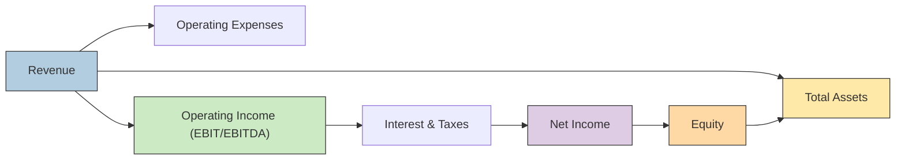

## Introduction
Have you ever looked at two companies with similar profit margins but ended up scratching your head because their Return on Equity (ROE) figures were wildly different? I know I’ve been there – wondering if I’d missed some subtle detail in the footnotes or if there was a hidden trick in the financials. Well, the DuPont formula is like that handy friend who explains everything piece by piece, revealing exactly why even similar-looking margins can lead to completely different overall returns. 

The classic DuPont framework breaks ROE into three components: Net Profit Margin (NPM), Asset Turnover (ATO), and Financial Leverage (FL). That’s a great start. But guess what – we can push it further. You know, sometimes you just need to see more detail: maybe we want to know if a company’s higher net margin is driven by better operating efficiency or just a more favorable tax strategy. Or maybe we’re worried about intangible assets that might not be on the balance sheet under certain accounting standards. If that’s the case, the extended DuPont analysis is right up our alley.

Below, we’ll dive into how DuPont works, how to expand it, and when to tweak it for IFRS vs. US GAAP differences or intangible-driven businesses. We’ll also briefly explore how share buybacks, capital structure, and industry norms can shape the story you see in DuPont figures. By the end, you’ll know how to take a standard DuPont approach and supercharge it to answer deeper questions – exactly the kind of questions that come up in a Level II exam vignette (and real life, for that matter).

## Breaking Down the Traditional DuPont Framework
The standard DuPont formula (also called the “three-step DuPont”) expresses ROE as:


\text{ROE} = \text{Net Profit Margin} \times \text{Asset Turnover} \times \text{Financial Leverage}


or in more algebraic terms:


\text{ROE} 
= \left( \frac{\text{Net Income}}{\text{Sales}} \right)
\times \left( \frac{\text{Sales}}{\text{Total Assets}} \right)
\times \left( \frac{\text{Total Assets}}{\text{Equity}} \right).


This breaks ROE into:
• Net Profit Margin (NPM): Are you keeping enough of your revenue as profit?  
• Asset Turnover (ATO): How efficiently are those assets used to generate revenue?  
• Financial Leverage (FL): How much do you rely on debt vs. equity to fund those assets?  

When you multiply these components, many interesting dynamics pop out. For example, a company might have a low NPM but an extremely high ATO, creating a solid ROE. Meanwhile, another firm might rely on high leverage to compensate for low margins or lower asset efficiency.

## Expanding the Analysis with Operating Margins and Tax
Sometimes, you need more color behind “net profit.” If you’re not sure whether a company boosted its net profit by cutting operating expenses or simply found some magical way to reduce its tax expense, try disaggregating net profit margin:

1. Operating Margin: For instance, you might use EBIT or EBITDA margin. This lets you see how profitable the company’s core business is before interest and taxes.  
2. Tax and Interest Effects: Factor out how much taxes (or interest) are influencing the resulting net income. A company may have a big tax credit or is simply operating in a low-tax jurisdiction, which can inflate net income relative to operating income.

So we could refine the formula by splitting net income into:


\text{Operating income} 
\times 
\left(1 - \text{Effective Tax Rate}\right)


then dividing by revenue to see how each part influences the total. That way, you can tell if a company’s profit growth is from genuine operational improvements or from "tax wizardry."

## Deeper Analysis and Adjustments
Now, let’s say suddenly we discover big one-time charges or an underestimation of important costs (like uncapitalized leases or excessive capitalized R&D costs). We don’t want those ephemeral or potentially “aggressive” accounting moves to distort the analysis. Adjusting the DuPont components for these items can provide a more representative picture of “real” ROE.

• Adjust Net Income for Unusual Items: Maybe remove large one-off restructuring charges, or add back uncapitalized lease costs.  
• Adjust Total Assets for Off-Balance-Sheet Items: If IFRS or US GAAP might treat certain arrangements differently, like operating leases that should be capitalized from a substance-over-form perspective, we should adjust total assets – and possibly total liabilities – to see the real leverage ratio.  

A bigger job than it might sound, but trust me, the clarity you get is worth the effort. I once analyzed a firm with a stellar ROE only to discover that a chunk of the so-called “assets” were intangible goodwill from an acquisition gone stale. Adjusting for that changed the entire leverage ratio and revealed a lot more risk.

## IFRS vs. US GAAP: Impact on DuPont
I often tell folks that IFRS and US GAAP differences can be sneaky. You’ll see them in your income statement, or your balance sheet, or both. They’ll show up in how intangible assets are recognized, whether certain costs get capitalized or expensed, or how a finance lease is treated vs. a mere operating lease. These differences matter for DuPont because:

• Under IFRS, operating leases are generally capitalized if they meet specific criteria. Under US GAAP (especially pre-ASC 842), many operating leases stayed off the balance sheet, artificially lowering total assets and total liabilities. That can inflate asset turnover and reduce leverage in a way that doesn’t reflect true economic reality.  
• IFRS might allow intangible assets (like development costs) to be capitalized if certain conditions are met, which can increase total assets; US GAAP is more restrictive for internal R&D capitalization, leading to lower asset values on the balance sheet (and potentially a higher asset turnover).  

When you’re analyzing a global company, or you suspect that an exam item set might be testing your appreciation for these differences, re-check how they might distort each DuPont component. The key is consistency. Compare apples to apples, adjusting where necessary to put IFRS and US GAAP statements on roughly equivalent footing.

## Practical Applications with a Real-World Example
Imagine we have a hypothetical tech company, HorizonApps, that’s heavily reliant on intangible assets like software code, brand reputation, and R&D. Let’s say you want to run an extended DuPont analysis. The standard unadjusted figures show:

• Net Profit Margin: 15%  
• Asset Turnover: 0.9×  
• Leverage: 2.0×  

So the reported ROE is 27%. Are we done here? Perhaps not. We find out a few interesting tidbits:

• HorizonApps has a large chunk of intangible assets from R&D that, under US GAAP, are treated mostly as expenses rather than capitalized assets. Under IFRS, a portion of that might be capitalized if development-phase criteria are met. If we were to “capitalize” some development costs for better comparability to IFRS peers, total assets would rise, and net income might also increase if we remove some R&D expenses from the P&L. That could reduce the net margin (due to higher amortization) but also reduce periodic expenses.  
• The company engages in stock buybacks to return capital to shareholders, drastically lowering equity over time, boosting ROE. My friend once told me, “I don’t know if my company is actually better, or we just keep buying back shares.” This is exactly the scenario. By shrinking the equity base, buybacks can inflate ROE with no real operational improvement.  
• A portion of their net income includes foreign exchange gains from overseas operations – that might not reflect ongoing operational performance.

If we adjust the statements to:

– Add capitalized R&D assets of $200 million.  
– Reclassify $20 million of what was previously R&D expense as amortization.  
– Separate out $10 million of foreign exchange gain from net income.  

The net effect might be:

• Adjusted net margin: 13.5% (less foreign exchange gain, plus some changes in depreciation/amortization).  
• Adjusted asset turnover: 0.85× (the asset base grows from capitalizing R&D, which lowers turnover).  
• Adjusted leverage: 1.8× (the new intangible asset recognized increases shareholders’ equity, which changes the ratio of total assets to equity).  

Now the adjusted ROE might be closer to 20.6%. That still sounds nice, but it’s nowhere near the 27% you started with. So the key takeaway: always peek under the hood before trusting a single ROE number.

## Visualizing the Extended DuPont Model
Sometimes a diagram helps bring all these threads together:

Here, you can see how Revenue, Expenses, and Interest/Taxes drive Net Income. Net Income and Equity form that fundamental relationship so crucial in DuPont. Meanwhile, Total Assets is the pivot for Asset Turnover, and that ratio is also shaped by how Equity (and therefore leverage) aligns with the firm’s debt strategy.

## Tracking Trends Over Time
So far, we’ve touched on you noticing a single period’s results. But DuPont can really shine when you compare it across many years. Plotting the resulting lines for NPM, ATO, and FL can reveal:

• Is that spiking ROE from better operations or amped-up leverage?  
• Is a decrease in ATO offset by an increase in margin, and does that align with a strategic shift?  

If you see a consistent upward trend in leverage while margins or turnover remain flat, you should probably raise an eyebrow. Could be management is funding expansions with cheap debt, or it could be they’re simply piling on risk to boost short-term returns.

## Aligning with Strategy and Industry Norms
Always look at the bigger picture. If you see a capital-intensive business, you might expect more leverage. If you see an asset-light software or services firm, heavy leverage can be a red flag. Similarly, if you see a super high ATO but suspiciously low margins, it might be normal for that company’s industry... or maybe they’re sacrificing profitability for volume.

You can also do a segment-level DuPont, which is interesting in many diversified firms that have multiple lines of business. If, say, the hospitality division has a low margin but strong turnover, while the real estate development arm has a high margin but slow turnover, you want to see which side truly drives overall returns.

## Market-Based vs. Book-Based Measures
If you’re analyzing a firm with a huge difference between its market value and book value, you might consider using market-based metrics instead of purely the balance-sheet approach. For instance, some advanced analysts replace book equity with market equity, creating a so-called market-based leverage ratio. That can be relevant if you believe the stock’s market price better reflects the underlying “real” equity.

But be cautious: the market can swing around for reasons not necessarily tied to fundamental performance. During a bull market, your ROE might look artificially low if the market cap soared overnight, and you’re not adjusting the net income properly. 

## Share Buybacks and Their Effect
Ever see a company’s earnings not growing much, yet the ROE rises steadily year after year? That’s frequently from share buybacks (reducing the denominator). Although this can be a perfectly legitimate way of returning capital to shareholders, it can also mask underlying stagnation in operating performance. When performing an extended DuPont analysis, consider whether an evolving equity base is from organic changes (like retained earnings) or from mechanical changes (like repurchases).

## Intangible-Driven Analysis
Firms with big intangible assets (patents, software code, brand equity, or intellectual property) often look like they’re not using as many physical assets to drive sales. Aside from IFRS or US GAAP nuances in capitalization, these intangible assets might be understated or completely unrecorded. That typically inflates the asset turnover because the real “assets” are intangible and off the balance sheet. It’s worth adjusting your ratio to reflect the intangible dimension if you want a more precise read on how efficiently the company is truly leveraging its resources.

## Incorporating DuPont Results into Valuation
One perk of DuPont is that it ties neatly into other valuation models like residual income. If you see that margin or turnover is trending upward, your residual income projections might change substantially. Alternatively, if you suspect the only reason for the improved ROE is ramping up leverage, you’d adjust your discount rate higher to reflect the heightened financial risk. In practice, exam questions often like to see if you connect the dots between ratio analysis and how it might feed into a discounted cash flow or residual income approach.

## Conclusion and Key Takeaways
Anyway, the DuPont model remains one of the most useful ways to decompose ROE into core drivers: profitability, efficiency, and leverage. But it’s not just about plugging in numbers once. It’s about applying it repeatedly, cross-checking against different accounting treatments, factoring out non-operating or one-time items, and ensuring it aligns with a firm’s strategy and industry norms.

At a glance, ask yourself:  
• How is the company’s net profit margin changing? Is it from real operational improvements or from tax changes?  
• What’s going on with asset turnover? Are the assets properly represented on the balance sheet?  
• Does the firm rely on high leverage, and if so, is that typical for the industry or a sign of potential distress?  
• Are intangible assets (or lease accounting differences) skewing the results?  
• Are any share buybacks masking weak growth?  

And once you tie your partial answers back together, you’ll find that you have a much richer perspective – one that’s invaluable when tackling those tricky exam vignettes or making real-world investment decisions.

## References
• CFA Institute (Official Curriculum) – Sections on DuPont Analysis and advanced financial analysis  
• Penman, Stephen H. “Financial Statement Analysis and Security Valuation”  
• Koller, Tim, et al. “Valuation: Measuring and Managing the Value of Companies,” McKinsey & Company  
• NYU Stern’s Damodaran Online – Open-access materials on ratio analysis  

## DuPont Analysis Mastery – Practice Questions



### Which of the following best describes the traditional three-part DuPont formula?
- [ ] ROE = Profit Margin × Dividend Payout Ratio × Leverage
- [ ] ROE = EBITDA Margin × Asset Turnover × Leverage
- [x] ROE = Net Profit Margin × Asset Turnover × Financial Leverage
- [ ] ROE = Gross Margin × Operating Expenses × Effective Tax Rate

> **Explanation:** The classical DuPont approach multiplies net profit margin, asset turnover, and financial leverage to arrive at ROE.

### In an expanded DuPont framework, how can operating margin and tax considerations be separated from net profit margin?
- [x] By isolating EBIT or EBITDA margin and then applying an effective tax rate
- [ ] By dividing revenue by cost of goods sold
- [ ] By subtracting dividend payments from EBIT
- [ ] By focusing only on financing costs

> **Explanation:** An expanded DuPont often splits net income into operating margin (e.g., EBIT margin) and a tax component (effective tax rate), providing visibility into the operating side versus tax effects.

### A firm heavily reliant on intangible assets may see inflated asset turnover because:
- [x] Many intangible assets are either understated or not recorded on the balance sheet
- [ ] IFRS always values intangible assets at higher amounts than US GAAP
- [ ] The firm’s intangible assets reduce leverage
- [ ] This firm must have a higher leverage ratio

> **Explanation:** Intangible assets (like brand value, IP, etc.) may not appear at full value on the balance sheet, artificially reducing the asset base and inflating asset turnover.

### Under US GAAP (pre-ASC 842), operating leases might cause:
- [x] An understatement of total assets, leading to an inflated asset turnover
- [ ] Overstated net income by capitalizing interest
- [ ] A reduction in net profit margin
- [ ] Excessively high equity on the balance sheet

> **Explanation:** Historically, operating leases were off-balance-sheet, decreasing both total assets and total liabilities, leading to an inflated ATO ratio.

### A key limitation in using market value of equity instead of book value in DuPont analysis is that:
- [x] Market value can swing significantly based on investor sentiment rather than fundamental performance
- [ ] Market value is always lower than book value
- [ ] Dividend policy becomes irrelevant
- [ ] It is never relevant in any ratio analysis

> **Explanation:** Market values can diverge from fundamentals due to market dynamics, thus making short-term fluctuations potentially misleading in ratio analysis.

### Which statement about share buybacks and DuPont analysis is most accurate?
- [ ] Buybacks lower net income, reducing ROE
- [x] Buybacks reduce equity, potentially boosting ROE without operational improvements
- [ ] Buybacks raise total assets, decreasing asset turnover
- [ ] Buybacks reduce leverage by creating new treasury shares

> **Explanation:** When a firm buys back shares, equity goes down, which can artificially boost ROE even if net income is unchanged.

### If a firm’s ROE is climbing solely because of higher financial leverage, a potential risk is:
- [x] Increased financial distress if the firm cannot meet its debt obligations
- [ ] A reduction in asset turnover
- [ ] A higher effective tax rate in the short term
- [ ] A decline in net profit margin

> **Explanation:** Over-reliance on debt raises the specter of financial distress, especially if revenues do not keep pace with interest or principal obligations.

### When analyzing DuPont components over time, discovering that net profit margin is rising while asset turnover is falling could indicate:
- [x] A shift toward higher-margin products at the cost of volume
- [ ] A decline in research and development
- [ ] A hidden share buyback strategy
- [ ] A typical pattern for capital-intensive businesses

> **Explanation:** Increasing margins but declining turnover often suggests the company is emphasizing profitability per unit over sales volume, possibly adopting a premium-product strategy.

### Adjusting total assets to incorporate operating leases (for comparability) would typically:
- [x] Decrease asset turnover
- [ ] Increase net profit margin
- [ ] Have no impact on financial leverage
- [ ] Turn intangible assets into goodwill

> **Explanation:** If you capitalize operating leases onto the balance sheet, total assets rise, usually reducing the asset turnover ratio.

### A high operating margin but low net profit margin may indicate:
- [x] Significant net interest expenses or an unusually high effective tax rate
- [ ] Minimal intangible assets
- [ ] Excessively high asset turnover
- [ ] Understated total liabilities

> **Explanation:** A large difference between operating margin and net profit margin often points to notable financing costs (interest) or taxation that erodes net income.


