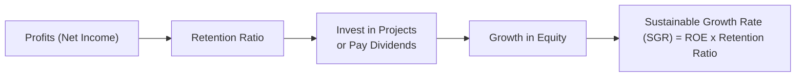

## Introduction and Core Concepts

Growth is exciting—no doubt about it. If you’ve ever invested in a company that seems to skyrocket, you know the thrill. But sustainable growth? That’s a slightly different story. Sometimes folks get all wrapped up in impressive revenue trends without asking: “Is this growth profitable and, well, can it last?” You know, I’ve seen companies launch brilliant new products and absolutely demolish short-term sales targets—only to hit a wall because they over-borrowed or overlooked capacity constraints. Let’s make sure that’s not your story.

### Defining Sustainable Growth

In a nutshell, sustainable growth is the rate at which a firm can expand its operations—revenues, profits, and market share—without blowing up its leverage or sacrificing profitability. In other words, it’s all about longevity. A firm that’s growing at a healthy, controlled pace can keep attracting investors, nurture customer loyalty, and maintain stable returns on equity (ROE).

There’s an important formula that tries to capture this idea in very simple terms:


\text{Sustainable Growth Rate (SGR)} = \text{ROE} \times \text{Retention Ratio}


• ROE is Return on Equity.  
• Retention Ratio (b) is the portion of net income the firm doesn’t pay out as dividends.

Why is this formula crucial? Because it reminds us that a company can only grow by plowing back its profits (that come from net income) at a certain efficiency level (that comes from ROE). If a firm’s ROE is, say, 15%, and it retains 60% of its earnings, its theoretical sustainable growth rate is 9%. Pushing beyond that 9% might require more external funding or more risk.

### Quick Python Example

If you like tinkering with data, here’s a tiny Python snippet that calculates SGR for a small set of companies:

```python
import pandas as pd

data = {
    'Company': ['Alpha', 'Bravo', 'Charlie'],
    'ROE': [0.15, 0.10, 0.20],
    'RetentionRatio': [0.6, 0.4, 0.7]
}

df = pd.DataFrame(data)
df['SGR'] = df['ROE'] * df['RetentionRatio']
print(df)
```

This prints out each company’s sustainable growth rate. Companies with a higher ROE and higher retention ratio can fund more growth from internal sources.

## Capital Structure and Financial Risk

A company that wants to outgrow its internal capacity can raise debt or equity—maybe both. But, you guessed it, that can change the firm’s risk profile. If you leverage too heavily, interest expenses and repayment obligations gnaw away at earnings, particularly when business conditions turn sour. And if you raise additional equity? You dilute ownership and possibly reduce earnings per share in the short run, which can be a sore spot for existing shareholders.

So be mindful of a well-balanced capital structure. A certain pivot to external financing isn’t necessarily bad, but do check if the cost of capital remains manageable. If the marginal cost of new debt or equity starts to spike, it might be a signal that markets view the firm’s current trajectory as risky.

## Product Life Cycles and the Pace of Growth

Many of us have been wowed by crazy-fast growth in new technologies. But let’s not forget product life cycles. Even the coolest product eventually sees competition, market saturation, and (if management isn’t on top of it) declining growth. For tech or pharmaceutical companies, product cycles might be short and intense. Others, like consumer staples, typically show slower but steadier (secular) growth.

Imagine a scenario: a cutting-edge phone maker sees incredible expansion in the first few years—super high demand, big brand hype. Then, new players enter. Suddenly, that phone maker must cut prices, eat into margins, or spend a fortune on R&D to keep pace. The once-ton-of-fun growth story could deflate quickly if management didn’t plan for competition and capacity constraints.

## Organic Versus Inorganic Growth

It also helps to be super clear on how a firm is growing:

• Organic Growth: Driven by good ol’ core operations—new products, new markets, or just more demand from existing customers. Usually low risk, but also relatively slow, because you reinvest profits bit by bit.  
• Inorganic Growth: Mergers and acquisitions (M&A), external partnerships, or expansions into new geographies. This can bring in a sudden revenue leap, but also integration headaches, cultural clashes, and, in many cases, heavier leverage.

One big M&A transaction might catapult top-line revenue growth, but watch out for intangible asset write-downs if the synergy assumptions were, well, a bit too rosy. If it looks too good to be true, it often is—especially if a firm’s prior track record was less than stellar.

## Aligning Revenue, Earnings, and Cash Flow

I can’t emphasize this enough: consistent growth should show up across the income statement and the cash flow statement. If the income statement proclaims 20% net income growth year after year, but operating cash flow barely moves, ask yourself why. Possibly:

• Over-aggressive Revenue Recognition: booking future sales prematurely.  
• Underinvestment in working capital: the firm might be delaying payments or collecting from customers slowly.  
• Channel Stuffing or Bill-and-Hold: shipping goods early to “meet targets.”  

None of these are healthy ways to maintain growth. Balanced growth typically features aligned trends in revenue, profits, and operating cash flow.

## Margin Stability, Capacity Constraints, and R&D

### Margin Stability

Margins are crucial for the big picture. If a firm’s revenue is booming but margins are eroding, the result could be that net income growth lags behind. Obviously, some industries live with tighter margins than others, but abrupt margin swings often signal changes in pricing strategy or cost structure.

### Capacity Constraints

Capacity constraints pop up when production, shipping, or even management bandwidth is stretched to its limit. Adding new production capacity often involves capital expenditures (CapEx), which can dent free cash flow. As a result, a firm might fund expansions with more debt or new shares. Sure, that might facilitate further growth, but it alters the risk-return equation. 

### R&D and Innovation

Some industries, especially biotech, pharmaceuticals, and technology, hinge on the success of R&D pipelines. You might see a high cost of research relative to sales. That’s a bet on the future. If those R&D initiatives bear fruit, fantastic—growth is boosted significantly. But if they flop, or if competitor products come out first, the expensive pipeline can become a drag. Analysis here involves checking historical R&D track records, management’s commentary on upcoming launches, and regulatory approvals.

## Management Guidance and Historical Performance

Yes, management’s forward guidance can be helpful. But we should cross-check:

• Have they been accurate in the past, or do they have a history of over-promising?  
• Is there a big shift in strategy that suddenly implies a doubling of growth projections? Could be legitimate. Or maybe they’re trying to distract from deeper issues.  

A consistent track record of either meeting or beating guidance suggests reliability, though surprises can come at any time.

## Adjusting for Macro Shocks and Using Scenario Analysis

### Macro Shocks

When you look at historical growth rates, pay attention to any recessions, commodity price spikes, or global events that might have skewed performance. That once-in-a-decade windfall from an economic boom doesn’t necessarily reflect everyday reality.

### Scenario Analysis

One great way to handle uncertain futures is scenario analysis. Build a few plausible outcomes:

• Base Case: Reasonable assumptions about the economy and market competition.  
• Optimistic Case: Maybe faster product adoption, fewer regulatory hurdles, strong consumer sentiment.  
• Pessimistic Case: Economic downturn, competitor breakthroughs, or cost overruns.

This variety helps set boundaries for growth expectations and clarifies how sensitive the business is to external shocks. It’s also a neat way to stress test a firm’s capital structure under different degrees of strain.

## Cyclical Versus Secular Growth

Let’s dig a little deeper into growth’s nature:

• Cyclical Growth: This mirrors the ups and downs of the overall economy. Think of industries like automotives, airlines, or machinery. Earnings can be brilliant in boom times, but quickly collapse if a recession hits.  
• Secular Growth: Long-term growth that keeps chugging along, often driven by unstoppable demographic, technological, or social trends. For instance, an aging population might consistently increase demand for certain healthcare products over decades.

Understanding the distinction is vital for forecasting. A cyclical firm might look unstoppable near the top of the business cycle, but it could be painfully vulnerable in lean years.

## Dividend Policy, Share Repurchases, and Retention

High dividends can be appealing to shareholders. But if the firm regularly pays out, say, 80% of earnings, that leaves only 20% for reinvestment. That 20% is your retention ratio (b). As we noted earlier, SGR = ROE × b. So a lower retention ratio means a lower theoretical sustainable growth rate, all else being equal.

On the flip side, share repurchases reduce share count, which can boost earnings per share (EPS). But repurchases also consume cash that could otherwise go into expansion. Management’s balancing act: if they see better returns from new projects, they might lower shareholder payouts to fuel growth.

## The Role of Intangibles

Intangible assets—like brands, patents, and loyal customer relationships—can drive growth that’s well above average. But intangible assets can also be precarious. If brand reputation takes a hit, or if patents expire, you might see a rapid vanishing act in pricing power. Keep an eye on intangible asset valuations on the balance sheet. Impairment might be necessary when an acquisition’s intangible benefits don’t pan out.

## Cross-Sectional Comparisons

Remember to examine how your firm’s growth metrics compare to its industry peers. If you see a mature industry where everyone else is growing at around 3% to 5% a year, but your company claims 20%? That’s either remarkable innovation or something suspicious. Dig deeper. Sometimes a truly disruptive product can justify radical differences. Other times, it’s a clue that management might be gaming the numbers or taking excessive risk.

## A Quick Mermaid Diagram

Let’s look at a simple flow depicting the logic from profits to reinvestment and ultimately growth:



The idea is straightforward: net income can be partially retained, fueling the equity base. The cycle can continue as long as returns on that reinvestment remain strong.

## Exam Tips and Key Takeaways

• Integrate Growth Indicators: Always check if revenue, net income, and cash flow growth are in sync. In annuity-like businesses or stable industries, consistent growth patterns matter.  
• Confirm Realism: SGR is a great starting point, but it’s not magic. If a firm claims it’ll exceed its SGR by a large margin, question whether that’s feasible without extra leverage.  
• Watch for Red Flags: Rapid margin erosion, big gaps between CFO and net income, or repeated downward guidance revisions.  
• Be Aware of Industry Structure: Some industries, particularly cyclical ones, might mask a company’s true performance. Use scenario analysis to see how robust the firm is in downturns.  
• Understand the Management Approach: A seasoned, transparent management team with consistent guidance is typically a calmer ride for investors.  
• Don’t Forget Qualitative Factors: R&D capabilities, intangible assets, brand strength, and global expansion strategies can sustain growth in subtle, non-quantitative ways.

## References and Further Reading

• CFA Program Curriculum – Equity Valuation Reading (Growth Analysis)  
• The Little Book That Still Beats the Market, Joel Greenblatt  
• Equity Asset Valuation, Jerald E. Pinto, CFA  
• Harvard Business Review articles on innovation and growth metrics  

## Test Your Knowledge: Growth Trajectories and Sustainable Earnings



### A company has an ROE of 20% and a retention ratio of 50%. What is its sustainable growth rate (SGR)?
- [ ] 10%
- [ ] 8%
- [ ] 12%
- [x] 10% (20% × 0.50)
> **Explanation:** SGR = ROE × Retention Ratio = 20% × 0.50 = 10%.  

### Which of the following best describes a key difference between organic and inorganic growth?
- [ ] Organic growth relies solely on reducing operating costs.  
- [x] Inorganic growth often involves acquisitions or partnerships.  
- [ ] Organic growth never involves new products or regional expansions.  
- [ ] Inorganic growth requires no capital outlay.  
> **Explanation:** Organic growth comes from a firm’s own efforts—new products or expanded sales of existing products. Inorganic growth typically involves external methods like M&A.  

### If a firm’s revenue has grown 15% annually, but its operating cash flow has grown only 5%, what might this indicate?
- [ ] The company is underreporting profits.  
- [x] The company may be aggressively recognizing revenue or not managing working capital effectively.  
- [ ] The company has high free cash flow.  
- [ ] The company’s capital structure is too conservative.  
> **Explanation:** Large discrepancies between revenue growth and cash flow growth can point to overly aggressive revenue recognition, channel stuffing, or poor working capital management.  

### Which element is most critical to the Sustainable Growth Rate concept?
- [ ] Earnings per Share (EPS)  
- [x] Retention Ratio  
- [ ] Debt-to-Equity Ratio  
- [ ] Revenue Growth  
> **Explanation:** SGR is directly linked to ROE and the retention ratio (the portion of net income retained in the business).  

### A high dividend payout ratio generally implies:
- [x] Lower sustainable growth, all else equal.  
- [ ] Higher sustainable growth, all else equal.  
- [ ] No effect on growth.  
- [ ] A reduction in overall risk.  
> **Explanation:** Paying out a higher share of earnings as dividends leaves fewer funds to reinvest, thus lowering the potential reinvested portion of ROE.  

### Which statement about capacity constraints is most accurate?
- [ ] They generally boost profits in the short term.  
- [ ] They only apply in cyclical industries.  
- [ ] They reduce the need for capital expenditure.  
- [x] They may force heavy capital expenditures to expand capacity.  
> **Explanation:** Once near maximum capacity, a firm faces the necessity of large capital investments to support additional growth.  

### Management guidance is:
- [ ] Always consistent with historical performance.  
- [x] A helpful indicator but should be cross-checked with prior track records.  
- [ ] Legally binding on the company.  
- [ ] Irrelevant to analysts.  
> **Explanation:** Guidance is valuable but needs to be compared with the company’s historical reliability and market conditions.  

### In which scenario might a biotechnology firm experience a sudden growth decline despite having strong historical trends?
- [ ] Short-term macroeconomic downturn  
- [x] A major product candidate fails to achieve regulatory approval  
- [ ] They announce an increase in share repurchases  
- [ ] Their intangible assets are halfway through amortization  
> **Explanation:** A failed regulatory approval can instantly derail growth in biotech firms, regardless of past performance.  

### Why might a company’s SGR differ substantially from its actual growth rate?
- [ ] Because SGR is a random measure  
- [x] Because the company might fund growth with debt or equity beyond what internal resources can sustain  
- [ ] Because SGR accounts only for intangible assets  
- [ ] Because the company cannot control its payout ratio  
> **Explanation:** A firm can exceed its SGR by leveraging external financing or altering capital structure, which allows growth to outpace what internal funds alone would permit.  

### A firm that relies heavily on cyclical growth:
- [x] May see earnings fluctuate in line with broader economic upturns and downturns.  
- [ ] Has a stable, predictable earnings trend under all conditions.  
- [ ] Does not need scenario analysis.  
- [ ] Only expands during recessions.  
> **Explanation:** Cyclical firms typically experience volatility in demand that correlates with economic conditions, making growth variable.  


