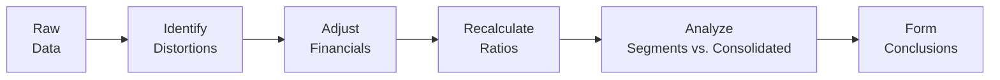

## Introduction

So, you’ve slugged your way through advanced ratio concepts—profitability, liquidity, leverage, and efficiency. Maybe you’re feeling like you’ve got all the formulas memorized and tested backward and forward. Yet when the real world (and the CFA® exam) tosses multiple segments, intangible asset capitalization, a foreign subsidiary, and a share repurchase plan your way—all wrapped into a single item set—it can be daunting. No worries! This workshop is here to walk you through the nitty-gritty of analyzing segmented financial statements and uncovering distortions that might lurk within.

In the following pages, you’ll see a hypothetical multi-segment scenario for a company called “GlobalTech Manufacturing Inc.” (GTM). GTM is a conglomerate with both a tech segment (software licensing, intangible assets, R&D) and a manufacturing segment (heavy equipment, significant inventory, and cost-of-production complexities). We’ll examine the company’s consolidated financials, footnotes, and management commentary (MD&A). Then we’ll revisit key adjustments—like removing non-recurring charges or clarifying off-balance-sheet exposures—to reveal how those tweaks shape ratio analysis.

Along the way, we’ll explore how these ratios connect to potential investment recommendations and valuation implications. Ready? Let’s dive in.

## Overview of the Hypothetical Vignette

Before we dissect the numbers, let’s outline the components of the multi-page item set:

• Consolidated Income Statement and Balance Sheet for GTM.  
• Segment disclosures: Tech Division and Manufacturing Division.  
• Footnotes discussing intangible capitalizations, a recent acquisition, lease commitments, share repurchases, and foreign currency translation details.  
• MD&A excerpts containing management’s claims about cost savings and synergy benefits.  

Many times, the exam item set might pack these details into a couple of pages with multiple-choice questions. Our aim here is to simulate that environment and encourage thorough reading and cross-referencing. Specifically, keep an eye on:

1. Intangible Asset Capitalization: The Tech Division might be capitalizing more development costs than we’d expect.  
2. Inventory Costing Changes: The Manufacturing Division might have shifted from FIFO to weighted average or vice versa.  
3. Off-Balance-Sheet Items: Leases, factoring of receivables, or other arrangements could be partially hidden.  
4. Foreign Currency Translation: If the company uses the current rate method in one subsidiary and the temporal method in another, watch out for distortions in equity or net income.  
5. Non-Recurring Charges: Management might claim certain expenses are “one-off,” but the footnotes might say otherwise.  

## Sample Financial Highlights

Below is a simplified snapshot of GTM’s consolidated financial data, along with separate segment data:

| (USD millions)                      | Consolidated | Tech Division | Manufacturing Division |
|-------------------------------------|-------------:|--------------:|-----------------------:|
| Revenue                             |      4,500   |       2,000   |             2,500      |
| Cost of Goods Sold                  |      2,520   |         900   |             1,620      |
| Gross Profit                        |      1,980   |       1,100   |               880      |
| Operating Expenses                  |      1,200   |         750   |               450      |
| Operating Income                    |        780   |         350   |               430      |
| Net Income                          |        520   |      (not separately disclosed) | (not separately disclosed) |
| Total Assets                        |      8,000   |       4,000   |             4,000      |
| Intangible Assets (net)             |      1,200   |       1,000   |               200      |
| Inventory                           |      1,100   |           50   |             1,050      |
| Total Liabilities                   |      3,600   |               |                       |
| Equity                              |      4,400   |               |                       |
| CFO (Cash Flow from Operations)     |        600   |               |                       |

**Footnotes & MD&A Highlights:**

• Tech Division R&D costs: $300 million capitalized as intangible assets this year, up from $200 million the previous year. Management asserts these are “leading-edge technologies with guaranteed payback.”  
• Manufacturing Division changed inventory costing from FIFO to weighted average this year, citing “improved cost matching.” Footnotes estimate a $40 million decrease in COGS if FIFO had been used consistently.  
• A newly acquired overseas subsidiary uses the temporal method for foreign currency translation. Gains/losses from remeasurement appear in net income.  
• GTM executed a stock repurchase program, buying back 5% of shares outstanding. Management states this was done to “reward shareholders,” but no explicit mention of how it might bump up EPS or ROE metrics.  
• A “one-time environmental cleanup charge” of $50 million landed in operating expenses. However, the footnotes reveal that a portion of this might recur annually due to deposit regulations.  
• GTM has an operating lease for a major manufacturing facility. The undiscounted future lease payments total $300 million over 10 years, not reflected in the balance sheet.  
• MD&A states: “We achieved cost reductions of $100 million across all segments,” but the financial statements do not clearly show a proportionate drop in operating expenses.  

## Approach to Granular Ratio Analysis

We want to break down the ratio analysis step by step:

### 1. Identifying Potential Distortions

• Capitalization of R&D: If GTM’s approach is aggressive, this might inflate assets and reduce expenses, so operating margins could appear better than they really are.  
• Inventory Method Switch: The manufacturing segment’s cost of goods sold is impacted. If the footnote suggests a $40 million difference under FIFO, that can shift profit margin.  
• Environmental Cleanup: The “one-time” label might be questionable. Should we treat it as recurring or truly nonrecurring?  
• Off-Balance-Sheet Lease: Potentially understates liabilities and can alter leverage ratios and interest coverage.  

### 2. Adjusting the Financials

Let’s illustrate an adjustment for a nonrecurring charge. Suppose you suspect only half of that $50 million cleanup is truly nonrecurring. Then an adjusted operating expense might be:


\text{Adjusted Operating Expenses} 
= 1{,}200 \text{ (original)} 
- 25 \text{ (half the charge)} 
= 1{,}175


The new operating margin becomes:


\text{Operating Margin (Adjusted)} 
= \frac{(1{,}980 - 1{,}175)}{4{,}500} 
= \frac{805}{4{,}500} \approx 17.9\%


Compare that to the unadjusted:


\text{Operating Margin (Unadjusted)} 
= \frac{780}{4{,}500} \approx 17.3\%


That’s a modest difference, but if repeated across multiple line items, it can materially alter your perception of profitability.

### 3. Calculating Core Ratios

Let’s highlight a few classic metrics:

• Return on Equity (ROE):

\text{ROE} 
= \frac{\text{Net Income}}{\text{Total Equity}} 

In our case, \\(\textstyle \text{Unadjusted ROE} = \frac{520}{4{,}400} \approx 11.8\%\\).

• Debt-to-Equity:

\text{D/E Ratio} 
= \frac{\text{Total Liabilities}}{\text{Total Equity}}

Which is \\(\textstyle \frac{3{,}600}{4{,}400} \approx 0.82\\). If we were to capitalize the operating lease (say $300 million of an estimated liability), the new liabilities would be $3,900, pushing D/E to \\(\textstyle \frac{3{,}900}{4{,}400} \approx 0.89\\).

• Profit Margin:

\text{Profit Margin} 
= \frac{\text{Net Income}}{\text{Revenue}}

Currently \\(\textstyle \frac{520}{4{,}500} \approx 11.6\%\\). If you suspect intangible capitalization artificially boosts net income, you might recast the financials.

### 4. Segment-Level Analysis

Want to know if the Manufacturing Division’s performance is overshadowing or amplifying the Tech Division? Calculate each division’s margins, DSO, DIO, etc., individually.

• Days Sales Outstanding (DSO) in the Tech Division might be shorter if licensing fees are promptly collected.  
• Days Inventory on Hand (DIO) in the Manufacturing Division might be longer because heavy machinery inventory can take longer to turn.  

If the consolidated statements look rosy, but the Tech Division’s intangible investments mask large lumps in expenses, that’s a big clue about overall sustainability of earnings. Likewise, the inventory costing switch in Manufacturing can artificially shift profits from one period to the next.

### 5. Evaluating CFO Backing of Earnings

Cash Flow from Operations (CFO) is $600 million, leaving a difference of $80 million between CFO and net income ($520 million). That’s not too large, so initially it might look fine. However, you’d want to see if CFO was boosted by changes in working capital, or if any intangible capitalizations reduced immediate R&D expensing. If the Tech Division significantly capitalizes expenditures, reported net income might seem healthy, but the actual cash outflow is hidden under “investing activities.”

### 6. Off-Balance-Sheet Items

As mentioned, the operating lease for a large facility is $300 million in total future commitments. If we discount those properly and include them in the balance sheet, we get a more realistic leverage picture:


\text{Adjusted Total Liabilities} 
= 3{,}600 + \text{PV of Lease} \quad (\text{approximately } 3{,}900 \text{ mil if discounted})


That also reduces interest coverage if, for instance, we capitalize interest expense on that lease. Failing to account for such a lease can cause us to underestimate the real financial burden.

### 7. The Acquisition & Goodwill

GTM’s footnotes mention a recent overseas acquisition. Goodwill was recognized at $200 million. If that turns out to be overvalued and subject to future impairment, the subsequent write-down could hurt future earnings. Also, foreign currency translation under the temporal method means remeasurement gains or losses can unusualy pop into net income, making it volatile and possibly inflating or deflating certain margins.

### 8. Share Repurchase Implications

Buying back shares typically elevates EPS and can pump up ROE by trimming the equity base. If management references “shareholder value creation,” you might want to see whether that’s just a short-term optics move (reducing share count to buoy ratios) or if it has a strong strategic rationale. For instance, if the repurchase was financed with more debt, that could increase financial risk.

### 9. MD&A vs. Footnotes: Conflicting Narratives

Management claims $100 million in cost reductions. Yet the footnotes and raw statements might not confirm that. This is an ideal place to flex your ratio muscles—compare year-over-year changes in operating expenses or segment-level costs. If expense lines don’t drop in line with these claimed synergies, you might question management’s story or suspect the cost savings were offset by something else (e.g., intangible amortization or integration costs).

### 10. Effective Tax Rate Spike

You might see an effective tax rate jump from, say, 20% last year to 28% this year. Is it because of a shift in pre-tax income from a lower-tax to a higher-tax jurisdiction? Or some one-time item (like an adjustment in deferred tax assets)? Understanding this helps you figure out whether net income is inflated or deflated by ephemeral tax events.

### 11. Summarizing Your Analyst Commentary

Once you perform all these adjustments, your commentary might look like this:

“Well, after revisiting the capitalized R&D, partial environmental charges, and the intangible assets from the acquisition, we discovered that GTM’s operating margin is slightly overstated in the Tech Division. Also, the share repurchase boosted ROE artificially. Adjusted ROE looks more like 10% than 11.8%. Meanwhile, the potential lease obligations push the leverage ratio closer to 0.89, a non-trivial increase from 0.82. Finally, suspicious cost savings claims in the MD&A and the intangible build-up in Tech suggest a need for further diligence on the quality and timing of revenue streams.”

### 12. Making the Investment Recommendation

Would you recommend a buy or pass on GTM? That decision depends on your final set of adjusted ratios, your comfort with the Tech Division’s intangible-based strategy, the cyclical nature of manufacturing, and the reliability of management’s statements. If adjusted valuations remain attractive and you believe in the synergy story, you might recommend an investment. If, however, the bulk of these “adjustments” simply unmask deeper issues (like recurring cleanup costs or questionable intangible valuations), you could advise caution.

### 13. Valuation Implications

When you tweak these ratios, you also tweak your assumptions for growth, discount rates, or comps. For example, if you realize that intangible capitalization is aggressively pushing down R&D expense, you might adjust your free cash flow projections downward. Similarly, capitalization of leases might raise the cost of capital due to increased financial risk. Keep tying these ratio findings back to your DCF or multiples-based valuations.

### 14. Common Pitfalls to Avoid

• Skimming Footnotes: Missing the special mention that the lease is a major factor in liabilities.  
• Ignoring Segment Nuances: Failing to see how each division’s unique accounting choices hide or exacerbate profit swings.  
• Overlooking Foreign Currency Method Differences: Gains or losses can slip into net income or CTA.  
• Trusting “One-Time” Items: Some “nonrecurring” expenses become annual events.  
• Not Reconciling MD&A with Numbers: Management might highlight synergy, but the data might not support it.

## References

• CFA Institute Learning Ecosystem: Practice item sets on footnote analysis and ratio adjustments.  
• Young, S. David, and Jacob Cohen. “Corporate Financial Reporting and Analysis.” Specific case studies on segment reporting.  
• Big Four Accounting Firm Guides (Deloitte, PwC, etc.) on multi-segment ratio analysis and advanced footnote disclosures.  

## Evaluate Granular Ratios and Distortions: Practice Questions



### Which of the following is a potential effect of aggressively capitalizing R&D costs in the Tech Division?
- [ ] Lower reported assets and higher net income.
- [ ] Lower reported equity and lower net income.
- [x] Higher reported assets and higher net income.
- [ ] Lower gross margin but higher ROE.

> **Explanation:** Capitalizing R&D results in less expense recognized immediately, raising net income. Assets increase as intangible assets are recorded.

### If the Manufacturing Division switches from FIFO to weighted average, and we see that it reduced COGS by $40 million, which statement is most accurate for analyzing performance?
- [x] Adjusting COGS back to FIFO may better reflect historical comparisons.
- [ ] Weighted average is always more conservative than FIFO, so no need to adjust.
- [ ] The $40 million difference is immaterial for ratio calculations.
- [ ] Cost of goods sold is unaffected by the inventory method change.

> **Explanation:** Switching inventory methods can distort year-over-year comparisons. Adding back the $40 million difference helps maintain consistency.

### How should you account for a major operating lease commitment of $300 million when calculating the debt-to-equity ratio?
- [x] Capitalize the lease to include its present value in liabilities.
- [ ] Ignore it, as operating leases are not recorded on the balance sheet.
- [ ] Subtract it from equity because it offsets intangible assets.
- [ ] Postpone until the lease becomes a finance lease.

> **Explanation:** The best practice in analyzing leverage is to treat significant operating leases as debt-like obligations reflective of future commitments.

### Which ratio is likely to be significantly impacted by the share repurchase?
- [ ] Debt/Assets ratio.
- [x] Return on Equity (ROE).
- [ ] Cash Conversion Cycle.
- [ ] Inventory Turnover.

> **Explanation:** A reduction in equity (via share buybacks) can inflate ROE, given the same level of net income.

### When the overseas subsidiary uses the temporal method, foreign currency remeasurement gains or losses:
- [x] Affect net income and can distort period-over-period comparisons.
- [ ] Are captured in other comprehensive income (OCI) only.
- [x] Potentially occur due to monetary asset remeasurements.
- [ ] Have no impact unless the local currency is the parent’s functional currency.

> **Explanation:** Under the temporal method, foreign currency remeasurement gains/losses appear in net income and can cause earnings fluctuations.  

### A large “one-time” environmental cleanup charge appears in operating expenses, but the footnote suggests it may recur. How should this be treated for ratio analysis?
- [x] Treat part of it as recurring if evidence supports ongoing costs.
- [ ] Ignore the entire cleanup cost as it’s labeled “one-time.”
- [ ] Move the entire cost to non-operating expenses.
- [ ] Capitalize the expense as intangible to smooth earnings.

> **Explanation:** If there is a strong indication that part of the charge will recur, adjusting only a portion is more accurate than discarding it altogether.

### How does capitalizing more intangible assets in Tech typically affect the depreciation or amortization profile?
- [x] It increases amortization expense in future periods.
- [ ] It removes intangible assets from future expense calculations.
- [x] It may reduce near-term R&D expenses but creates future write-down risks.
- [ ] It lowers reported assets over time.

> **Explanation:** Capitalizing intangible assets often decreases immediate expenses while raising future amortization or impairment risk.

### MD&A states $100 million in cost reductions, but the income statement does not reflect these. What should you do?
- [x] Investigate footnotes and segment data to reconcile the discrepancy.
- [ ] Accept management’s claim; MD&A is always correct.
- [ ] Conclude that operating expenses are miscalculated.
- [ ] Enforce a restatement of financials.

> **Explanation:** A thorough ratio analysis includes verifying management’s claims against footnotes and actual results. Sometimes synergy statements aren’t fully reflected yet.

### A spike in the effective tax rate from 20% to 28% might suggest:
- [x] A shift in the mix of profits to higher-tax jurisdictions.
- [x] A nonrecurring item or a reevaluation of deferred taxes.
- [ ] Lower statutory rates in all jurisdictions.
- [ ] No effect on net income or net margin.

> **Explanation:** Changes in geographic profit mix or a one-time adjustment to deferred tax balances can push the effective tax rate higher.

### True or False: Segment-level ratio analysis can reveal operational strengths or weaknesses not obvious in the consolidated numbers.
- [x] True
- [ ] False

> **Explanation:** Each segment may have unique cost structures, growth rates, and accounting policies that blend into the consolidated figure. Analyzing divisions separately uncovers new insights.


