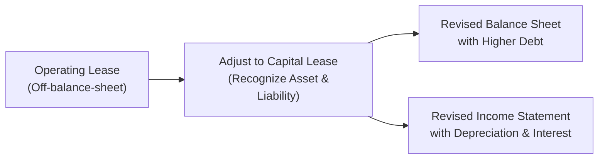
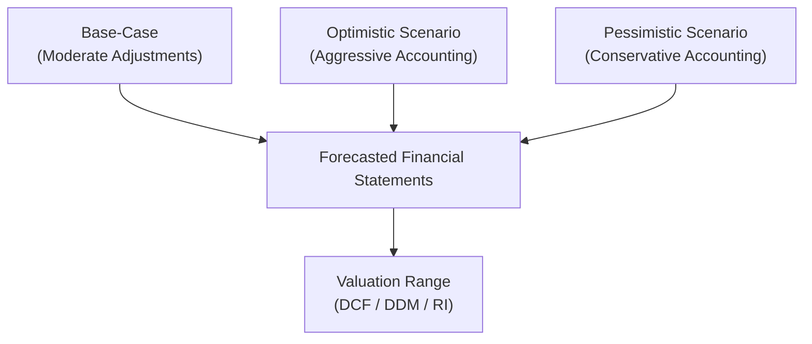

## Introduction
Valuing a company can sometimes feel like peeling an onion, layer by layer, to reveal the real story hidden beneath the official reports. Even if we trust management (and we usually want to), we should remember that reported financial statements are often littered with assumptions, accruals, and one-time items. So, how do we make sense of all this? The key is understanding how accounting adjustments—like capitalizing operating leases or normalizing pension assumptions—impact the metrics we rely on for valuation. If we miss these tweaks, we risk overvaluing or undervaluing a firm. In the CFA Level II context, you’ll see how adjustments made to a company’s books can fundamentally alter the numbers that feed into popular valuation models such as discounted cash flow (DCF), dividend discount models (DDM), or residual income (RI) approaches.

In this discussion, we’ll unravel the many ways analysts refine reported figures to reach more accurate estimates of a firm’s intrinsic value. Along the way, we’ll check out practical examples, highlight pitfalls, and propose best practices for building a rock-solid valuation model—one that can hold its own under the scrutiny of real-world markets and demands of the exam.

## Why Accounting Adjustments Matter
Have you ever picked up a financial statement and felt a bit uneasy, suspecting that certain “one-time” items show up every quarter? Or that management’s assumptions about future loan losses are perhaps a tad optimistic? I remember once chatting with a colleague who said, “I just can’t figure out why this company’s revenue seems to jump in the last quarter every single year—and then revert right back.” If a pattern recurs, can we still call it one-time?

Well, the truth is that accounting standards permit a fair amount of managerial discretion. Sometimes, you’ll catch a CFO smoothing out earnings or reclassifying costs to show a pretty picture for investors. As an analyst, you want to remove the “window dressing.” Hence, making accounting adjustments matters. It gives you a better shot at apples-to-apples comparisons across companies in the same industry and more confidence that your valuation is grounded in economic reality.

### Common Adjustments
• Capitalizing operating leases: If a company rents assets considered core to operations, reclassifying them as capital leases can reveal hidden leverage and alter reported EBITDA.  
• Normalizing pension costs: Adjusting discount rates or expected returns on plan assets ensures pension expenses more accurately reflect realistic assumptions.  
• Identifying and reclassifying non-recurring items: One-time restructuring charges or highly irregular litigation costs can distort reported profitability.  
• Revenue timing: If management has recognized revenue prematurely, we might need to adjust sales downward or shift them to a different period.

By implementing these and other adjustments, you’re cleaning up the numbers so your valuation is aligned with true, sustainable performance.

## The Tug of War: Conservative vs. Aggressive Accounting
We’ve all heard the buzzwords “conservative” and “aggressive” in accounting. Conservative accounting methods generally understate income in the short run (e.g., quicker recognition of potential losses, shorter depreciation periods), whereas aggressive approaches do the opposite (e.g., delayed recognition of certain expenses, spreading R&D costs over an extended period).  

### Why It Matters
• Conservative policies might lead to “hidden reserves,” so future earnings could be higher when these reserves are eventually unlocked or reversed.  
• Aggressive policies can inflate short-term earnings but could backfire if the company can’t sustain the illusions over time.  

From a valuation standpoint, if you see a company adopting extremely aggressive revenue recognition policies, you might need to reduce those “rosy” revenue figures in your model. Similarly, if you pick up on highly conservative, borderline pessimistic assumptions, it could mean the firm’s genuine earning power is understated.

## Evaluating Earnings Quality
When in doubt, follow the clues. Earnings quality revolves around how “real” and repeatable a company’s profits are. If we suspect an abnormally high proportion of discretionary accruals (like low loan loss provisions or insufficient allowances for doubtful accounts), we might see a big correction in the future. You might say, “But, come on, how can I measure discretionary accruals?” Tools like the Modified Jones Model, along with ratio analysis of accounts receivable growth vs. sales growth, can help identify questionable patterns.

There’s also a simpler approach: compare cash flow from operations (CFO) to net income. If net income is consistently outpacing CFO, that’s a warning bell. It could hint that management is pulling out all the stops to show profits that might not be backed by solid cash flow.

## Key Areas for Accounting Adjustments
Let’s zoom in on some typical areas where adjustments are super important for equity valuation. Each area, if treated incorrectly, can throw off your valuations by a wide margin.

### 1. Operating Lease Capitalization
Under IFRS and US GAAP, many leases are now capitalized on the balance sheet. Yet historically, operating leases often lurked in the notes, leaving analysts to do the heavy lifting themselves. So if you see older statements or less transparent ones, it’s crucial to “create” the right-of-use assets and lease liabilities. This exercise often boosts a company’s EBITDA (because operating lease expenses are replaced by depreciation and interest) but also raises debt levels. Here’s a whimsical diagram to illustrate:



By capitalizing these leases, you may see changes in key ratios, from debt-to-equity to return on assets. Naturally, in a discounted cash flow model, interest expense and depreciation schedules shift, which can alter free cash flow.

### 2. Pension Assumption Normalization
Pension accounting can be a real headache, especially if you’re dealing with defined benefit plans. Management assumptions—like the discount rate, expected return on plan assets, or average employee life expectancy—can dramatically affect reported pension expenses and the funded status of the plan. Normalizing these assumptions to industry averages or more realistic rates ensures you’re not building your valuation on an overly rosy pension forecast.  

### 3. Non-Recurring Items and One-Time Charges
Companies frequently classify certain expenses as non-recurring. When used sparingly, that might be fair. But if you see “restructuring charges” or “acquisition-related expenses” every single year, well, that’s no longer truly non-recurring. By adding back these charges (or by adjusting them to be part of normal operations), you can fix inflated or deflated earnings.

### 4. Revenue Recognition Timing
Timing is everything, or so they say. If sales are recognized earlier than they should be (think bill-and-hold arrangements) or if certain items are left in a “deferred revenue” account for too long, the timing can distort periodic earnings. Understanding the revenue recognition policies—in terms of IFRS 15 or ASC 606 (US GAAP)—and adjusting to ensure revenue lines up with actual delivery can remove significant measurement error in your forecasting.

## Linking Adjustments to Valuation Models
Sometimes, candidates assume the “adjustment process” ends once the statements look correct. But the real magic happens when you feed these refined statements into your equity valuation models. Let’s do a quick recap of some well-known approaches and why accurate statements matter for each.

### Discounted Cash Flow (DCF)
DCF is all about projecting future free cash flows and discounting them at the firm’s weighted average cost of capital (WACC). If you incorrectly exclude capitalized leases or incorporate abnormally low operating expenses, your free cash flow forecast might be off. A small mismatch or oversight can lead to a big error in your final valuation, especially since DCF sums up all future periods plus a terminal value.

The typical DCF structure can be summarized as:


\text{Equity Value} = \sum_{t=1}^{n} \frac{FCF_{t}}{(1 + WACC)^{t}} + \frac{\text{Terminal Value}}{(1 + WACC)^{n}}


Where:

• \\( FCF \\) can be heavily altered by discretionary accounting choices (e.g., depreciation, interest, working capital changes).  
• Terminal Value is extremely sensitive to the final year’s FCF.   

So if your last forecast year has inflated net income or suppressed capital expenditures, you’re likely to overestimate or underestimate the business’s continuing value.

### Dividend Discount Model (DDM)
The DDM focuses on the firm’s dividends:


\text{Value} = \sum_{t=1}^{\infty} \frac{D_{t}}{(1 + r_{e})^{t}}


Any policy that distorts reported earnings and, by extension, available free cash flow for dividends, can change your assumptions of the growth rate or expected dividend payout. Aggressive surveillance of policy changes is required if you’re relying heavily on dividends to gauge value.

### Residual Income (RI)
The Residual Income approach emphasizes:


\text{RI} = \text{Net Income} - (r \times \text{Beginning Book Value of Equity})


If the book value or net income is off because of unrecorded liabilities or artificially inflated earnings, your residual income measure will be unreliable. Because RI highlights “excess” returns beyond a required rate of return on equity, you must ensure both net income and book value reflect the true economic scenario. Capitalizing intangible assets (like R&D under IFRS development costs) can also increase book value, which influences the RI calculation each period.

## Tying Adjusted Financials to Forecasting
So, you’ve made your adjustments—fantastic. But that’s not the end of the story. You now want to take those clean statements and project them into the future. Suppose you raise the allowance for doubtful accounts to a more realistic level, which obviously lowers current net income. In your future forecast, you’d adjust the growth rate of receivables to ensure the same higher standard of provisioning continues. Conversely, if you’re capitalizing a chunk of R&D, be sure to factor in the future amortization of those capitalized assets.

These follow-throughs in your forecast can significantly alter:  
• Profit margins and net income profiles in each forecast year.  
• The shape of your free cash flow curve.  
• Key ratio trend lines (e.g., interest coverage, debt-to-assets).  
• Terminal value assumptions.

## Corroborating Adjustments
If your friend ever says, “I just trust management,” maybe nudge them (gently) to read the footnotes, investor presentations, and MD&A sections. Cross-reference official guidance with industry norms, watch management’s consistency over time, and compare with peer firms investigating whether the choices are in line or outliers. This is where the real detective work happens. 

Over multiple reporting periods, do you see management dramatically changing depreciation methods or revenue recognition policies without explanation? Could be a sign of opportunistic accounting. On the exam, you might see vignettes subtly highlighting shifts in policy—be sure to check those footnote disclosures carefully.

## Considering Intangible Assets & R&D Capitalization
Especially in industries like software or pharmaceuticals, intangible assets and R&D can be major drivers of future earnings. IFRS allows certain development phase expenditures to be capitalized if specific criteria are met. US GAAP generally expenses R&D immediately. That single difference can make cross-border comparisons tricky. If you suspect the intangible asset base is either overblown or underrated, re-expressing (i.e., adjusting) those items is often the difference between a pass or fail in discerning intrinsic value.

### Effects on Profitability
• Capitalizing R&D: Boosts current income (fewer immediate expenses) but introduces future amortization.  
• Expensing R&D: Depresses current income but can lead to a smoother path in future periods.

An example? Let’s say a UK-based (IFRS) software firm capitalizes a big chunk of development costs, strongly lifting net income. A US-based (GAAP) competitor in the same space expenses everything. If you apply a simple price-to-earnings multiple to compare the two, guess what? You’d be comparing apples to oranges. Standardizing these treatments is vital for a fair valuation approach.

## Share-Based Compensation: Dilution and Beyond
Share-based compensation (SBC) can be a real doozy if you’re not careful. On one hand, awarding options is an expense, diluting the ownership stake of existing shareholders. On the other hand, option-based pay can align employee incentives with overall performance. For valuation, keep these pointers in mind:  
• Incorporate the additional shares into your diluted EPS calculations. Don’t rely on basic EPS alone.  
• Watch for modifications, repricing, or new option grants. They can shift the future share count significantly.  
• Overly large “stock-based compensation” line items might artificially inflate operating cash flow because SBC is added back as a non-cash expense. But the real cost is the dilution of ownership.

If you ignore the dilutive aspect, you might overvalue the firm because your “per share” metrics look better than reality.

## Scenario Analysis for Accounting Adjustments
Given the subjectivity in certain estimates (pension discount rates, intangible asset lifespans, etc.), scenario analysis can be powerful. Gaming out best-case, worst-case, and base-case scenarios on how these estimates might shift can help you see the range of fair values. 

Try adjusting the discount rate for pensions up or down by 50 basis points, or rework the growth rate if intangible asset capitalization is less (or more) than you assumed. This approach is especially relevant in exam item sets, where you may be asked to evaluate a range of outcomes under different conditions.



When performing these scenario adjustments, keep track of how changes in one line item (e.g., intangible asset amortization) might have ripple effects on operating margins, net income, and taxes in future years.

## Best Practices and Common Pitfalls
Let’s be honest: analyzing adjustments is time-consuming, and in exam conditions, you might feel pressed for time. But ignoring them can lead you astray. Here are some do’s and don’ts:

### Do:
• Stay consistent across all peer companies you’re valuing, ensuring that a single adjustment is applied uniformly.  
• Look at multi-year trends to see if “one-time” items are repeated.  
• Keep comprehensive notes so you remember your reasoning.  

### Don’t:
• Randomly assume zero one-time items without verifying.  
• Over-adjust to the point of ignoring the company’s actual reported statements. (Yes, we correct for manipulations, but there is a limit—use footnotes and disclosures as a guide.)  
• Forget about the real cash flow implications of certain changes (especially capitalizing vs. expensing).

## Practical Example: Delivering a More Accurate Computation
Imagine that you have a small set of data and want to see how capitalizing an operating lease changes your DCF model. Below is a simplified Python snippet that demonstrates a straightforward approach to rearranging the lease expense into depreciation and interest. Don’t worry if you’re less comfortable with Python—this is just to illustrate the concept:

```python
cfo_original = 1000
dep_original = 300
int_original = 100
net_income = 500

# We decide to capitalize it: assume half is interest, half is depreciation for example.

lease_int = 100
lease_dep = 100

cfo_adjusted = cfo_original + 200  # remove the lease expense from CFO
dep_adjusted = dep_original + lease_dep
int_adjusted = int_original + lease_int
net_income_adjusted = net_income  # might remain the same if we still expense it, but classification shifts

print("Adjusted CFO: ", cfo_adjusted)
print("Adjusted Depreciation: ", dep_adjusted)
print("Adjusted Interest: ", int_adjusted)
print("Net Income (potentially unchanged, but classification changes apply): ", net_income_adjusted)
```

In real life, you’d refine the interest and depreciation amounts based on discount rates and lease lengths. Also, watch how these changes flow through to your free cash flow calculations, which feed your DCF. In the exam, you probably won’t code, but you might do a mini-version in your financial calculator or by hand.

## Glossary
• **Discretionary Accruals:** Accounting adjustments arising from management estimates (like depreciation methods or bad debt allowances) that influence reported earnings.  
• **Restatement:** Revision of previous financial statements to correct errors or misstatements, often leading to improved comparability.  
• **Residual Income (RI) Model:** A valuation method focusing on net income beyond an acceptable return on equity.  
• **Terminal Value (TV):** The estimated value of a firm’s cash flows beyond the forecast period.  
• **Share-Based Compensation:** Equity instruments provided as compensation, potentially diluting share counts and affecting per-share metrics.  
• **Footnotes (MD&A):** Disclosures providing detail and context for the primary financial statements.  
• **Capitalization of R&D:** Possible under IFRS if specific criteria are met; may shift expenses to the asset side, changing net income and book value.  
• **Comparables (Comps):** Benchmarks of peer companies for relative valuation multiples.

## References & Further Exploration
• “International Financial Statement Analysis” by Jerald E. Pinto et al. (CFA Institute Investment Series).  
• IFRS Foundation (https://www.ifrs.org) for deeper dives into IFRS standards.  
• “Equity Asset Valuation” by Jerald E. Pinto et al. (CFA Institute Investment Series).  
• Online tutorials on analyzing pension footnotes and share-based compensation.  
• Industry conference calls and transcripts (often found on IR websites) for real-time management commentary.

## Exam Tips
• Read those footnotes! You’ll likely see subtle hints in a vignette about changes in accounting policy or new one-time items.  
• Use consistent adjustment methods: if you capitalize leases for Company A, do the same for Company B, especially if they’re in similar industries.  
• Don’t panic if you see complicated pension disclosures. Focus on the discount rate, expected asset return, and gain/loss recognition—these are your big levers.  
• For scenario-based questions (common in Level II item sets), swiftly identify how an adjustment would shift key metrics like EBITDA, net income, or CFO.

And that’s it. Whether you’re in your office analyzing a potential investment or in the test center combing through a vignette, remember: accounting numbers are seldom perfect. We refine them to see a truer picture of economic reality—and that’s the heartbeat of good valuation.

---

## Assessing Accounting Adjustments in Equity Valuation: Test Your Knowledge



### Which of the following is most likely a reason to capitalize an operating lease?

- [ ] To decrease net income in the current period.
- [ ] To reduce both depreciation expense and interest expense.
- [ ] To avoid disclosing any liabilities on the balance sheet.
- [x] To more accurately depict the firm’s economic obligations and improve comparability.

> **Explanation:** Capitalizing an operating lease brings the lease obligations onto the balance sheet as liabilities and creates right-of-use assets. This treatment improves comparability by recognizing the economic nature of the lease and reflecting indebtedness that can be hidden if accounted for off-balance-sheet.

### An analyst finds a firm with extraordinarily low allowance for doubtful accounts relative to peers. What risk does this pose for valuation?

- [ ] Lower estimates of capital expenditures.
- [x] Overstated earnings and potential future write-offs.
- [ ] Understated intangible assets.
- [ ] Understated operating cash flow.

> **Explanation:** If the allowance for doubtful accounts is too low, the firm might be overstating net income with insufficient provisioning for bad debts. Eventually, if more receivables go unpaid, there may be a spike in write-offs, reducing future earnings.

### Under IFRS, some development phase R&D expenses can be capitalized. If two firms in the same industry use different approaches (one expenses all R&D, the other capitalizes), how should an analyst handle these differences?

- [x] Adjust financials to a common basis for both firms before comparing.
- [ ] Treat the capitalized R&D as an off-balance-sheet item and ignore it.
- [ ] Increase net income for both companies to maintain consistency.
- [ ] Assume it has no bearing on valuation.

> **Explanation:** Consistent presentation is critical for meaningful comparisons. An analyst should make adjustments so both firms’ financials align on R&D accounting treatment.

### In a residual income (RI) valuation, which of the following would most likely happen if a company significantly understates its book value of equity?

- [ ] Residual income would appear inflated.
- [x] Residual income would appear understated if net income is unchanged.
- [ ] Residual income would be unaffected by changes to book value.
- [ ] Residual income would only change if the discount rate is affected.

> **Explanation:** Residual income = Net Income – (r × Beginning Book Value of Equity). If the firm’s book value of equity is artificially low, the subtracted term (r × BV) is smaller, so the result would be higher than it should be—meaning the “true” residual income is actually overstated. However, if net income is also affected, the direction can vary. Typically, understating BV can inflate measured RI. Analysts must check both net income and BV carefully.

### A company reclassifies frequent restructuring costs as “non-recurring.” How might an analyst respond in valuation terms?

- [x] Add these costs back to normal operating expenses.
- [ ] Ignore the expenses altogether.
- [ ] Extend the useful life of the company’s assets.
- [ ] Assume management has accurately reflected these costs.

> **Explanation:** If charges appear year after year, they are effectively recurring. An analyst would include these costs in normal operating expenses rather than treating them as isolated events.

### An analyst wants to see if a firm’s revenue is recognized prematurely. Which of the following is most relevant?

- [x] Checking the timing of actual delivery or performance obligations.
- [ ] Verifying the firm’s operating lease disclosures.
- [ ] Monitoring intangible asset capitalization.
- [ ] Doubling the company’s interest expense.

> **Explanation:** Revenue recognition depends on whether the product or service has been delivered and whether performance obligations are substantially satisfied. Examining these terms is crucial for identifying any prematurely booked revenue.

### When examining pension costs, which assumption is most critical for adjusting the firm’s earnings to reflect economic reality?

- [x] The discount rate used to measure pension obligations.
- [ ] The dividends paid to plan beneficiaries.
- [ ] Future marketing expenditure growth rates.
- [ ] Management’s personal preferences for plan features.

> **Explanation:** The discount rate drives the present value of pension obligations. If management chooses an unrealistically high discount rate, pension obligations appear smaller, thus artificially boosting current earnings.

### A firm’s management consistently uses aggressive accounting assumptions, resulting in overstated earnings. What is the primary long-term risk for investors?

- [x] A sharp revision of earnings in the future when assumptions prove unsustainable.
- [ ] More conservative disclosure in the footnotes.
- [ ] Less potential for permanent impairments.
- [ ] Reduced ability to pay dividends from actual cash flow.

> **Explanation:** Aggressive assumptions that inflate earnings can only stretch so far. Ultimately, the reality of lower cash flows or higher expenses emerges, causing abrupt downward revisions. This can be detrimental to investor returns.

### Which of the following best describes a scenario analysis approach to accounting adjustments?

- [x] Testing how different sets of assumptions (e.g., discount rates, R&D capitalization) alter the valuation outcome.
- [ ] Calculating the average of DDM, DCF, and RI valuations.
- [ ] Estimating intangible assets for peer companies.
- [ ] Ignoring footnotes while focusing on the bottom-line EPS figure.

> **Explanation:** Scenario analysis involves altering assumptions around key accounting estimates and observing the effect on projected earnings or cash flows. It helps gauge the sensitivity and range of potential valuations.

### True or False: Diluted EPS calculations ignore the effects of new shares issued via stock options because options are considered an expense only.

- [x] True
- [ ] False

> **Explanation:** This statement, as written, is actually false in practice. Diluted EPS calculations must account for the potential impact of stock options on the share count. If the statement says “diluted EPS calculations ignore the effects...” then that is incorrect in real-world GAAP/IFRS practice. However, since the question presents it as a “True/False” about ignoring the effect, the correct marking is that the statement is false. (Note the question is tricky: If an exam item says “True or False: ‘Diluted EPS calculations ignore the effects of new shares...’,” the correct answer is that it’s false, because diluted EPS must include the effect of new shares from options or warrants.)


