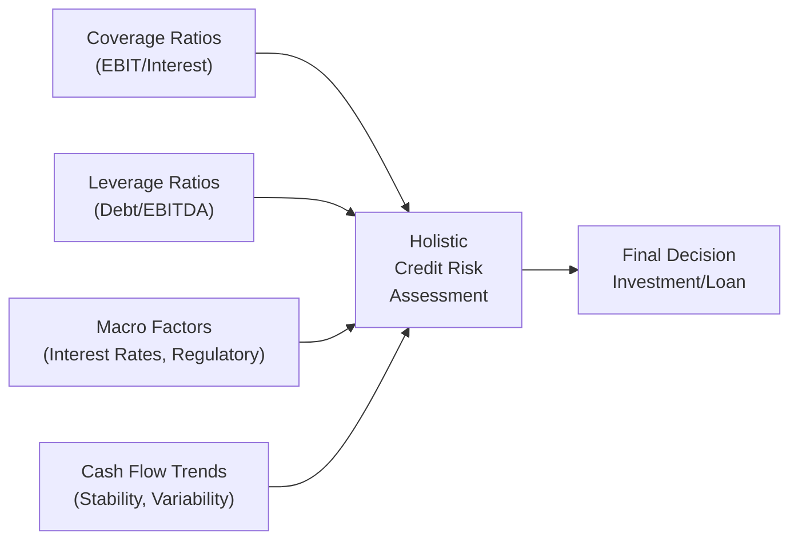

## Introduction
Credit analysis is all about investigating whether a company can comfortably meet its debt obligations, especially under less-than-ideal circumstances. While equity analysts may get excited about growth prospects, credit professionals tend to focus on the downside—sort of like always scanning the horizon for storm clouds before setting sail. You can bet that consistent cash flows, a solid liquidity position, and a manageable debt structure rank super high on a credit analyst’s wish list.

I remember chatting with a colleague who used to say, “Hope is not a strategy.” That statement might come across as negative, but in credit analysis, it’s spot on. You can’t rely on hope when it comes to paying back interest and principal. You need cold, hard facts, which often boil down to a handful of ratios, comprehensive off-balance-sheet adjustments, and rigorous scenario testing.

Below, we’ll explore the fundamental metrics that credit analysts lean on, along with the essential adjustments and forward-looking considerations that help you get as close to a true portrait of a borrower’s risk as possible.

## Overview of Key Credit Analysis Tools
Credit analysis combines quantitative and qualitative factors, always seeking to answer one main question: “Can this firm consistently meet its financial obligations?” The short answer is found through:

• Coverage ratios: The ability to cover interest (and sometimes principal).  
• Leverage ratios: How much debt is stacked on the firm’s balance sheet relative to its capital or earnings power.  
• Cash flow analysis: The reality check to see if the firm’s operating, investing, and financing decisions leave it with enough cushion to pay down debt.  
• Off-balance-sheet adjustments: Because some obligations don’t show up where you’d expect them.  
• Covenants and collateral: Protective layers for lenders that can profoundly impact a borrower’s flexibility.  
• Macroeconomic variables: Real-world forces like interest rates, exchange rates, or even a sudden regulatory shift.  

Let’s break down the most critical tools and highlight how they fit into an analyst’s process.

## Coverage Ratios
Coverage ratios gauge how many times a company’s earnings (or cash flow) can meet its interest obligations. When those coverage ratios slip close to 1.0×, it essentially means all cash is just covering the interest, leaving zero margin for error. That’s obviously a red flag if you’re a creditor.

### Interest Coverage (EBIT / Interest Expense)
This is one of the most common coverage metrics. It’s basically how many times operating profit can handle interest payments. Some prefer using EBITDA instead of EBIT since EBITDA is closer to operating cash flow. However, EBITDA conveniently ignores depreciation and amortization (both can still be major costs for capital-intensive firms).

• The higher the ratio, the more comfortably a firm can pay interest due.  
• The lower the ratio, the more likely the firm faces distress if revenues drop or costs rise unexpectedly.

### Fixed-Charge Coverage
A variation on the interest coverage theme, fixed-charge coverage broadens the scope by including lease payments or other fixed obligations. It’s calculated as something like:
(EBIT + Fixed Charges) / (Fixed Charges + Interest Expense).  
Here, “fixed charges” might include lease expenses or any other contracted flight of funds.

## Leverage Ratios
Leverage ratios reveal how much debt is supporting the firm’s capital structure. High leverage magnifies both the upside (if everything goes great) and the downside (if the economy tanks or if the firm’s specific industry hits a slump).

### Debt-to-EBITDA
This ratio is a quick measure that says, “How many years of current EBITDA does it take to pay off total debt?” Lenders commonly use it to set covenants or to define default triggers. If Debt-to-EBITDA is skyrocketing, it suggests the firm’s capital structure might be unsustainable unless EBITDA grows or debt is paid down.

### Debt-to-Equity
Often the first ratio that pops up in quick comparisons. It’s straightforward: total debt divided by total shareholders’ equity. A more conservative balance sheet usually means a lower debt-to-equity ratio. Notably, we want to ensure total debt is measured consistently (e.g., including current portion of long-term debt, short-term borrowings, and adjusted for any off-balance-sheet exposures).

## Adjusting for Off-Balance-Sheet Liabilities
This is where we separate the novices from the experts. A firm may use operating leases, special purpose entities (SPEs), or factoring arrangements to keep liabilities out of sight (but they are definitely not out of mind for credit analysts). Under IFRS and US GAAP, operating leases for real estate are mostly brought onto the balance sheet these days, but you still want to watch out for older liabilities or any creative structuring.

### Common Off-Balance-Sheet Arrangements
• Operating Leases: Even though lease accounting standards have tightened, older or specialized leasing setups might still be partially off-balance-sheet.  
• Special Purpose Entities (SPEs) / Variable Interest Entities (VIEs): An entity that could house debt that doesn’t show up on the sponsor’s statements if certain conditions are (or were) met.  
• Understated Pension Obligations: Sometimes companies use optimistic discount rates or asset return assumptions to reduce reported pension liabilities.

You want to gather the relevant disclosures (often hidden in the footnotes), estimate the present value of these obligations, and add them to the firm’s total debt. Then you recalculate your leverage and coverage ratios for a more authentic picture of risk.

## Sustainability of Cash Flows
If operating cash flows are unpredictable, interest coverage can vanish in the blink of an eye. Stable, recurring, or contractually committed revenues (like take-or-pay contracts or regulated utilities) offer a better cushion. Some items to scrutinize:

• Trends in the cash flow statement: If cash flows from operations (CFO) have been declining year over year, that’s a sign.  
• Seasonality: Some companies generate the majority of CFO in a single quarter (e.g., holiday sales).  
• Industry disruptions: A new technology, regulation, or competitor can crater previously stable operating cash flows.

## Forward-Looking Analysis
Looking at past and present data is never enough. Credit analysis thrives on understanding what could happen to a firm’s finances in the near term:

• Debt maturity schedule: Are big debt repayments looming within the next 12 months?  
• Refinancing risk: If interest rates are on the rise, rolling over old debt might get pricey.  
• Contingent liabilities: Lawsuits, potential fines, or other “we’ll see” items.  

Creditors frequently stress test these scenarios. For instance, you might model a 2% increase in your borrowing cost or a 10% decrease in top-line revenue to see if coverage ratios or cash flow stay within comfortable levels.

## Covenants and Collateral in Credit Agreements
I once heard a company CFO say, “Covenants are like curfews.” If you break them, trouble often follows. Debt covenants typically define:

• Maximum permitted leverage (like a set Debt-to-EBITDA ceiling).  
• Minimum coverage ratios.  
• Restrictions on dividends, share buybacks, or additional indebtedness.

Collateral, on the other hand, serves as a plan B for lenders if the borrower can’t make good on payments. If collateral is top-tier (e.g., real estate, high-quality inventory), that lowers credit risk. But intangible collateral can be tricky—imagine trying to sell intangible assets in a distressed scenario.

## Macro and Sector Considerations
Even the best-run, lowest-leveraged company can face credit distress if macroeconomic winds shift. Keep an eye on:

• Interest Rate Environment: Rising rates mean higher debt costs, especially if a firm relies on variable-rate debt.  
• Currency Risks: Volatile exchange rates can catch companies with foreign-currency liabilities off guard.  
• Regulatory Shifts: Stricter rules can quickly turn once-attractive industries into nightmares.

## Benchmarking and Peer Comparisons
Comparing a firm’s ratios to industry peers is crucial. If your company’s interest coverage ratio is 3× while peers average 10×, that’s a huge discrepancy. You also want to see how a firm’s metrics have trended over time. Has leverage slowly been creeping up while coverage is shrinking? Those are typically early warning signals often overlooked when everything is going “fine.”

Here’s a simple illustration in Mermaid to show how you might conceptualize the interplay among coverage, leverage, and external factors:



## Combining Quantitative and Qualitative Factors
Quantitative ratios alone don’t tell the whole story. You also need to consider:

• Management’s track record and credibility: Are they transparent about potential risks?  
• Corporate governance: Too many related-party transactions or a controlling shareholder overshadowing minority interests?  
• Industry fundamentals: Market demand, competitive landscape, barriers to entry.  

Credit analysts use these qualitative factors to reinforce—or sometimes contradict—the signals from ratio analysis. If there’s a big mismatch between the “numbers story” and the “narrative story,” you dig deeper.

## Simple Python Example for Ratio Calculation
Below is a brief snippet showing how you might compute a few coverage ratios using Python. (Of course, in a real exam or real-world scenario, you’ll likely use your financial calculator or a spreadsheet.)

```python

import pandas as pd

data = {
    'EBIT': [1200000],       # in USD
    'EBITDA': [1500000],
    'Interest_Expense': [200000],
    'Fixed_Charges': [50000]
}

df = pd.DataFrame(data)

df['Interest_Coverage_EBIT'] = df['EBIT'] / df['Interest_Expense']
df['Interest_Coverage_EBITDA'] = df['EBITDA'] / df['Interest_Expense']
df['Fixed_Charge_Coverage'] = (df['EBIT'] + df['Fixed_Charges']) / (df['Interest_Expense'] + df['Fixed_Charges'])

print(df)
```

## Common Pitfalls
• Overreliance on historical data: Companies evolve, industries transform, and interest rates fluctuate.  
• Ignoring red flags in footnotes: Some sneaky or complicated instruments can hide risk.  
• Overly rosy assumptions in stress tests: Stress testing means stress—try a real workout, not a warm-up.  
• Not factoring in currency mismatch: If you have debt in a currency not aligned with your revenues, watch out.  
• Blindly trusting Non-GAAP metrics: Some companies present “adjusted EBITDA” that can be aggressive.  

## Conclusion
Credit analysis isn’t rocket science, but it demands discipline, thoroughness, and a touch of skepticism. You’d be surprised how often major problems are spelled out in the notes to the financial statements—if you actually read them. By carefully calculating and evaluating coverage ratios, leverage measures, off-balance-sheet exposures, and future obligations, you get a clearer sense of a company’s real capacity to repay its debts.

As you practice for the CFA exam, focus on the interplay between the balance sheet, income statement, and statement of cash flows. Vignette-style questions will typically throw in a footnote that changes your entire ratio calculation, so be ready to adjust. And always remember: “Hope is not a strategy.” Numbers, adjustments, and well-thought-out scenarios paint the real picture.

## References & Further Reading
• “Corporate Credit Analysis” (CFA Institute Publications)  
• “Credit Risk Management” by Tony Van Gestel and Bart Baesens  
• Basel Committee on Banking Supervision: https://www.bis.org/bcbs/  

---

## Test Your Credit Analysis Knowledge with Practice Questions



### A company’s EBIT is $1 million, while interest expense is $250,000. The firm also has an operating lease expense of $100,000 that is not capitalized on its balance sheet. Which of the following is the closest interest coverage ratio using EBIT only?

- [ ] 2.0×
- [x] 4.0×
- [ ] 5.0×
- [ ] 10.0×

> **Explanation:** With EBIT of $1 million and interest expense of $250,000, interest coverage is simply $1 million / $250,000 = 4.0×. The operating lease expense, though important for broader analysis, doesn’t affect the basic EBIT/Interest measure directly.

### If a firm’s Debt-to-EBITDA ratio has increased from 3× to 5× over the last year, while EBITDA remained stable, which of the following is the likely cause?

- [ ] Lower interest expenses
- [ ] Improved coverage ratio
- [x] Higher overall debt levels
- [ ] Greater EBITDA cushion

> **Explanation:** Since EBITDA didn’t change, the ratio could only have increased if total debt rose, making the company more leveraged.

### Which of the following potential off-balance-sheet items is most likely to understate leverage if it is not adjusted for?

- [ ] Short-term accounts payable
- [x] Operating lease obligations
- [ ] Current portion of long-term debt
- [ ] Retained earnings appropriation

> **Explanation:** Historically, operating leases were off-balance-sheet commitments. Failing to capitalize them would understate both lease liabilities and total debt.

### A firm has a covenant stating that its Debt-to-EBITDA must remain below 3.5×. The firm’s EBITDA is $2 million, and total debt stands at $7 million. Which of the following is correct regarding its covenant compliance?

- [ ] The firm’s ratio is 3.0×, so it violates the covenant.
- [x] The firm’s ratio is 3.5×, so it is on the edge of compliance.
- [ ] The firm’s ratio is 2.8×, so well within compliance.
- [ ] The ratio cannot be determined with the given numbers.

> **Explanation:** Debt-to-EBITDA = $7 million / $2 million = 3.5×, exactly the threshold.

### When analyzing credit risk from a qualitative standpoint, which factor is likely to be most relevant?

- [ ] The firm’s inventory turnover ratio
- [x] Management’s track record and credibility
- [ ] The market risk premium
- [x] Corporate governance structures

> **Explanation:** Qualitative analysis often involves assessing the trustworthiness and competence of management, along with governance practices. These can significantly influence a firm’s creditworthiness beyond the raw numbers.

### A company reported Net Income of $800,000, Depreciation of $200,000, and Amortization of $50,000. Interest Expense is $150,000. Using EBITDA for an interest coverage ratio, what is the most appropriate calculation?

- [x] ($800,000 + $200,000 + $50,000) / $150,000 = 7.0×
- [ ] ($800,000 + $200,000) / $150,000 = 6.7×
- [ ] $800,000 / $150,000 = 5.3×
- [ ] ($800,000 + $50,000) / $150,000 = 5.7×

> **Explanation:** EBITDA = Net Income + Depreciation + Amortization (assuming no interest or taxes are separately provided). That gives $1,050,000 / $150,000 = 7.0× for EBITDA/Interest Expense.

### Which of the following scenarios best describes “Refinancing Risk?”

- [ ] The possibility that a firm’s products become obsolete
- [ ] The risk that a company cannot pay its suppliers on time
- [x] Inability to roll over maturing debt on acceptable terms
- [ ] A credit downgrade leading to higher coupon payments on existing debt

> **Explanation:** Refinancing risk centers on the difficulty of extending or repaying maturing debt, especially if market conditions or the firm’s credit profile have worsened.

### Which of the following is true regarding covenants in a debt agreement?

- [ ] They primarily protect the interests of shareholders.
- [ ] They guarantee the company’s future profitability.
- [x] They impose restrictions on borrower activities to protect creditor interests.
- [ ] They are typically unenforceable in most jurisdictions.

> **Explanation:** Covenants are designed to protect lenders and ensure the borrower’s financial practices remain within agreed-upon limits.

### Which ratio would an analyst likely emphasize to evaluate whether a firm’s operating results can consistently cover both interest and lease payments?

- [ ] Quick ratio
- [ ] Debt-to-equity
- [ ] Cash ratio
- [x] Fixed-charge coverage ratio

> **Explanation:** Fixed-charge coverage is specifically targeted at covering all fixed financial obligations such as interest and lease payments.

### True or False: A low Debt-to-Equity ratio always indicates that the company is a safe credit bet.

- [x] True
- [ ] False

> **Explanation:** While a low Debt-to-Equity ratio generally implies lower leverage, it does not automatically guarantee safety. Other factors (e.g., hidden off-balance-sheet liabilities, uncertain cash flows) may still pose significant risks.


