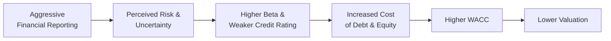

## Influence of Accounting Transparency on Perceived Risk

Let’s be honest: the cost of capital can feel like one of those dry, formula-heavy topics you’d rather sidestep if you could. But—trust me—understanding your weighted average cost of capital (WACC) is absolutely crucial if you’re analyzing or valuing a company. And guess what? A firm’s accounting choices have a direct link to how investors and creditors see its risk profile, which in turn flows through to its cost of capital. If you’ve ever seen a company post amazing earnings one quarter and then face skeptical questions from analysts, you’ve witnessed how numbers on a financial statement can shift perceptions of risk at lightning speed.

Picture a scenario: Company A uses conservative revenue recognition, rigorous impairment testing, and thorough footnotes. Company B, in the same industry, pushes the envelope with aggressive revenue treatments and minimal depreciation. Which one would you say is riskier on the surface? Many investors would intuitively spot the second company’s financial statements as more likely to face restatements or unpleasant surprises later on. The market and credit rating agencies aren’t shy about penalizing such behavior with a higher cost of capital. The logic is direct: more uncertainty equals more risk, which typically translates to higher required returns.

## Aggressive Accounting Maneuvers and Their Impact on WACC

Aggressive accounting is like a shiny short-term fix. It might boost reported earnings—at least temporarily—but it often comes back to bite. Inflating revenues or understating expenses can temporarily boost profits. Those inflated profits might lead to a short-term bump in the stock price or maybe even cheaper borrowing if the company’s debt metrics look strong. But—and here’s the kicker—the day the market realizes that some of those numbers were artificially padded, you can expect investors to demand higher returns on equity and debt to compensate for the newly exposed risk.

A quick personal anecdote: I once saw a smaller industrial company that significantly extended the useful life of its machinery and recognized minimal depreciation expense. It was, on paper, super-profitable for several quarters. Then, a new CFO arrived, promptly shortened the remaining useful lives, and took a big depreciation catch-up. The earnings cratered. Soon, credit agencies raised eyebrows, the stock price sagged, and the firm felt an immediate spike in its cost of borrowing. That’s the real heart of the matter: short-term illusions from aggressive accounting erode credibility.

## Capital Structure and Hidden Leverage

Your WACC formula—yes, that old friend that goes something like:


\text{WACC} = \left( \frac{D}{D + E} \times r_d \times (1 - t) \right) + \left( \frac{E}{D + E} \times r_e \right)


—relies heavily on the ratio of debt (D) to equity (E). And if off-balance-sheet liabilities or overly optimistic asset valuations hide true leverage, you might miscalculate how much debt the company is really using. Suppose a firm sweeps its huge operating lease obligations under the rug (pre-IFRS 16 or ignoring US GAAP guidance on finance leases) or tries to keep variable interest entities (VIEs) off the consolidated statements. Although the letter of the accounting law might allow it in some borderline situations, the market eventually picks up on these hidden risks. The more leveraged a business actually is, the bigger the potential financial risk is for shareholders, and the higher the cost of equity goes.

As soon as equity holders sense they are bearing more risk than the statements let on, they’ll demand a higher return, which is effectively an increase in rᴇ (the required return on equity). Some readers might recall the expression “Debt magnifies returns”—well, that’s a double-edged sword. If the business does well, great; if not, it becomes a downward spiral with lenders and shareholders both feeling the strain.  

## Evaluating Beta in Light of Adjusted Financial Statements

One big piece of the cost of equity puzzle is beta (β). Beta measures the firm’s volatility relative to the market, but it also mirrors the company’s perceived risk. If your statements are squeaky clean and predictable, your beta might be lower, because investors see fewer uncertain surprises lurking around the corner.

But let’s say you’re analyzing a company and you suspect there are off-balance-sheet items or intangible assets carried at inflated values. You might want to recast or adjust those financial statements before you even start plugging numbers into your cost of equity formula (like the Capital Asset Pricing Model, CAPM). Under CAPM, we have:


r_e = r_f + \beta \left( r_m - r_f \right)


where:  
• \\(r_e\\) is the cost of equity,  
• \\(r_f\\) is the risk-free rate,  
• \\(\beta\\) is the firm’s equity beta,  
• \\(\left(r_m - r_f\right)\\) is the equity risk premium.

Now, if a company’s actual exposure to risk is higher than its reported statements suggest, that might not show up in the historical beta you calculate from public data. The job of a diligent analyst is to gauge whether that historical beta fully reflects the forward-looking risk. If you suspect that hidden liabilities or uncertain intangible values increase future volatility, you might subjectively adjust that beta upward. Yes, it’s a bit of an art form, but it’s crucial for realistic valuation.

## Intangibles, Impairments, and the Impact on Cost of Equity

Intangible assets can be a major source of discrepancy between book values and actual economic realities. If a firm has a lot of goodwill from acquisitions, for example, an impairment test might not have been conducted recently or might have been done with questionable assumptions. A sudden large write-down can signal the market that the business environment is riskier than previously thought or that management was overly optimistic in prior periods. Boom—perceived risk spikes, beta climbs, cost of equity increases.  

Even intangible assets like patents, trademarks, or brand value can obfuscate the real risk if the company’s competitive advantage is eroding behind the scenes. The second the market figures it out—perhaps from updated guidance, a competitor’s product release, or a sudden cash flow shortfall—investors may reassess the risk profile. So, watch carefully for intangible red flags, such as intangible-based earnings that rely heavily on uncertain TV or movie rights, or ephemeral brand popularity.  

## Tax Implications and the Interest Tax Shield

The cost of debt (r_d) is regularly considered on an after-tax basis because interest payments are typically deductible for income tax purposes. This “interest tax shield” lowers the effective cost of debt, which in turn reduces the WACC. However, the magnitude of that shield depends on the tax rate and how the company’s revenues and expenses line up.

But if a company is using creative methods to defer taxes or treat certain expenses in ways that limit the recognition of interest expense, the actual value of the tax shield might be less than the number on the face of the statements. Or if the firm is so aggressive that it risks losing tax-favorable status or running afoul of the tax authorities, that’s an entirely new layer of risk. Tax authorities can impose fines and interest, or even disallow certain deductions, which effectively raises the future cost of debt.  

## The Role of Credit Ratings in Shaping Cost of Debt

Credit rating agencies have big research departments that look for the hidden skeletons. While it might be tempting for a company to inflate certain metrics or push liabilities off the balance sheet, rating analysts tend to “look through” these illusions. If a company lacks transparency or has obviously manipulated statements, rating agencies can issue a negative watch or downgrade. 

And if you think equity investors can hammer a stock price, wait until a rating downgrade happens. The firm’s cost of debt can suddenly become punishing as new debt issues require higher yields to compensate for the rating-based perception of risk. Even existing debt might face higher yields if it’s floating rate or if covenants allow lenders to adjust terms. At the end of the day, a lower credit rating basically signals that lenders need more interest (and a bigger default premium) to take on that risk.

## Adjusting Capital Structure for Proper WACC Computation

Every once in a while, you’ll come across a company with a capital structure that looks deceptively healthy: moderate debt-to-equity ratio, comfortable interest coverage, and a stable bond rating. Meanwhile, the footnotes might reveal that the pension plan is severely underfunded or that the company owes billions in operating lease obligations. These commitments might not be fully reflected in the reported debt figure.

At a minimum, you should adjust the debt figure by adding the “present value of operating lease obligations.” For pension shortfalls, you can treat that underfunded status as an additional liability that—sooner or later—must be funded. Once you incorporate these adjustments into your debt levels, your D/(D+E) ratio might look very different. And guess what? That flows all the way to the final WACC, usually increasing it if you’ve uncovered a big hidden liability.  

Consider the following mini-example:

| Item                             | Reported Value | Adjusted Value |
|----------------------------------|----------------|----------------|
| Total Debt (Balance Sheet)       | \$500 million  | \$500 million  |
| PV of Operating Leases           | \$0            | \$150 million  |
| Underfunded Pension Liability    | \$0            | \$100 million  |
| Total Adjusted Debt              | \$500 million  | \$750 million  |

In the reported scenario, the debt/equity ratio might look modest. But adjusted, the firm is carrying a significantly heavier leverage load. So, if you’re computing WACC for a discounted cash flow model, ignoring these might give you an artificially low cost of capital—and a mirage of a higher firm value.

## From WACC to Valuation: The Big Picture

When you forecast free cash flows and discount them back using WACC, a small change in your cost of capital can make a massive difference in the final valuation. For instance, if your DCF is especially sensitive (say, it’s a high-growth tech firm with big cash flows expected in the out-years), a one-percentage-point increase in WACC can knock the valuation down significantly.

In short, the entire valuation model hinges on the idea that your discount rate accurately reflects the riskiness of the cash flows. If your discount rate is too low because you missed some big intangible meltdown or underfunded pension plan, you’ll be overvaluing the company. That’s easy enough to do, especially if the firm’s management is putting its best foot forward in the statements. That’s why professional analysts spend so much time adjusting for these items, asking tough questions on earnings calls, and reading footnotes.

## A Quick Mermaid Overview

Here’s a simple Mermaid diagram that shows how different elements feed into WACC calculations. It might help you visualize the flow of risk from accounting to cost of capital:

In a nutshell, the chain reaction is: push your accounting too far → spike perceived risk → watchers (both equity holders and lenders) demand higher returns → up goes your WACC → down goes your valuation. That’s why “earnings quality” is not just an academic idea but a direct driver of corporate value in the real markets.

## Conclusion and Practical Exam Tips

Let me just put this plainly: if you’re prepping for the Level II exam, remember that the cost of capital can hinge on various subtle accounting choices. Watch for red flags in the vignette: extremely low depreciation, intangible assets suspiciously lacking impairment, or debt levels that don’t reflect off-balance-sheet obligations. Also, keep in mind:

• The exam might ask how a sudden impairment or hidden liability affects WACC— typically, it goes up.  
• A big difference in IFRS vs. US GAAP for lease reporting or pension accounting can alter how you see the capital structure.  
• Beta adjustments matter, especially if you suspect the official “market” beta is outdated or adjusted incorrectly for new risks.  

Save some mental energy to think critically about whether a firm’s reported cost of debt or cost of equity is plausible given what you know from the footnotes. In an exam setting, showing your process—like adding in lease obligations to get a real debt figure—can earn you partial credit even if you don’t land on the exact final number. So, pay attention to signals of low-quality reporting and be prepared to recast statements when necessary.

## Glossary

WACC (Weighted Average Cost of Capital)  
A blended measure of a firm’s cost of debt and equity that weights each source of capital in proportion to its usage in the capital structure.

Beta (β)  
A gauge of a security’s or portfolio’s volatility relative to a broader market benchmark. Higher beta indicates higher systematic risk.

Impairment  
A write-down signaling that an asset’s carrying value no longer reflects its fair (recoverable) value, often triggered by negative business events or poor performance.

Interest Tax Shield  
The tax savings a firm achieves due to the deductibility of interest expenses. This reduces the effective cost of borrowing.

Credit Ratings  
Assessments by agencies (like Moody’s, S&P, Fitch) on the creditworthiness of a company or financial instrument. Lower ratings imply higher borrowing costs.

Capital Structure  
A firm’s mix of debt, equity, and any other financing mechanisms, determining its financial leverage profile.

Financial Risk  
The additional volatility and uncertainty introduced by using debt financing, borne primarily by equity holders.

Underfunded Pension  
When the fair value of pension plan assets is less than the present value of its obligations—effectively a liability that could diminish the firm’s future cash flows.

## References & Further Reading

• “Cost of Capital: Applications and Examples” by Shannon P. Pratt and Roger J. Grabowski.  
• “Financial Statement Analysis for Valuation” by Leonard C. Soffer and Robin J. Soffer.  
• Damodaran Online (New York University): http://pages.stern.nyu.edu/~adamodar/ — excellent cost of capital data and valuation resources.

## Practice Quiz: Cost of Capital and Accounting Choices



### Which of the following most directly influences a company's weighted average cost of capital (WACC)?

- [ ] Gross margin percentage compared to industry peers
- [ ] Floor value for intangible assets
- [ ] Ratio of COGS over revenue
- [x] Perceived risk profile for both debt and equity holders

> **Explanation:** WACC depends on how both debt and equity investors perceive the firm’s risk and the required return to compensate for that risk.

### A firm underreports its depreciation expenses and thereby inflates its earnings. How does this typically affect the firm’s perceived risk and cost of capital?

- [ ] Reduces perceived risk and lowers cost of capital
- [x] Increases perceived risk in the long run, raising cost of capital
- [ ] Has no effect on perceived risk but raises cost of capital
- [ ] Lowers perceived risk but increases cost of capital

> **Explanation:** Aggressive depreciation underreporting can temporarily improve earnings, but once uncovered, it increases uncertainty and risk, leading to a higher cost of capital.

### When accountants mask genuine operating lease obligations by not capitalizing them, which WACC component is most likely understated initially?

- [ ] Cost of equity
- [x] Proportion of debt
- [ ] Tax rate
- [ ] Risk-free rate

> **Explanation:** By leaving large lease obligations off the balance sheet, the reported debt level may be understated, causing the firm’s leverage and thus its WACC to be misrepresented.

### A sudden goodwill impairment is announced, unexpectedly reducing the company’s net income. What is the most probable effect on the company’s equity beta?

- [x] It is likely to rise.
- [ ] It is likely to fall to reflect lower assets.
- [ ] It remains unchanged, as goodwill is non-operational.
- [ ] It drops initially, then recovers with the next quarter’s earnings.

> **Explanation:** The impairment signals a riskier environment; investors see the write-down as a red flag, frequently leading to a higher beta.

### Which statement about the interest tax shield is accurate?

- [x] It lowers the effective cost of debt by reducing taxes.
- [ ] It is irrelevant to WACC calculations.
- [x] It can vary based on the company’s tax strategies and actual tax rate.
- [ ] It only applies when tax rates are zero.

> **Explanation:** The interest tax shield generally reduces the cost of debt through deductibility of interest, but its benefit can shift if aggressive tax strategies fail or tax rates change.

### A firm overstating its intangible assets for multiple reporting periods is likely to experience what consequence regarding cost of equity?

- [x] An eventual upsurge in the cost of equity upon discovery
- [ ] A permanent decrease in the cost of equity
- [ ] No change in the cost of equity
- [ ] Immediate reduction in required returns

> **Explanation:** When overstatements are discovered, the market corrects its assumptions, often resulting in inflated perceived risk and thus a higher cost of equity.

### How do credit rating agencies typically handle superficial, short-term earnings boosts?

- [ ] They ignore them as non-operational.
- [x] They look through such boosts for potential manipulation or unsustainability.
- [x] They might downgrade due to a lack of transparency.
- [ ] They immediately upgrade the credit rating once higher EPS is reported.

> **Explanation:** Credit rating agencies typically conduct thorough analyses to detect manipulation or risky accounting. Lack of transparency can lead to downgrades.

### Under a scenario where a company’s pension plan is severely underfunded, which cost of capital component is most directly impacted once this underfunding is recognized?

- [ ] Risk-free rate
- [ ] Tax rate
- [x] Firm’s cost of equity
- [ ] Depreciation expense

> **Explanation:** Significant underfunding of pension obligations raises equity-holder risk, often reflected in a higher cost of equity. Lenders may also feel uneasy, further impacting overall WACC.

### An analyst recalculates a firm’s capital structure by incorporating off-balance-sheet leases. Which aspect of WACC is most likely to be immediately revised upward?

- [ ] Cost of equity only
- [ ] Equity portion of WACC
- [x] Debt ratio (D / (D+E)) used in WACC calculation
- [ ] Risk-free rate assumption

> **Explanation:** Once those leases are included, total debt obligations rise. Hence, the proportion of debt in the capital structure—and the resulting WACC—goes up.

### True or False: Higher WACC increases the present value of a company’s future free cash flows.

- [ ] True
- [x] False

> **Explanation:** A higher discount rate reduces the present value of future cash flows, thus lowering the valuation.


