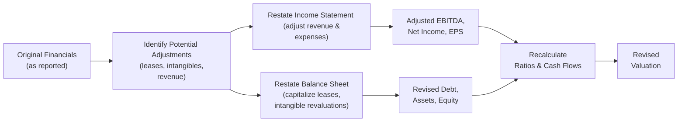

## Scenario Overview

Imagine you’re analyzing CloudSpan Inc.—a multinational technology firm dominating the enterprise software space, with significant intangible assets (like patents and proprietary software), a broad subscription services revenue base, a history of acquisitions, and, oh yeah, some off-balance-sheet lease obligations. The CFO’s footnotes sparkle with disclaimers about intangible asset valuation and revenue timing, so you suspect the reported figures might not tell the entire story. Maybe you’ve been here before: reading footnote after footnote, trying to piece together what’s real and what’s, well, “managed.”

In this vignette, we’ll walk through how you, in an analyst’s chair, would systematically rework CloudSpan’s financials—taking into account intangible-heavy assets, potential revenue recognition twists, and the possibility that operating leases might be more accurately treated as finance leases. Then we’ll talk about how these restatements ripple through valuations, impacting free cash flow (FCF) projections, weighted average cost of capital (WACC), and ultimately the difference between a “headline” valuation and one that truly reflects economic reality.

## Identifying Potential Earnings Management

Digging into CloudSpan’s annual report, you spot a few suspicious items that could lead to earnings management:

• Subscription services revenue recognition: CloudSpan receives ongoing payments for its software-as-a-service (SaaS) platforms. The footnotes mention “revenue recognition over time,” but do they overly front-load certain revenues? Or do they push them forward to smooth out earnings?  
• Intangibles from acquisitions: CloudSpan has purchased a handful of smaller tech start-ups. The intangible asset valuations might be inflated—or, in some cases, underreported if they’re trying to avoid big future amortization or impairment charges.  
• Operating leases that might really be finance leases: CloudSpan’s largest data centers are recorded as operating leases. If you read the details though, it looks suspiciously like the company might have all but purchased those data centers outright. That suggests a capital/finance lease classification is more accurate.  
• Deferred revenue from multi-year subscription deals: Multi-year deals often generate short-term illusions of bigger net cash inflows. The CFO might be using them to smooth or spike earnings.  

If you’ve ever attended a company’s earnings call and heard the CFO talk about “adjusted” results, you know how important it is to look beyond the headlines. Those glossy numbers usually rely on assumptions the firm hopes you won’t question. But as an analyst, that’s literally your job—to question them.

## Restating the Financials

Once you’ve identified these red flags, the next move is to restate the financial statements in a way that reflects what you think is actually going on. This can feel a bit like detective work. You gather your data, cross-reference footnotes with IFRS or US GAAP guidelines, account for intangible impairments or reclassifications, and try to see the “substance” of each transaction instead of just the “form.”

### Converting Operating Leases to Finance Leases

Under IFRS 16, most leases end up on the balance sheet anyway. But suppose CloudSpan prepared its statements under US GAAP and keeps certain data center leases off the balance sheet as operating leases. By capitalizing these leases, you:

• Increase both assets and liabilities.  
• Shift part of the lease payment from an operating expense to depreciation and interest expense.  
• Potentially alter EBITDA, as operating lease expenses dip out of the operating expense line, though depreciation and interest appear separately.  

This is crucial for ratio analysis—suddenly your Debt/Equity and Debt/EBITDA can skyrocket if you bring a massive lease obligation onto the books.

### Adjusting Intangible Asset Values

CloudSpan’s intangible assets might be overstated if, for instance, they’re capitalizing in-house software development aggressively. Alternatively, intangible assets might be understated if they recognized all intangible R&D costs as expenses, artificially depressing near-term earnings. Whichever direction the CFO’s assumptions lean, you want to see:

• How the capitalization or impairment assumption changes the balance sheet total assets.  
• Whether there’s an immediate effect on amortization or impairment expenses that can distort net income.  
• How changes in intangible values might trigger covenant issues down the line if intangible-heavy assets hamper certain ratio requirements.  

### Recasting Subscription Revenue Timing

CloudSpan’s subscription-based model can produce very stable monthly or quarterly inflows. But from an accounting perspective, that revenue can be recognized either faster or slower depending on performance obligations. If you suspect earnings are boosted by front-loaded revenues, you might recast the income statement to reflect a more conservative (time-proportionate) revenue recognition approach, effectively deferring some portion of recognized revenue into future periods.

Here’s a simple diagram showing how these restatements might collectively flow into adjusted performance metrics:



## Impact on Earnings, Cash Flow, and Ratios

With these restatements in place, it’s time to note how they affect EBITDA margins, net income, and free cash flow.

EBITDA margin can shift if you reclassify operating lease expenses (which are usually in “operating expenses”) into depreciation and interest. That often *increases* EBITDA, but ironically raises your interest burden. Meanwhile, intangible asset amortization adjustments might do the opposite, *decreasing* EBITDA. The net effect can sometimes be surprising.

Free cash flow can also see big swings, particularly if intangible capitalization moves or lease capitalizations change the operating vs. financing section of the cash flow statement. Perhaps you reduce CFO (operating cash flow) while increasing CFF (financing cash flow) to reflect lease principal payments.

As you do these recalculations, keep track of any changes to:

• Debt/Equity.  
• Debt/EBITDA.  
• Interest Coverage.  
• Leverage-related covenants.  

A potential real-world example: If you bring $1 billion of lease obligations onto the books, you might push your Debt/EBITDA from a comfortable 2.2× to 3.0×, possibly breaching bank covenants.

## Revisiting the Cost of Capital

Adjusting the financial statements is only half the story. If your restated figures show the company is riskier, that can directly affect its WACC. Higher perceived leverage means a higher cost of debt; intangible-laden assets might also mean the equity holders face greater risk, raising the cost of equity.

In practice, you might see something like this for WACC:


\text{WACC} = \left(\frac{D}{D + E}\right)r_d (1 - t) + \left(\frac{E}{D + E}\right) r_e


But if your restated debt is larger, the fraction \\(\frac{D}{D + E}\\) grows, and also \\(r_d\\) could go up if lenders price in extra risk. Similarly, intangible intangible assets might prompt some higher equity risk premium, shifting \\(r_e\\). In real life, it’s rarely straightforward. In fact, you might only realize how crucial these changes are when you run a quick sensitivity analysis on your WACC formula and see how a half-point here or a decimal point there can swing the final valuation by tens of millions.

## DCF Valuation with Adjusted and Unadjusted Statements

Now for the grand finale: Let’s see how the restated numbers feed into a discounted cash flow (DCF) model. Often, you’ll build two versions side-by-side: one using the firm’s “headline” accounting, and one using your adjusted assumptions.

Below is a simplified Python snippet that might illustrate how you’d handle a quick DCF for CloudSpan, ignoring some complexities for brevity:

```python
import numpy as np

free_cash_flows = [100, 120, 150, 200]  # project 4 years of FCF in millions
terminal_value_unadjusted = 2200  # unadjusted terminal value
wacc_unadjusted = 0.08  # 8% discount rate

pv_unadjusted = 0
for i, fcf in enumerate(free_cash_flows):
    pv_unadjusted += fcf / ((1 + wacc_unadjusted)**(i+1))

pv_unadjusted_terminal = terminal_value_unadjusted / (1 + wacc_unadjusted)**len(free_cash_flows)

ev_unadjusted = pv_unadjusted + pv_unadjusted_terminal

print("Unadjusted Enterprise Value (in millions):", round(ev_unadjusted, 2))

free_cash_flows_adj = [90, 110, 145, 195]  # maybe intangible reclass & lease changes alter FCF
terminal_value_adjusted = 2100
wacc_adjusted = 0.085  # slightly higher discount rate due to new risk

pv_adjusted = 0
for i, fcf in enumerate(free_cash_flows_adj):
    pv_adjusted += fcf / ((1 + wacc_adjusted)**(i+1))

pv_adjusted_terminal = (terminal_value_adjusted / 
                        (1 + wacc_adjusted)**len(free_cash_flows_adj))

ev_adjusted = pv_adjusted + pv_adjusted_terminal

print("Adjusted Enterprise Value (in millions):", round(ev_adjusted, 2))
```

You might discover that your adjusted enterprise value (EV) is 10% or 15% lower than the unadjusted figure. Sometimes, it’s not *that* different, but it can be—and especially for intangible-heavy, lease-laden companies. Then you pair that revised EV with the net debt figure (also restated with lease obligations included) to get implied equity value per share. Presto: your new fair value might deviate significantly from the stock’s current price or the consensus target price.

## Sensitivity Analysis and Potential Outcomes

If you’re feeling fancy, you can run a multi-dimensional sensitivity analysis to see how changes in growth rate, discount rate, or intangible impairment might affect your final valuation. For instance, a 1% change in your perpetual growth assumption may shift the fair value by 5–10%. If intangible impairment is recognized sooner rather than later, that’s an immediate blow to net income and book equity, raising the risk for lenders and crimping the cost of capital conversation.

## Concluding Thoughts on Fair Value

Balancing your restated analysis with standard “headline” accounting is what separates the advanced analyst from the wide-eyed newbie. Sure, the CFO provided some “official” numbers, but real-world investing demands that you look behind the curtain. Maybe you only conclude there’s a small difference from the official story. Or maybe the official story is pure fantasy, and your restatement reveals a company that’s leveraged to the gills, with intangible assets that could vanish if a competitor emerges.

The point: the more intangible the assets, the more critical robust financial statement analysis becomes. And that’s the real lesson of this vignette—any time you see intangible-laden tech or pharma or software companies, don’t just trust the face-value illusions. Take the time to do your own forensic, consistent restatements. Then run valuations on both sets of numbers and see how the risk profile changes.

## Real-World Implications

• Small changes in intangible asset assumptions can lead to huge swings in net income and equity valuations, especially where intangible valuations drive big annual amortization or potential impairment expenses.  
• Off-balance-sheet liabilities, such as operating leases or certain pension obligations (see Chapters 7 and 8 for a deeper pension dive), can grossly understate leverage, exposing higher default risk.  
• With subscription revenue, analyzing timing differences in recognition can mean the difference between a robust year and a superficial, short-term pop.  
• Adjustments might cause negative surprises for investors, regulators, or lenders, potentially triggering covenant breaches or rating downgrades.  

## Practice Tip

Always keep your adjustments consistent across multiple companies if you’re comparing them side by side. If you adjust intangible recognition for CloudSpan, make sure to do the same for its key competitor, so you don’t bias your relative valuation. And pay attention to the firm’s footnotes explaining intangible investments. Some intangible expenditures may be crucial for the company’s long-term strategy. Others might be borderline “capitalization” territory. The bottom line: read those footnotes like a detective—and maybe with a strong coffee in hand.

## Additional References

• Lundholm, R., & Sloan, R. (2019). Equity Valuation and Analysis. McGraw-Hill.  
• Schilit, H., & Perler, J. (2018). Financial Shenanigans: How to Detect Accounting Gimmicks & Fraud in Financial Reports. McGraw-Hill.  
• CFA Institute Research Foundation: Case Studies in Integrated Analysis of Financial Statements.  
• IFRS 16 “Leases” for the IFRS perspective, and ASC 842 for the US GAAP perspective on lease accounting.  

## Practice Questions: Balancing FSA with Valuation Models



### In reviewing CloudSpan Inc.’s footnotes, you discover material off-balance-sheet operating leases. Adjusting these leases to finance leases most likely:  
- [ ] Reduces EBITDA, since lease depreciation is recorded in the operating section.  
- [ ] Reduces interest expense, leading to higher net income.  
- [x] Increases recognized debt, potentially raising the firm’s leverage ratios.  
- [ ] Converts intangible asset write-offs into an operating lease expense item.  

> **Explanation:** Capitalizing operating leases raises liabilities and assets on the balance sheet, which typically increases leverage (Debt/Equity or Debt/EBITDA). EBITDA often increases (since operating lease expense is removed from operating expenses and replaced by interest and depreciation).

### An analyst chooses to restate revenue recognition for CloudSpan’s subscription services using a more conservative approach. What is the most likely outcome of this restatement?  
- [x] Deferred revenue increases, lowering near-term reported revenue.  
- [ ] Operating cash flow significantly increases due to higher cash receipts.  
- [ ] Free cash flow remains unchanged because intangible expenses offset revenue.  
- [ ] The discount rate used in DCF calculations automatically decreases.  

> **Explanation:** Conservative revenue recognition typically defers more revenue to future periods, increasing deferred revenue on the balance sheet and reducing near-term reported revenue.

### When intangible assets are overvalued on CloudSpan’s balance sheet, which of the following is a direct effect of writing them down to more realistic values?  
- [ ] It typically increases net income due to a tax credit on the impairment.  
- [x] Equity decreases and leverage ratios worsen, as the write-down reduces the asset base.  
- [ ] The cost of debt decreases immediately because interest expense is lower.  
- [ ] Depreciation expense decreases, thereby inflating EBIT.  

> **Explanation:** A write-down of overvalued intangible assets immediately reduces equity and total assets, often resulting in higher leverage ratios.

### In a sensitivity analysis of CloudSpan’s DCF valuation, which variable is most likely to affect the magnitude of the terminal value?  
- [x] The perpetual growth rate.  
- [ ] The interest rate paid on short-term notes.  
- [ ] The depreciation method for short-lived assets.  
- [ ] The distinction between operating and finance leases.  

> **Explanation:** The terminal value in a DCF model is highly sensitive to the perpetual growth rate used. Even small changes in the perpetuity growth assumption can swing terminal value considerably.

### After capitalizing CloudSpan’s operating leases, which of the following statements about its cash flow statement is most accurate?  
- [ ] Financing cash flow decreases since lease principal payments are moved above EBIT.  
- [x] Operating cash flow increases because lease payments are partly reclassified to financing.  
- [ ] Investing cash flow increases, reflecting intangible asset revaluations.  
- [ ] Operating cash flow remains unaffected by changes to leases.  

> **Explanation:** When operating leases are capitalized, the portion of the lease payment that previously appeared as an operating outflow is split into interest (operating outflow) and principal (financing outflow). As a result, the operating cash flow will be higher, and financing cash flow will be lower.

### If post-adjustment analysis shows CloudSpan has a much higher Debt/EBITDA ratio, which of the following is the most likely effect on its WACC?  
- [x] WACC increases because both the cost of debt and cost of equity could rise due to higher financial risk.  
- [ ] WACC remains constant since the capital structure proportion doesn’t matter to valuations.  
- [ ] WACC decreases because intangible assets are now recognized at higher values.  
- [ ] WACC stays unchanged if the firm’s tax rate is unchanged.  

> **Explanation:** A higher Debt/EBITDA ratio indicates increased financial risk, prompting creditors and equity holders to require higher returns, thus raising WACC.

### A restatement that lowers CloudSpan’s reported net income via intangible asset amortization changes would most directly affect which of the following valuation metrics?  
- [x] Price-to-Earnings (P/E).  
- [ ] Enterprise Value-to-Sales (EV/Sales).  
- [ ] Economic Value Added (EVA®), but not P/E.  
- [ ] Dividend yield.  

> **Explanation:** Changes in intangible asset amortization directly affect net income, which in turn alters the P/E ratio. EV/Sales is not affected by net income changes in the same direct way.

### Which component is most critical when evaluating the reliability of CloudSpan’s intangible assets?  
- [x] Management’s impairment testing methodology.  
- [ ] The statutory corporate tax rate.  
- [ ] The firm’s weighted average cost of capital (WACC).  
- [ ] The bond covenants detailing maximum leverage.  

> **Explanation:** The reliability of intangible asset values depends heavily on how rigorously management tests for impairment. If they use aggressive assumptions, the assets could be overstated.

### In comparing unadjusted and adjusted valuations, an analyst might do all of the following EXCEPT:  
- [ ] Prepare two sets of forecasts reflecting different financial statement assumptions.  
- [ ] Evaluate how the restatements might affect future covenant compliance.  
- [ ] Adjust the firm’s WACC to reflect different risk factors.  
- [x] Calculate a stock’s trailing P/E based on the unadjusted figures only while ignoring the adjusted figures.  

> **Explanation:** It is typical to calculate ratios under both sets of assumptions (unadjusted and adjusted) to assess the potential valuation gap. Ignoring adjusted figures for key metrics (like P/E) defeats the purpose of restating the numbers.

### A true statement regarding the relationship between intangible asset valuation and corporate credit ratings is:  
- [x] Credit analysts often haircut intangible asset values, raising perceived leverage and possibly lowering the rating.  
- [ ] Large intangible assets always enhance credit ratings by boosting total asset value.  
- [ ] Write-downs of intangible assets generally lead to improved bond ratings.  
- [ ] Intangible assets never factor into credit rating assessments.  

> **Explanation:** Credit analysts commonly apply more conservative standards to intangible assets, often assigning only partial or no value to them when evaluating the firm’s leverage.


