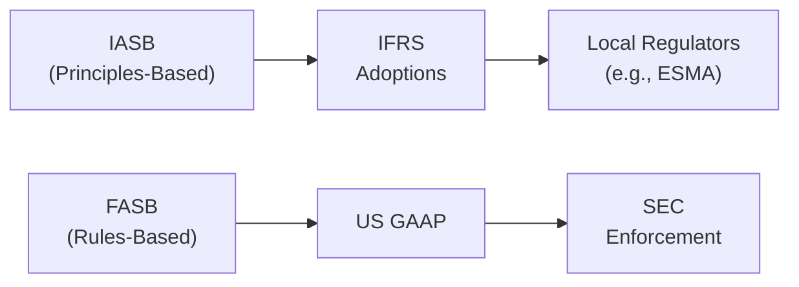

## Introduction  

It’s funny—I recall the first time I encountered financial statements from a European multinational that had a US listing. They provided two sets of reports: one under IFRS, and another under US GAAP. I thought, “Wait, can’t one set of rules handle this?” But no, the regulatory environment for financial reporting is more complex, shaped by different historical and conceptual foundations. This section clarifies how IFRS and US GAAP differ, who makes the rules, and why these differences matter when you’re analyzing companies around the globe.  

## Standard-Setting Bodies and Their Roles  

### IASB and IFRS  

The International Accounting Standards Board (IASB) develops and issues International Financial Reporting Standards (IFRS). IFRS is principles-based—meaning it provides general guidelines and overarching frameworks rather than rigid, detailed rules. For example, IFRS might say, “When measuring an asset, consider its fair value,” allowing for management judgment to determine what “fair value” reasonably entails. This approach often fosters flexibility but requires robust professional judgment and clear disclosures.

Oversight of IFRS compliance usually happens at a jurisdictional level. For instance, European-listed companies follow regulations monitored by bodies such as the European Securities and Markets Authority (ESMA). Each region employing IFRS might have unique enforcement or additional reporting requirements layered on top.  

### FASB and US GAAP  

The Financial Accounting Standards Board (FASB), under the oversight of the US Securities and Exchange Commission (SEC), crafts and maintains US GAAP. US GAAP is traditionally described as rules-based, meaning it outlines more explicit guidelines for recognition and measurement. For example, if you want to test goodwill for impairment, US GAAP has a multi-step, very specific procedure for that—sometimes spelled out in minute detail. It leaves less room for interpretation, which some see as beneficial for consistency but potentially cumbersome in less-common scenarios.

Regulatory enforcement in the United States primarily falls on the SEC. Publicly traded companies must file periodic reports (Forms 10-K, 10-Q, etc.) following US GAAP. Though certain foreign private issuers can file IFRS-compliant statements under specific conditions, a large portion of cross-border companies end up either reconciling to or fully adopting US GAAP when they trade in US markets.  

## Principles-Based vs. Rules-Based Approaches  

IFRS’s principles-based approach can be likened to a teacher who says, “Write an essay on current economic trends. I trust your judgment to determine the relevant trends, but please explain yourself clearly.” Meanwhile, US GAAP is the teacher who says, “You must write a five-paragraph essay, each paragraph containing at least three sentences, covering these five bullet points exactly.”  

• Advantages of a Principles-Based System (IFRS-style):  
  – Offers flexibility to reflect economic reality.  
  – Allows for professional judgment to adapt to unique circumstances.  

• Advantages of a Rules-Based System (US GAAP-style):  
  – Reduces subjectivity, which may enhance comparability where every entity follows the same explicit instructions.  
  – Minimizes gray areas (though not completely) due to detailed guidance.  

• Potential Pitfalls for Analysts:  
  – Under IFRS, the reliance on judgment might mean companies interpret the same principle differently, so thorough footnote reading is vital.  
  – Under US GAAP, there might be a rigid approach to certain items that doesn’t entirely reflect economic reality or that leads to “bright-line” interpretations.  

## Oversight and Enforcement  

### The SEC (United States)  

The SEC enforces US GAAP for publicly traded entities. But it’s not just about slapping fines if something looks off (though that can happen). The SEC also reviews financial filings for compliance, can request restatements, and issues interpretive guidance.  

### National and Regional Bodies (IFRS Jurisdictions)  

Since IFRS is used in over 100 countries, each area has its own regulator or enforcement mechanism. ESMA, for example, coordinates with national regulators in Europe to ensure consistent application of IFRS across EU member states. Companies might face differences in how rigorously each regulator interprets or enforces IFRS guidance.  

The upshot for analysts? Even if two companies both claim full IFRS compliance, read the footnotes carefully for local twists.  

## Key Presentation Differences  

### Comprehensive Income and Expense Classification  

IFRS allows companies to present all items of income and expense (including components of other comprehensive income) in either a single statement of comprehensive income or two statements (an income statement followed by a statement of comprehensive income). On the flip side, US GAAP historically favored a two-statement approach, although it, too, permits a single continuous statement.  

For expense classification, IFRS permits classification by either “function” (e.g., cost of goods sold, administrative) or “nature” (e.g., depreciation, salaries, rent). US GAAP generally leans toward classification by function, though certain industries (like software) often have specialized guidance.  

### Financial Instruments and Revenue Recognition  

Revenue: Both IFRS and US GAAP now largely follow the same five-step revenue recognition model, thanks to a major convergence project that culminated in IFRS 15 and ASC 606. However, analysts should note subtle differences remain in areas like contract modifications and exclusion of certain receivable types.  

Financial Instruments: IFRS 9 vs. US GAAP (ASC Topic 320, 321, 326, etc.) differ in the classification, measurement, and impairment models used for financial assets. IFRS 9’s expected credit loss model has broad applicability from day one, whereas US GAAP has a Current Expected Credit Loss (CECL) model that can be more prescriptive in some scenarios.  

## Diagrams: IFRS vs. US GAAP Enforcement Structure  

Below is a simple flowchart showing how IFRS and US GAAP oversight differs.  

## Convergence Efforts and Remaining Gaps  

It’s tempting to say IFRS and US GAAP have converged so much that they’re 90% identical. In practice, fundamental differences remain, such as:  

• LIFO Inventory: IFRS prohibits the use of LIFO (Last-In, First-Out), but US GAAP still allows it.  
• Development Costs: IFRS often capitalizes development costs when certain criteria are met, while US GAAP expenses most development costs as incurred.  
• Impairment Reversals: Under IFRS, certain impairment losses can be reversed if asset values recover; under US GAAP, reversals are not permitted for most asset classes.  

Though the IASB and FASB worked on major convergence projects (like revenue recognition and leases) for several years, achieving complete consistency remains challenging due to structural, cultural, and legal differences in each environment.  

## Cross-Border Listings: Why Analysts Should Care  

Many large corporations list shares on multiple stock exchanges—say, London and New York. This often requires them to either prepare dual financial statements or file reconciliations between IFRS and US GAAP. If you’re an analyst comparing two international companies—one that files in IFRS, the other in US GAAP—you could be dealing with differences in depreciation methods, intangible assets, or how they measure segment profitability.  

When analyzing cross-border firms, always:  
• Access original filings in both jurisdictions if available.  
• Look for reconciliations and footnotes that document key differences.  
• Evaluate whether “non-GAAP” or “non-IFRS” measures are used differently in each set of statements.  

## Importance of Keeping Current  

The IASB and FASB issue updates, clarifications, and amendments on a periodic basis. For IFRS, this could be an annual improvements project or a thematic standard revision (e.g., IFRS 17 for insurance contracts). For US GAAP, it might be an Accounting Standards Update (ASU) that changes how certain transactions are recognized. If you don’t stay on top of these changes, you could misinterpret a company’s financials, especially if you rely on older knowledge that’s out of date.  

## Best Practices and Common Pitfalls  

• Read the Footnotes: Key IFRS vs. US GAAP deviations often surface in disclosures rather than bold statements on the face of the financials.  
• Beware of “Overrelying” on Ratios: Differences in recognition or classification under IFRS vs. US GAAP can skew direct ratio comparisons. Adjust or standardize if comparing companies across frameworks.  
• Watch for Judgments: Under IFRS, read where management has significant judgment in measurement. Under US GAAP, watch out for key decision points in areas with multiple permissible alternatives (e.g., inventory costing methods).  
• Understand Regulatory Filings: A US cross-listed firm might have to file a US GAAP-based 10-K with the SEC, while also issuing IFRS statements in Europe. Compare them closely to spot big divergences.  

## Applying These Concepts in Vignettes  

In Level II, you’ll likely meet item sets where a multinational’s statements differ based on IFRS or US GAAP guidelines. Common tricky points include how net income changes under different impairment rules, or how totals in equity shift because IFRS allows reversal of impairment losses. Carefully step through the footnotes, bridging items to see which lines are changed and why.  

One practice approach is to analyze an actual dual-filer. For instance, consider a major German automotive company that trades on the NYSE. Check out its annual reports prepared under IFRS and its Form 20-F filed with the SEC. Look for the line-by-line reconciling items and see how intangible assets, pension liabilities, or housekeeping items like R&D costs shift.  

## Final Thoughts  

Navigating IFRS vs. US GAAP is sort of like driving on the left side of the road vs. the right side. Both methods aim to get you from Point A to Point B safely (and fairly represent economic reality). But the rules of engagement differ and, if you’re not careful, you might wind up on the wrong side of the financial analysis highway. In practice, once you understand each framework’s foundational principles—and know where to look for disclosures—you’ll be more confident and efficient in evaluating financial statements across borders.

## References and Further Reading  

• IFRS Foundation, “Standards and Interpretations”:  
  https://www.ifrs.org  

• FASB Accounting Standards Codification:  
  https://asc.fasb.org  

• U.S. Securities and Exchange Commission (SEC):  
  https://www.sec.gov  

• American Institute of Certified Public Accountants (AICPA):  
  https://www.aicpa.org  

----------
  
## Test Your Knowledge: IFRS vs. US GAAP Regulatory Environment



### Which body is primarily responsible for issuing IFRS?  
- [x] The International Accounting Standards Board (IASB)  
- [ ] The Financial Accounting Standards Board (FASB)  
- [ ] The U.S. Securities and Exchange Commission (SEC)  
- [ ] The American Institute of Certified Public Accountants (AICPA)  

> **Explanation:** The IASB creates and issues IFRS, while the FASB is responsible for US GAAP.

### Which statement best reflects the difference between IFRS and US GAAP?  
- [x] IFRS is considered more principles-based, whereas US GAAP is considered more rules-based.  
- [ ] IFRS provides more explicit, prescriptive rules than US GAAP.  
- [ ] US GAAP disallows professional judgment entirely.  
- [ ] IFRS strictly mandates the LIFO inventory method.  

> **Explanation:** IFRS relies on overarching principles, whereas US GAAP tends to be more prescriptive.  

### Under IFRS, impairment losses on certain assets can sometimes be reversed in future periods. Under US GAAP, this:  
- [x] Is generally not allowed, except for certain asset classes like securities available-for-sale.  
- [ ] Is unrestricted; companies may reverse any impairment if the asset’s value recovers.  
- [ ] Applies only to inventory and intangible assets.  
- [ ] Follows the exact same rules as IFRS.  

> **Explanation:** US GAAP does not typically permit the reversal of impairment on most assets, though financial instruments can differ.  

### Which regulator enforces compliance with US GAAP for publicly traded companies?  
- [x] The SEC  
- [ ] Local country regulators in each jurisdiction  
- [ ] The IASB  
- [ ] The European Securities and Markets Authority (ESMA)  

> **Explanation:** The SEC (Securities and Exchange Commission) enforces reporting requirements in the United States.  

### A major result of the IFRS and US GAAP convergence project is:  
- [x] Both frameworks largely share a similar five-step revenue recognition model.  
- [ ] IFRS adoption of LIFO as a preferred inventory method.  
- [x] Elimination of all differences between IFRS and US GAAP.  
- [ ] Full convergence of all accounting standards.  

> **Explanation:** While many differences remain, the two frameworks do share a common five-step revenue recognition model, reflecting partial convergence.

### Which of the following is an example of a “rules-based” approach to accounting?  
- [x] Detailed instructions specifying exactly how much expense to recognize in each scenario.  
- [ ] Requiring management to use significant judgment when measuring revenue.  
- [ ] Encouraging flexible interpretation of financial instrument valuation.  
- [ ] Allowing each firm to define how they classify expenses.  

> **Explanation:** Rules-based systems, like US GAAP, often spell out detailed instructions for specific treatments.

### In analyzing financial statements from a cross-listed company, a key best practice is to:  
- [x] Examine reconciliations and footnotes to identify material differences in reporting frameworks.  
- [ ] Immediately assume IFRS and US GAAP financials are fully the same.  
- [x] Focus only on the income statement, ignoring the balance sheet.  
- [ ] Depend solely on management’s discussion and analysis.  

> **Explanation:** Reviewing reconciliations and footnotes is essential in cross-listed entities to locate and understand reporting differences.

### Which method of expense classification typically reflects IFRS flexibility but not necessarily US GAAP norms?  
- [x] By function or by nature  
- [ ] Strictly by function only  
- [ ] Strictly by nature only  
- [ ] No classification method is allowed under IFRS  

> **Explanation:** IFRS allows classification of expenses by function or by nature, whereas US GAAP more commonly requires function-based classification.

### Which of the following is a major ongoing challenge in IFRS/US GAAP convergence?  
- [x] Differences in how impairment is tested and reversed  
- [ ] Requirement that IFRS filers convert fully to US GAAP by 2026  
- [ ] Elimination of intangible recognition from both standards  
- [ ] Complete ban on professional judgment  

> **Explanation:** One key area of divergence is the handling of impairment, particularly reversals, which IFRS allows in certain cases but US GAAP generally does not.

### True or False: The SEC permits certain foreign private issuers to file IFRS-based financials without reconciling to US GAAP.  
- [x] True  
- [ ] False  

> **Explanation:** The SEC does allow specific foreign private issuers to file under IFRS (as issued by the IASB) without providing a US GAAP reconciliation, subject to certain criteria.


