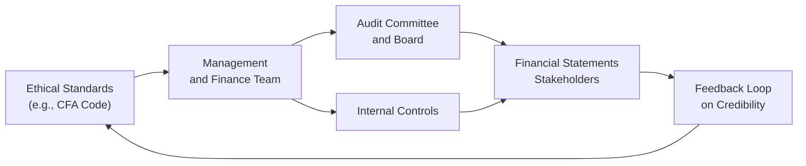

Let’s talk ethics in financial reporting. Frankly, there’s no shortage of guidance: If you’ve ever glanced at the CFA Institute Code of Ethics and Standards of Professional Conduct, you already know there’s a ton of detail about how financial professionals should behave. But you might be wondering: Why so much emphasis on ethics when we already have accounting standards like IFRS and US GAAP?

Well, here’s the thing: Even the best accounting frameworks can be twisted if the people applying them have questionable intentions. So while IFRS, US GAAP, and other regulations set the rules, the moral compass of those who prepare, review, or audit the numbers really determines how faithfully these rules are followed. This article explores what it looks like to navigate financial reporting with integrity, and how to detect when things might just be veering off course.

Understanding the Ethical Foundation

At its core, ethical reporting means presenting a company’s financial standing in a manner that is both honest and transparent. The CFA Institute Code of Ethics emphasizes the primacy of client interests, integrity, diligence, and the responsibility to uphold the reputation of the profession. When you think about how important reliable numbers are—investors, creditors, customers, employees, regulators...they all rely on these documents—it’s obvious that financial statements must reflect reality, not illusions.

In practice, though, the lines can blur. People get paid bonuses for meeting revenue targets, or they face pressure from investors to “smooth” earnings. It’s easy to slip into a pattern of pushing the boundaries of GAAP or IFRS. Before you know it, “aggressive accounting” might cross the line into outright misconduct. Let’s be real: The difference between acceptable estimates and manipulative guesswork can be razor-thin when a manager is under pressure.

Common Ethical Lapses in Reporting

The scope of unethical conduct runs from subtle footnote omissions all the way to full-fledged fraud. You can think of it as a spectrum:

• Minor Omissions or Disclosures. Perhaps management conveniently leaves out a known risk factor in the footnotes since it’s “probably immaterial.” This omission can still mislead stakeholders if the omitted risk becomes significant.

• Overstated Revenues. Managers might record “sales” for goods that haven’t even shipped or recognize licensing revenue too early. Sometimes, it’s just an attempt to brighten up the quarter.

• Understated Expenses. Delaying expense recognition or recording them below the line can artificially inflate net income. If you’re analyzing financial statements, you need to check if the company’s expenses appear in appropriate periods.

• Misrepresented Liabilities. This can include failing to recognize contingent liabilities or moving liabilities off-balance-sheet, effectively hiding them in special purpose entities. This might sound dramatic, but it happens when ethics slip.

When any of these happen, we’re no longer just talking about a questionable interpretation of an accounting rule; we’re dealing with an ethical breach that can demolish stakeholder trust. And the worst part? It’s rarely done for no reason: people cheat for short-term bonuses, stock price boosts, or the appearance of consistent growth.

Aggressive Accounting Versus Earnings Manipulation

Folks often assume that “aggressive accounting” automatically means illegal or unethical. Actually, managers frequently have some leeway—choices like straight-line depreciation vs. accelerated depreciation, or the method for valuing inventories. These judgments can be perfectly legitimate if done transparently. But it becomes dicey if the end goal is to obscure real performance.

Aggressive accounting stays technically within the boundaries of IFRS or US GAAP but tends to stretch those boundaries. Earnings manipulation, on the other hand, crosses the line. Think back to “creative” transactions that artificially inflate revenues or cunning manipulations of accrual estimates—these no longer fall under “interpretation” but under “willful misrepresentation.”

To an analyst, your job includes recognizing when managerial choices systematically favor revenue inflation or conceal liabilities. One clue might be that the chosen accounting methods all consistently maximize reported profits. A track record of decisions that always “just happen” to deliver earnings targets is suspicious and begs closer scrutiny.

Here’s a quick personal anecdote: Years ago, I was analyzing a mid-sized manufacturer’s financials. Each quarter, they employed one method or another to recognize revenue on partially completed customer orders—some quarters they used a proportional approach; other quarters, they conveniently switched to a completed-contract approach. They always chose the method that improved immediate earnings. This raised a red flag. It wasn’t illegal on the surface, but the pattern was suspicious, and ultimately, it led me to re-check everything...and guess what? I discovered a huge overstatement of revenue. Without an ethical framework guiding them, they drifted deeper into manipulation each quarter.

The Role of Internal Controls and Governance

You’ve probably heard the term “internal controls” a thousand times. It might sound like a corporate buzzword, but trust me: solid internal controls are crucial for preventing and detecting manipulative practices. Internal controls define systematic checks, validations, and approvals that ensure financial data is recorded properly.

Meanwhile, governance structures—such as an engaged board of directors and a proactive audit committee—provide oversight. In an ideal world, an independent audit committee is the last line of defense, armed with the power to question anomalies in management’s reporting. If you think about it, these structures are basically the organizational nuts and bolts that enforce the ethical foundation laid out by frameworks like the CFA Institute Code of Ethics.

Let’s look at a simplified diagram of how ethics, governance, and internal controls interact:

In this flow, ethical standards guide the behavior of management. Internal controls and the audit committee oversee management’s functioning, ensuring the final financial statements are reliable. Stakeholders then assess these statements—directing a feedback loop on a company’s ethical reputation, which in turn can reinforce or pressure management’s adherence to ethical norms.

Spirit Versus Letter of the Standards

A central tenet you’ll learn in advanced accounting or finance programs is that you can’t just read IFRS or US GAAP like a rulebook and check a compliance box. Ethics demands understanding the spirit of these standards. The point is to provide a fair representation of financial position and performance. If management is fixating on how to interpret IFRS in ways that mislead—or worse, disguising questionable activities behind standard rules—then the true objective is missed.

Consider how intangible assets or goodwill might be tested for impairment. IFRS has provided guidelines that look objective on the surface; however, the assumptions around discount rates, potential cash flow forecasts, or synergy estimates can be manipulated if managers choose to. That’s where ethics plugs in: you either choose assumptions that reflect reality as faithfully as possible, or you push them to create “maybe someday” optimism.

Fostering an Ethical Culture

An ethical atmosphere doesn’t appear out of thin air. Often, companies that prioritize ethics from the top—CEOs, CFOs, directors—create a culture that fosters honest disclosure. In such companies, employees at lower levels feel empowered to voice concerns if they see questionable transactions. Whistleblowers are more likely to speak up early, giving the firm a chance to correct issues before they blow up into major scandals.

If a company’s leadership invests heavily in compliance and training, invites external audits beyond regulatory minimums, and encourages ongoing dialogue about best ethical practices, it’s a good sign that they aren’t just paying lip service. As a potential investor or analyst, you might watch for these cues. They tell you if management is truly committed to ethical stewardship or simply listing it as a bullet point in a corporate presentation.

Gray Areas: Where Ethical Judgment Shines

In real life, ethical challenges often aren’t black-and-white. You might find yourself looking at a scenario where the standard is ambiguous: a brand-new product line might or might not meet the criteria for revenue recognition, or an asset might be borderline impaired. If management’s assumptions for intangible asset valuation are just within the plausible range but still lean heavily toward an optimistic scenario, is that allowed?

Yes, so long as the assumptions are disclosed transparently and reflect good-faith estimates. That’s what “spirit of the rules” means. But if the assumptions are so rosy you can’t see reality, or there’s a pattern of always pushing them to meet investors’ short-term expectations, you should question the company’s ethical grounding. 

Sometimes, your best approach as an analyst is to gather extra data to see if the estimates align with broader market conditions or relevant sector benchmarks. If you see repeated mismatch—like they keep predicting 20% growth in a shrinking market—well, that’s probably not just an honest mistake.

The Analyst’s Responsibility

You can’t assume that just because something is in the financial statements, it’s beyond reproach. Part of the reason you study advanced financial analysis (like we do in the CFA Program) is so you can question assumptions and detect potential red flags. Analysts bear some responsibility too: if we fail to scrutinize or challenge suspicious items, we’re letting our guard down—and that’s not what the CFA Institute or any professional body wants.

When you’re evaluating a company:

• Assess the Tone at the Top. Read up on the management’s track record, background, and statements in investor calls or conference transcripts. Do they regularly push the envelope on reporting?

• Review Auditor Opinions. Did the auditors express concerns, or highlight “critical audit matters”? Now is the time to pay attention.

• Compare with Industry Norms. If every competitor uses a certain approach to intangible asset valuation or revenue recognition, but one outlier is consistently taking a different approach that flatters their earnings, that’s your sign to investigate deeper.

• Stay Vigilant on Disclosures. Sometimes, the biggest clues are in the footnotes or the management discussion and analysis (MD&A). If what you see there is incomplete or inconsistent with the main statements, that could be a sign of trouble.

Stewardship and Long-Term Importance

Ultimately, ethical behavior in financial reporting and disclosure is about stewardship. Accountants, financial managers, and executives are stewards of the company’s resources and reputation. By adhering to ethical norms and the letter—or rather, spirit—of the standards, they ensure they’re truly representing shareholders and stakeholders at large. Sure, there are short-term incentives to fudge the numbers, but the potential damage to a company’s credibility (and possibly legal repercussions) is enormous.

Even the markets reward ethical companies in the long run. Solid governance, transparent disclosures, and minimal ethical controversies tend to build investor confidence. And confidence translates to a lower cost of capital, stable share prices, and better relationships with regulators, suppliers, and customers. It’s like building a house on a strong foundation—less glamorous than quick wins, but stable and resilient over time.

Practical Example: Scenario Analysis

Imagine a software company just won a multi-year subscription contract from a new client. Under IFRS 15, they need to judge whether revenue should be recognized up front (for design and implementation) or ratably over the contract life (for ongoing support and updates). They have an accounting policy that aligns with IFRS, but the CFO is pushing for a higher upfront allocation to “help” the quarterly earnings figure.

If you’re the CFO, you might reason, “We can do this because IFRS 15 does allow determining stand-alone selling prices for each performance obligation.” Sure, that’s true. But are you pushing that boundary purely to inflate near-term earnings? If so, you’ve crossed the line from respectable interpretation into ethically questionable territory. If you’re the analyst, you pay attention to the footnotes and question if these judgments seem aligned with the underlying economics of the contract.

Applying the Ethics Mindset in Vignette Questions

In the CFA exam context, you’ll see scenario-based item sets (vignettes) that require you to identify breaches of the Standards of Professional Conduct. These might involve a CFO messing around with revenue recognition or an analyst ignoring a blatant overstatement of intangible assets. Sometimes you’ll be asked to pick the best course of action in a borderline scenario. That’s when referencing the Code of Ethics and your knowledge of IFRS/GAAP becomes critical. A good rule of thumb: The “spirit” of fairness and transparency usually trumps any hair-splitting argument about the “letter” of the rule.

References and Further Exploration

• CFA Institute, Code of Ethics and Standards of Professional Conduct  
• Association of Certified Fraud Examiners (ACFE): https://www.acfe.com  
• International Ethics Standards Board for Accountants (IESBA), Handbook of the Code of Ethics for Professional Accountants  
• Various articles in the Journal of Business Ethics on corporate ethical cultures and how they improve decision-making  

If you’re looking to dive deeper, it might be worth exploring the ACFE’s resources on fraud prevention—these can be especially handy if you’re in a role where you need to set up internal controls or investigate potential fraud. Also, check out the IESBA guidelines for a broader international perspective on ethics in accounting.

Anyway, the bigger takeaway is that ethics aren’t just a warm-and-fuzzy add-on. They’re at the heart of the trust that underpins all capital markets. And that’s precisely why CFA candidates study this stuff so intently: because the best financial analysts and portfolio managers aren’t just savvy about numbers; they’re guardians of integrity in the investment profession.

Remember: The next time you see a footnote that looks a bit too friendly toward management’s desired image, don’t just gloss over it. Ask yourself whether it aligns with an honest representation of the firm’s economic reality. That’s how you embody true ethical conduct—and how you protect the interests of clients, stakeholders, and the broader financial ecosystem.

## Mastering Ethics in Financial Reporting: 10 Practice Questions



### Which statement best characterizes “aggressive accounting”?

- [ ] It always violates IFRS or US GAAP.  
- [x] It stays within accounting standards but pushes estimates and assumptions to present financials more favorably.  
- [ ] It is only relevant to off-balance-sheet financing.  
- [ ] It generally leads to lower-reported revenues.  

> **Explanation:** Aggressive accounting uses permissible choices in IFRS or US GAAP but tilts those choices in a way that paints a more favorable picture of a company’s finances. It’s not always a violation, but it can be a sign of potential earnings manipulation.

### In the context of ethics, why is the concept of “spirit of the standards” critical?

- [ ] Because the rules are meant to be bent for optimal performance.  
- [x] Because ethical compliance involves understanding the deeper purpose of reporting standards beyond literal interpretation.  
- [ ] Because external auditors require spirit-based compliance more than rules.  
- [ ] Because IFRS and US GAAP are too vague to interpret literally.  

> **Explanation:** The spirit of financial reporting standards emphasizes transparent and faithful depiction of a firm’s performance. Merely adhering to the letter of the rules while knowing you’re misleading users violates ethical responsibilities.

### Which of the following would be classified as an ethical lapse rather than mere “aggressive accounting”?

- [ ] Selecting one of two permitted inventory valuation methods.  
- [ ] Overestimating a minor warranty expense within a reasonable range.  
- [x] Recognizing revenue on goods not yet delivered.  
- [ ] Using straight-line depreciation instead of an accelerated method.  

> **Explanation:** Recognizing revenue on goods not delivered is a clear violation of standard practices, indicating potential fraud or unethical conduct, rather than a permissible accounting choice.

### The CFA Institute Code of Ethics and Standards of Professional Conduct primarily requires financial professionals to:

- [x] Place the interests of clients first, act with integrity, and uphold the profession’s reputation.  
- [ ] Maximize short-term financial results over long-term credibility.  
- [ ] Follow IFRS or US GAAP exactly as written, ignoring any ethical considerations.  
- [ ] Ensure that reported net income aligns with investor expectations.  

> **Explanation:** The Code of Ethics underscores integrity, client interests, professionalism, and diligence. Simply adhering to rules without ethical judgment does not fulfill CFA standards.

### If management systematically selects accounting policies that inflate current earnings while ignoring future consequences, this behavior suggests:

- [ ] A well-reasoned forward-looking strategy.  
- [ ] A legitimate tool for smoothing income.  
- [x] Potential earnings manipulation and unethical conduct.  
- [ ] Improved alignment with best practices.  

> **Explanation:** Continually choosing methods that inflate short-term results is a strong warning sign of inappropriate earnings manipulation. It can indicate ethical lapses that compromise the faithful representation of financial performance.

### Which governance mechanism most directly helps detect or prevent unethical financial reporting?

- [ ] Marketing department.  
- [ ] Company’s external PR agency.  
- [ ] Department of Human Resources.  
- [x] Independent audit committee overseen by the board of directors.  

> **Explanation:** The audit committee, especially if it’s independent, serves as a key check on management’s financial reporting, helping ensure that the statements reflect reality rather than manipulated figures.

### What is a major reason internal controls are considered essential in upholding ethical financial reporting?

- [x] They create a system of checks and balances that prevent or detect errors and misrepresentations.  
- [ ] They ensure that net income is always at desired levels.  
- [ ] They replace the need for external audits.  
- [ ] They allow the CFO to alter figures without detection.  

> **Explanation:** Internal controls help verify transaction data, monitor processes, and reduce the risk of errors or intentional misstatements, forming a critical component of ethical reporting.

### From an ethical standpoint, what should an analyst do if they spot incongruities between management’s discussion (MD&A) and the financial statements?

- [x] Investigate the discrepancies further and seek clarification.  
- [ ] Assume it’s due to immaterial rounding issues.  
- [ ] Dismiss it, as MD&A always differs from statements.  
- [ ] Report the discrepancy to regulators immediately without investigation.  

> **Explanation:** Analysts are expected to dig deeper to understand inconsistencies. Jumping to conclusions or ignoring them are both inappropriate. Fact-finding is key to upholding professional duties.

### A key difference between “aggressive accounting” and “earnings manipulation” is:

- [ ] Aggressive accounting is illegal, whereas earnings manipulation is typically allowed.  
- [ ] Earnings manipulation always follows the spirit of the standards whereas aggressive accounting does not.  
- [x] Aggressive accounting lies within GAAP or IFRS but pushes assumptions, while earnings manipulation likely involves misrepresentation.  
- [ ] Earnings manipulation uses only IFRS-based approaches, whereas aggressive accounting uses only US GAAP.  

> **Explanation:** Aggressive accounting remains within permitted frameworks, albeit it pushes the boundaries. Earnings manipulation usually indicates crossing the line into fraudulent or deceptive practices.

### True or False: “Ethical behavior in financial reporting benefits a company only in terms of avoiding legal consequences.”

- [ ] False  
- [x] True  

> **Explanation:** Actually, this statement is somewhat misleading. “Ethical behavior” does indeed help avoid legal consequences, but it also fosters investor trust, enhances a firm’s reputation, and can lower the cost of capital. So the correct interpretation is that ethical behavior extends benefits well beyond merely avoiding the legal realm.


