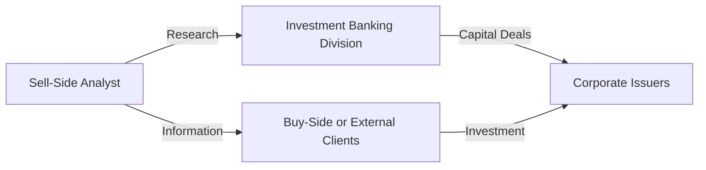

## Understanding Conflict of Interest Challenges

Conflicts of interest are basically those sneaky situations where, as an analyst, you might kind of lean away from giving your best objective judgment because something else is nudging you a little bit—maybe your bonus, maybe your relationships, or even the corporate culture. You know how it is: you want to do a good job, but there's always that voice in your head that wonders, “Well, might my boss or some other stakeholder prefer a certain outlook?” 

Anyway, these tensions can undermine not only your professional standing but also the capital markets’ integrity. The CFA Institute is pretty big on stamping out conflicts of interest, emphasizing that analysts provide transparent, unbiased research. In practice, though, it’s not always so simple. Let’s walk through these delicate areas and see how to handle them.

## Different Incentives and Pressures

Conflicts of interest can come from all directions. Imagine you’re a sell-side analyst, and your firm’s investment banking division has a juicy underwriting deal with the same company you cover. Nobody explicitly says, “Write something positive or else,” but it’s still easy to feel that subtle pressure, right?

Even buy-side analysts aren’t immune. They might be subject to pressure from portfolio managers who want them to tweak valuations or otherwise paint a rosy picture that helps meet short-term performance goals (and, let’s be honest, bonuses). Let’s break down the major sources of conflict and see what’s going on.

### Sell-Side Pressures: The Realities of Brokerage Ties

On the sell side, analysts often produce research for clients of brokerage firms. These clients may be institutional investors, but the analysts’ compensation can be tied to the trading revenues or underwriting deals those investors bring to the firm. It’s no wonder that “sell-side” analysts end up juggling contradictory objectives:

• Brokerage revenue vs. candid analysis: If your firm’s underwriting or advisory department has signed a big IPO or M&A deal, you might be nudged to maintain an upbeat rating.    
• Relationship-building vs. skepticism: Companies that you cover might grant better access or “relationship perks” if you write glowing research. Resistance could mean losing contact with management or no longer being invited to earn a seat at corporate events.  

From personal experience, I once spent a month analyzing a mid-cap tech stock and concluded, “This company is financially overstretched—maybe a Sell recommendation.” But then I found out the investment banking side was pursuing a major capital raise with them. It was a tricky conversation with our head of research, to say the least. The best approach? Present bulletproof data and keep your methods transparent. 

### Buy-Side Pressures: Client and Manager Demands

Buy-side analysts work within asset management firms, mutual funds, or hedge funds, aiming to produce internal investment research. You might think that’d be conflict-free, but real life begs to differ:

• Performance-based compensation: If the fund manager is rewarded for short-term outperformance, there could be an urge to overstate (or understate) a stock’s prospects if it suits the portfolio’s strategy.    
• Internal politics: A buy-side analyst might have a strong negative view on a stock that the star portfolio manager loves, creating tension.    
• Pressure to justify current holdings to clients: Sometimes the marketing team wants to publish glowing commentary to support the existing positions.  

These buy-side tensions can be subtle, but they matter a lot. The more your compensation is tied to short-run performance, the higher the temptation to fudge assumptions or ignore certain negative signals to keep the portfolio looking good. 

## The Importance of Transparency and Disclosure

If there’s one thing that helps mitigate conflicts of interest, it’s shining as much light on them as possible. Disclosing personal holdings, relationships, or potential incentives can help both your firm and your clients judge whether your recommendations are truly objective. 

For instance, if you (the analyst) own a huge position in a company’s stock, that’s worth telling your readers or your supervisors. Or if your spouse works for the firm you’re covering, that’s definitely a factor. And it’s not just about revealing the existence of these interests but also about the context: how big is the stake, what kind of relationship do you have, and so forth?

Many regulatory bodies (like the SEC in the US) require quite specific disclosures, particularly for research analysts issuing public recommendations. The gist is: reduce hidden agendas by making them public. Because, let’s face it, once your motivations are in the open, it’s easier to keep your analysis above board.

## Regulatory and Organizational Safeguards

### Chinese Walls (Information Barriers)

Firms often maintain strict “Chinese walls” to separate teams that might have conflicting objectives. For example:

By keeping investment banking teams away from the analysts, you reduce the chance that a banker’s desire to court a company for underwriting will bias the analyst’s rating. In reality, these walls might have cracks, but compliance departments provide mandatory training to patch them up.

### Compliance and Mandatory Rotation

In some firms, analysts are required to rotate coverage after a certain period, reducing the chance they get too cozy with a company’s management. This can be frustrating, especially if you’ve developed deep expertise in an industry. But the broader ethics behind it is that fresh eyes will produce more candid analysis.

Attending annual compliance refreshers often feels tedious—like, yes, we’ve all read the standards. But these sessions do help remind you to remain vigilant about conflicts. Training typically covers insider trading restrictions, how to handle material nonpublic information (MNPI), and the best ways to keep your research free of undue influences.

### Compensation Structures and Ethical Dilemmas

Let’s talk about money. Because, let’s be honest, compensation is a significant driver of behavior. If you’re rewarded based on how many trades happen on your recommendations, or how profitable those trades are, the conflict is real. Sure, it might push you to strive for accurate calls, but it can also tilt your outlook: “If I push a Buy rating, maybe we’ll get more trades and I get a higher bonus.” That’s not so good.

Balancing compensation is essential. Ideally, analyst pay should hinge on metrics of accuracy and thoroughness over time, not just near-term trading volume or investment banking deals. CFA Institute guidelines stress that an analyst’s compensation should not be explicitly tied to investment banking revenues. Where possible, a portion of an analyst’s evaluation might rest on feedback from asset manager clients about the quality of research, track record correctness, and ethical behavior.

## Independence and Objectivity: CFA Institute’s Guidelines

The CFA Institute is serious about independence and objectivity in investment analysis. Standard I(B) “Independence and Objectivity” within the Code of Ethics and Standards of Professional Conduct states that analysts must maintain an unbiased perspective, free from external pressures. Some best practices for compliance include:

• Avoiding direct links between your research opinions and any investment banking deals.  
• Refraining from accepting bribes, gifts, or lavish entertainment from the companies you cover (beyond the trivial).  
• Keeping a robust process for generating research, such as double-checking data sources, performing your own modeling, and not relying excessively on company presentations.  
• Documenting the rationale behind each recommendation, so it’s crystal clear how you reached your conclusion.

These measures protect you as an analyst, too. When you present your findings and your boss or a corporate executive questions them, it’s easier to stand by your call if you have a well-documented, data-driven approach.

## Practical Strategies for Maintaining Independence

### Use Comprehensive Data and Forecasting

Maintaining independence often boils down to the strength of your analysis. The more time you spend scouring multiple data sources—like published financial statements, competitor comparisons, macroeconomic assumptions—the stronger your base will be. Don’t just rely on a single conversation with company management, especially if the conversation is overshadowed by them wanting you to see only the good stuff.

Historical trends are also your friend. If you notice that a company’s margins are historically cyclical but management insists this time is different, you can test that assertion by building sensitivity analyses. Show the range of possibilities. If management truly wants you to buy into their assumption, they should provide robust evidence. If not, it’s fine to remain skeptical.

### Steering Clear of Material Nonpublic Information

It’s easy to slip up. Sometimes you’re touring a factory or chatting with the CFO, and they drop a “Hey, by the way, sales are way up this quarter.” If that’s not publicly disclosed, guess what? You’re sitting on MNPI—material nonpublic information. Trading or recommending trades on that info is illegal insider trading in many jurisdictions. 

CFA Standards also forbid using that info in your analysis if it’s material and not public. The correct approach is to escalate the matter to compliance. Typically, the compliance folks will instruct you or your office to place the stock on a restricted list until that info becomes public. 

### Balancing Relationship Management and Ethical Responsibility

If you’ve ever gotten an insider tip that made your job easier, you might feel a bit of fear about losing that access should you not “play along.” But there’s a bigger picture: if you get caught using MNPI, or your investment calls are compromised by these conflicts, your entire career can be at risk. The ethical path is often more sustainable. Your long-run reputation for integrity far outweighs any short-term career gain you might get from appeasing a certain client or company management.

## Real-World Vignette Example

Picture this scenario: You’re an analyst at a big brokerage firm covering the pharmaceutical sector. One day, you receive a heads-up from a friend (who works in the medical device division of a major publicly-traded firm) that they’re about to announce a major product recall that’s going to devastate sales. That news is not yet public. Meanwhile, your own research indicates the company’s fundamentals are already shaky, and you were leaning toward a Sell recommendation. The recall info feels like the final nail. 

• Ethical dilemma: If you incorporate that recall information directly into your published note before the announcement, you’re effectively using MNPI. You’d also be revealing it to the world if your note gets published.  
• Correct approach: Alert compliance, who will likely say, “We need to put this stock on the restricted list. You can’t publish on it until that info is made public.”  

Now, your friend might be disappointed (and you might get some pushback for adjusting your recommendation later than you “could have”), but from a legal and moral standpoint, you’re doing the right thing. This helps you maintain trust and credibility in the market, especially over the long haul.

## Common Pitfalls and Best Practices

• Pitfall: Accepting corporate-provided research or “guidance” at face value.   
• Best Practice: Perform your own modeling, compare competitor data, and question assumptions.  

• Pitfall: Letting your annual bonus overshadow honest analysis, especially if your boss keeps referencing how you “need to align your calls with firm agenda.”  
• Best Practice: Document your rationale thoroughly, and if push comes to shove, escalate the conflict to compliance or a higher authority.  

• Pitfall: Failing to disclose that you hold a significant personal stake in the stock you cover.  
• Best Practice: Clearly state your personal interests on record. This might mean stepping back from coverage if your stake is too large.  

## References for Deeper Reading

• CFA Institute: Standards of Practice Handbook – especially Standard I(B) Independence and Objectivity, and Standard II(A) Material Nonpublic Information.  
• Securities and Exchange Commission (SEC): https://www.sec.gov – for insider trading rules and analyst conflict-of-interest disclosures in the US.  
• FINRA rules on analysts and research: https://www.finra.org/rules-guidance   
• Academic Literature: Articles in the Journal of Finance and Financial Analysts Journal discussing the long-term effects of compromised analyst objectivity.  

## Potential Conflicts of Interest for Analysts: Practice Questions



### Potential Conflict #1

- [ ] A small personal investment in a company you cover is irrelevant to your recommendation.  
- [ ] You only need to disclose personal investments if someone explicitly asks.  
- [ ] Personal stakes below 5% never need disclosure.  
- [x] You should disclose any significant personal investment or relationship that might appear to compromise objectivity.  

> **Explanation:** The CFA Institute and many regulatory bodies emphasize full disclosure of interests to maintain trust in an analyst’s objectivity.

### Potential Conflict #2

- [x] Sell-side analysts often experience pressure from investment banking divisions to issue favorable research.  
- [ ] Buy-side analysts face no such pressures.  
- [ ] Pressure arises only in small brokerage firms.  
- [ ] Conflicts only matter for short-selling recommendations.  

> **Explanation:** Sell-side analysts can be pressured by their firm’s investment banking relationships, potentially weakening their independence. Buy-side analysts are not immune to conflicts either, but the question specifically references sell-side pressures.

### Potential Conflict #3

- [ ] Having a high-performance bonus tied to trading volume always leads to unbiased research.  
- [ ] Linking an analyst’s pay to underwriting fees helps objectivity.  
- [x] Compensation based on long-term accuracy and client feedback can reduce conflicts of interest.  
- [ ] Firm policies have no influence on an analyst’s ethical conduct.  

> **Explanation:** Tying analyst pay directly to short-term trading volume or underwriting fees can misalign incentives. Long-term performance-based compensation tends to encourage more objective analysis.

### Potential Conflict #4

- [x] Chinese walls attempt to separate investment banking from research.  
- [ ] Chinese walls are used to segregate marketing and HR only.  
- [ ] Chinese walls allow unrestricted flow of MNPI to analysts.  
- [ ] Chinese walls are ineffective and rarely used.  

> **Explanation:** A “Chinese wall” (or information barrier) is a structure firms use to isolate certain departments, like research from investment banking, to prevent undue influence and protect material nonpublic information.

### Potential Conflict #5

- [ ] Analysts are free to publish material nonpublic information if it benefits their clients.  
- [ ] Using insider information is acceptable if it’s validated by public sources later.  
- [ ] Personal gain is permissible if it doesn’t exceed $50,000.  
- [x] Trading or recommending trades based on MNPI is illegal and violates the CFA Code.  

> **Explanation:** Trading on or disseminating MNPI is illegal under most securities laws, and it violates the CFA Institute’s Standards of Professional Conduct.

### Potential Conflict #6

- [ ] Maintaining relationships with company management at all costs is key.  
- [x] Analysts should verify management’s claims with independent data and thorough analysis.  
- [ ] It’s fine to accept management’s forecasts without cross-checking, as they are the experts.  
- [ ] Relations with management are more important than providing objective research.  

> **Explanation:** While good relationships with management can provide valuable insights, analysts must always confirm information with independent sources to remain objective.

### Potential Conflict #7

- [ ] Buy-side analysts never face conflicts tied to compensation structures.  
- [ ] Buy-side analysts do not need compliance oversight.  
- [x] Buy-side analysts may be incentivized to manipulate valuations for short-term portfolio gains.  
- [ ] Only sell-side analysts must clear data with compliance.  

> **Explanation:** Buy-side analysts can also experience pressures from portfolio managers or from bonus structures that reward short-term wins at the expense of long-term objectivity.

### Potential Conflict #8

- [x] Disclosing ownership stakes helps investors evaluate potential biases.  
- [ ] Disclosure of conflicts is outdated; investors assume bias anyway.  
- [ ] Regulatory bodies do not care about personal disclosures.  
- [ ] Disclosure is only required if an analyst is a board member of the covered company.  

> **Explanation:** Disclosure enables transparency, so investors can gauge potential biases in an analyst’s recommendations.

### Potential Conflict #9

- [ ] Self-regulation by analysts alone is enough to prevent conflicts.  
- [ ] Analysts should only rely on their firm’s policies and not read external guidelines.  
- [x] Following the CFA Institute Code & Standards is crucial for maintaining independence and objectivity.  
- [ ] Regulatory oversight has no bearing on an analyst’s conflicts of interest.  

> **Explanation:** The CFA Institute Code & Standards is a cornerstone of professional conduct, setting clear expectations for ethical behavior and conflict of interest management.

### Potential Conflict #10

- [x] True  
- [ ] False  

> **Statement:** “Analysts sometimes rotate industries or coverage areas to reduce the risk of developing overly cozy relationships with company management.” This is true. Firm policies often impose mandatory rotations to help ensure objectivity.


