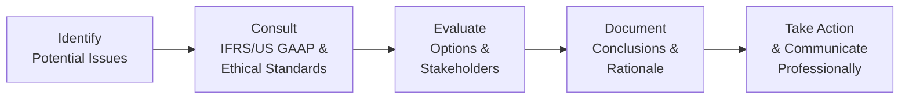

## Introduction and Context

So, imagine you’re just settling into your new role as an equity analyst, feeling fairly confident after nailing CFA Level I. You put on your best “game face” for the big meeting with MegaTronix Inc. This fictional tech manufacturing giant is rumored to be creatively stretching the bounds of IFRS/US GAAP in the notes to its financial statements. You’ve heard murmurs about ambiguous revenue recognition, borderline impairment decisions, and a few suspect footnotes. No big deal, right? Except… your boss and the company’s CFO seem awfully chummy, and the CFO suggests that a “slightly rosier” analyst report wouldn’t hurt. 

These are the moments that test not only your technical knowledge of financial statement analysis (FSA) but also your ethical compass. In practice, “ethics” isn’t just an abstract idea you skim over in your study notes. It’s what keeps your credibility intact when you’re feeling subtle (or not so subtle) pressure from stakeholders to fudge the line. This vignette is designed to help you think through those dilemmas step by step and decide how to respond—especially under exam conditions where nuanced judgments are key.

## The Scenario: MegaTronix Inc.

MegaTronix Inc. is a large, publicly traded electronics manufacturer that has expanded aggressively in emerging markets. Here are the highlights:

• Revenue Recognition Policies:  
  – The company sells customized devices and services in bundled contracts under both variable and fixed pricing terms.  
  – Management is especially proud of their “milestone-based” revenue approach and claims compliance with both IFRS 15 and ASC 606. However, the footnotes describing actual revenue cutoffs are… well, less than crystal clear.  

• Borderline Impairment Decision:  
  – MegaTronix has intangible assets related to a recent acquisition of a smaller robotics startup. These intangible assets have shown signs of potential impairment under IFRS (due to falling sales forecasts in the robotics division).  
  – Under US GAAP, the CFO asserts the recoverability test is “clearly passed,” but on further digging, you notice that some assumptions used in the forecast appear quite optimistic.  

• Potential Conflicts of Interest:  
  – Your brokerage department wants to maintain a positive outlook because MegaTronix is an important investment banking client.  
  – The CFO has hinted that MegaTronix will reconsider its relationship if you publish a critical note about their “aggressive” accounting.  

• Segment Reporting Tensions:  
  – When you ask about segment-level profitability on new expansions, management brushes off the question, claiming that additional detail is “unnecessary.”  
  – You sense they might be hiding underperformance in certain regions.  

You’re tasked with seeing how these issues line up with IFRS/US GAAP requirements—and whether they cross any ethical boundaries. Let’s walk through an approach that addresses both the technical and moral dimensions of FSA.

## Identifying Ethical Red Flags

It’s easy to skim the surface of disclaimers and footnotes, but thoroughness is your guardian. Keep notes of anything that smells fishy:

• Vague Revenue Recognition Clauses:  
  – Are the revenue milestones measured in a way that aligns with actual performance obligations? Or is the timing suspiciously favorable to meet quarterly targets?  
  – IFRS and US GAAP both demand consistent application of the five-step revenue recognition model. If MegaTronix changes the interpretation of milestones period to period, it might indicate manipulation.  

• Overly Optimistic Impairment Assumptions:  
  – Under IFRS, intangible asset impairments should be tested whenever indicators exist. But if management’s projects for the robotics division show questionable growth rates or ignore negative market indicators, you might suspect they’re delaying an otherwise necessary writedown.  
  – Under US GAAP, the two-step approach for testing long-lived assets can be manipulated if initial recoverability assumptions are unrealistic.  

• Management Pushback on Segment Reporting:  
  – IFRS 8 and ASC 280 both require disclosure of operating segments based on internal management. If they’re combining poorly performing businesses into more profitable segments, that’s a red flag.  

• Pressure for Favorable Analyst Coverage:  
  – A request for “rosier” analysis, especially when your compensation or job security might hinge on it, is a direct ethical challenge.  
  – Violates principles on objectivity, independence, and possibly the CFA Institute Code of Ethics and Standards of Professional Conduct, particularly Standard I(B) (Independence and Objectivity) and Standard VI(A) (Disclosure of Conflicts).  

## The Ethical and Professional Decision Points

You’re likely to face choice after choice at each step of the analysis. Let’s break down a possible approach:

### Step 1: Identify Potential Issues

Take note of each area that might be compromised: revenue recognition, impairment tests, segment reporting, and undue pressure on your coverage.

### Step 2: Consult IFRS/US GAAP & Ethical Standards

Compare the company’s practices with the relevant sections of IFRS and US GAAP. For instance:  
• IFRS 15 / ASC 606 for revenue recognition.  
• IAS 36 vs. ASC 350 and ASC 360 for impairment of assets.  
• IFRS 8 / ASC 280 for segment disclosures.  

Simultaneously, align each questionable practice with the CFA Institute Code of Ethics and Standards of Professional Conduct. For instance:  
• Standard I(C): Misrepresentation—Are they misrepresenting results?  
• Standard I(B): Independence and Objectivity—Are you being corrupted by external pressure?  
• Standard V(A): Diligence and Reasonable Basis—Are your internal reports supported by thorough analysis, or are you caving to time constraints or pressure?

### Step 3: Evaluate Options and Stakeholders

Now, weigh the consequences of your findings. Maybe the revenue recognition approach is borderline but within technical compliance, but it strays from the spirit of transparent reporting. If the impairment testing is based on laughably optimistic growth forecasts, should you call it out? Probably! Consider the perspective of:

• Shareholders who might be misled if the company delays impairments or inflates earnings.  
• Creditors who rely on accurate reports to assess risk.  
• Regulators who enforce IFRS/US GAAP compliance.  
• Your own firm’s reputation if you remain silent.  

### Step 4: Document Conclusions and Rationale

In a real-world compliance environment, you might need to produce an internal memo or, at minimum, keep personal documentation. If you suspect unethical or borderline reporting, record the date, who communicated with you, and their statements. This step provides protection if your integrity is challenged later.

### Step 5: Take Action and Communicate Professionally

Finally, decide how to proceed. If management refuses to address or clarify questionable practices, you may need to escalate the issue internally—or externally if it rises to that level. In a typical exam item set, you might be asked how you respond if your employer encourages you to issue an overly positive report. The correct approach, consistent with the Code and Standards, is to maintain your independence and objectivity.

## Potential Conflicts of Interest: High-Level Rundown

Below is a simplified table illustrating some key conflict points and potential ways to address them:

| Conflict Point                          | Possible Cause                                  | CFA Standard Implicated                                      | Response Approach                                          |
|----------------------------------------|-------------------------------------------------|--------------------------------------------------------------|------------------------------------------------------------|
| Positive Spin on Analyst Coverage      | Pressure from management or colleagues          | Independence and Objectivity (I(B)), Conflict of Interest (VI) | Reassert professional integrity, consult compliance        |
| Concealing Segment Underperformance    | Protect stock price or management compensation  | Misrepresentation (I(C)), Diligence & Reasonable Basis (V(A)) | Demand segment data, reference IFRS 8/ASC 280 disclosure  |
| Aggressive Revenue Recognition         | Achieve earnings targets; meet bonuses          | Misrepresentation, possibly Fraud (I(D))                     | Scrutinize footnotes, validate with IFRS 15/ASC 606        |
| Delayed Impairment Tests               | Avoid asset write-downs and negative headlines  | Misleading financial statements (I(C)), Fair Dealing (III(B)) | Revisit discount rates, growth forecasts, consult audit team|

Remember that personal accountability remains. Even if your direct supervisor or the CFO suggests that “everyone does it,” your responsibility under the Code of Ethics is crystal clear: you must prioritize ethical conduct and transparent communication.

## Practical Example: Applying Ethical Frameworks

Let’s say you discover that the robotics division’s forecast includes a 20% annual sales growth rate that’s double the historical trend—even though the sector just lost a major contract. Under IFRS, that’s a major question mark for impairment assumptions. If you, as the analyst, are told, “Don’t worry, we got it covered,” that’s an ethical challenge. 

In your exam item set, a question might ask: “How should an analyst respond if management’s forecast is materially inconsistent with recent actual market trends?” The correct answer is to gather sufficient evidence to form an independent opinion—like obtaining industry benchmarks, verifying with external sources, or analyzing competitor data. You remain obligated to issue a recommendation that reflects the most accurate picture possible, even if it’s not what your boss or client wants to hear.

## Documentation: Protecting Yourself and Your Firm

Even if you belong to a small team, maintain or propose official guidelines for documenting research rationale. For borderline judgments (like revenue cutoffs or impairment assumptions), your better defense is a well-kept trail of how you arrived at your conclusion. If the firm’s compliance structure is robust, you can consult legal or compliance officers. If not, consider the steps you can take personally to protect your integrity: create a personal log of communications, gather relevant references from official accounting standards, and keep your notes in a safe location. 

“Document, document, document” might sound repetitive, but in all seriousness, those notes are your best friend if regulators or senior management start pointing fingers later.

## The Impact on Stakeholders

Beyond the immediate question of whether a certain treatment is a technical violation, it’s worth stepping back and asking: “Who else suffers or benefits if the financials are distorted?”

• Investors and Creditors: If the stock is overvalued based on inflated reports, some might lose money when the truth emerges.  
• Employees: Overstating the health of a segment might lead staff to invest in company stock for retirement, only to face losses later.  
• Capital Markets: Each instance of unethical reporting erodes trust, ultimately harming market efficiency.  

Ethical compliance, while it can feel like an uphill battle in the moment, fosters credibility for your analysis and for the broader financial system.

## Personal Anecdote: Learning the Hard Way

I recall a time early in my career when a smaller client insisted on female-coded promotional spending to be recognized as an asset (since “it was brand-building”). It was nowhere near IFRS or US GAAP standards, and they kept pushing me to tweak the forecast so the bottom line would look better. Well, I was pretty naive, but something just felt off—like that little internal voice screaming “Run!” So, I documented everything, politely escalated to the compliance team, and we parted ways amicably. But had I not recognized that attempt as crossing the line, I could have ended up endorsing a borderline practice that might’ve landed us in real trouble, not to mention tarnishing my own reputation in the long run.

## Conclusion and Key Takeaways

Ethical pitfalls in FSA are everywhere—especially at Level II and beyond, where the scenarios get more complex. Remember to:

• Stay vigilant for red flags: suspicious revenue recognition, questionable impairment assumptions, hidden segment performance.  
• Consult both IFRS/US GAAP technical requirements and the CFA Code of Ethics.  
• Evaluate stakeholder implications and maintain your independence—even under pressure.  
• Document your analysis and decisions meticulously.  
• Recognize accountability is on you to do the right thing, always.

When you see ethical challenges in exam questions, think about the bigger picture and the stepwise approach. And in the real world, have the courage to push back or escalate when management tries to nudge (or shove) you across ethical boundaries. After all, your professional reputation might be your most valuable asset.

---

## Additional References for Further Scenario Practice

• CFA Institute. (2025). CFA Program Curriculum Level II, Ethics and Professional Standards.  
• IFRS Foundation. (2022). International Financial Reporting Standards (IFRS) – IFRS 15, IFRS 8, IAS 36.  
• FASB. (2022). Accounting Standards Codification (ASC) – ASC 606 (Revenue), ASC 280 (Segment Reporting), ASC 350 and ASC 360 (Intangible Assets and Impairments).  
• Past CFA Program Mock Exams: Multi-part vignettes with ethical scenarios.  
• Corporate Finance Institute. (2024). Case Studies of Historical Corporate Scandals: Enron, WorldCom, and Others.  
• KPMG, Deloitte, PwC, EY compliance training materials for real-world application of ethics in financial analysis.

---

## Test Your Knowledge: Ethical Challenges in Financial Statement Analysis



### A scenario-based question describes a company that recognizes revenue early to meet quarterly targets, with minimal disclosures in the footnotes. What ethical red flag should an analyst be most concerned about?

- [ ] The CEO’s personal investment in the company’s stock.  
- [ ] The company’s strong cash position.  
- [x] Potential misrepresentation of timing in revenue recognition.  
- [ ] The absence of any intangible write-downs.  

> **Explanation:** Recognizing revenue prematurely can be a form of misrepresentation, and footnotes lacking clarity on timing is a classic warning sign of aggressive accounting.  

### MegaTronix Inc. uses highly optimistic assumptions for impairment testing despite clear evidence of market downturn. Under IFRS, which step is most crucial for identifying a potential breach of ethical standards?

- [ ] Comparing the robotics division’s growth rate to inflation.  
- [x] Analyzing whether management’s assumptions for the forecast are credible and consistent with observable market conditions.  
- [ ] Confirming the use of the two-step impairment test.  
- [ ] Comparing the CFO’s compensation structure to the overall market average.  

> **Explanation:** Under IFRS, companies must test for impairment if indicators exist. If management’s assumptions are out of line with reality, it could signal both misrepresentation and a lack of independence in estimates.  

### Which CFA Institute Standard primarily addresses an analyst’s responsibility to maintain independence and objectivity in the face of client or employer pressure?

- [x] Standard I(B) Independence and Objectivity  
- [ ] Standard II(A) Material Nonpublic Information  
- [ ] Standard IV(C) Responsibilities of Supervisors  
- [ ] Standard V(B) Communication with Clients and Prospective Clients  

> **Explanation:** Standard I(B) guides maintaining independence and objectivity, particularly when external pressures might compromise an analyst’s professional judgment.  

### An analyst suspects that revenue for bundled product sales is split in a way that inflates near-term profits. What should be the first line of action?

- [x] Review the contract terms and IFRS 15/ASC 606 guidelines to verify the allocation of transaction price.  
- [ ] Immediately file a whistleblower complaint with regulators.  
- [ ] Dismiss it as an industry norm.  
- [ ] Wait for the external auditors to issue their final report.  

> **Explanation:** The first step is to compare the firm’s revenue recognition approach to official accounting guidelines before escalating the issue.  

### A senior manager at MegaTronix Inc. invites you to a lavish weekend retreat while you’re finalizing a research report. Which ethical concern is most relevant here?

- [x] Independence and Objectivity  
- [ ] Fair Dealing  
- [x] Conflict of Interest  
- [ ] Preservation of Confidentiality  

> **Explanation:** Accepting extravagant gifts or hospitality from a firm you’re covering can impede your independence and represents a potential conflict of interest.  

### Management threatens to discontinue business dealings with your employer if you don’t publish an upbeat analyst report. Which CFA standard is at greatest risk?

- [x] Standard I(B) Independence and Objectivity  
- [ ] Standard I(A) Knowledge of the Law  
- [ ] Standard III(A) Loyalty, Prudence, and Care  
- [ ] Standard VII(B) Reference to CFA Institute, Designation, and Program  

> **Explanation:** The direct threat to independence is a violation under Standard I(B), as it attempts to sway the analyst’s objective evaluation.  

### The CFO of MegaTronix insists that their combined segment reporting is justified despite one segment dragging down overall performance. Under IFRS 8, which question should the analyst ask first?

- [x] Whether the segments have similar economic characteristics that warrant aggregation.  
- [ ] Whether combining segments boosts reported net income.  
- [x] Whether the CFO’s motivation is personal gain.  
- [ ] Whether discontinuing segment disclosure is an option.  

> **Explanation:** IFRS 8 requires that aggregated segments share similar economic characteristics and be managed as a single unit. If they’re not, combining them may violate transparency requirements.  

### The new footnote references “management’s best estimates” of future cash flows for goodwill impairment testing. How can an analyst best assess the reasonableness of those estimates?

- [x] Compare them with third-party industry forecasts and market data.  
- [ ] Repeat the same assumptions for all forecasting periods but double-check discount rates.  
- [ ] Ignore them if the external auditor has approved the financials.  
- [ ] Accept the CFO’s verbal assurance during a company roadshow.  

> **Explanation:** Analysts must compare management’s assumptions to objective market data or independent sources. Merely trusting verbal assurances or external audits is insufficient for thorough due diligence.  

### If an analyst documents every conversation and decision in a personal log, what ethical principle is primarily served?

- [x] Protecting oneself and the firm through evidence of diligent effort.  
- [ ] Supporting the CFO’s strategic decisions.  
- [ ] Complying strictly with IFRS revenue recognition.  
- [ ] Increasing the amount of corporate bureaucracy.  

> **Explanation:** Thorough documentation safeguards the analyst and the employer, illustrating that decisions and analyses were conducted ethically, given the available information at each stage.  

### True or False: It is acceptable for an analyst to issue an overly positive research report if it helps maintain a solid client relationship, as long as it does not violate actual legal requirements of IFRS or US GAAP.

- [x] True  
- [ ] False  

> **Explanation:** This is a trick question in the sense that it tests whether you understand that ethical standards go beyond pure legal compliance. While it might be “legal,” issuing distorted or biased research violates the spirit of ethical guidelines and independence under the CFA Code of Ethics.  


