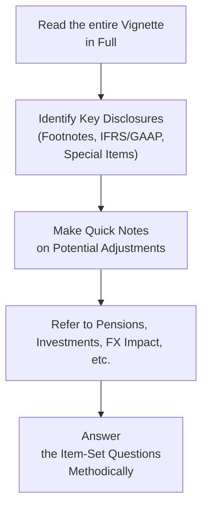

## Introduction to the Corporate Vignette Scenario

Welcome to a sneak peek of how the CFA® Level II exam might fuse various Financial Statement Analysis topics into one juicy, multi-dimensional vignette. Maybe you’ve already noticed that Level II is all about deeper dives and integrated thinking. You’re not just recalling definitions anymore, but actually dissecting a company’s footnotes and forging links between intangible asset disclosures, pension assumptions, and foreign exchange (FX) exposures. It’s kind of like juggling, except the “balls” are revenue recognition, intercorporate investments, and IFRS vs. US GAAP differences—and you’re on a tight exam-day timeline.

I remember the first time I got a practice vignette that combined intangible-asset write-downs with IFRS-US GAAP differences in pension expense. Let’s just say, I was thrilled...until I realized how many footnotes I had to parse! But hey, we learn by doing, right? In this section, we’ll simulate that experience and provide a blueprint for tackling it.

Below, we’ll outline a typical multi-topic scenario, highlight pitfalls, and suggest a systematic approach. We’ll also use a few diagrams to illustrate possible ways you might organize your notes or interpret relationships among different parts of the financial statements. So, let’s roll up our sleeves and get ready.

## How to Approach the Multi-Topic Vignette

Reading the entire vignette first might feel overwhelming—lots of footnotes, lots of details. Should you skim? Should you read each question? My personal approach is to read the entire scenario at least once, focusing on big themes (like the presence of pension obligations or intercorporate investments). Then, you can dive deeper into details, especially footnotes. Try to keep running notes of anything that stands out—things like changes in accounting policies, estimates, IFRS vs. US GAAP references, or intangible asset impairments.

Below is a visual representation of one possible approach:

Feel free to adapt this flow to your own style. Some candidates prefer question-first reading, but in my opinion, you’ll rarely lose time by reading the entire scenario carefully.

## Key Considerations

### IFRS vs. US GAAP

• Identify which reporting framework is used by the parent company and whether any subsidiaries or associates use a different standard.  
• Common divergences appear in revenue recognition timing, classification of financial assets, goodwill impairment tests, and intangible asset revaluation.  
• Check if the vignette explicitly says that a subsidiary uses IFRS while the parent uses US GAAP—that may require you to do some bridging or adjusting of figures.

### Pension Accounting

• Keep an eye out for the type of pension plan (defined benefit vs. defined contribution).  
• Review footnotes for discount rate changes, changes in expected return on plan assets, and the timeline of these changes.  
• IFRS vs. US GAAP differences include how the net pension liability is reported, the treatment of remeasurements in Other Comprehensive Income (OCI), and the immediate recognition vs. amortization of certain components.

### Intercorporate Investments

• Determine whether the investment is classified as a financial asset (e.g., FVOCI, FVPL) or an associate (equity method). Maybe the company has joint ventures or controlling interests that require consolidation.  
• If consolidation is needed, are there any special intangible assets recognized at acquisition? Are there partial goodwill or noncontrolling interests to consider?  
• Check for any hints of variable interest entities (VIEs), especially if you see language about a “primary beneficiary” or “significant variable interest.”

### FX Translation

• Identify the functional currency of each subsidiary. If it differs from the parent’s presentation currency, that’s a big clue.  
• Look for references to the current rate method vs. the temporal method.  
• IFRS vs. US GAAP treatments for hyperinflationary economies can pop up in a question.  
• Keep track of the cumulative translation adjustment (CTA) in equity or any realized FX gains/losses in net income.

### Combination of Topics

You might see, for instance, that the parent company invests in a subsidiary in a different currency zone, uses IFRS for intangible assets, and has a defined benefit pension plan requiring an immediate recognition of remeasurements in OCI. So many moving parts! The key is to maintain clarity and structure in your approach. I like to keep separate note “buckets” for each major topic:

• Pension details  
• FX translation method  
• Consolidation or equity method for intercorporate investments  
• IFRS/GAAP differences on intangible assets  

In an exam environment, you might create a quick correlated table that flags each entity with a yes/no for IFRS or US GAAP, a yes/no for controlling interest, etc.

## Practical Example (Fictional Scenario)

Let’s consider a simplified scenario that the exam might present:

You’re given the financial statements of Mavtech Inc., a global technology firm reporting under IFRS. Mavtech Inc. acquired a 40% stake in Banyo, a software developer based in a country with a different currency. Because Mavtech Inc. does not have controlling interest, it uses the equity method to account for Banyo.

Footnotes highlight that:  
1) Mavtech sponsors a defined benefit plan, changing its discount rate from 6% to 5.5% this year.  
2) The intangible assets of Mavtech’s German subsidiary were revalued upward according to IFRS rules. Under US GAAP, this might not have been allowed.  
3) Banyo’s functional currency is the euro, while Mavtech’s presentation currency is the US dollar. Banyo’s local currency statements are translated using the current rate method.  
4) Mavtech recognized an impairment charge on goodwill from a previous acquisition—footnotes mention the IFRS testing method for impairment.  
5) The notes also reveal that Mavtech invests in a special purpose entity (SPE) in which Mavtech is the primary beneficiary. IFRS guidelines require consolidation, even though Mavtech only holds 30% equity.

Now, each of these details could spawn one or more exam questions around measurement, translation adjustments, disclosures, or the differences between IFRS and US GAAP. For instance, you might be asked:

• How the pension discount rate change affects net pension liability.  
• How intangible asset revaluations differ under IFRS vs. US GAAP, and whether that revaluation affects reported equity.  
• How to account for the goodwill impairment.  
• Which currency translation method is appropriate for Banyo.  
• Whether the SPE meets conditions for consolidation and how that affects Mavtech’s leverage ratios.

## Best Practices and Potential Pitfalls

• Don’t gloss over footnotes. This is where the “fun” surprises usually lurk.  
• Be consistent in how you link IFRS and US GAAP differences. If you see intangible asset revaluation in IFRS, remember US GAAP typically doesn’t allow upward revaluation (apart from some rare circumstances like fresh start accounting in reorganizations).  
• Mind your timeline: if an acquisition date is mid-year, some adjustments might be prorated or only partially included.  
• Watch out for rhetorical or trick questions that test conceptual knowledge, like IFRS’s approach to determining functional currency.  
• Thoroughly parse pension notes. Even a small shift in discount rate can have big ramifications for the pension expense.  
• Don’t rush. A question might look straightforward, but re-check footnotes for any mention of “retrospective application” or “change in accounting principle.”

## Quick Formula Examples

Pension obligation calculations or goodwill measurement often appear. For example, the formula for goodwill under IFRS (and US GAAP, although impairment testing differs) might look like this:

$$
\text{Goodwill} = \text{Purchase Price} - \bigl(\text{Fair Value of Identifiable Net Assets}\bigr).
$$

For the interest cost on pension obligations (under US GAAP), you might see:

$$
\text{Interest Cost} = \text{Opening Projected Benefit Obligation (PBO)} \times \text{Discount Rate}.
$$

But remember, IFRS lumps interest cost and expected returns on plan assets into one net figure. Summaries like these can help you quickly recall the main differences.

## Sample Note-Taking Structure

One approach that I like is setting up a quick, simplified table to track each major area:

| Topic                | IFRS or GAAP | Key Footnotes          | Potential Adjustments |
|----------------------|-------------|------------------------|-----------------------|
| Pensions             | IFRS        | Changed discount rate  | Re-calc net liability |
| Intercorp. Investment| IFRS        | Equity method        | Eliminations if control? |
| FX Translation       | IFRS        | Current rate method    | CTA in equity?        |
| Goodwill Impairment  | IFRS        | IFRS approach used     | Compare recoverable amt.|
| Consolidation        | IFRS        | SPE considered a VIE   | Must consolidate?     |

## Encouraging Critical Thinking

Take a step back and ask yourself, “Why might management revise a discount rate for its pension plan or revalue intangible assets?” Sometimes these changes are genuine. Other times, they might be used to adjust earnings or smooth out volatility. Always keep a healthy dose of skepticism—particularly if the vignette subtly hints that the CFO changed policy right before year-end.

## Glossary

• Vignette: A case-based question format used in the CFA exam, providing a scenario plus multiple questions.  
• Acquisition Date: The date a business combination is considered effective.  
• Disclosures: Footnotes or supplementary notes in the financial statements providing deeper insights.  
• Policies vs. Estimates: Policies are the rules and methods a company chooses; estimates are the assumptions used in applying those policies.  
• Non-Operating Items: Revenues or expenses not related to the core operations (e.g., gains on securities).  
• Red Flags: Warning signs for possible financial manipulation (massive intangible write-ups with no justification, abrupt changes in pension assumptions, etc.).  
• IFRS vs. US GAAP Differences: Divergences in how standards handle valuations, revenue recognition, and so forth.  
• Time-Series Analysis: Looking at trends over multiple years to identify anomalies.  

## References and Further Reading

• IFRS Foundation (https://www.ifrs.org/) – Official IFRS standards documents and illustrative examples.  
• FASB ASC (https://asc.fasb.org/) – Official US GAAP guidelines.  
• International Financial Statement Analysis (by CFA Institute) – Excellent exam-focused resource.  
• Financial Reporting and Analysis (Revsine et al.) – Great for bridging theoretical discussions with real-world policy references.  

## Practice Questions: Setting the Stage for the Exam

Below, you’ll find ten sample questions to test your readiness for a multi-topic corporate vignette. Review your notes and see if you can spot relevant footnotes or IFRS/US GAAP differences in each question. Good luck, and don’t forget: practice is the best way to build confidence!

## Test Your Knowledge: Integrated FSA Vignette Strategies



### In a multi-topic vignette, what is the most effective first step?
- [ ] Immediately jump to the questions to save time.  
- [x] Read the entire vignette thoroughly to identify overall themes and key footnotes.  
- [ ] Create a complex spreadsheet of all possible IFRS and US GAAP differences before reading further.  
- [ ] Ignore pension information unless you see a separate pension footnote.  

> **Explanation:** Reading the entire vignette carefully ensures you grasp the broad context and major footnote disclosures before attempting any calculations or comparisons.

### A company reporting under IFRS recognizes an upward revaluation of intangible assets. Under US GAAP, which of the following is true?
- [x] Upward revaluation of most intangibles is generally not permitted.  
- [ ] Upward revaluations are permitted only for internally generated software.  
- [ ] Upward revaluations are permitted if the fair value can be reliably measured.  
- [ ] Upward revaluations are allowed, but only in the first year after acquisition.  

> **Explanation:** US GAAP typically does not allow upward revaluation of intangible assets (with rare exceptions). IFRS does, provided there is an active market or other reliable measurement basis.

### When consolidating a Variable Interest Entity (VIE) under IFRS, which condition typically triggers consolidation?
- [ ] Ownership of at least 50% of the entity’s equity.  
- [x] Being the primary beneficiary exposed to the majority of the risks and rewards.  
- [ ] Having a joint arrangement with significant influence.  
- [ ] Meeting the definition of fair value hedging.  

> **Explanation:** Under IFRS (and similarly under US GAAP for VIEs), consolidation is required if the reporting entity is the primary beneficiary with significant risk/reward exposure, regardless of percentage ownership.

### A parent company using IFRS acquires 40% ownership in a subsidiary. Under which method is the subsidiary’s financials typically reported?
- [ ] Consolidation.  
- [x] Equity method, unless control or joint control is established.  
- [ ] Fair value through profit or loss only.  
- [ ] Proportionate consolidation.  

> **Explanation:** Generally, 40% ownership implies significant influence but not control, so the equity method is used unless other factors indicate control.

### How might a reduction in the pension discount rate from 6% to 5.5% affect a defined benefit plan’s reported financials under IFRS?
- [x] It would increase the present value of the defined benefit obligation, possibly raising pension expense.  
- [ ] It would reduce the service cost in the current period.  
- [ ] It has no impact on the PBO or pension expense.  
- [ ] It would automatically move the plan from an overfunded to an underfunded status.  

> **Explanation:** Lower discount rates increase the PBO, reflecting a higher present value of future obligations. This often increases pension expense.

### A EUR-functional subsidiary is translated into a USD parent’s financial statements using the current rate method. Which statement is correct?
- [ ] Revenues and expenses use the historical rate.  
- [ ] Assets and liabilities use average rates for the period.  
- [x] All assets and liabilities use the current exchange rate, while revenues and expenses use average rates.  
- [ ] Equity is translated using the average rate for the year.  

> **Explanation:** Under the current rate method, balance sheet items are translated at the current rate, and income statement items at the average rate. Equity accounts are typically translated at historical rates.

### What is the main difference between IFRS and US GAAP regarding pension remeasurements in Other Comprehensive Income (OCI)?
- [x] IFRS requires immediate recognition of remeasurements in OCI without recycling, whereas US GAAP may require some amortization in future periods.  
- [ ] There is no difference; both IFRS and US GAAP require the same recognition and recycling approach.  
- [ ] IFRS defers all remeasurements as intangible assets.  
- [ ] US GAAP forbids any recognition of remeasurement in OCI.  

> **Explanation:** IFRS puts remeasurements directly in OCI and keeps them there permanently. US GAAP is more likely to place elements like actuarial gains/losses in OCI but subsequently amortize amounts to the income statement over time.

### Why might footnotes mentioning “change in accounting estimate” be crucial in a multi-topic vignette?
- [x] Because changes in estimates can alter reported figures (like depreciation expense or pension costs) without restating prior periods.  
- [ ] Because estimates are only relevant if the question explicitly asks about intangible assets.  
- [ ] Because changes in estimates always trigger immediate restatement of previous years’ statements.  
- [ ] Because IFRS prohibits changes in estimates once the financial statements are issued.  

> **Explanation:** Changing an estimate (e.g., pension discount rate or useful life of an asset) affects current and future periods but not past statements, which can significantly impact analysis.

### In an exam setting, how might you structure your notes to avoid missing critical details?
- [ ] Write a single paragraph summarizing each footnote.  
- [x] Create clear topic-based categories (e.g., IFRS vs. US GAAP adjustments, pensions, FX, intangible assets) and track relevant data under each.  
- [ ] Rely solely on your memory to keep track of everything.  
- [ ] Ignore intangible assets unless they appear in the balance sheet directly.  

> **Explanation:** Using topic-based categories helps you systematically track material without confusion. This approach is more reliable than mental notes alone.

### True or False: A red flag like a sudden, unsubstantiated revaluation of intangible assets near year-end can sometimes signal potential earnings management.
- [x] True  
- [ ] False  

> **Explanation:** Abrupt changes in accounting judgments (like revaluing intangible assets without clear market-based justification) may indicate possible earnings manipulation or aggressive accounting practices.



Hope this helps you practice the intricacies of multi-topic vignettes in Level II FSA. Keep revisiting these methods and, above all, keep calm when approaching the real exam. The more you deal with integrated scenarios now, the less likely you’ll be caught off-guard on exam day. Good luck and happy practicing!
