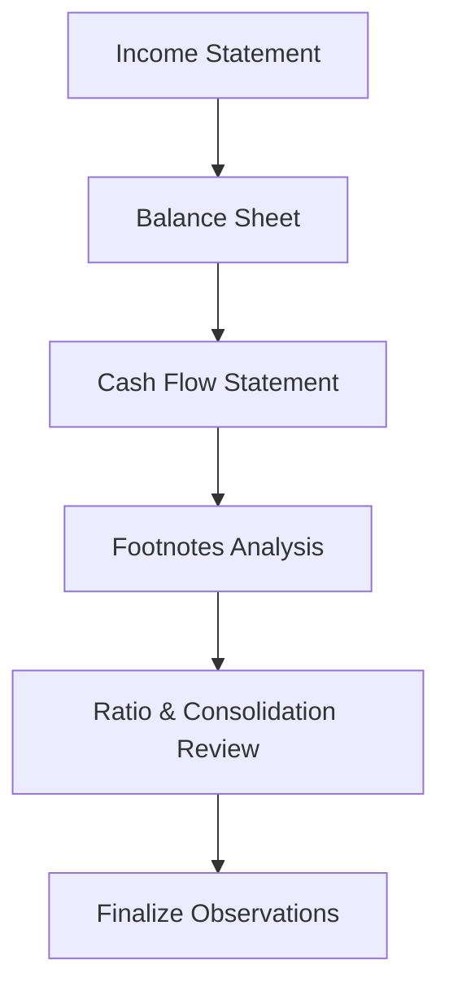

## Introduction

So, you’re faced with a detailed vignette that includes a stack of financial statements, footnotes, and perhaps even a snippet about IFRS vs. US GAAP differences. You might be thinking, “Uh, where do I even begin?” Trust me, we’ve all been there. The key is to go step by step, calmly verifying each piece of information—because, honestly, everything is interlinked. Whether you’re checking pension assumptions or reconciling foreign subsidiary balances, it’s all about methodical analysis.

Below, we’ll walk through a process to ensure you don’t miss any red flags or hidden gems within a vignette. You’ll see how each statement builds on the previous one, what footnotes really say (and sometimes don’t say), and how ratio analysis can tie it all together. Let’s get started.

## A Systematic Approach: The Big Picture

Before diving into the nitty-gritty, let’s visualize how we might link each part of the financials. Here’s a simple Mermaid flowchart showing the overall journey from income statement to final observation:



This flow tries to mirror your actual reading experience: start with the income statement, move to the balance sheet, then see how the cash flow lines up, dig into the footnotes, do ratio analysis, and wrap up your observations. By continually cross-checking everything, you’re less likely to overlook important signals.

## Income Statement: A Starting Point

The income statement is often the most attention-grabbing part of a vignette: revenue is up, the company posted record net income, and so on. But it’s also full of potential pitfalls. Here’s how I like to dissect it:

• Check revenue recognition policies.  
  - Under IFRS 15, revenue is recognized when control passes to the customer. For US GAAP, it’s a similar framework but with some differences in disclosures. Any mention of “bill-and-hold” transactions or channel stuffing is an immediate call for caution.  
• Identify unusual items.  
  - One-time gains (like a big asset sale) or restructuring charges can significantly distort net income. I remember once reading a vignette that buried a major gain on discontinued operations in the footnotes—without calling it “discontinued.” Sneaky.  
• Evaluate margins.  
  - Year-over-year margin changes might suggest changes in cost structure, product mix, or even questionable accounting. A margin jump from 15% to 25% is worth investigating, especially if there’s no operational reason for such an increase.  

### Quick Example  

Let’s say you spot a note that states, “In FY 2024, the company changed its method of revenue recognition for certain long-term contracts, leading to an additional $10 million in revenue.” Immediately, I’d think: “Does that align with IFRS (or US GAAP) guidelines? How does that affect net income, and will it reverse in the next period?” Cross-checking the subsequent year’s statements could reveal if that $10 million truly represents normal, sustainable revenue— or if it’s just a one-off timing benefit.

## Balance Sheet: Where Are the Shifts?

Next, move to the balance sheet. It’s like rummaging through a fridge: you’re checking what’s fresh, what’s expired, and, hopefully, why certain items are missing or newly added.

• Compare major line items over multiple periods.  
  - Is inventory growing faster than sales? Could be a sign of potential obsolescence or overly generous channel stuffing.  
  - Has goodwill jumped by a significant amount? Possibly a recent acquisition or a switch from the equity method to consolidation.  
• Look for IFRS vs. US GAAP treatments.  
  - Under IFRS, intangible development costs might be capitalized, whereas under US GAAP they’re usually expensed. That affects R&D categories and intangible asset balances.  
• Note newly consolidated entities.  
  - Did the company acquire more than 50% of a joint venture? If so, you might see a noncontrolling interest line pop up.  

### Hidden Pitfalls  

It’s easy to overlook partial vs. full goodwill methods or intangible measurements. If IFRS states that goodwill is tested at the cash-generating unit (CGU) level, but the footnotes mention a US GAAP approach, you might want to see how they tested for impairment and if they wrote down any portion.

## Review the Cash Flow Statement

After you’ve studied the balance sheet, the cash flow statement is next. Now, this is where you see how that net income translates into actual cash flows. If there are big discrepancies, you might suspect some non-cash items, or something more concerning.

• Check operating vs. investing vs. financing.  
  - A mismatch in patterns could be a red flag. For instance, if net income soared but cash flow from operations barely budged, maybe receivables are sky-high or payables are shrinking.  
• Evaluate capital expenditures.  
  - A big CapEx jump typically means expansions, but if the footnotes say it’s part of “maintenance capital,” you need clarification.  
• Watch for classification differences.  
  - IFRS sometimes allows more flexibility in classifying interest and dividends. US GAAP is more rigid.     

### Quick Cash Flow Cross-Check  

An easy cross-check is to add up net income, plus non-cash expenses, minus changes in working capital, and see if that roughly matches the operating cash flow. If it doesn’t, I’d be reading footnotes with extra attention. Maybe the firm reclassified certain expenses to investing or used factoring that artificially boosted CFO.

## Dissect the Footnotes

Now, footnotes often reveal the “gotchas.” They may be lengthy, but ignoring them is a surefire way to miss exam-critical details.

• Accounting method transitions:  
  - If the vignette says the company went from equity method to full consolidation of an investment, you might see a spike in consolidated revenue or assets. Also, intangible assets might appear out of nowhere because of purchase price allocation.  
• Impairment details:  
  - If a note says, “We tested goodwill for impairment using a value-in-use approach,” dig deeper: how did they estimate future cash flows? Under US GAAP, you might see a two-step approach (though the standards keep evolving). IFRS uses a one-step approach.  
• Pension assumptions:  
  - The discount rate, expected long-term return on plan assets, and changes in mortality tables are all relevant. If the firm changed assumptions significantly (like drastically lowering the discount rate), you might see a ballooning pension liability.  
• Share-based compensation specifics:  
  - Look for vesting schedules, big modifications, or repricings. They can create unusual expense patterns.  

Honestly, I used to skip the footnotes in practice vignettes because they were so long and, well, a little boring. Then I realized that’s usually where examiners hide crucial data. So, pro tip: read them carefully. They might even mention partial goodwill or a foreign subsidiary’s functional currency.

## Ratio Analysis: Bringing It All Together

With all this data in hand, you can now do ratio analysis. The trick is to ensure you’re using the “clean” numbers. If there’s a big one-time charge or a shift in accounting policy, consider adjusting those out for a more “normalized” view.

• Profitability ratios:  
  - Gross margin, operating margin, and net margin. Adjust them if you see large nonrecurring items.  
• Liquidity ratios:  
  - Current ratio, quick ratio. If payables soared while current assets stayed stagnant, that might be short-term financing (fine in some cases, but watch out for solvency risk).  
• Solvency ratios:  
  - Debt-to-equity, interest coverage. Confirm if any of the firm’s off-balance-sheet items (like VIEs or operating leases under older standards) need to be included.  
• Efficiency ratios:  
  - Inventory turnover, receivables turnover. If there’s a mismatch in revenue growth vs. turnover, that’s a possible sign of operational or accounting anomalies.  

### A Quick KaTeX Illustration  

Let’s say you want to recast the firm’s interest coverage ratio by adding back non-cash charges. You might highlight the ratio as:


\text{Adjusted Interest Coverage} = \frac{\text{EBITDA} - \text{One-Time Items}}{\text{Interest Expense}}


Of course, check your footnotes for any subtle definitions of “one-time items,” because you’d be amazed how frequently companies label recurring charges as “one-off.”

## Consider IFRS vs. US GAAP Nuances

Sometimes you’ll see a parent using IFRS, while a subsidiary uses US GAAP. The exam might expect you to identify how certain items reconcile when rolling into consolidated financials. That’s especially relevant for:

• Pension accounting differences.  
• Goodwill impairment tests.  
• Development costs (capitalized under IFRS, typically expensed under US GAAP).  
• Reversal of inventory write-downs (IFRS allows it under certain conditions; US GAAP doesn’t).  

These nuances can shift net income, equity balances, and key ratios. Don’t gloss over them.

## Finalize Observations

Once you’ve gone through each statement and the footnotes (and performed ratio analysis), it’s time to form a coherent story. That means weaving together your findings:

• Summarize key events, such as acquisitions, big gains/losses, changes in pension assumptions, or new share-based compensation grants.  
• Highlight areas where IFRS vs. US GAAP differences may cause confusion or require diligent reconciliation.  
• Conclude with your final assessment: does the firm’s performance look stable, or do the footnotes suggest concerns? Are there potential manipulations that you suspect?

Personally, I like to note down three positives and three negatives from the statements. It keeps me balanced—just because I see a big “red flag” doesn’t mean everything is wrong. Then, if a question in the vignette says, “Identify the biggest concern regarding the firm’s 2024 financials,” I already have my bullet points lined up.

## Cross-Checking Numerical Relationships

This part is super important: if a footnote says, “The change in depreciation method reduced total depreciation expense by $2 million,” find that $2 million difference in the numbers. If you can’t, maybe there’s a discrepancy. The exam might want you to spot that.

Let’s do a tiny Python snippet showing how you might quickly check if a “footnote” value is consistent:

```python
depreciation_2023 = 10_000_000
depreciation_2024 = 8_000_000
claimed_reduction = 2_000_000

actual_reduction = depreciation_2023 - depreciation_2024

if actual_reduction == claimed_reduction:
    print("Yes, the footnote's $2 million reduction matches the actual data.")
else:
    print("Hmm, there's a mismatch—need to investigate further.")
```

While you won’t be running Python code during the exam (unfortunately!), this logic proves the point: verify, verify, verify.

## Special Tie-Ins from Earlier Chapters

• Pension Accounting (Chapters 7 & 8): Don’t forget to pinpoint where service cost, interest cost, and actuarial gains and losses end up. Under IFRS, remeasurements go to OCI, while US GAAP might handle them a bit differently. Check that the net pension liability or asset on the balance sheet aligns with the footnote disclosures.  
• Goodwill (Chapters 5 & 4): If partial goodwill is used, you should see references to the fair value of the noncontrolling interest. US GAAP typically uses the full goodwill method; IFRS can use partial goodwill, but either method must be consistent.  
• VIEs (Chapter 6): If the firm is considered the primary beneficiary, you’ll see the VIE’s assets and liabilities in the consolidated statements. Watch for disclaimers about risk exposures.  
• FX Translation (Chapters 11, 12, 13): Current vs. temporal method differences matter. Keep track of the CTA and how it flows into OCI.  

## One Personal Tale

I once reviewed a real case study (outside exam prep) where the footnotes casually mentioned a “FASB ASC 810 revaluation,” but it didn’t explicitly say the company started consolidating what used to be an equity-accounted investment. The newly consolidated subsidiary added $50 million in assets. If I hadn’t read that footnote carefully, I’d have been clueless about the jump in total assets and intangible assets on the balance sheet. So, moral of the story: read the footnotes as if your exam grade depends on it— because it does.

## Best Practices and Pitfalls

• Stay organized: Make a short checklist for each statement (Income, Balance Sheet, Cash Flow) and check off each item as you go.  
• Don’t skip footnotes: Nine times out of ten, that’s where the examiner hides the clue.  
• Adjust your ratios: If you see big one-time items, consider how that affects ratios like ROE or interest coverage.  
• IFRS vs. US GAAP: Don’t let the slight differences trip you up. Know the major distinctions, especially for consolidation, goodwill, and pension.  
• Be mindful of partial vs. full goodwill: If a question references “partial goodwill,” recall that IFRS can measure NCI at fair value or proportionate share of net identifiable assets. US GAAP typically uses the fair value method only.  

## Conclusion

By applying this stepwise approach—Income Statement → Balance Sheet → Cash Flow → Footnotes → Ratio Analysis → IFRS/GAAP Reconciliation → Final Observations—you’ll have a strong roadmap for tackling just about any vignette. And trust me, once you get the hang of it, the exam’s item sets become a lot less terrifying. You’ll see the synergy among these statements, you’ll identify potential manipulations, and you’ll be the star who can confidently answer tricky FSA questions.

Remember: slow, systematic, and thorough beats quick and sloppy every time.

## References and Further Reading

• Foster, G. “Advanced Financial Statement Analysis.” A thorough look at real-life ratio analysis case studies.  
• Lundholm, R. and Sloan, R. “Equity Valuation and Analysis.” Great for understanding how financial statement analysis segues into equity valuation.  
• Chapters 4, 5, 6, 7, 8, 11, 12, 13, and 23 in this Volume for deeper dives into consolidations, goodwill, VIEs, pensions, FX translations, and cross-topic synergy.  

## Stepwise FSA Concepts Mastery Quiz



### Identifying Revenue Recognition Policies

- [ ] Revenue recognition typically has no effect on the Income Statement if it’s deferred.  
- [x] Under IFRS and US GAAP, revenue is recognized upon the transfer of control, though disclosures and timing nuances differ somewhat.  
- [ ] Revenue recognition methods rarely appear in footnotes.  
- [ ] Channel stuffing is an acceptable revenue recognition technique if properly documented.

> **Explanation:** Both IFRS 15 and US GAAP’s ASC 606 adopt the concept of transferring control to recognize revenue. Footnotes often detail the specific timing and methods used. Channel stuffing is generally a red flag.

### Unusual One-Time Gains or Losses

- [x] They can distort a company’s true performance metrics.  
- [ ] They are always included in the operating income section under IFRS.  
- [ ] They do not affect ratio analysis.  
- [ ] They rarely appear in vignettes.

> **Explanation:** One-time items can significantly affect net income and margins, so they should be isolated or adjusted when assessing performance trends and ratios.

### Balance Sheet Investigations

- [ ] An increase in noncontrolling interest has no impact on total equity.  
- [ ] Goodwill is amortized over time under both IFRS and US GAAP.  
- [x] A spike in goodwill might indicate a recent acquisition and should be cross-checked with footnotes.  
- [ ] Stock option expenses never appear on the balance sheet.

> **Explanation:** Goodwill often indicates acquisitions. Both IFRS and US GAAP require periodic impairment testing, not amortization. Noncontrolling interest does affect total equity, and option expenses usually flow through equity adjustments.

### Cash Flow Statement Red Flags

- [x] A significant discrepancy between net income and cash flow from operations can signal potential earnings manipulation.  
- [ ] Operating cash flow always matches net income plus interest expense.  
- [ ] Financing activities are not impacted by share buybacks or dividend payments.  
- [ ] IFRS and US GAAP treat interest expense classification identically.

> **Explanation:** Large gaps between net income and CFO may indicate aggressive revenue recognition or underestimating expenses. IFRS and US GAAP handle interest and dividends differently on the cash flow statement.

### Footnotes in Financial Statement Vignettes

- [ ] They only repeat information already found in the statements.  
- [x] They often show hidden details like accounting changes, pension assumptions, and intangible asset measurements.  
- [ ] They are rarely tested in the CFA exam.  
- [x] They may reveal partial vs. full goodwill treatments.

> **Explanation:** Footnotes tend to detail critical items such as accounting policy changes, consolidation methods, or pension calculations—often including partial vs. full goodwill references.

### Ratio Analysis and Adjustments

- [x] Removing one-time restructuring charges helps evaluate normalized earnings.  
- [ ] All NA (not available) items are simply excluded without consideration.  
- [ ] Liquidity ratios ignore inventory classification.  
- [ ] IFRS and US GAAP require the same definitions for all ratios.

> **Explanation:** In establishing a clean comparison, you should exclude large nonrecurring items. Ratios are not standardized across IFRS and US GAAP, though many definitions in practice are similar.

### IFRS vs. US GAAP Reconciliations

- [x] IFRS sometimes lets firms reverse inventory write-downs, while US GAAP forbids it.  
- [ ] US GAAP always expenses development costs, whereas IFRS never does.  
- [x] Goodwill impairment can follow different rules under IFRS and US GAAP.  
- [ ] All intangible assets are capitalized equally under both standards.

> **Explanation:** One major difference is how IFRS treats inventory write-down reversals. Also, Goodwill impairment tests differ: IFRS typically applies a one-step approach; US GAAP used to have two but is converging to a one-step approach.

### Consolidation Nuances

- [x] Shifting from equity method to consolidation can explain a sudden jump in total assets.  
- [ ] Joint ventures under IFRS never use proportionate consolidation.  
- [ ] A VIE always appears on the parent’s statements, regardless of beneficiary determination.  
- [ ] Noncontrolling interests only show up if you own exactly 50% plus one share.

> **Explanation:** Moving from equity method to consolidation often inflates assets and liabilities. VIE accounting depends on determining the primary beneficiary, not just ownership percentage.

### Pension Assumptions

- [x] Changes to the discount rate can greatly affect the pension liability amount.  
- [ ] Service cost includes remeasurement losses.  
- [ ] Both IFRS and US GAAP record actuarial gains/losses fully in the Income Statement each period.  
- [ ] IFRS never allows net interest cost to be recognized separately.

> **Explanation:** Small changes in the discount rate have large impacts on the pension liability. IFRS typically reports remeasurements in OCI, while US GAAP may have different corridor or smoothing methods.

### True or False: Footnote Verification

- [x] True  
- [ ] False  

> **Explanation:** Always verify if footnotes match the actual amounts cited in the statements (e.g., depreciation claims, pension adjustments). Mismatches might indicate errors or manipulations.


