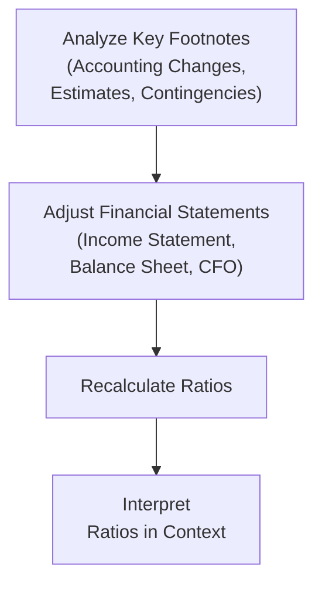

Footnotes are sometimes overlooked in a fast-paced exam environment, but trust me—over the years I’ve learned that those tiny paragraphs at the back of a financial statement often contain the biggest revelations. You know, the first time I took a serious look at footnotes was when I stumbled upon a half-hidden reference to a pending lawsuit in a large shipping company’s annual report. At the time, I remember thinking, “Well, that can’t be important.” Spoiler alert: the lawsuit ended up costing them millions, so it was definitely pretty important. 

Anyway, in this section, we’ll dig into how to interpret footnotes accurately and incorporate the insights into real-time ratio analysis. Whether you’re tackling an exam vignette or evaluating a real-world company, the practice is the same: read carefully, adjust as needed, and don’t be afraid to recast reported figures in a way that makes sense. Let’s explore approaches for deciphering footnotes, bridging IFRS and US GAAP differences, and fine-tuning important ratios.

## Footnotes: The Quiet Shapers of Financial Reality
Footnotes offer clarifications or expansions on the raw numbers presented in the primary financial statements. If you only focus on line items like revenue, PPE, and net income, you might miss:
• Significant accounting policy changes (e.g., a shift from LIFO to FIFO under US GAAP or IFRS switchovers).  
• Revised estimates or assumptions (like a new pension discount rate).  
• One-time events or extraordinary items.  
• Contingent liabilities that, if realized, could drastically alter a firm’s financial health.  
• Subsequent events that change how we view a firm’s forward outlook.

In a Level II FSA exam vignette, you’ll often see footnotes describing a new revenue recognition standard or a post-balance-sheet business combination. The question might require you to adjust the ratio calculations or monetary values based on that info. It’s not always spelled out. Sometimes you need to piece it together.

## Key Disclosures and How They Affect Ratios
Let’s jump into a few common footnote items and the potential ramifications for ratio analysis:

### Accounting Policy Changes
A company might switch its inventory method or alter its depreciation approach. Under US GAAP, a switch from LIFO to FIFO (if legally allowable) can cause:
• Lower reported Cost of Goods Sold (COGS) in times of rising prices.  
• Higher net income in the short run.  
• Changes in inventory asset values.  
• A potentially higher current ratio.  

In an exam scenario, you might be given both old and new inventory valuation data. You can’t just blindly use net income or the balance sheet figures. Instead, recast your ratio to reflect consistent methodology. That’s especially important for multi-year ratio comparisons.

### Estimates and Judgments
Footnotes reveal models and assumptions used in valuations—like the discount rate for pension obligations, salvage values for manufacturing equipment, or intangible asset impairment triggers. If management lowers the pension discount rate, the present value of pension liabilities typically goes up, which can increase total liabilities and lower equity. This directly impacts ratios such as:
• Debt-to-Equity or Leverage Ratios  
• Return on Equity (since equity might be lower)  
• Coverage Ratios (EBIT/Interest coverage could be affected by changed pension expense)

When you see a footnote describing a new discount rate or a refined assumption about salvage values, you might have to recalculate how that affects the ratio if the exam question specifically flags it. Keep an “adjustment schedule” so you can systematically track these changes.

### Contingent Liabilities
Footnotes might indicate lawsuits, product warranties, or environmental obligations. Depending on the likelihood and magnitude, these items could transform your ratio perspective in two ways:
• If probable and estimable, they are recorded as a liability and an expense.  
• If only reasonably possible, they’re disclosed but not necessarily recognized in the financial statements.  

In a test scenario, watch for wording in the footnotes: “probable” vs. “possible” vs. “remote.” This will determine how the item is recognized. If you suspect the ratio question is hinting at this liability being realized, consider its effect on net income and the balance sheet.

### Subsequent Events
Think about major acquisitions, issuance of additional debt or equity, or catastrophic events happening right after the reporting period. They can alter the capital structure or the operational outlook. If footnotes mention a large acquisition priced significantly above net asset value, goodwill spikes on the consolidated balance sheet. This can:
• Increase total assets and intangible assets.  
• Alter Return on Assets (ROA) or Return on Invested Capital (ROIC).  

If you’re analyzing in real time, consider whether it’s just a disclosure or if the exam requires you to integrate the post-balance-sheet shift into your ratio. Sometimes, you might have to recast the statements as if the event happened before the year-end date.

## IFRS vs. US GAAP: Footnote Variations
Here’s a snippet of how footnote disclosures might differ under IFRS and US GAAP, influencing your ratio interpretation:

• Interest and Dividends in Cash Flow Statements:  
  – IFRS allows more flexibility. Companies may classify interest and dividends received in either operating or investing.  
  – US GAAP usually classifies interest received in operating, dividends received in operating, and dividends paid in financing.  

If you spot footnotes clarifying that a company using IFRS puts interest income in Investing instead of Operating, that changes CFO. And, well, changes in CFO inevitably affect ratios like Operating Cash Flow to Total Debt or interest coverage based on operating cash flow.

• Revenue Recognition Timing:  
  – IFRS uses a principles-based approach, often requiring more detailed qualitative footnotes about performance obligations.  
  – US GAAP is rules-based, requiring more specific guidance as to timing, separate performance obligations, etc.  

So you might see footnotes describing partial revenue recognition on a long-term contract under IFRS that differs from how a US GAAP-based company approaches it. Adjust your revenue-based metrics accordingly if the exam question calls for an “apples-to-apples” comparison.

## Practical Flow: From Footnote to Ratio Adjustment
Below is a simple flowchart illustrating how you might process footnotes in a real-time exam setting, from reading them to recalculating your ratios:

As you can see, you typically start with reading the footnotes carefully, then adjust the base statements if needed (e.g., recomputing liabilities, removing one-time items, normalizing revenue), and finally recalculate your target ratios. After that, interpret them in the context given by the vignette.

## Watching for Partial Data
One challenge in the exam is when the footnotes hint at an accounting change or an event, but you only have partial data. Let’s say the footnotes mention a shift in the pension discount rate, but they don’t give the exact new pension expense. The exam might expect you to make a rough approximation or find a clue in the financial statements. Keep your eyes peeled for:
• Changes in pension contributions or service cost.  
• A mention that the effect of the change is an extra $X million recognized in other comprehensive income (or net income).  
• The mention of a reclassification from OCI to net income.  

When data is incomplete, approach the problem with a structured guess, referencing all available numbers. For instance, if the footnote says the difference in discount rate increased pension liabilities by 5%, and you see total pension liabilities of $200 million, you could recast that as $210 million. Then go back and see how that shifts your Debt-to-Equity ratio.

## One-Time Items and Adjusted Ratios
Sometimes, large settlement costs or windfall gains from an asset sale pop up in the footnotes. The company might still record them in “Other Income (Expense).” If you want your ratio to reflect a more “persistent” measure of performance, you might recast net income by removing that item. For instance, if the footnotes reveal:
• A $10 million legal settlement recognized in net income of $50 million.  

You might compute an adjusted net income of $60 million for calculating Return on Equity or Margin-based ratios. This is especially relevant in an exam question that specifically asks for an “underlying performance” or “ongoing operating performance.”

## Best Practice: Keep an Adjustment Schedule
A simple tactic—both on the exam and in real practice—is to maintain a small table of adjustments for each footnote item. Label them as changes to net income, total assets, total liabilities, CFO, or other relevant line items. Then recalculate the ratios with those adjusted totals. This approach keeps you organized even under time pressure.

## Example: Quick Scenario
Imagine a Level II exam vignette presents:
• A footnote revealing a new depreciation policy, switching from straight-line to an accelerated method, increasing annual depreciation by $5 million.  
• Another footnote about the company settling a lawsuit for $15 million, already included in net income.  
• IFRS-based statements that classify dividends received as Investing.  

The question might ask you for the company’s Return on Equity and Operating Cash Flow-to-Debt ratio. You’d want to:
1. Recast net income to remove or separate the effect of the one-time lawsuit if the question hints at analyzing “core” earnings.  
2. Understand that accelerated depreciation lowers net income and your asset values more quickly.  
3. Remember that if dividends received are in Investing, the CFO figure under IFRS might need reclassification if you want it to resemble a US GAAP-based measure.  

Once you’ve processed these adjustments, you compute the ratio. The exam might provide multiple-choice answers that reflect different treatments—so stay alert to the footnotes’ ramifications.

## Tips for Exam Success
• Read the footnote references in chronological order. Don’t skip them until after you do the calculation.  
• Watch for subtle language changes (e.g., “probable” vs. “possible” in litigation, “expected to continue” vs. “one-time” in extraordinary charges).  
• Don’t forget the statement of cash flows footnotes—especially IFRS vs. US GAAP differences.  
• Keep a small grid: original figures, footnote adjustments, final “normalized” or “adjusted” figure.  
• If uncertain, see if the question specifically asks for “adjusted” or “baseline.” Some item-set questions target your ability to discriminate between the two.

## Further Reading
• “Forensic Accounting and Fraud Examination” by William S. Hopwood.  
• “Financial Shenanigans” by Howard Schilit.  
• IFRS Foundation website for updates on IFRS disclosure requirements (www.ifrs.org).  
• FASB website for US GAAP clarifications (www.fasb.org).  

Use these resources for a deeper dive into footnote manipulations, red flags, and best accounting disclosure practices.  

---

## Test Your Knowledge: Footnotes and Ratio Adjustments



### When a firm shifts from LIFO to FIFO (under US GAAP) during inflationary periods, which of the following impacts is most likely?
- [ ] Lower ending inventory.
- [x] Higher ending inventory.
- [ ] Lower net income.
- [ ] Higher cost of goods sold.

> **Explanation:** Under inflationary conditions, FIFO reports higher ending inventory because the recently acquired (more expensive) items remain in ending inventory. This also typically increases net income by reducing COGS.

### A footnote states that the company settled a significant lawsuit during the reporting period, recognized in net income. In calculating an adjusted Return on Equity that focuses on core operations, how should you handle the settlement?
- [x] Add back the settlement amount to net income.
- [ ] Subtract the settlement amount from equity.
- [ ] Difference in discount rate has no effect on net income.
- [ ] Reclassify the settlement expense from operating to financing.

> **Explanation:** A large, one-time settlement can distort recurring earnings. For “core” profitability analysis, analysts often add it back to net income to get a normalized figure.

### If an IFRS-reporting entity classifies interest received in Investing Activities, while a US GAAP-reporting entity classifies it in Operating Activities, which ratio is directly affected for cross-company comparisons?
- [x] Operating Cash Flow (CFO)-based ratios.
- [ ] Debt-to-Equity.
- [ ] Price-to-Earnings.
- [ ] Asset Turnover.

> **Explanation:** The classification difference affects CFO. Any ratio that uses CFO in the numerator or denominator (like CFO-to-Debt or CFO-Coverage) would be impacted if interest is reported differently.

### A footnote reveals a new pension discount rate that is significantly lower than the prior year, but no direct recalculation is provided. Which of these steps is most appropriate when adjusting your leverage ratio?
- [x] Increase pension liabilities to reflect the lower discount rate.
- [ ] Decrease pension liabilities to reflect higher net income.
- [ ] Increase CFO by the difference in discount rate.
- [ ] Reduce net income by the difference in discount rate.

> **Explanation:** A lower discount rate generally increases the present value of pension obligations, raising total liabilities and thus leverage.

### A firm under IFRS guidelines has earnings of $80 million (including a gain of $10 million from selling a division). If the question requires core earnings for ratio calculations, what is the appropriate figure to use for net income?
- [ ] $70 million.
- [ ] $80 million.
- [ ] $90 million.
- [x] $70 million, removing the one-time gain.

> **Explanation:** Removing the one-time gain yields $70 million in “core” earnings, which provides a better base for evaluating ongoing profitability.

### The footnotes mention a change in depreciation method from straight-line to accelerated, increasing annual depreciation by $4 million. If no other data is given, how should an analyst handle net income for ratio calculations?
- [x] Consider the lower net income, but note the method change may not reflect a permanent cost increase.
- [ ] Add the $4 million back to net income to normalize.
- [ ] Classify the $4 million as a contingent liability.
- [ ] Allocate the $4 million to operating cash flow.

> **Explanation:** An accelerated method increases yearly depreciation, thus reducing reported net income. It may or may not be reversed for adjusted calculations, but the question states no other data is given to assume a change is non-recurring. The correct approach is to accept the reduced net income but remain aware that comparability with prior periods may be compromised.

### Footnotes for a manufacturing company show a $5 million environmental cleanup liability classified as “possible” but not “probable.” What is the typical impact on the balance sheet?
- [x] It is disclosed but not recognized as a liability on the balance sheet.
- [ ] It is fully recognized as a liability and reduces net income.
- [x] Proper classification includes expensing the full $5 million in the next fiscal period.
- [ ] It must be recognized in other comprehensive income (OCI).

> **Explanation:** A “possible” but not “probable” liability is typically disclosed only. No full recognition as a liability is required unless it’s deemed probable and estimable.

### A note states that dividends received are classified under Investing Activities for an IFRS-preparer. How could an analyst adjust for comparability to a US GAAP-preparer’s cash flow statement?
- [x] Reclassify dividends received from Investing Activities to Operating Activities.
- [ ] Recognize dividends received as part of financing activities.
- [ ] Deduct the amount from net income.
- [ ] Combine dividends received with interest paid.

> **Explanation:** Under US GAAP, dividends received normally go into CFO, whereas IFRS allows them to be in CFO or CFI. To compare directly, reclassify them to Operating if you want to align with typical US GAAP practice.

### The footnotes mention a significant foreign exchange gain recorded in the income statement due to currency translation. Which ratio might most likely be distorted if you do not adjust for this gain?
- [x] Net Profit Margin.
- [ ] Debt-to-Capital.
- [ ] Current Ratio.
- [ ] Inventory Turnover.

> **Explanation:** FX gains typically boost net income. When analyzing core operational profitability, Net Profit Margin can be skewed if the gain is large and non-recurring.

### For a contingent liability to be recognized on the balance sheet under IFRS and US GAAP, it must be:
- [x] Probable and reasonably estimable.
- [ ] Remote, but potentially material.
- [ ] Neither likely nor estimable.
- [ ] Recognized only in equity.

> **Explanation:** Both IFRS and US GAAP generally require that a contingent liability be probable and measurable for recognition. Otherwise, it remains disclosed in the footnotes, not on the balance sheet.


