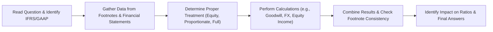

## Overview  

This section provides a deep dive into the last step of the mock vignette walkthrough. We’ll combine everything we’ve discussed—consolidation nuances, pensions, translations, and more—into a detailed solution methodology. Think of it like pulling all your puzzle pieces together to see the bigger picture.  

We’ll walk through each phase—from reading the question carefully to cross-verifying your final answers with alternative computations. Along the way, we’ll highlight best practices and cautionary tales (some from personal experience).  

Our aim is to help you:  
• Translate the complexities of IFRS and US GAAP into actionable steps.  
• Show how you should methodically combine data from footnotes and financial statements.  
• Provide a structure for identifying key adjustments (e.g., partial-year acquisitions, changes in accounting estimates, or foreign exchange swings).  

By the end, you’ll have a framework that you can replicate for any tricky exam vignette or real-world situation.  

## Step-by-Step Solution Methodology  

### Reading the Question Carefully  
So, you’ve got a multi-paragraph vignette with footnotes, numbers all over the place, and some references to IFRS or US GAAP differences. The very first step? A slow, thoughtful read.  

• Pay attention to exactly what the question wants. For example, is it about which consolidation method to use (e.g., equity, proportionate, or full consolidation)?  
• Underline or list the relevant data: This might be the date of an acquisition, an associate’s net income, or the currency exchange rates for a specific period.  

Back when I first studied for the exam, I’d get excited and jump straight to the numbers. That can be a big mistake. If you misread whether the question is about “transactional” vs. “translational” FX exposures, you could end up calculating something that’s correct arithmetically but irrelevant in context.  

### Revisiting Relevant Data  
After clarifying the question, revisit the vignette’s details and footnotes:  

• Check footnotes for disclaimers about partial-year acquisitions. If a company gained control on July 1, you only consolidate from July onward.  
• Look for differences in classification under IFRS vs. US GAAP. For instance, IFRS might classify certain development costs in intangible assets, whereas US GAAP might expense them outright.  
• Look for changes in accounting estimates or policies mid-year. Maybe the discount rate for pension calculations changed in Q3.  

A quick tip: visualize this step. You might draw a grid or table to align footnote data with main statements.  

For example:  

| Item                    | Income Statement | Footnote Disclosure | Adjustments Required? |
|-------------------------|------------------|---------------------|-----------------------|
| Associate Net Income    | $400,000        | 35% Ownership       | Equity method only    |
| Goodwill (Impairment?) | Not shown       | $50,000 impairment  | IFRS level-based test |
| FX Rate (Avg)          | 1.2 (avg)       | 1.3 (end)           | Translational method? |

This kind of layout helps ensure you don’t forget crucial details.  

### Applying the Correct Standard  
Now, interpret the scenario using the correct accounting treatment. This is where IFRS vs. US GAAP can get a bit, well, tricky. Let’s zero in on a few typical differences:  

• Business Combinations: IFRS uses a single-step approach for goodwill impairment, while US GAAP uses a two-step approach (though slightly simplified in recent updates).  
• R&D Classification: IFRS might allow capitalization of development costs once technical and economic feasibility are established, while US GAAP generally expenses R&D in the period incurred (with some exceptions).  
• Proportionate Consolidation: Under IFRS, certain joint ventures can use proportionate consolidation—but not under US GAAP (which typically uses the equity method for joint ventures).  

It’s essential to note the question’s specific references. If the vignette explicitly says, “The company prepares its financial statements under IFRS,” that changes your approach to intangible asset impairment. If it states the entity is a US GAAP filer, that might alter the classification of G&A vs. R&D.  

### Showing Your Work  
I can’t stress enough: in both the real-world and exam setting, show your steps. Not only does this help you stay organized, but it also helps you catch errors early.  

#### Example: Equity Method Calculation  
If we own 35% of a company that records net income of $400,000, we do:  
Equity Method Income = 35% × $400,000 = $140,000  

After finding that figure, tie it back to the final question. Are we asked for the consolidated net income? If so, you’ll add this $140,000 to the parent’s net income line—assuming no other adjustments are needed.  

#### Example: Foreign Currency Translation  
Under the current rate method, you typically translate assets and liabilities at the closing rate and equity at the historical rate. Income statement items use an average rate. The difference goes into the cumulative translation adjustment (CTA) in equity.  

If the question is about a gain or loss from translation, you might do something like:  
CTA = Net Asset Exposure × (Ending Rate – Beginning Rate).  

Say Net Asset Exposure is €100,000, and the euro appreciated from 1.20 USD/EUR to 1.25 USD/EUR during the year:  
CTA = €100,000 × (1.25 – 1.20) = €100,000 × 0.05 = $5,000 gain  

Be sure that your sign convention (gain vs. loss) lines up with the question’s prompt.  

### Interpreting the Result  
After you have your numerical answer, interpret it. If the question is about how an acquisition or goodwill impairment affects net income, clarify if net income will decrease (because of the impairment) and how that might reduce the equity figure.  

Also, consider key ratios. If net income is lower, your return on equity (ROE) might be lower, or your debt-to-equity might remain unchanged (if the impairment doesn’t affect liabilities).  

Remember to be consistent with the footnotes. If there’s a mention that a portion of the intangible values are indefinite-lived, under IFRS, you’d test for impairment annually. Under US GAAP, indefinite intangibles (like certain brand names) skip the amortization step but still require annual impairment testing.  

### Cross-Verify with Alternative Computations  
Cross-checking is a life-saver. For instance, if the footnotes mention a partial disposal of a subsidiary, ensure you updated the ownership percentage properly. If your ownership decreased from 80% to 70% mid-year, your consolidation share might shift.  

Or if the company changes from the cost method to the equity method because it gained significant influence at some point in the year, you might have to re-measure the previously held interest at fair value.  

If the vignette references multiple ways to measure intangible assets—like brand valuation vs. a discounted cash flow approach—confirm that you used the method the question specifically calls for. If it doesn’t specify, assume IFRS standard guidance or the local GAAP treatment (depending on the scenario).  

## Best Practices and Additional Considerations  

### Double-Checking for Inconsistencies  
Sometimes, footnotes accidentally contradict the main financial statements. Or the question might deliberately test your alertness. For instance:  
• The statements say, “Long-term debt maturity is 10 years,” but the footnotes might mention a partial early redemption scheduled next year.  
• The statement of cash flows might show an inflow from financing activities that the footnotes classify as an operating lease liability.  

Take a second look if something doesn’t align.  

### Explaining Adjusted vs. Reported Figures  
If you decide to remove non-recurring items, let’s say a big litigation settlement, you must label your result as “Adjusted Net Income” clearly. The question might want the reported figure (the official GAAP/IFRS line item) or an adjusted figure.  

When these differ significantly, always highlight why. The examiner or your CFO (in real life) will want to see that explanation.  

### Sensitivity Analysis and Alternate Assumptions  
Sometimes, the question might hint at different discount rates or periods for intangible asset valuations. For instance, “Had the discount rate been 10% instead of 9%, the goodwill impairment would have been $X.” This is a clue that the question might ask about how changing an assumption affects the outcome.  

### Real-World Anecdote  
I once saw a company attempt to amortize goodwill because they interpreted a local GAAP rule incorrectly. They expensed it in a single year, which drastically reduced reported net income. Eventually, the CFO recognized the error—IFRS rules required annual impairment testing instead. The difference in reported net income was massive, illustrating how important it is to get these details right.  

## Diagram: Consolidation Steps and Key Choices  



In this simple flowchart, each node represents a critical step you must tackle to reach a correct, consistent answer in an exam or real-world scenario.  

## A Quick Python Example  

Sometimes, you might want to quickly test a calculation or see how adjusting parameters affects your final number. Here’s a toy snippet:

```python

def equity_method_income(ownership_percent, associate_net_income):
    return ownership_percent * associate_net_income

company_net_income = 400000  # The associate's net income
ownership_ratio = 0.35
income_from_associate = equity_method_income(ownership_ratio, company_net_income)

print(f"Equity Method Income: ${income_from_associate:,.2f}")
```

This might be overkill for an exam environment, but for real-world tasks, it’s often handy to have these quick scripts for validating your logic (especially if you’re dealing with multiple scenarios or partial-year adjustments).  

## Glossary of Key Terms  

• Associate’s Net Income: The income from an investee in which an investor has significant influence, accounted for under the equity method. Typically, the investor reports its pro-rata share of the associate’s net income.  

• Partial-Year Adjustment: Calculations that account for a change in ownership or control partway through the year. You only recognize revenues, expenses, or share of income from the date of acquisition onward, or until the date of disposal.  

• Translational vs. Transactional FX Gains/Losses:  
  – Translational: Gains or losses from converting the financial statements of a foreign subsidiary into the parent’s reporting currency.  
  – Transactional: Gains or losses resulting from a specific transaction denominated in a foreign currency (e.g., you buy inventory in euros but pay in dollars).  

• Impairment Charge: A reduction in the carrying amount of an asset, such as goodwill or intangible assets, when its recoverable amount falls below its book value. Under IFRS, goodwill is tested at the cash-generating unit (CGU) level; under US GAAP, it’s tested at the reporting unit level.  

• Normalizing Adjustments: Adjustments made to financial statements to remove the effects of non-recurring, one-time, or unusual items, providing a clearer view of sustainable performance.  

## Summing it Up  
In short, thorough reading, careful classification (especially IFRS vs. US GAAP nuances), and consistent calculations are essential. Don’t rush: re-check footnotes, confirm partial-year impacts, and consider the effect on final numbers and ratios. That’s your path to exam success—plus, these are precisely the steps you’d take if you were analyzing a real company.  

## References and Further Reading  
• CFA Level II Curriculum (Financial Statement Analysis Readings). Particularly, the official practice item sets that mirror real exam formatting.  
• Corporate Finance and Valuation by Fred Weston and Thomas Copeland for linking numerical solutions to broader valuation framework.  
• IFRS 3 “Business Combinations” (https://www.ifrs.org/issued-standards/list-of-standards/ifrs-3-business-combinations/) for goodwill recognition and impairment testing detail.  
• Past experiences, real-world annual reports, and official GAAP/IFRS guidelines.  

CFA Institute does not endorse, promote, or warrant the accuracy or quality of the products or services offered by any preparatory content providers. CFA® and Chartered Financial Analyst® are trademarks owned by CFA Institute.  

## Practice Questions: Detailed Solutions & Explanation



### 1. When calculating equity method income, which of the following steps should be your primary focus?

- [ ] Subtract non-controlling interest from consolidated net income.
- [ ] Consolidate 100% of the associate’s revenues and expenses.
- [x] Multiply the investee’s net income by the ownership percentage.
- [ ] Exclude the investee’s net income entirely from the parent’s income statement.

> **Explanation:** Under the equity method, you recognize your share of the associate’s net income at the ownership percentage. You do not fully consolidate their revenues and expenses unless you have control.  

### 2. Which best describes a partial-year adjustment for an acquisition made on July 1?

- [ ] Recognize the associate’s income from the beginning of the year.
- [x] Include the associate’s income only for the acquisition date forward.
- [ ] Differ all recognition until the next fiscal year.
- [ ] Allocate the entire year’s income but with a pro-rata discount factor.

> **Explanation:** Partial-year adjustments reflect the investee’s contributions only from the date you gain significant influence or control. If acquired mid-year, only half the year’s results are included.  

### 3. Under IFRS, which statement about goodwill impairment testing is most accurate?

- [ ] It’s done at the legal entity level.
- [ ] It’s prohibited unless triggered by an external event.
- [x] It’s performed at the cash-generating unit (CGU) level.
- [ ] It’s calculated after intangible assets with finite lives are fully amortized.

> **Explanation:** IFRS requires goodwill impairment testing at the CGU level at least annually, or whenever there’s an indication of impairment.  

### 4. Suppose a company’s net asset exposure in a foreign subsidiary is €500,000. The exchange rate at the beginning of the period was 1.10 USD/EUR, and at the end, it was 1.15 USD/EUR. Under the current rate method, what is the cumulative translation adjustment?

- [ ] A €0.05 loss per euro, totaling €25,000.
- [x] A $25,000 gain for the parent.
- [ ] A $5,000 gain for the parent.
- [ ] A $500,000 negative adjustment in retained earnings.

> **Explanation:** CTA = €500,000 × (1.15 – 1.10) = €500,000 × 0.05 = $25,000 gain.  

### 5. If a company classifies an expenditure as R&D under US GAAP but it would be capitalized under IFRS, which is the most likely effect on net income under US GAAP?

- [x] Lower net income, because R&D is generally expensed.
- [ ] Higher net income, because intangible assets increase.
- [ ] No impact, because R&D is never inventoried.
- [ ] Higher net income, because intangible asset amortization is deferred.

> **Explanation:** US GAAP typically requires immediate expensing of R&D, lowering net income. IFRS may allow capitalization of development costs once certain criteria are met, delaying the expense.  

### 6. Company A has a 70% stake in Company B. Under full consolidation, which amount best describes how Company A records Company B’s results on its financial statements?

- [ ] Company A recognizes only 70% of B’s revenues and expenses.
- [x] Company A consolidates 100% of B’s revenues and expenses, then reports a non-controlling interest.
- [ ] Company A recognizes only dividends received from B.
- [ ] Company A excludes B’s assets and liabilities but shows an equity investment.

> **Explanation:** Full consolidation means 100% of the subsidiary’s accounts are included, and a separate line for non-controlling interest shows the portion not owned by the parent.  

### 7. Which of the following best characterizes normalizing adjustments?

- [ ] Adjustments performed only after an M&A transaction closes.
- [x] Removal of non-recurring, one-time, or unusual items to reflect sustainable performance.
- [ ] Changing reported figures to align with IFRS after initially using US GAAP.
- [ ] Reclassifying interest expense from operating to financing activities.

> **Explanation:** Normalizing adjustments aim to show a firm’s ongoing, recurring performance by removing one-off events.  

### 8. A company’s footnotes reference that R&D expenditures were capitalized as intangible under IFRS. If you were adjusting for US GAAP, which approach is most likely?

- [x] Reclassify the capitalized costs as an operating expense, reducing net income.
- [ ] Continue to capitalize, but change the amortization period.
- [ ] Remove them from the balance sheet entirely, creating an equity reduction.
- [ ] Classify expenditure as a non-operating item in the income statement.

> **Explanation:** Under US GAAP, R&D is generally expensed. You’d thus remove the capitalized intangible assets linked to R&D and reflect it as an expense, lowering net income.  

### 9. During an impairment test, if the recoverable amount of a cash-generating unit is $200,000, while the carrying amount of its associated assets is $225,000, how much is the impairment charge (under IFRS)?

- [x] $25,000
- [ ] $200,000
- [ ] $225,000
- [ ] $425,000

> **Explanation:** IFRS impairment charge = carrying amount – recoverable amount = $225,000 – $200,000 = $25,000.  

### 10. True or False: Under the equity method, an investor’s ownership in an associate’s net assets is recognized as a line-by-line consolidation on the balance sheet.

- [ ] False
- [x] True

> **Explanation:** Actually, this is a bit tricky. Strictly speaking, under the equity method, you present the single-line item “Investment in Associate,” not a line-by-line consolidation of the associate’s assets and liabilities. However, you do reflect the pro-rata share of net income in your income statement. So the statement is false if interpreted literally. The correct approach is a single “Investment in Associate” line on the balance sheet, not line-by-line.  


