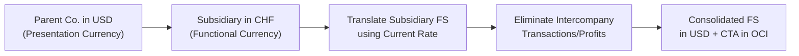

## Overview  
Sometimes, when you’re consolidating financial statements for a group that spans multiple countries, you can wind up with a bit of a headache—especially if each entity has a different reporting framework or currency. Add a partial disposal or a step acquisition in there, and the puzzle pieces get even more complicated. In this section, we’ll walk through the big issues that arise when combining complex ownership structures and foreign exchange (FX) components in consolidated statements. We’ll look at how IFRS (particularly IFRS 10 on Consolidated Financial Statements) and US GAAP (ASC 810) approach these issues, and we’ll highlight a few ways to keep your sanity in check when eliminating intercompany transactions or adjusting for currency translation gains and losses.

We’ll also look at how to determine each subsidiary’s functional currency, which method—current rate or temporal—to use for financial statement translation, and how intercompany balances affect the consolidated group’s numbers in the parent’s presentation currency. By the end, you’ll be able to identify which approach is best (equity method vs. full consolidation vs. proportional consolidation) and to recognize how partial disposals, step acquisitions, and foreign-currency-denominated debt can all move the needle on your reported results.

## Distinguishing Ownership Structures and Control  
One of the questions that always comes up is, “Do we fully consolidate this entity or do we simply pick up the equity method?” So, let’s nail that down first. The rules under IFRS 10 and ASC 810 hinge on who effectively controls the investee:

• Full Consolidation (Control): If a parent has more than 50% voting interest (or de facto control through arrangements or variable interest structures), typically you’re in the full consolidation zone. All of the subsidiary’s assets, liabilities, revenues, and expenses get reported on the parent’s consolidated financial statements.  
• Equity Method (Significant Influence): If you own between 20% and 50% or otherwise have significant influence (for instance, a seat on the board or a major say in policy decisions), you usually apply the equity method. So the investor’s share of the investee’s profits is recognized in one line on the P&L, and the investee’s net assets get reflected in a single “Investment in Affiliate” line on the balance sheet.  
• Proportional/Joint Control: Joint ventures or certain joint operations might be consolidated proportionally or might still apply the equity method, depending on the specifics of the standards and the nature of the arrangement. IFRS often drives practitioners toward the equity method for joint ventures, whereas certain niche cases might continue to use proportionate consolidation.  
• Partial Control or Changes in Ownership Over Time: The complexity arises when you start with an equity-method investment, then pick up additional shares. Or maybe you own 60% today, but next year you sell a slice to someone else—still retaining a small majority. Each scenario can trigger remeasurements and changes in how you account for the subsidiary.  

### Step Acquisition  
If you acquire interest in stages—say you bought 30% in 2021, then in 2023 you bought another 25%—you may move from significant influence to full control. IFRS 3 (Business Combinations) and ASC 805 (Business Combinations) typically require a remeasurement of previously held equity interests to fair value on the date that control is obtained. This remeasurement means recognizing a gain or loss in the income statement. It’s kind of like telling us: “Well, if you now control the entire thing, let’s treat your original holdings as if they were sold and reacquired at fair value.”  

### Partial Disposal  
Similarly, if you reduce ownership but still maintain control—for instance, you go from 70% to 55%—it’s treated as an equity transaction with no income impact from losing control (unless, of course, you drop below control thresholds, at which point you might have to deconsolidate). Under IFRS and US GAAP, partial disposals can get tricky because you might remeasure your remaining interest if you lose control entirely, but if you just reduce your stake but keep control, the difference often flows through equity.  

## Intercompany Transactions and Eliminations  
After determining who consolidates, the next step is to handle intercompany transactions. You might be thinking: “Hey, the group is one economic entity—why should we show transactions between ourselves?” Exactly. When presenting consolidated financials, intercompany sales and purchases, intercompany loans, or dividends within the group must be eliminated.  

### Unrealized Profits and Transfer Pricing  
Let’s say Company A (the parent) sells inventory to Company B (the subsidiary) at a markup. If Company B hasn’t sold that inventory to an external customer by the year-end, that unrealized profit is still sitting in the group’s inventory. Under consolidation, you must eliminate that intragroup profit, because from the standpoint of the consolidated entity, no “real” sale occurred to an external party.  

A similar story plays out with fixed assets. If the subsidiary sells equipment to the parent at a markup, you need to eliminate those gains and restore the asset to its historical cost at the consolidated level (adjusted for any depreciation that would have been recognized had the transaction not occurred).  

The logic behind these requirements is to prevent income overstatement or distortion of the financial position. Transfer pricing might also come into play, especially in cross-border transactions, so watch for artificially inflated or deflated prices that could skew reported results.  

## Foreign Currency Translation Methods  
Now, let’s layer in the foreign exchange complexities. If you have foreign subsidiaries, each one might have a functional currency that differs from the parent’s presentation currency. The key is to figure out whether the foreign operation’s functional currency is basically local (i.e., they operate autonomously in their local environment) or it’s the same as the parent’s currency (or some other major currency).

### Functional Currency Determination  
IFRS and US GAAP share broadly similar guidelines for picking a functional currency: look at the cash flows, sales market, financing structure, and expenses. If the subsidiary is integrated with the parent’s operations, the parent’s currency might be the functional currency. If the subsidiary is fairly independent with local customers and local expenses, the local currency is probably the functional currency.  

### Current Rate Method  
If the subsidiary’s functional currency is its local currency, the current rate method typically kicks in (IFRS refers to it as a “translation” method). Under the current rate method:

• Assets and Liabilities: Translated at the current exchange rate (spot rate) on the balance sheet date.  
• Income Statement Items: Translated at average rates for the period.  
• Equity Items (except retained earnings): Translated at historical rates when shares were issued or the transaction originally occurred.  
• Unrealized FX Gains/Losses: Recognized through a separate component of equity known as the cumulative translation adjustment (CTA).  

### Temporal Method  
If the subsidiary’s functional currency is not its local currency—say it uses the parent’s currency or another currency—then IFRS/US GAAP require the temporal method. Here:  

• Monetary Assets and Liabilities: Translated at the current/DC rate (spot rate) on the balance sheet date, because they fluctuate with exchange rate changes (e.g., cash, receivables, payables).  
• Nonmonetary Items: Carried at historical rates, because their values are recorded as of the transaction date in the parent’s currency.  
• Income Statement Items: Typically use an average rate, but depreciation/amortization is measured using the historical rate that applied to the underlying asset.  
• FX Gains/Losses: Go straight to the income statement. In other words, your net income can get more volatile under the temporal method than under the current rate method.  

### Cumulative Translation Adjustment (CTA)  
Under the current rate method, the difference between the translated assets and liabilities plus equity flows to an equity account commonly called the CTA (Cumulative Translation Adjustment). IFRS and US GAAP both allow it to sit in OCI (Other Comprehensive Income) until you dispose of the foreign entity. At that point, you “recycle” the CTA into net income (under IFRS) or you might handle it similarly under US GAAP.  

## Combining Consolidation with FX  
Let’s see how it all ties together in a typical scenario. Suppose you own 70% of a Swiss subsidiary whose functional currency is the Swiss franc (CHF), and your presentation currency is USD. Under IFRS 10 or ASC 810, you must fully consolidate the subsidiary because you have control (70% > 50%). You’d translate the subsidiary’s financial statements into USD using the current rate method, and the CTA would be recognized in OCI as part of equity.

But maybe that same Swiss subsidiary sells inventory to your US parent, which hasn’t sold it by year-end. You’ll still have to eliminate that intragroup sale, which gets a bit messy because you have an FX component in the original transaction. The profit elimination is performed based on the exchange rate at the transaction date, and any subsequent changes in the exchange rate might create additional translation differences.  

Below is a simplified diagram illustrating a high-level flow for handling a multinational consolidation under the current rate method:

## Step Acquisition and FX Nuances  
Step acquisitions can complicate matters further, especially if your ownership crosses a threshold during the year. You might end up with two different sets of translation calculations:  
1. As an equity-method investment for part of the year.  
2. As a consolidated subsidiary for the remainder of the year.  

At the point of obtaining control, you remeasure your prior stake to fair value, which can create a recognized gain or loss in your net income. Post-acquisition, you start translating the entire subsidiary’s financials under the current rate or temporal method—depending on that subsidiary’s functional currency—and you book a CTA for subsequent exchange differences.  

## Partial Disposal and FX  
On the flipside, if you partially dispose of your stake but remain in control, you usually don’t remeasure to fair value. Instead, the difference between the sale proceeds and the carrying amount of the portion of the investment sold is recognized in equity. You keep consolidating the entire subsidiary (albeit now with a higher or lower noncontrolling interest). However, if you lose control or if it transitions from a consolidated subsidiary back down to an equity-method investment, then you do remeasure your residual interest at fair value.  

### CTA Reclassification  
One tricky point is how to handle the CTA. If you lose control entirely, IFRS states that you reclassify the entire CTA balance to profit or loss. Under US GAAP, the reclassification follows a similar principle, but the details can vary slightly depending on the nature of the disposal (e.g., a sale of shares vs. a sale of net assets).  

## Foreign-Currency-Denominated Debt and Hedging  
Sometimes, the subsidiary (or the parent) issues debt denominated in a currency other than its functional currency. If the subsidiary’s functional currency is CHF but it issued USD bonds, fluctuations in the USD/CHF rate can result in realized or unrealized FX gains or losses in the subsidiary’s income statement. Once you consolidate, you’ll see those gains or losses flow into the parent’s results in some form.  

The group might also use hedging strategies—like forward contracts or cross-currency interest rate swaps—to manage this exposure. For exam purposes, remember that hedge accounting can get complicated. IFRS 9 (Financial Instruments) and ASC 815 (Derivatives and Hedging) have specific requirements for hedge designation, effectiveness testing, and how to report derivatives in OCI vs. net income.  

## Disclosures and Transparency  
Given the complexities, IFRS (especially IFRS 12 for disclosures) and US GAAP (ASC 830 for foreign currency matters, ASC 815 for hedging, ASC 810 for consolidation, etc.) demand extensive footnote disclosures. Analysts should look for these disclosures to understand how management is dealing with partial disposals, step acquisitions, hedging strategies, or large CTA balances.  

## Common Pitfalls and Best Practices  
• Forgetting to Eliminate Intercompany Transactions: Probably the biggest error is to omit the complete elimination of intercompany revenues, expenses, gains, or losses, resulting in overstated group performance.  
• Incorrect CTA Calculations: Missing the boat on the translation method or mixing rates incorrectly. This leads to “mystery” plugs in your consolidated statements.  
• Mid-Period Changes in Ownership: Not properly applying the remeasurement or equity entries at the moment control changes, leading to a mismatch in recognized gains or losses.  
• Historical vs. Current Exchange Rates for Nonmonetary Assets: Under the temporal method, messing up the historical exchange rate can cause big distortions in depreciation expense or carrying values.  
• Partial Disposal CTA: If you remain in control after a disposal, you typically do not reclassify CTA. But some folks accidentally dump the entire CTA to the income statement when selling just a slice of the subsidiary.  

## Practical Example: Consolidating a Partially Owned, Foreign-Currency Subsidiary  
Let’s pretend that in 2024, Pizzazz Inc. in the US obtains a 60% share of Brugge BV, a Belgian company that uses the euro (EUR) as its functional currency. During 2025, Pizzazz sells 10% of its holdings to a private investor, dropping its stake to 50%. Let’s assume it retains control.  

1. Consolidation Approach: Initially, Pizzazz consolidates Brugge because it holds > 50%.  
2. Intercompany Transactions: Suppose Pizzazz sells some special packaging equipment to Brugge at a 20% markup in September, and Brugge still holds it at year-end. Pizzazz must eliminate the unrealized profit from the consolidated statements, reversing any gain recognized.  
3. FX Translation: Since the euro is Brugge’s functional currency, all of Brugge’s assets and liabilities are translated at the year-end exchange rate. Its revenues and expenses use the average exchange rate for the year. The difference goes to CTA in OCI.  
4. Partial Disposal: Mid-year, Pizzazz sells 10%. It still controls 50%, so no deconsolidation. The gain from that portion typically goes to equity rather than net income, because IFRS and US GAAP treat this as an equity transaction when control is retained. The 50% stake remains consolidated.  
5. CTA: Because Pizzazz still controls Brugge, the CTA remains on Pizzazz’s books in OCI. If Pizzazz were to sell more shares and drop below 50%, that is likely a total or significant loss of control, causing a remeasurement of the remaining investment at fair value and recycling of CTA to net income.  

## Encouragement and Final Thoughts  
I get it, complex consolidation and FX translations can feel like a tangle of rules. But what helps is systematically breaking down each part:  

1. Figure out the ownership structure and the correct method (equity, proportional, or full).  
2. Identify intercompany transactions and properly eliminate them.  
3. Determine if the local currency is the functional currency, then select the appropriate translation approach (current rate vs. temporal).  
4. Monitor the CTA or realized FX gains/losses.  
5. Pay special attention to partial disposals, step acquisitions, and foreign-currency debt structures.  

Doing these steps in order can help you avoid major mistakes and keep your consolidated financials consistent with IFRS and US GAAP. Watching out for mid-year ownership changes, partial disposals, or stage acquisitions might seem like extra complexity, but focusing on each event’s date and fair value measurements—plus whether or not you lose control—will go a long way toward accurate reporting.

## References for Further Study  
• IFRS 10: Consolidated Financial Statements – IFRS Foundation (https://www.ifrs.org)  
• ASC 810: Consolidation – FASB (https://www.fasb.org)  
• “Multinational Business Finance,” David K. Eiteman, Arthur I. Stonehill, and Michael H. Moffett  

## Test Your Knowledge: Complex Consolidation and FX Components



### Which of the following typically triggers the full consolidation of a subsidiary under both IFRS 10 and ASC 810?
- [ ] Owning 20% of the voting interest and having significant influence.
- [x] Owning more than 50% of the voting rights or otherwise demonstrating control.
- [ ] Purchasing any portion of a company’s nonvoting preferred shares.
- [ ] Entering a short-term loan agreement with a company.

> **Explanation:** Full consolidation is required when the investor has control over the subsidiary, typically evidenced by ownership above 50% (or other indicators like potential voting rights, contractual power, or variable interest entity structures).

### Under the current rate method of foreign currency translation, which statement is most accurate?  
- [ ] Monetary assets and liabilities are translated at historical rates.  
- [x] All assets and liabilities are translated at the current exchange rate on the balance sheet date.  
- [ ] Retained earnings are translated at the current exchange rate each reporting period.  
- [ ] Depreciation expense is translated at spot rates relevant to each day of the period.  

> **Explanation:** Under the current rate method, balance sheet items use the rate as of the reporting date, and income statement items use the average rate. Equity accounts, other than retained earnings, use historical rates.

### When a parent partially disposes of shares in a subsidiary but continues to retain control, how is the disposal typically recorded?  
- [ ] A gain or loss is recognized in the income statement for the total difference between fair value and historical cost.  
- [ ] The entire CTA is reclassified into net income.  
- [ ] The disposal is treated as a purchase accounting adjustment.  
- [x] It is recorded as an equity transaction with no impact on consolidated net income.  

> **Explanation:** Reducing ownership but continuing to control the subsidiary means the parent does not deconsolidate, so the transaction is recognized directly in equity, not in net income.

### Under the temporal method, unrealized gains and losses associated with translating monetary assets and liabilities are recognized:  
- [x] Immediately in the income statement.  
- [ ] In a separate component of equity, the CTA.  
- [ ] Only when the items are settled.  
- [ ] Never recognized if the entity remains within the corporate group.  

> **Explanation:** Under the temporal method, monetary items are remeasured at current rates, and any resulting translation gains or losses flow directly through net income, not through OCI.

### In a step acquisition where an investor’s ownership increases from 30% to 60%, how are the previously held 30% interests treated at the date control is obtained?  
- [x] Remeasured to fair value, with any gain or loss recognized in the income statement.  
- [ ] Classified as an equity transaction with no income impact.  
- [ ] Written off against retained earnings.  
- [ ] Recorded at the original carrying amount with no change.  

> **Explanation:** When control is obtained, IFRS and US GAAP require remeasurement of the previously held equity interests to fair value, triggering recognition of gains or losses.

### If a subsidiary’s functional currency differs from its presentation currency, and it is determined to be in a hyperinflationary economy under IFRS, which approach generally applies?  
- [x] The financial statements must first be adjusted for inflation using IAS 29, then translated using the current rate.  
- [ ] The temporal method must be used in all cases.  
- [ ] The parent must abandon consolidation and only use the equity method.  
- [ ] Unrealized FX gains are deferred until inflation stabilizes.  

> **Explanation:** In hyperinflationary environments, IFRS requires restating the foreign currency financial statements for inflation under IAS 29, after which you typically use the current rate method for translation.

### When unrealized intercompany profit remains in a subsidiary’s inventory at year-end, how should it be handled in the consolidated financial statements?  
- [ ] Recognize it as revenue in the consolidated income statement if the transaction is with a wholly owned subsidiary.  
- [x] Eliminate the unrealized profit and reduce inventory to historical cost.  
- [ ] Record in OCI until the inventory is sold externally.  
- [ ] Restate the profit using the average exchange rate.  

> **Explanation:** You always eliminate unrealized intercompany profit because it was not sold to an external party. This elimination removes any inflated inventory value on consolidation.

### What generally happens to the Cumulative Translation Adjustment (CTA) when a parent loses control of a foreign subsidiary under IFRS?  
- [ ] It remains indefinitely in the parent’s equity.  
- [x] It is reclassified to the income statement as part of the gain or loss on disposal.  
- [ ] It is written off against goodwill.  
- [ ] It is aggregated into retained earnings without affecting net income.  

> **Explanation:** When control is lost, IFRS typically requires recycling the cumulative translation balance from OCI into profit or loss.

### Suppose a parent company’s functional currency is USD, and its subsidiary’s functional currency is euro. How should the subsidiary’s balance sheet items be translated?  
- [ ] Asset and liability accounts use historical exchange rates.  
- [x] Asset and liability accounts use the year-end spot rate, and equity items use historical rates.  
- [ ] All items are translated using the average rate for the period.  
- [ ] Monetary items use current rates, while nonmonetary items use historical rates.  

> **Explanation:** Under the current rate method, because the subsidiary’s functional currency is the local euro, assets and liabilities are translated at the balance sheet date spot rate, while equity (other than retained earnings) is converted at historical rates.

### In the context of partial disposal, which of the following statements is true regarding CTA if the parent retains control?  
- [x] The CTA remains in equity if the parent retains control after the disposal.  
- [ ] The CTA is automatically recycled to net income upon any decrease in ownership.  
- [ ] The CTA is allocated between the parent and the minority interest in proportion to the disposal.  
- [ ] The CTA is offset against a new intangible asset.  

> **Explanation:** If control is maintained, the CTA remains in the parent’s equity. Only a significant loss of control triggers reclassification of the entire CTA balance into net income.


