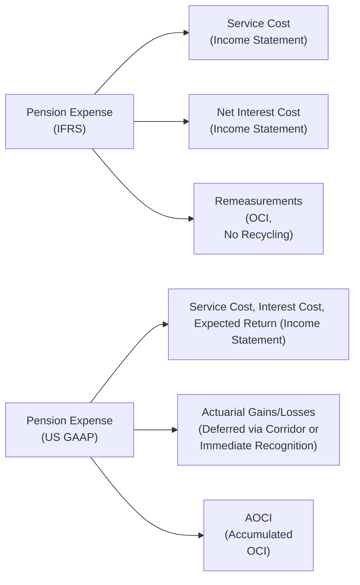

## Overview

Imagine you’re running a company and you’ve got two major compensation elements swirling around at the same time: a defined benefit pension plan and a big chunk of share-based awards that are set to vest soon. You’re juggling discount rates for your pension obligation, mortality assumptions, and the potential volatility from your share-based compensation (SBC). Suddenly, you tweak your pension assumptions, and—boom—you find your company’s net income or other comprehensive income (OCI) shifting. Meanwhile, these changes might also alter profit-based performance metrics, which in turn affect how many shares actually vest under performance-based share awards. So, yeah, it can get messy.

In this section, we’re going to explore these crossovers between pension accounting and share-based compensation. We’ll walk through scenarios where pension remeasurements might threaten share-based performance goals, or how changes in expected returns on plan assets might subtly tilt a company’s leverage ratios just as a wave of equity awards hits the balance sheet. We’ll also break down some IFRS vs. US GAAP nuances, because nothing says “exam question” like a cross-border gap in accounting. Buckle up—this can be quite fun once you see how it all weaves together.

## Interplay Between Pension and Share-Based Compensation

One of the trickiest parts about combining pension expenses with share-based compensation is that each element can influence overall profitability in unexpected ways. Let’s say a firm has significant share-based compensation lined up for executives, contingent upon meeting EPS growth targets. At the same time, changing pension assumptions—like the discount rate used to calculate pension obligations—could dramatically increase or decrease pension expense. If higher pension expense drags down net income, it could sabotage the performance threshold for vesting. Alternatively, if remeasurement gains push net income higher, the share-based awards might accelerate or vest in larger quantities.

• Pension Expenses Affecting EPS:  
  – Service cost and interest cost directly hit earnings.  
  – Actuarial gains or losses often show up in OCI under IFRS, but can still influence overall equity and investor perceptions.  
  – Under US GAAP, some portion of these gains or losses might eventually flow to net income via the corridor or other amortization methods.

• Share-Based Compensation (SBC) Linked to Performance:  
  – The expense recognized for equity-based awards depends on grant date fair values, vesting schedules, and whether performance goals look achievable.  
  – If the performance goal is pegged to profitability metrics like EPS or ROE, big swings in pension expense could inadvertently make these targets harder (or easier) to reach.  
  – Under IFRS and US GAAP, performance conditions can revise the total compensation cost recognized if the conditions become improbable or fail to be met.

## Key IFRS vs US GAAP Distinctions

We know the exam loves these frameworks, so let’s do a quick overview of how IFRS and US GAAP treat the big items in pension plans and SBC:

### Pension Accounting

Under IFRS (IAS 19):
• Service Cost: Income statement (IS) expense.  
• Net Interest on Net Defined Benefit Liability/Asset: IS expense (or income).  
• Remeasurements (Actuarial Gains/Losses): Immediately in OCI, not recycled back to income.  

Under US GAAP (ASC 715):
• Components of Net Periodic Pension Cost:  
  – Service Cost (IS)  
  – Interest Cost (IS)  
  – Expected Return on Plan Assets (reduces pension expense in IS)  
  – Actuarial Gains/Losses can be deferred and recognized through the “corridor approach” or recognized immediately in IS (policy choice, but corridor is common).  
• Remeasurements eventually impact retained earnings once recognized in the IS, but initial deferrals live in AOCI (Accumulated Other Comprehensive Income).

### Share-Based Compensation

Under IFRS (IFRS 2):
• Equity-settled share-based payments: Fair value measured at grant date, recognized over the vesting period. No subsequent fair value remeasurement for equity-settled awards, though performance conditions might reduce or eliminate the number of shares that ultimately vest.  
• Cash-settled awards: Liabilities measured at fair value each reporting date, with changes in fair value recognized in the IS.  

Under US GAAP (ASC 718):
• Equity awards measured at grant-date fair value, allocated over vesting.  
• If performance-based, the expense recognized depends on management’s best estimate of whether the performance condition will be satisfied.  
• Same as IFRS regarding no remeasurement for equity-settled awards after grant date (except for certain modifications/replacements).

## Step-by-Step Calculation Approaches

Let’s illustrate a scenario—some simplified numbers, of course—showing how changes in pension assumptions plus share-based comp can blend to affect net income, OCI, and equity.

### Pension Expense Example

Suppose your firm has a defined benefit plan, and the following data applies:

• Service Cost (annual): USD 2 million  
• Interest Cost (annual): USD 1 million  
• Expected Return on Plan Assets: USD 800,000  
• Actuarial Loss recognized in the current year: USD 3 million  

Under IFRS (IAS 19):
• Service Cost + Net Interest = (2 million + 1 million) = 3 million expense in the IS.  
• Remeasurement (Actuarial Loss of 3 million) → hits OCI immediately, no recycling to IS.  
• The total direct hit to the IS is 3 million, while shareholders’ equity is additionally reduced by 3 million in OCI.

Under US GAAP (ASC 715) with corridor approach:
• Total annual pension expense in the IS includes:  
  – Service Cost: 2 million  
  – Interest Cost: 1 million  
  – Expected Return on Plan Assets: -0.8 million  
  – Amortization of Actuarial Loss: depends on corridor rules. Let’s assume just 0.5 million is recognized in the current year.  
• So net P&L hit = 2 + 1 - 0.8 + 0.5 = 2.7 million.  
• The remaining 2.5 million of the actuarial loss (3.0 - 0.5) sits in AOCI, to be amortized in future periods (or recognized earlier if the losses keep stacking up beyond corridor thresholds).

### Share-Based Compensation Example

Now assume the firm also has a performance-based RSU plan with the following data:

• 200,000 RSUs granted at the start of Year 1.  
• Grant-date fair value per RSU: USD 15.  
• Three-year vesting based on (1) time served and (2) achieving a minimum ROE threshold in each year.  
• In Year 2, the firm changes pension assumptions that unexpectedly boosts the pension expense, lowering net income—hence, lowering ROE.  

Under IFRS or US GAAP, the total grant-date fair value at inception was 200,000 × 15 = USD 3 million. Typically recognized over three years, that’s about USD 1 million per year, provided the performance conditions appear achievable. After Year 1, if management decides the ROE threshold is no longer likely to be met due to higher pension cost, part of that recognized expense may get reversed. Let’s say they reduce the total expense recognized for RSUs by 300,000 because they don’t expect certain targets to be met. That reversal will lower share-based compensation expense in the IS, offsetting some of the pension expense increase in the same period, ironically smoothing out net income volatility.

## Diagram: Pension Expense Recognition Under IFRS vs. US GAAP

Below is a simple Mermaid flowchart to visualize the difference between IFRS and US GAAP in pension expense recognition:

Notice how IFRS locks Remeasurement Gains/Losses into OCI permanently while US GAAP might eventually bring them into the P&L (through corridor amortization).

## Advanced Ratio Analysis

Now let’s talk about ratio analysis, because the exam definitely wants you to interpret these changes in the context of financial statement analysis:

• Leverage Ratios: An increase in pension obligation or bigger recognized expense can reduce equity (especially if recognized immediately in OCI). Meanwhile, share-based compensation (equity awards) can effectively lessen leverage by increasing paid-in capital. But if performance conditions reduce the ultimate number of shares, it can counteract that effect.  
• Profitability Ratios (Return on Equity, Return on Assets, Net Profit Margin): Both pension service costs and share-based comp charges can reduce the denominator or numerator in different ways. For instance, a new batch of vested shares might inflate weighted average shares outstanding, lowering EPS. Pension remeasurement could hammer net income if recognized under US GAAP more vehemently.  
• Coverage Ratios: If interest expense on the pension liability jumps (due to changes in discount rates), interest coverage might decline. On the other hand, strong equity inflow from employees exercising stock options might enhance CFO in the short term, improving coverage.  

In practice, you must consider how a firm discloses these items in footnotes. You might see a separate schedule showing the breakdown of pension expense, the link to remeasurements, and the portion recognized in OCI. Then, keep an eye on share-based compensation footnotes, which detail any performance triggers or likelihood of vesting. Cross-referencing these two can reveal how a single shift in interest rate assumptions might have a double whammy on top-line results.

## Best Practices and Pitfalls

• Coordinating Pension Assumptions: Management may be incentivized to use a higher discount rate to reduce pension obligations (and thus service cost), but that might only be short-term relief if actual returns or workforce mortality assumptions differ significantly.  
• Watch Out for the “Performance Condition Trap”: If you set an aggressive EPS or ROE threshold for share-based awards, a big unexpected pension expense can sink your performance metrics. Sometimes it’s wise to build in realistic assumptions from the start.  
• IFRS vs. US GAAP Differences: If you forget that IFRS recognizes actuarial gains/losses permanently in OCI while US GAAP might use corridor amortization, you can easily misjudge the timing of expense recognition.  
• Don’t Overlook the OCI Impact: In IFRS, large remeasurements can accumulate in OCI, but they don’t reclassify to net income later. Under US GAAP, they eventually can. This difference can be huge when analyzing period-over-period net income.  
• Nailing the Weighted-Average Assumptions: Even a small shift in discount rates, expected returns, or mortality can produce big swings in pension expense, which can overshadow typical year-to-year share-based compensation changes.  

## Conclusion and Exam Tips

When you see a multi-topic vignette that includes both pension information and share-based compensation details, be ready for scenario-based questions like, “What happens if the pension discount rate changes from 5% to 4.5% in the same year that half the share-based awards are due to vest?” This is your cue to:

• Evaluate the direct effects on net income and OCI from the new pension assumptions.  
• Reassess the share-based compensation expense if it depends on performance metrics.  
• Recalculate diluted EPS or other performance indicators if the vesting schedule changes.  
• Incorporate final adjustments into ratio analysis and identify the net effect on balance sheet leverage or equity.  

On the exam, it’s easy to slip on IFRS vs. US GAAP distinctions—particularly with the corridor approach—so double-check the standard references. If a question states, “Under IFRS, how are remeasurement losses treated?” you know it’s immediate recognition in OCI, no recycling. If it’s US GAAP, ask yourself whether the employer uses the corridor approach or immediate recognition.  

Finally, keep a close eye on footnotes in vignettes; they often reveal the performance conditions for share-based awards or the discount rates for pension measurement. Those tiny details can drastically change your answers, especially on ratio or EPS calculations. And remember, it’s not about memorizing tables—it’s about applying the logic in each scenario.

---

**Glossary**  
• Defined Benefit Plan: A pension plan promising specific retirement payments, where the employer bears actuarial and investment risks.  
• Service Cost: Incremental pension benefits earned by employees from one period’s service.  
• Actuarial Assumptions: Key inputs like discount rate, mortality, turnover, or salary growth that drive pension obligation calculations.  
• Share-Based Compensation (Equity-Settled): Awards settled by issuing equity instruments, recognized at grant-date fair value over the vesting period.  
• Performance Condition: A vesting trigger linked to financial targets such as EPS or ROE.

---

**References**  
• IAS 19 Employee Benefits – IFRS Foundation (https://www.ifrs.org)  
• ASC 715 Compensation—Retirement Benefits and ASC 718 Compensation—Stock Compensation – FASB (https://www.fasb.org)  
• Kieso, D.E., Weygandt, J.J., & Warfield, T.D. (Various Editions). Intermediate Accounting.  

## Test Your Knowledge: Pension and Share-Based Crossovers



### Which of the following statements best describes a key IFRS treatment of actuarial gains and losses for defined benefit pensions?
- [ ] They must be amortized using a corridor approach.
- [ ] They are initially recognized in net income but later transferred to OCI.
- [x] They are immediately recognized in OCI with no subsequent recycling.
- [ ] They always reduce plan assets directly on the balance sheet.

> **Explanation:** Under IAS 19, remeasurements—including actuarial gains and losses—go straight to OCI and do not get recycled back to the income statement in future periods.

### Under US GAAP, which component of pension expense is commonly reduced by the expected return on plan assets?
- [ ] Service cost
- [x] Net periodic pension cost
- [ ] Accumulated other comprehensive income
- [ ] Cash flow from operations

> **Explanation:** The expected return on plan assets is used to lower net periodic pension cost. This reduces the total pension expense recognized in the income statement.

### A company experiences an unexpected jump in pension expense, lowering its net income. Which outcome could occur if its share-based comp plan is tied to a net-income performance threshold?
- [x] Fewer shares might vest, reducing share-based compensation expense.
- [ ] More shares might vest, increasing share-based compensation expense.
- [ ] Pension expense has no impact on share-based compensation vesting.
- [ ] The discount rate must be changed to restore net income targets.

> **Explanation:** If pension expense lowers net income below a performance threshold, fewer shares may vest under a performance-based share plan, leading to a partial reversal of share-based compensation expense.

### Under IFRS, how is the net interest cost on a defined benefit pension recognized?
- [ ] It’s recognized in OCI only if management chooses the corridor approach.
- [x] It’s recognized in the income statement as the net of interest on the defined benefit obligation and interest on plan assets.
- [ ] It’s recognized in full within OCI with subsequent recycling to net income.
- [ ] It’s recognized in the income statement only if it exceeds the corridor threshold.

> **Explanation:** Under IAS 19, net interest is typically calculated on the net pension liability or asset and is recognized in the income statement as a financing cost.

### Which of the following adjustments is most likely to occur if an entity’s share-based awards carry a performance condition tied to ROE, but a negative pension remeasurement drives equity sharply lower?
- [x] ROE diminishes, making the performance condition less likely to be met.
- [x] The total share-based compensation expense might be revised downward.
- [ ] Operating income rises due to the offsetting effect of intangible items.
- [ ] The remeasurement cannot change the final share count.

> **Explanation:** Lower equity from an adverse pension remeasurement reduces ROE, which might make the performance condition unattainable. This could decrease the recognized share-based compensation expense.

### When share-based compensation expense is recognized, how does it generally affect equity on the balance sheet?
- [x] It increases paid-in capital if equity-settled.
- [ ] It decreases retained earnings by the full amount of the expense only.
- [ ] It bypasses all equity accounts and appears as a liability.
- [ ] It is deducted from the pension asset.

> **Explanation:** For equity-settled share-based comp, the firm debits compensation expense and credits an equity account (often additional paid-in capital), increasing total equity.

### In a period of declining discount rates for a defined benefit plan, what potential net impact might you see on pension expense and EPS, respectively, if a large portion of share-based awards are scheduled to vest?
- [x] Higher pension expense and reduced EPS from more shares outstanding.
- [ ] Lower pension expense and increased EPS from fewer shares outstanding.
- [x] Higher pension expense and potential cancellation of some awards if performance conditions fail.
- [ ] No impact on EPS because pension items are recognized in OCI only.

> **Explanation:** A falling discount rate typically increases the present value of pension obligations, boosting expense. Meanwhile, share-based compensation can dilute EPS by increasing the share count, or reduce it further if performance metrics miss the mark.

### Which statement about the corridor approach under US GAAP is correct?
- [ ] It immediately recognizes all actuarial gains and losses in the income statement.
- [x] It permits deferral of actuarial gains/losses and requires amortization only when they exceed 10% of the greater of plan assets or benefit obligation.
- [ ] It is mandatory under IFRS.
- [ ] It does not apply to defined benefit plans.

> **Explanation:** The corridor approach is a US GAAP method allowing a portion of actuarial gains/losses to remain in AOCI, with only the excess over 10% of the greater of plan assets or the defined benefit obligation amortized each year.

### How might a firm’s leverage ratio be affected if the firm has a large pension deficit and issues a significant number of shares to employees as part of share-based compensation?
- [x] The deficit might increase total liabilities, while newly issued shares simultaneously boost equity, potentially offsetting part of the leverage increase.
- [ ] The ratio will remain unchanged because share-based compensation is a non-cash expense.
- [ ] The share issuance has no effect on equity because they are given “for free” to employees.
- [ ] Liabilities will always decrease due to share-based payments.

> **Explanation:** A large pension deficit increases liabilities. Newly issued shares under share-based comp can increase equity, partially mitigating a rise in leverage.

### True or False: Under IFRS, a firm recycles pension remeasurements out of OCI and into the income statement once they are deemed “realized.”
- [x] True
- [ ] False

> **Explanation:** This is actually a trick. The correct IFRS treatment is that remeasurements are recognized in OCI and are not recycled. So the statement given is false. If you selected “True,” you need to revise your understanding!  


