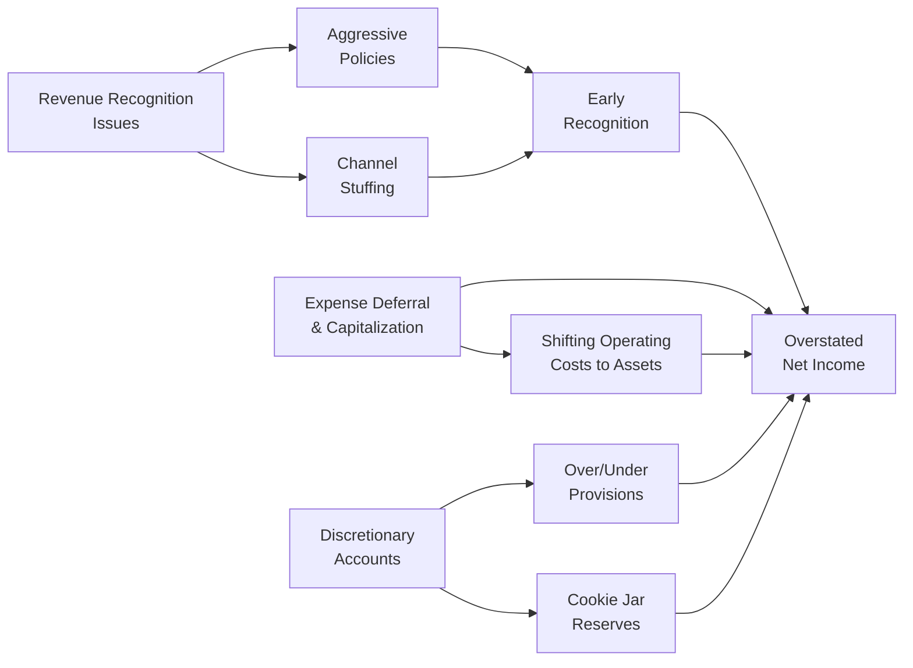

So, let’s be honest: spotting reporting quality pitfalls is kind of tricky—and sometimes it feels like you need X-ray vision to figure out what’s going on. I remember getting dizzy reading footnotes that seemed designed to bury important details. But that’s exactly why this section matters. In the Level II CFA exam context, these pitfalls sneak up in item-set (vignette) questions, forcing us to carefully scan each paragraph, footnote, and statement for signs of trouble.

Below, we’ll dive into various ways a company might try to “dress up” its financials, from overly aggressive revenue recognition to the sneaky classification of costs so that operating expenses magically appear in a different section of the statement of cash flows. We’ll also talk about intangible assets—like goodwill and patent-related intangibles—and how they might get overvalued if management’s rosy assumptions don’t match reality. The more you practice scanning vignettes with these concerns in mind, the better prepared you’ll be, not just for the exam but also for real-world financial analysis.

## Importance of Identifying Reporting Quality Pitfalls

Analyzing where management might manipulate numbers is critical for two big reasons:  
• Investors rely on reported earnings to value companies and to evaluate risk. If the numbers are wrong, the entire valuation or risk assessment is off.  
• A company’s actual operating performance can differ dramatically from the “story” it tries to present. You don’t want to be that analyst who buys into inflated hype without verifying.

CFA Level II expects you to dig deeper than Level I—like, truly roll up your sleeves and get into the nitty-gritty details of how transactions flow through the statements. As you read each vignette, pay special attention to any anomalies in the managerial discussion, footnotes, or line items that deviate significantly from benchmarks or from prior years. Let’s address the key pitfalls that might arise.

## Spotting Red Flags in Revenue Recognition

Revenue recognition is one of the first big areas to examine. The old adage is that wherever revenue is recognized too early, a mismatch in expenses or some long-unearned revenue might follow. Common red flags include:

• Recognizing revenue before the substantial completion of a project or service obligation.  
• Using bill-and-hold arrangements improperly—where the company recognizes revenue but still physically holds the inventory.  
• Offering extended warranties or future services but recording the full sale upfront without deferring an appropriate portion.  
• A steep spike in revenue near period-end that is not accompanied by significantly higher receivables or does not align with historical seasonality.

It’s not always malicious—sometimes it’s an honest difference in interpreting the rules. But you (and especially the examiner) want to see if any footnotes mention unusual revenue recognition policies. Also, watch for things like channel stuffing (“Hey distributors, want an enormous amount of product you didn’t order?”), which basically means pushing product into distribution channels at period-end to inflate reported sales. The problem is that those shipments might bounce back as returns next period.

## Expense Deferral and Balance Sheet Misclassifications

Another area that gets manipulated is expenses. The concept is pretty simple: If you want earnings to look good, you throw some operating costs over onto the balance sheet, deferring them as assets. For instance, capitalization of R&D or marketing costs might cross the line if the future benefits are uncertain.  

You’d also investigate if the company is classifying certain inventory costs or intangible creation costs in a way that doesn't align with IFRS or US GAAP. Over time, an asset that was incorrectly capitalized might need to be impaired—leading to a big—and suspiciously timed—charge to the income statement. If you see an abnormal buildup in intangible assets or “prepaid” line items without a clear explanation, it’s a good idea to dig deeper.

## Overstated Intangible Assets: Goodwill and Co.

Goodwill is a classic: a company makes an acquisition and records goodwill on the balance sheet based on the purchase price minus the fair value of net assets. Sometimes that purchase price is a bit, um, enthusiastic. If the newly acquired entity’s continuing performance doesn’t measure up to the assumptions used in the acquisition model, the goodwill is impaired. But guess what? If management drags its feet in running (and disclosing) those impairment tests, the intangible asset stays put at an inflated value.

Likewise, intangible assets such as patents or brand trademarks might be artificially inflated if the estimated useful life or the fair value was done using overly generous assumptions. Did the company switch from an accelerated amortization method to a straight-line approach without strongly justified reasons? That might be an early warning that they’re smoothing out the intangible expense.

## Discretionary Accounts and Restructuring Reserves

Alright, another hot spot: discretionary accounts. Let’s mention a big one: allowances for doubtful accounts. Maybe the company sets artificially low allowance estimates in a good year (fewer accounts written off), boosting short-term income. Then, in a down year, it “increases the allowance” to absorb some of that slump. The net effect is a smoothing of earnings over multiple periods, often called “cookie jar reserves.”

Restructuring reserves can do something similar. Some managers might gather all sorts of expected future costs—everything from severance to lease termination fees—into a single “restructuring” charge in one big year. Next year, if actual costs come in lower, they magically reverse a portion of that reserve, further boosting the next period’s earnings.  

These are not always illegal, but they’re definitely areas requiring professional skepticism whenever you see them in the footnotes. If you see that a company has a “restructuring” charge almost every year, that’s suspicious. Why do they keep having one-time events that just happen to reduce earnings in one period and provide a cushion for the next?

## Non-Recurring Items: A Critically Skeptical Eye

Non-recurring items like “one-time charges” or “extraordinary losses” pop up in statements to show how they’re not part of the core, ongoing business. In principle, that’s good. But it also means management might be lumping recurring costs into the “non-recurring” bucket. If that happens too often, it begins to look less like a truly isolated event and more like an ordinary cost they’re trying to keep hidden.

One trick is to watch for repeated restructuring or legal settlement items that mysteriously appear each year. A once-a-decade restructuring might be legitimate, but if it’s annual, is it truly “extraordinary”? The same goes for “one-time” losses from worthless intangible assets or repeated losses from discontinued operations.

## CFO: The Holy Grail… or Not?

We love CFO (Cash Flow from Operations) because it’s less susceptible to direct manipulation than earnings, right? Well, it’s generally more trustworthy, but it can still be manipulated. For instance, a company might:  
• Capitalize some operating expenses as investments, inflating CFO and pushing the outlay to CFI (Cash Flow from Investing).  
• Sell receivables to a third party (a form of securitization) to accelerate the cash inflow, artificially boosting CFO in the short term.  
• Classify interest or taxes in ways that shift them between CFO, CFF, or CFI, depending on the allowed accounting rules.

If CFO shows a consistent upward trend while net income stagnates, you want to figure out how they’re pulling that off. Maybe they changed collection policies or made big cuts in working capital. Or maybe there's some reclassification scheme in the background. The footnotes or MD&A typically reveal these policy changes if you read carefully.

## Segment Disclosures: Where Problems Hide

Segment disclosures can offer a goldmine of clues about potential cross-subsidization or the concealment of a troubled business unit. You might see that one segment’s margins are unbelievably high compared to industry norms, while another is consistently negative. Or maybe the sum of the segments’ operating results does not reconcile cleanly with the consolidated statements. Sometimes, management lumps poorly performing segments with better ones to disguise a downward trend.  

In exam vignettes, they may give you partial disclosures or mention that “Segment X had a 50% jump in revenues despite minimal marketing.” This might be a sign of something like channel stuffing or a questionable internal transfer policy. If the consolidated statements show robust growth but each segment’s figures don’t add up to that growth, question the math or the classification.

## A Handy Checklist for Footnotes and MD&A

Reading footnotes and MD&A can be about as fun as trying to interpret an ancient text, but you can approach it with a structured list of questions. For instance:

• Have there been changes in accounting policies or estimates (useful lives of assets, bad debt assumptions, or inventory valuations)?  
• Are there any “special transactions” or “non-recurring” items that show up consistently from year to year?  
• Is the company capitalizing more costs now compared to prior periods?  
• How do intangible asset balances grow or shrink over time, and do those changes align with performance or new acquisitions?  
• Is there a mismatch between segment data and consolidated data, or are the footnotes incomplete?  
• Are there any disclaimers about uncertain tax positions or big contingencies that might be recognized next period?  
• Does the CFO trend align with net income, or are they going in opposite directions without a sensible explanation?

Simply scanning these areas systematically every time you open a footnote can help you spot suspicious changes. On the exam, you might only have a few paragraphs of footnotes, but they’re often peppered with hints if you know what to watch for.

## Mermaid Diagram: Sneaky Places for Earnings Management

Below is a simple Mermaid diagram illustrating potential areas of manipulation around a company’s financial statements:



Each node points to an area that can inflate reported earnings or conceal a firm’s economic reality. Pay attention to the interplay among these manipulations.

## Small Python Example: Checking Segments

Sometimes you might want to do a quick check of segment totals versus consolidated statements. Say you have segment-level data in a CSV and want to sum them up quickly to see if the consolidated figure is consistent. Below is a toy Python snippet:

```python
import csv

segment_totals = {'Revenue': 0, 'Expenses': 0}

with open('segments.csv', 'r') as f:
    reader = csv.DictReader(f)
    for row in reader:
        segment_totals['Revenue'] += float(row['Revenue'])
        segment_totals['Expenses'] += float(row['Expenses'])

print(f"Total Segment Revenue: {segment_totals['Revenue']}")
print(f"Total Segment Expenses: {segment_totals['Expenses']}")
```

In a real analysis, you’d compare these sums to the reported consolidated revenue and expenses. If the puzzle pieces don’t fit, you might have discovered a hole in the manipulative puzzle.

## Practical Example: A Quick Story  
Imagine a tech hardware company—call them Gadgetrix Inc.—that experiences a sales dip in its main product line. Each quarter, management points to “one-time integration costs” from a minor acquisition it made two years ago. Some of us might scratch our heads: two years is plenty of time to integrate. Meanwhile, Gadgetrix’s intangible assets have ballooned, supposedly from R&D capitalized for its new IoT devices. But the footnotes are vague about actual performance or how exactly they determined intangible asset values. If you see “inconsistent or minimal explanation” for large intangible asset growth, you rightly wonder if management is pulling forward future profits or deferring normal R&D costs.  

Meanwhile, the CFO statement is plateauing—no real growth—and the company is touting “record earnings.” Setting these data points side by side, it’s not a stretch to suspect the earnings might be inflated. This is the kind of scenario you might see in an exam vignette, and it’s your job to piece together the puzzle.

## Best Practices for Identifying Pitfalls

• Compare year-over-year financials: Are large fluctuations in line items explained clearly?  
• Read the footnotes first: Sometimes companies bury crucial info about changes in accounting estimates or new adoption of an accounting policy.  
• Check real-world consistency: If a company says it recognized a huge portion of revenue from a contract but you see no corresponding cost or no mention of partial deliveries, that’s a potential discrepancy.  
• Evaluate intangible assets over time: If goodwill remains unscathed year after year—even in the face of negative indicators—ask why.  
• Cross-reference segment info: Do the segment margins make sense for that industry? Are there new (unexplained) segments?  
• Look for stable CFO: If net income growth outstrips CFO systematically, maybe the company is stretching accruals or capitalizing big expenses.

## Glossary

• Earnings Manipulation: Efforts to influence net income by using legitimate or questionable accounting methods.  
• Cookie Jar Reserve: Stashing away excess reserves (liabilities) during good times to release them later, smoothing profits across periods.  
• Aggressive Revenue Recognition: Recognizing revenue too early or in excess of what is truly earned.  
• Operating Cash Flow (CFO): Cash generated from a company’s core operations—usually considered more reliable than accrual-based net income.  
• Non-Recurring Charges: Expenses that are expected to be infrequent or unusual, but repeated declarations can suggest pattern-based manipulation.

## References

• Schilit, Howard M., and Jeremy Perler. “Financial Shenanigans: How to Detect Accounting Gimmicks & Fraud in Financial Reports.”  
• CFA Institute Publications. “Earnings Quality: Spotting Earnings Manipulation by Focusing on the Cash Flow Statement.”  
• International Federation of Accountants (IFAC). “International Standards on Auditing (ISA) Guidelines.” (https://www.ifac.org)

-------------------------------------------------------------

## Test Your Knowledge: Identifying Reporting Quality Pitfalls Quiz



### Which of the following would be considered a red flag for aggressive revenue recognition?
- [ ] Recording revenue upon complete satisfaction of performance obligations.
- [x] Channel stuffing at the end of a reporting period.
- [ ] Deferring revenue when service milestones are not met.
- [ ] Recognizing service revenue progressively over the contract term.

> **Explanation:** Channel stuffing pushes product into distribution channels before actual demand, inflating period-end sales in a suspicious manner.

### Management’s use of discretionary accounts, such as allowances for doubtful accounts, typically helps:
- [ ] Align recognized revenue with realized cash.
- [ ] Increase the reliability of net income without affecting cash flow.
- [x] Smooth earnings across multiple periods.
- [ ] Prepare for an anticipated regulatory investigation.

> **Explanation:** Managers can understate or overstate allowances in good or bad years to keep net income figures consistent, effectively smoothing earnings.

### Which of the following strategies might inflate operating cash flow (CFO)?
- [x] Capitalizing operating expenses in an intangible asset account.
- [ ] Paying suppliers earlier than normal.
- [ ] Deferring interest costs to a later period as an accrued liability.
- [ ] Accelerating the write-down of intangible assets in a profitable year.

> **Explanation:** By capitalizing what should be operating expenses, the firm reduces the outflow in CFO (the expenses are recorded in CFI instead).

### A repeated pattern of “one-time charges” is a red flag because:
- [ ] One-time charges are never legitimate.
- [ ] They often appear in the cash flow from financing section.
- [x] They might no longer be truly “non-recurring” if they happen regularly.
- [ ] They inflate the firm’s intangible assets.

> **Explanation:** If “one-time” charges keep popping up, they might indicate ongoing expenses that management is misclassifying as exceptional.

### When goodwill appears on a company’s balance sheet for several years without impairment, even though the acquired company is performing poorly, an analyst should:
- [x] Investigate the reasonableness of the goodwill valuation assumptions.
- [ ] Assume the goodwill reflects a legal requirement to maintain historical cost.
- [x] Check pricing multiples and see if a goodwill write-down is overdue.
- [ ] Automatically adjust intangible asset values downward by 50%.

> **Explanation:** The lack of impairment, despite subpar performance, signals the possibility that management is delaying or avoiding the required write-down.

### Which item is the most common candidate for a “cookie jar reserve”?
- [x] Allowance for doubtful accounts.
- [ ] Capitalized software development costs.
- [ ] Depreciation methods.
- [ ] Prior period adjustments to revenue.

> **Explanation:** Companies frequently manage their earnings by setting aside or reversing excessive provisions in the allowance for doubtful accounts.

### To identify segment-level manipulation, an analyst should:
- [x] Compare the sum of individual segment revenues and expenses to total consolidated values.
- [ ] Assume each segment has the same profit margin.
- [x] Check if poorly performing segments consistently get merged into larger segments.
- [ ] Count the number of product lines reported.

> **Explanation:** Aggregated segment figures not matching the consolidated total can reveal cross-subsidization or misclassification. Merging a poorly performing segment into a better-performing one can mask losses.

### Which of the following scenarios might signal inflated CFO?
- [x] A sudden surge in CFO due to securitizing receivables.
- [ ] A stable ratio of CFO to net income over several periods.
- [ ] Decreased capital expenditures despite business expansion.
- [ ] Increased net income but declining inventory levels.

> **Explanation:** Securitizing receivables accelerates cash inflow from future periods into the current period, artificially boosting operating cash flow.

### A potential sign of aggressive expense deferral is:
- [x] A significant jump in capitalized costs without clear future benefits.
- [ ] Reducing a reserve previously created for potential legal claims.
- [ ] Increased amortization of an intangible asset.
- [ ] A shortened depreciable life for certain PPE.

> **Explanation:** By capitalizing costs that may not have a clear future return, a firm might be deferring what should be immediate expenses.

### True or False: Segment disclosures rarely offer clues about reporting quality issues.
- [x] True
- [ ] False

> **Explanation:** Actually, this statement is false in spirit. Segment disclosures often offer valuable clues if the consolidated statements don’t match segment-level data. This question tested whether you’re paying attention to the statement’s meaning. Segment disclosures can be extremely revealing for analysts!


