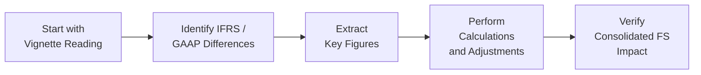

## Introduction and Overview

Well, here we are, tackling one of the more challenging aspects of the CFA Level II Financial Statement Analysis curriculum: a comprehensive, multi-page vignette that fuses consolidation policies, foreign currency translation, pension plan adjustments, and share-based compensation. If you’ve ever felt overwhelmed by footnotes mentioning partial goodwill and intangible asset valuations—plus a mention of some currency “we’ve never heard of”—you’re not alone. Many of us have that moment of surprise when we realize how easily small details can change big numbers.

In what follows, we’ll walk through a representative item set. We’ll see how to systematically break down a scenario by summarizing each footnote, identifying IFRS vs. US GAAP requirements, isolating ownership percentages, and performing the relevant calculations. We’ll then weave everything together so you can see how the final consolidated financial statements come alive—and hopefully glean a few best practices for exam day.

## Approaching the Mock Vignette

One of the biggest pitfalls, in my opinion, is to dive straight into the questions without truly understanding the story the vignette is telling. It’s like trying to put together a 3D puzzle without looking at the picture on the box. You know, you could do it, but it’ll be a mess. Instead, let’s outline a clear approach:

1. Read every sentence of the scenario, resisting the urge to skip that suspicious footnote about intangible assets or share-based vesting schedules.  
2. Note which reporting framework we’re dealing with (IFRS, US GAAP, or a mix) and the relevant standards that typically come into play for each footnote (e.g., IFRS 3 for Business Combinations, IAS 19 for pension, ASC 718 for share-based compensation, etc.).  
3. Organize your data: ownership amounts, foreign exchange rates, discount rates for the pension plan, vesting conditions, or unusual modifications in equity-based pay.  
4. Perform calculations step by step, labeling every figure carefully (I once forgot to label which currency I was dealing with—learned that lesson the hard way).  
5. Synthesize: In other words, if a share-based plan expense changes net income, how does that flow through to consolidated equity? If the foreign subsidiary has a new functional currency, how does that hit the cumulative translation adjustment?

Below is a little diagram showing how you could think about the workflow when reading a multi-layered vignette:

Take your time with each step. It’s possible you’ll be dealing with a step acquisition, partial goodwill, or multiple segments that must be consolidated differently based on controlling interest.

## Footnote Summaries and Key Takeaways

Let’s imagine our fictional firm, Achieva Corp, has three major footnotes in its annual report. These footnotes provide crucial details for the item set questions.

### Footnote 1: Consolidation Details

• Achieva Corp acquired an additional 20% of Eckert Co. during the fiscal year, raising total ownership from 50% to 70%.  
• Under IFRS, Achieva remeasures any previously held ownership to fair value at the time control is gained; partial goodwill is recognized.  
• Eckert Co. has intangible assets previously unrecognized, including a trademark with a 10-year remaining life.  

Keep your eyes peeled for partial goodwill or full goodwill differences between IFRS and US GAAP. Also note that intangible assets require fair value adjustments and subsequent amortization, which can reduce consolidated net income.

### Footnote 2: Pension Assumptions

• Achieva sponsors a defined benefit plan under IFRS, but also discloses that local GAAP would treat the plan similarly to US GAAP.  
• The discount rate is 5%, and the expected return on plan assets is 6%.  
• Past service costs are recognized immediately in net income under IFRS (while US GAAP typically accumulates them in OCI and amortizes).  

Here, watch for the net pension liability or asset’s effect on the balance sheet. Also, the immediate recognition of past service costs under IFRS can cause a big shift in net income that you might not see under US GAAP.

### Footnote 3: FX Translation and Share-Based Compensation

• Achieva’s subsidiary in Canada changed its functional currency from CAD to USD due to a shift in primary economic environment.  
• A new share-based incentive plan was instituted: 1 million restricted stock units (RSUs) that vest ratably over two years for top management.  
• The share-based compensation is measured at fair value at grant date, with an annual expense recognized in net income over the vesting period.  

Currency changes can flip your approach to translation from the temporal method to the current rate method (or vice versa). Meanwhile, keep track of whether those RSUs are liability-classified or equity-classified. IFRS and US GAAP have mostly converged on share-based compensation, but slight differences remain (especially around modification accounting).

## Step-by-Step Calculation Overview

Now that we’ve lined up the big details, let’s see how we’d methodically handle the required calculations.

### Determining the Method of Translation

1. If the subsidiary’s functional currency is stated as USD, the current rate method becomes relevant if the presentation currency differs (like if Achieva’s home currency is EUR).  
2. If the functional currency had remained CAD, the temporal method could apply if CAD was not considered the currency of the primary economic environment.  

Exam-wise, always confirm the currency definitions: local currency vs. functional currency vs. presentation currency. Failing to do so might lead you to apply the wrong method and produce an incorrect CTA.

### Partial Goodwill Calculation

When Achieva raised its stake in Eckert Co. from 50% to 70%, IFRS calls for remeasurement of the old 50% stake to fair value. Suppose:  
• Fair value of Eckert’s net identifiable assets = $200 million.  
• Achieva pays $60 million for the additional 20% interest.  
• Fair value of Achieva’s previously held 50% interest is $140 million at the date it obtains control (implies Eckert as a whole is now valued at $280 million).  

Under IFRS partial-goodwill:  
• Goodwill recognized = Purchase price for new interest + fair value of previously held interest + fair value of any noncontrolling interest (NCI) – fair value of net identifiable assets.  

Let’s do a simplified version—assuming IFRS partial goodwill with NCI on a proportionate share basis:

| Item                                              | Amount (USD millions) |
|---------------------------------------------------|-----------------------|
| Fair value of old 50% interest                    | 140                   |
| Consideration paid for additional 20%             | 60                    |
| Subtotal (Achieva's total recognized value)       | 200                   |
| Fair value of net identifiable assets (NIA)       | 200                   |
| Implied value for Achieva's 70% of NIA (70% of 200) | 140                   |
| Goodwill for Achieva’s 70% stake                  | 200 - 140 = 60        |

If we needed to incorporate the noncontrolling interest fair value (NCI), that might adjust the total recognized goodwill under some IFRS scenarios. Meanwhile, US GAAP typically uses the full-goodwill method by default, which can lead to higher goodwill.

### Pension Expense Recognition

Under IFRS, annual pension expense is basically:

Pension Expense = Current Service Cost + Net Interest on Net Pension Liability/Asset + Past Service Cost (immediate recognition for IFRS) ± Remeasurements (recognized in OCI).

If you’re asked to reconcile IFRS and US GAAP, remember that US GAAP might not immediately put the past service cost through net income. That difference can cause you to scratch your head when comparing net income.

### Share-Based Compensation Expense

Now, let’s say those 1 million RSUs each have a grant-date fair value of $10. The total fair value is $10 million. The vesting is over 2 years:

• Annual expense = $10 million ÷ 2 = $5 million each year.  

But if there are service conditions or if some employees leave early (forfeitures), we must reduce the recognized expense accordingly. IFRS and US GAAP are fairly similar in requiring you to revise estimates for expected forfeitures.  

## Bringing It All Together on the Statements

Imagine you now must produce the consolidated income statement and balance sheet:

- You consolidate Eckert Co. fully because you have a 70% interest. Sub-totals for net income and equity are then allocated between Achieva (the parent) and the NCI.  
- You incorporate any intangible amortization from revaluing intangible assets at fair value (the trademark’s 10-year life means an annual amortization).  
- You recognize pension expense for the year under IFRS, which might be higher than US GAAP if there’s a big chunk of past service cost.  
- You record share-based compensation expense each period, decreasing net income and increasing contributed capital (or additional paid-in capital) if equity-classified.  

Always check how big of a dent that share-based compensation puts in net income. If it’s large, it might affect your EPS calculations.

## Debrief: Ratio Analysis and Industry Comparison

Let’s say the newly consolidated statements show a noticeable drop in Achieva’s consolidated EBITDA margin compared to the industry. Maybe we see a ratio of 15% for Achieva vs. 20% for peers. So, what happened?

1. Additional intangible amortization from Eckert Co. reduces operating income.  
2. Higher pension expense from IFRS immediate recognition of past service cost.  
3. Share-based compensation expense is ramping up in the early vesting stages (lots of employees receiving RSUs).  

When analyzing consolidated results, you might see unusual disparity from competitor margins. Sometimes that’s purely due to IFRS vs. US GAAP differences. Other times, management might be more conservative (or more aggressive) in their assumptions. But for exam day, keep your focus on how the question is framed. If you’re asked to compare Achieva with an identical US GAAP firm, you should highlight the different recognition methods.

## Best Practices and Common Pitfalls

• Always confirm consolidation thresholds. If you have >50% ownership, you generally consolidate. If you have a joint venture, you use the equity method (unless IFRS or US GAAP rules for joint operations say otherwise).  
• In partial acquisitions, watch out for remeasurement gains/losses on previously held stakes. You might find an “oops, we forgot that day-one revaluation.”  
• Double-check your currency translation method. A misread on the footnote about functional currency can throw your entire CTA calculation off.  
• For pensions, IFRS vs. US GAAP differences revolve around how service cost and remeasurements get recognized—don’t mix up which pieces go to OCI vs. net income.  
• Share-based compensation can be sneaky if there are vesting modifications in the footnotes. If the vesting schedule changes midstream, you may need to remeasure (in IFRS certain modifications can cause revaluation).  

I recall once reading a question on share-based compensation that pivoted halfway through from equity-settled to cash-settled. Talk about a curveball. The moral of the story: footnotes can hide surprises more devious than you’d expect.

## Summary of Key Takeaways

1. Read everything carefully—footnotes are your lifeline.  
2. Sort out IFRS vs. US GAAP differences first.  
3. Jot down all relevant figures: ownership percentages, exchange rates, discount rates, contractual terms of share-based payments.  
4. Do the math with clarity. Label your steps, keep track of which currency you’re using, and whether you’re measuring partial or full goodwill.  
5. Evaluate how each piece (pension, share-based compensation, FX translation, intangible amortization) affects net income, EPS, or balance sheet items.

## References for Further Exploration

• Tracy, J. A., How to Read a Financial Report: Wringing Vital Signs Out of the Numbers. This helps demystify footnotes.  
• CFA Institute, Standards of Practice Handbook: Good resource for ethical considerations around how data is presented in financials.  
• PwC, KPMG, EY, Deloitte IFRS vs. US GAAP Guides: Great for seeing side-by-side comparisons of complex topics like pension, share-based comp, or intangible assets.  

----

## Complex Consolidation, FX, and Share-Based Compensation: Practice Questions



### In a business combination under IFRS, which item best describes the partial goodwill method?

- [ ] Goodwill is recognized based on the full fair value of the subsidiary.
- [ ] Goodwill is not recognized at all unless there's negative goodwill.
- [x] Goodwill is recognized only for the parent's share of the subsidiary’s fair value over net assets.
- [ ] Goodwill is recognized evenly between the parent and noncontrolling interests.

> **Explanation:** Under IFRS partial goodwill, only the portion of goodwill attributable to the parent’s ownership percentage is recognized. This differs from the full-goodwill method.

### Achieva Corp changes the functional currency of its Canadian subsidiary from CAD to USD. Under the current rate method, which statement is most accurate?

- [ ] Historical rates are used for all income statement items.
- [x] Assets and liabilities are translated at the current exchange rate on the balance sheet date.
- [ ] Nonmonetary items are translated at historical cost.
- [ ] Sales are translated using the average rate from two periods ago.

> **Explanation:** Under the current rate method, all assets and liabilities are translated at the current exchange rate on the balance sheet date, while income statement items are usually translated at the average rate for the period.

### When a company increases its ownership from 50% to 70% in a subsidiary and obtains control under IFRS, what is the required accounting for the previously held equity interest?

- [ ] It is measured at historical cost.
- [ ] It is ignored because consolidation was already performed.
- [x] It is remeasured to fair value, with any gain or loss recognized in profit or loss.
- [ ] It is fully written off against any intangible assets on the balance sheet.

> **Explanation:** IFRS requires remeasurement of previously held interests to fair value when an investor obtains control for the first time, recognizing any gain or loss immediately in profit or loss.

### A defined benefit pension plan under IFRS recognizes past service costs:

- [ ] Gradually in OCI over the remaining service life of employees.
- [ ] Only if the employees renegotiate in the current period.
- [ ] As a reduction of plan assets.
- [x] Immediately in net income.

> **Explanation:** IFRS requires immediate recognition of past service costs in net income, whereas US GAAP typically defers them in OCI and amortizes later.

### If a share-based payment award has a two-year vesting period and a total grant-date fair value of $8 million, which of the following best describes the annual expense recognized under IFRS, assuming no forfeitures?

- [x] $4 million each year for two years
- [ ] $8 million recognized immediately
- [x] $4 million each year for two years if it’s an equity-settled plan
- [ ] $2 million for four years

> **Explanation:** With a simple two-year vesting schedule, the total fair value is recognized over the vesting period—$8 million ÷ 2 years = $4 million per year. Both IFRS and US GAAP follow this approach for equity-settled awards, though they require ongoing re-estimation if forfeitures occur.

### Under the temporal method, which rates apply to cost of goods sold (COGS)?

- [x] Historical exchange rates when inventory was purchased
- [ ] The period-end exchange rate
- [ ] A weighted-average exchange rate for the period
- [ ] The same rate used for revenue

> **Explanation:** Under the temporal method, cost of goods sold is translated using the historical rate when inventory or goods were acquired.

### In a scenario where Achieva Corp pays for intangible assets in a business combination, which of the following describes subsequent accounting for intangible amortization?

- [ ] No amortization is recognized if intangible is indefinite-lived.
- [ ] Amortization reduces consolidated net income proportionally to NCI share.
- [x] Amortization expense is recognized in the consolidated income statement, reducing the parent’s net income according to its proportional ownership.
- [ ] Amortization is recognized only under US GAAP, not IFRS.

> **Explanation:** Both IFRS and US GAAP require amortization of finite-lived intangibles. That expense flows through the consolidated income statement, reducing net income. The portion attributable to NCI is allocated, but the total expense is recognized in the consolidated statement.

### Which aspect of share-based compensation might lead to a larger net income reduction in the early years of the plan?

- [ ] Standard vesting schedules usually back-load expense recognition.
- [ ] IFRS does not require actual expense for equity-settled awards.
- [ ] US GAAP always leads to more expense in the first year.
- [x] Accelerated or front-loaded vesting schedules recognize higher expense in the early part of the vesting period.

> **Explanation:** Some share-based awards recognize more expense in early years if the vesting schedule is accelerated or “graded.” This can magnify the net income impact upfront.

### What is one common ratio effect when a parent consolidates a newly acquired subsidiary with significant intangible amortization?

- [x] The parent’s operating margin might decline.
- [ ] Cash flow from operations spikes due to intangible amortization.
- [ ] Profitability ratios generally increase.
- [ ] Times interest earned becomes irrelevant.

> **Explanation:** Amortizing newly recognized intangibles can reduce operating income, which in turn lowers operating margin and may also reduce profitability ratios.

### True or False: Under IFRS, the noncontrolling interest must always be measured at fair value, resulting in the same goodwill calculation as US GAAP.

- [x] True
- [ ] False

> **Explanation:** Under IFRS, you can measure NCI at fair value (full goodwill) or at the proportionate share of identified net assets (partial goodwill). However, measuring NCI at fair value does indeed mirror the full-goodwill approach, which is typically required under US GAAP.



---

Thank you for journeying through this integrated analysis of complex consolidation, FX translation, pension accounting, and share-based compensation. Keep in mind the bigger picture—these concepts all interact in real world financial statements (and in exam item sets!). Develop a systematic reading and problem-solving framework to ensure you never miss any crucial details hidden in those footnotes, and you’ll be well on your way to rocking your CFA® Level II exam.
