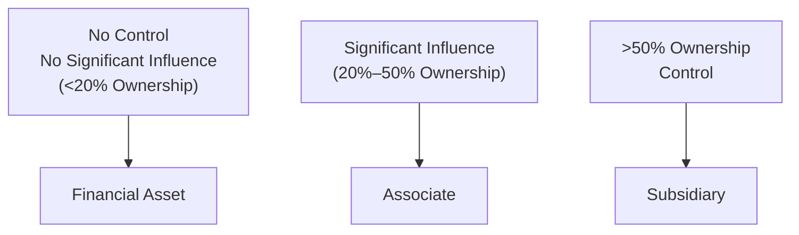

## Introduction
Sometimes, when people first hear about classifying intercorporate investments, they assume it’s always about the ownership percentage—like a quick “less than 20% equals financial asset, more than 20% means associate.” But, well, that’s only part of the story. I once knew an analyst who automatically chose the equity method for any investment above 20% and realized days later that he’d missed critical facts about actual influence rights. Cue a scramble and a few exasperated phone calls.

So, what’s going on under the hood? In this section, we’ll walk through the fundamentals of how IFRS and US GAAP classify investments, why “significant influence” matters, and how financial reporting changes based on the classification. We’ll also explore the equity method for associates, focusing on the real differences in measurement and reporting between “financial asset” categories and “associates.”

## IFRS vs. US GAAP: Classification Basics
Under IFRS, intercorporate investments in another entity’s shares or debt securities are generally accounted for under IFRS 9 (Financial Instruments). Meanwhile, US GAAP primarily draws on ASC 320 (Investments—Debt and Equity Securities) for classifying securities and ASC 323 (Investments—Equity Method and Joint Ventures) for associates.

The big question: Do you have “significant influence”? If yes, you typically use the equity method (making it an associate). If no, you’ll classify it as a financial asset (or liability, but let’s keep it straightforward here) with one of the recognized sub-categories. Let’s break each one down:

### IFRS 9 Categories
• Amortized Cost: This applies to financial assets held with the objective to collect contractual cash flows (that are solely payments of principal and interest).  
• Fair Value Through OCI (FVOCI): This classification is for certain debt instruments (and in some cases equity) held under a “hold to collect and sell” business model, or for equity investments designated at FVOCI.  
• Fair Value Through Profit or Loss (FVTPL): If you’re actively trading or your instrument doesn’t qualify for the other categories, you typically record gains/losses through the income statement.

### US GAAP Categories
• Trading Securities: Debt or equity securities actively bought and sold in the near term. They’re measured at fair value, and changes flow through net income.  
• Available-for-Sale (AFS) Securities: Measured at fair value, but unrealized gains/losses go through Other Comprehensive Income (OCI) until realized or impaired.  
• Held-to-Maturity (HTM) Securities: These are debt securities you have both the ability and the intent to hold to maturity. They’re recognized at amortized cost.

## The Equity Method for Associates
Let’s say you’ve determined that your investment is not “just” a financial asset. Instead, you have significant influence—maybe you own 25% of the voting shares, or you have a seat on the board, or you’re deeply involved in setting the material policies of the investee. That often demands the equity method. 

Under the equity method, the carrying value of your investment fluctuates with the investee’s performance and distributions:

$$
\text{Carrying Value}_{\text{end of period}} 
= 
\text{Carrying Value}_{\text{beginning of period}} 
+ \text{(Investor’s share of the investee’s net income)} 
- \text{(Investor’s share of the investee’s dividends)}
$$

Any recognized OCI items at the investee level might also affect the investor’s carrying amount, depending on the relevant standards. The gist is:  
• Dividends received are not recognized as income. Instead, they reduce your investment balance.  
• Your share of the associate’s net income or loss hits your P&L.  

In contrast, under a fair value approach (like IFRS 9 FVTPL or US GAAP trading securities), dividends are recognized directly as income, and changes in the market price are recorded as unrealized gains or losses.

## Indicators of Significant Influence
Of course, the “20%-50%” ownership rule is only the starting framework. Sometimes you’ll own 15% but have strong contractual or board-level powers, letting you exert significant influence. Other times you might have 25% but no real involvement. IFRS and US GAAP typically provide a list of indicators, such as:
• Representation on the board of directors, or equivalent governing body.  
• Participation in policy-making processes.  
• Material intercompany transactions.  
• Exchanging managerial personnel.  
• Providing essential technical information.  

If these indicators are present, you likely have significant influence, even if your ownership stake is below 20%. On the flip side, you can surpass 20% but still not exercise real influence—maybe you’re merely a passive investor with no say in strategic decisions.

## Example Scenario
I recall a client scenario in which a company, let’s call them “Maple Corp,” bought 18% of another firm’s shares. Maple got the right to appoint a board member (which they totally did) and had a major voice in how the other firm set R&D budgets. Even though they held under 20%, the rightful approach was the equity method, because Maple’s involvement in big decisions qualified as significant influence. If Maple had sat back with no real voting input, the story might have been different—a classic “financial asset at fair value” scenario.

## When Classification Changes
Classification isn’t always static. If you start with a 15% stake and then purchase more shares—or sign an important agreement—that pushes your level of influence higher, you might move from “financial asset” to “associate.” IFRS typically requires a remeasurement of your previously held interest to fair value, with any resulting gain or loss recognized immediately (often in profit or loss). US GAAP has similar but not identical requirements under remeasurement, and the details can get a bit tricky.

Equally, giving up influence (like losing your board seat or selling shares that drop you below the threshold) could flip you back to a fair value treatment. From an exam perspective, always be on the lookout for vignettes describing changes in ownership percentage or changes in how the companies work together.

## Impact on Financial Ratios
This is huge for exam scenarios. If you account for the investment as a financial asset at fair value, you’ll reflect changes in value either in the income statement or in OCI, not as a direct part of your net income or operating performance. By contrast, if you use the equity method:
• You’ll show your portion of the investee’s profit or loss in your income statement.  
• Dividends are not income—they’re considered a return of capital.  

Profit margin, return on equity, and even leverage ratios can shift significantly depending on the classification. For instance, if you classify the investment as an associate and suddenly pick up a percentage of that associate’s net income, your reported net income could look much beefier.

## Best Practices and Pitfalls
• Always read the footnotes. Sometimes you’ll see a 10% stake that’s accounted for using the equity method. This might reflect a deeper relationship, so watch out.  
• Watch out for IFRS 9 classifications—particularly “Amortized Cost” vs. “Fair Value.” The business model and the contractual cash flow characteristics matter a lot.  
• Realize that in US GAAP “Available-for-Sale” and “Trading” classifications differ primarily in where unrealized gains/losses go: net income or OCI.  
• Keep an eye on remeasurement triggers: Are you stepping up from 15% to 30%? If so, you might have to revalue everything at fair value on the day of the transaction.  
• Dividends from associates are not “dividend income” under the equity method—they reduce your investment account. This often confuses new folks.  

## Visual Overview
Below is a simplified decision flow to help you visualize how ownership percentages and influence typically guide classification:

Remember, actual classification depends on more than just ownership percent, so treat this chart only as a starting point.

## Concluding Thoughts
Sometimes I joke that if you can keep track of your teenage cousin’s complicated relationships, you can handle intercorporate investment classification just fine. It’s all about reading the fine print (footnotes) and assessing real influence, not just ownership percentages. For the CFA exam, be ready to spot subtle hints—like board seats, major contract approvals, or R&D sharing arrangements—indicating significant influence. 

There’s nothing quite like the moment you see a question about “Why is this 19% stake accounted for using the equity method, anyway?” and realize, “Oh, they hold the key to the board! That’s why!” 

Stay attentive to these details, and you’ll be in good shape for exam day.

## References
• International Accounting Standards Board (IASB) – IFRS 9: Financial Instruments (https://www.ifrs.org)  
• Financial Accounting Standards Board (FASB) – ASC 320 (Investments—Debt and Equity Securities) & ASC 323 (Investments—Equity Method and Joint Ventures)  
• “International Financial Statement Analysis” by Thomas R. Robinson et al. (CFA Institute Investment Series)  

## Test Your Knowledge: Financial Asset and Associate Classifications



### Which IFRS 9 category measures financial assets primarily at amortized cost?
- [ ] Fair Value Through Profit or Loss
- [ ] Fair Value Through OCI
- [x] Amortized Cost
- [ ] Trading Securities

> **Explanation:** Under IFRS 9, amortized cost classification is reserved for financial assets whose sole objective is to collect contractual cash flows (principal and interest), provided the business model meets the criteria.  

### Under US GAAP, which classification generally records unrealized gains/losses in OCI?
- [ ] Trading securities
- [x] Available-for-sale securities
- [ ] Held-to-maturity securities
- [ ] Equity method investments

> **Explanation:** AFS (Available-for-sale) securities carry unrealized gains/losses in Other Comprehensive Income until realized or deemed impaired. Trading securities, by contrast, record gains/losses in net income.  

### An investor owns 30% of an investee’s voting shares. There are no other contractual or governance arrangements. Under most circumstances, how should the investor account for this?
- [ ] Fair value through OCI
- [x] Equity method
- [ ] Fair value through net income (FVTPL)
- [ ] Amortized cost

> **Explanation:** A 30% stake typically suggests significant influence. Unless proven otherwise, the equity method applies.  

### Which of the following items will reduce the carrying value of an associate under the equity method?
- [ ] Unrealized gains on the associate’s stock price
- [x] Dividends paid by the associate
- [ ] Changes in the investor’s share of the associate’s net income
- [ ] Impairment recognized in OCI

> **Explanation:** When the associate pays dividends, they reduce the investor’s carrying amount because dividends are considered a return of capital, not income, under the equity method.  

### Which scenario could trigger the remeasurement of a previously held interest to fair value under IFRS?
- [x] Moving from a 15% to a 25% interest, gaining significant influence
- [ ] Acquisition of an additional 1% when the investor already has 51% ownership
- [ ] Selling shares that reduce ownership from 20% to 10%
- [ ] No equity share changes but seconding a junior staff member to the investee

> **Explanation:** If you cross the line to significant influence (for example, from 15% to 25%), IFRS requires remeasuring the previously held interest to fair value, recognizing gains/losses in profit or loss.  

### Which of the following generally increases the investor’s equity method investment account?
- [x] The investor’s share of the associate’s net income
- [ ] The investor’s share of the associate’s dividend payments
- [ ] Conversion of trading securities to available-for-sale
- [ ] Amortization of bond discounts under held-to-maturity classification

> **Explanation:** Under the equity method, the investor’s share of net income directly increases the carrying value of the investment.  

### An investor holds 18% of a company’s voting shares but is granted two board seats and participates in key strategic decisions. Which accounting method is most appropriate?
- [ ] Accounting as a trading security
- [x] Equity method
- [ ] Held-to-maturity
- [ ] Fair value through profit or loss

> **Explanation:** Even with under 20% ownership, the presence of actual board participation and strategic involvement signals significant influence, calling for the equity method.  

### A financial asset classified as FVOCI under IFRS 9 will:
- [ ] Recognize all dividend income in retained earnings
- [ ] Measure dividends as a reduction in the carrying value
- [x] Recognize unrealized gains/losses in OCI until disposal
- [ ] Recognize unrealized gains/losses in net income

> **Explanation:** Under FVOCI, unrealized gains/losses remain in Other Comprehensive Income until the asset is sold or otherwise derecognized.  

### Which of the following is a key difference between a trading security under US GAAP and an investment classified as FVTPL under IFRS 9?
- [ ] Trading securities record unrealized gains/losses in OCI while FVTPL recognizes them in net income
- [x] Both record unrealized gains/losses in net income
- [ ] Trading securities are measured at amortized cost, while FVTPL uses fair value
- [ ] FVTPL doesn’t allow realized gains/losses to flow through net income

> **Explanation:** Under both US GAAP trading securities and IFRS 9 FVTPL, unrealized gains/losses are reported in net income (profit or loss).  

### If an investor does not have significant influence and intends to hold a debt instrument to maturity, it should be classified under US GAAP as:
- [x] True
- [ ] False

> **Explanation:** Under US GAAP, a debt instrument intended and able to be held to maturity is recorded as held-to-maturity (HTM), typically measured at amortized cost.  


