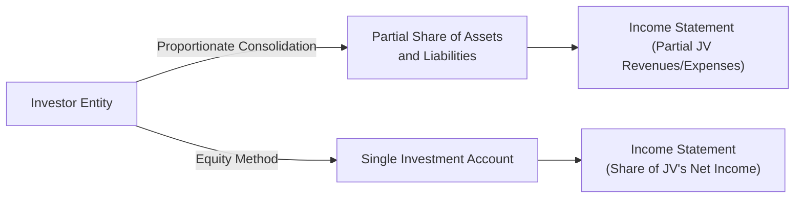

## Understanding the Nature of Joint Ventures

Well, let’s admit it: when you hear about investing in a “joint venture,” you might picture two corporate giants shaking hands and pouring resources into some massive project. Possibly an automobile manufacturer teaming up with a tech company on electric vehicle R&D, or energy giants working together in offshore drilling. But from an accounting perspective, a joint venture (JV) has a more precise meaning: it’s a contractual arrangement between two or more parties with joint control over a separate entity’s relevant activities. Each venturer typically shares strategic and operating decision-making. The result for the accountant? A puzzle: how do we record this arrangement on our books?

Under IFRS (particularly IFRS 11, Joint Arrangements) and US GAAP (mainly ASC 323 for equity method investments, with guidance also in ASC 810 for consolidation), the default approach for joint ventures is the equity method. Occasionally, there’s an opportunity—especially under IFRS—for what’s called proportionate consolidation, but that usually arises in “joint operations,” not typical JVs. More on that soon.

I once got stuck explaining to a new analyst why we can’t just fully consolidate a joint venture, even if we own 50% or more. She was new on the job, and her gut feeling was: “Hey, 50% is half; let’s just bring everything in proportionally.” The confusion is understandable—the deeper reasoning is that you don’t really unilaterally control that joint venture. You must share major decisions with the other venturer(s). Control is split, so your own financial statements reflect your share in a different way.

## IFRS vs. US GAAP: The Accounting Methods

Under IFRS 11, there are two distinct types of joint arrangements:

• Joint Operation: When each party has rights to the assets and obligations for the liabilities of the arrangement. Typically leads to proportionate recognition of the arrangement’s assets, liabilities, revenues, and expenses.  
• Joint Venture: When each party owns a stake in a separate vehicle (often a legal entity) over which they share control. Here, IFRS requires using the equity method—meaning you don’t just fully bring in your portion of the JV’s assets and liabilities line by line; you record a single “Equity Investment” asset on your balance sheet, adjusted over time for your share of the JV’s profits or losses.

Under US GAAP, the typical scenario for a joint venture also demands the equity method, unless specific industry exceptions come into play (for instance, certain specialized industries or unique transactions). Thus, proportionate consolidation under US GAAP is extremely rare in practice, reserved for a narrow set of situations.

## Proportionate Consolidation: How It Works

Proportionate consolidation is a method through which each venturer reports its share of every single line item—in other words, for the portion you own, you include your fraction of cash, receivables, fixed assets, and the related liabilities, revenues, and expenses of the JV in your own financial statements. If you own 30% of the JV, 30% of its accounts receivable show up under “Accounts Receivable” on your balance sheet, and so on across the income statement and statement of financial position.

Proportionate consolidation contrasts with full consolidation (where the parent consolidates 100% of the subsidiary’s line items and then sets aside a noncontrolling interest for the portion it doesn’t own) and with the equity method (which combines the investment into a single line item). Here’s a quick visual to help cement these differences:

• Under proportionate consolidation: Our friend the investor entity picks up a slice of each JV line item.  
• Under the equity method: That same investor lumps everything into one “Investment in JV” asset and one “Share of Income (Loss)” line on the income statement.

### Key Advantages and Considerations

• Enhanced Visibility: Proportionate consolidation allows investors and other stakeholders to see the direct contribution of the JV’s operations to your entity’s resources and obligations.  
• Complexity: Tracking each fraction of the JV’s line items can be more cumbersome than the equity method.  
• Ratio Effects: Because proportionate consolidation increases your reported assets and liabilities, leverage and liquidity metrics can shift significantly, sometimes painting a more “leveraged” picture relative to the equity method.

## The Equity Method

The equity method, especially for a joint venture, is often simpler on the face of the venturer’s financial statements because you have a single-line entry for your investment. That line item is generally measured at cost initially; after that, you adjust it each period by your share of the JV’s net income or loss. Dividends or distributions from the JV reduce the carrying amount of your investment (since you’re effectively getting your investment value back as cash).

Let’s say I own 40% of a JV. The JV makes a net profit of $1 million during the year. My portion of that JV’s earnings is $400,000, which increases the carrying value of the investment on my books. On the income statement, I’ll simply show “Equity Income from Joint Venture: $400,000.” If the JV pays out dividends of $200,000 to me, I reduce my investment by $200,000. So yeah, it’s a neat and tidy approach.

### Why the Equity Method for Most Joint Ventures?

• Shared Control: Because no single party calls all the shots, you’re effectively in partial control.  
• Aligns with Economic Reality: You benefit from your share of net assets, so you reflect it on your balance sheet.  
• IFRS & US GAAP Consistency: Both frameworks consider proportionate consolidation for joint operations (or for certain specialized industries under US GAAP), not the typical JV structure.

## Impact on Financial Ratios

Here’s the big question we face as analysts: “How does the chosen method matter for ratio analysis?” Well, a lot. For example, if you proportionately consolidate a JV that is heavily leveraged, your own entity’s debt ratio might balloon. Similarly, your current and quick ratios might look less favorable because you’re pulling in a bigger chunk of current liabilities. Meanwhile, under the equity method, you might show just a single net investment line item, leaving your liabilities ratio lower. This discrepancy can be mind-bending if you’re trying to compare two companies in the same industry that account for their JVs differently.

### Illustrated Example in a Table

Below is a simplified comparison of how proportionate consolidation vs. equity method can affect selected ratios. Assume the same JV interest in both approaches, and assume that the JV itself is relatively leveraged:

|                            | Proportionate Consolidation                        | Equity Method                          |
|----------------------------|-----------------------------------------------------|----------------------------------------|
| Balance Sheet Presentation | Each line item (assets, liabilities) proportionate | Single investment line                 |
| Leverage Ratio (D/E)       | Typically higher                                   | Typically lower                        |
| Current Ratio              | Could decrease if JV has high current liabilities  | No line-by-line effect; net impact is smaller |
| Net Income                 | Recognize share of revenues/expenses proportionally | Show share of net income in one line   |
| Transparency               | More detail on assets & liabilities                | Less detail, simpler presentation      |

## Practical Example: Oil & Gas Exploration

Imagine two oil giants—Callisto Energy and Aurora Drilling—forming a new entity, DeepOcean JV, to explore a promising undersea field. Under IFRS:

• If each entity claims direct rights to some physical oil rig assets and obligations for the decommissioning liabilities, they might call that a “joint operation.” Each party would proportionately consolidate those assets and liabilities.  
• If, however, DeepOcean JV is legally and economically independent, and the two giants only share in its net results, that’s a classic “joint venture.” So IFRS demands the equity method.

In some real transactions, we see partial overlap—maybe you have a JV for exploration but share pipeline assets proportionately. That’s one reason IFRS 12 demands robust disclosures: so readers can get the story behind your “joint arrangement” classification and see the associated risks. As an investor or analyst, you want to know: Are you on the hook for half the site cleanup if that well runs dry?

## Shifting Between Proportionate Consolidation and the Equity Method

Sometimes an entity’s classification changes from a joint operation to a joint venture, or vice versa. Under IFRS, this shift can prompt significant changes in your reported numbers. For instance, if you initially accounted for your arrangement under proportionate consolidation because it met the criteria for a “joint operation,” but then it transitions to a structure that meets the definition of a “joint venture,” you’d have to stop proportionate consolidation and adopt the equity method. Assets and liabilities previously recognized on your books for your share of the arrangement might come off your balance sheet, replaced by a single investment line item. That can turn your financial statements on their head—from dramatic changes in reported leverage to different profitability metrics. For managers and analysts, it’s vital to maintain consistency and carefully note the date and reason for the reclassification.

## Some Common Pitfalls and Best Practices

• Overlooking Disclosure Requirements: IFRS 12 requires extensive disclosure on joint arrangements, including the nature of the arrangement, any management judgments used in classification, and future funding commitments. US GAAP also expects thorough disclosure in the notes.  
• Confusing Joint Control with Significant Influence: If you have significant influence (ASC 323, IAS 28) but not joint control, you still use the equity method—but it’s no longer a “joint venture.”  
• Ratio Comparability Issues: Don’t forget to adjust ratios for proportionate consolidation when comparing to peers using equity accounting (and vice versa). Adjusting or reclassifying statements can help you compare apples to apples.  
• Industry Exceptions: A couple of industries (e.g., construction or real estate ventures) historically used proportionate consolidation more frequently under older rules. IFRS 11 changed the playing field significantly, so be sure you understand current standards.

## Personal Reflections

I vividly recall a time early in my career—I was tasked with analyzing a large Canadian mining company that had multiple “joint ventures” across the globe. At first, I found it odd that one JV was reported line by line (proportionate consolidation), while three others showed up as a single “Investments in Associates and JVs” line. After deeper digging, I learned the first arrangement was actually a “joint operation” focusing on a specific exploration zone. The other three were typical JVs—full-blown separate legal entities. That’s the nuance IFRS wants us to catch—and it’s also a perfect example of how an analyst might incorrectly assess the company’s risk profile if they fail to notice these accounting differences.

## Final Thoughts on Joint Ventures

Joint ventures can appear in just about any industry—tech, automotive, energy, pharmaceuticals. Each party’s interest in a JV is shaped by the contractual design. IFRS 11 and ASC 323 revolve around the common theme of “no unilateral control,” so equity method usage is the norm for JVs. Meanwhile, proportionate consolidation is reserved for joint operations under IFRS or for the narrow exceptions under US GAAP. From an analyst’s perspective, it’s crucial to understand that the same real economic arrangement could look quite different on the statements, all depending on the classification. So if you ever see large amounts of assets or liabilities appear on someone’s balance sheet “out of nowhere,” you might suspect a proportionately consolidated joint operation creeping in.

Be sure to keep your eyes open for disclosures clarifying the difference between a standard JV and a joint operation. Check out IFRS 12 for those. If the arrangement is indeed a JV, watch how the equity method might mask certain leverage or liquidity issues that proportionate consolidation might have made more visible. By being aware of these differences, you can better interpret the numbers and maybe even spot interesting investment or risk insights.

## Additional References & Further Exploration

• IASB – IFRS 11: Joint Arrangements  
• IASB – IFRS 12: Disclosure of Interests in Other Entities  
• FASB – ASC 810: Consolidation  
• FASB – ASC 323: Investments—Equity Method and Joint Ventures  
• Deloitte’s “iGAAP 2022—A Guide to IFRS Reporting”: Detailed guidance on classifying and accounting for joint arrangements  

Anyway, that’s the essential story on proportionate vs. equity method for joint ventures. Best of luck exploring all those footnotes in company reports—where the real fun begins!

## Test Your Knowledge: Joint Ventures Accounting Quiz



### Which IFRS standard primarily deals with joint arrangements such as joint ventures?
- [ ] IFRS 9
- [x] IFRS 11
- [ ] IFRS 16
- [ ] IFRS 10

> **Explanation:** IFRS 11 (Joint Arrangements) is the key standard dealing with joint operations and joint ventures. IFRS 9 covers financial instruments, IFRS 16 covers leases, and IFRS 10 covers consolidated financial statements.

### Under IFRS, which method is generally used to account for a joint venture?
- [ ] Full consolidation
- [ ] Fair value through profit or loss
- [x] Equity method
- [ ] Proportionate consolidation by default

> **Explanation:** IFRS 11 requires that typical joint ventures be accounted for using the equity method. Proportionate consolidation is generally applied only to joint operations.

### When proportionate consolidation is used, how does the venturer reflect the joint venture’s assets and liabilities on its own statements?
- [ ] They are excluded entirely
- [ ] They are lumped into a single “Equity Investment” line
- [x] The venturer reports its share of each asset and liability
- [ ] They appear only in the notes

> **Explanation:** Under proportionate consolidation, each venturer includes its share of the JV’s assets, liabilities, revenues, and expenses directly in its financial statements.

### Which of the following is a typical impact of proportionate consolidation on the venturer’s financial ratios?
- [ ] Decreases leverage ratios due to netting out liabilities
- [ ] Improves current ratio as liabilities are not consolidated
- [x] Potentially increases leverage ratios compared to the equity method
- [ ] No effect on any ratios

> **Explanation:** Because proportionate consolidation brings in the JV’s liabilities (on a proportionate basis), leverage ratios may appear higher than they would under the equity method.

### In a typical real-world scenario, which method is more frequently used for joint ventures under US GAAP?
- [ ] Proportionate consolidation
- [ ] Full consolidation
- [x] Equity method
- [ ] Fair value measurement

> **Explanation:** US GAAP generally mandates using the equity method for JVs, while proportionate consolidation is rare except for some narrow industry-specific exceptions.

### What is the rationale behind using the equity method for joint ventures?
- [ ] The venturer unilaterally controls the JV
- [x] The venturer shares control and recognizes only its share of net assets
- [ ] The JV has unlimited liability
- [ ] The JV operates as a separate listed company

> **Explanation:** Joint ventures are typically defined by shared control, so only the investor’s share of net income, net assets, and distributions are recognized, consistent with the equity method.

### Which IFRS standard mandates significant disclosures about an entity’s interest in joint arrangements?
- [ ] IFRS 8
- [ ] IFRS 10
- [x] IFRS 12
- [ ] IFRS 15

> **Explanation:** IFRS 12 (Disclosure of Interests in Other Entities) sets out extensive disclosure requirements for subsidiaries, associates, joint ventures, and unconsolidated structured entities.

### If a joint arrangement changes from a “joint operation” classification to a “joint venture,” what is the primary accounting effect under IFRS?
- [ ] A shift from equity method to proportionate consolidation
- [x] A shift from proportionate recognition of assets/liabilities to the equity method
- [ ] No change at all
- [ ] The JV is fully consolidated

> **Explanation:** Joint operations are usually proportionately consolidated. A change to joint venture status would prompt adoption of the equity method, removing line-by-line items previously accounted for and replacing them with a single investment line item.

### Which statement best describes how IFRS 11 distinguishes between a joint operation and a joint venture?
- [x] Whether the parties have direct rights to assets/obligations for liabilities or a share in net assets
- [ ] Whether the parties are based in different IFRS jurisdictions
- [ ] Whether the arrangement is profitable
- [ ] Whether the parties own more than 60% collectively

> **Explanation:** Under IFRS 11, the classification depends on whether the parties have direct rights to and obligations for specific assets and liabilities (“joint operation”) or whether they only share in net assets (“joint venture”).

### A venturer owns 40% of a JV that reported $2 million of net income. How much income would be recognized under the equity method?
- [x] $800,000
- [ ] $2,000,000
- [ ] $400,000
- [ ] $1,200,000

> **Explanation:** Under the equity method, the venturer recognizes its share of the JV’s net income. 40% of $2 million is $800,000.


