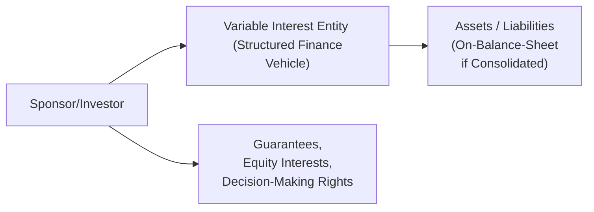

Variable interest entities (VIEs) often cause a bit of head-scratching for candidates—trust me, I’ve been there. During my first deep dive into VIEs (back when I thought all corporate control boiled down to voting shares), I realized that real-life accounting was way more nuanced. Sometimes, you end up controlling an entity not by traditional ownership of common equity or voting power but by controlling the decisions and bearing the risks. That’s exactly why standard-setters introduced the notion of variable interests and primary beneficiary criteria: to prevent creative off-balance-sheet structures that might otherwise keep liabilities hidden away.

Understanding how and why you might be required to consolidate a VIE is critical. From an exam perspective, you’ll be given disclosures, footnotes, or short vignettes about structured finance vehicles, securitized assets, or sponsor guarantees. Your task is to figure out who really “pulls the strings”—that is, who exercises control and enjoys the majority of the returns (or suffers the majority of the losses). This section strives to demystify VIEs under US GAAP’s ASC 810 guidance and compare it with IFRS 10 Consolidated Financial Statements.

A Quick Look at Variable Interest Entities

It’s tempting to think that all you need to do is look at voting rights to figure out who’s in charge. If Company A holds 51% of the voting shares in Company B, obviously Company A is the parent, right? Well, yes, in normal situations. But the tricky part is that some entities do not rely on typical voting shares or might have contractual or structural arrangements that give certain parties disproportionate rights or benefits. Such entities are typically referred to as VIEs (under US GAAP) or special purpose entities (SPEs) described under IFRS 10 as well.

VIEs are created for various reasons, often to achieve risk isolation, securitize assets, or optimize regulatory capital. For instance, a bank might transfer loans to a securitization vehicle that issues asset-backed securities to investors—yet the bank might guarantee certain losses. Even though the bank doesn’t hold a majority of the voting rights, it might still effectively control that entity by virtue of supporting it financially or bearing the majority of the potential losses. This is precisely what standard-setters want to capture and bring back onto the bank’s balance sheet if the bank is really the one in control.

Primary Beneficiary under US GAAP (ASC 810)

Under US GAAP, the concept of a primary beneficiary is crucial for VIE consolidation. The entity that has both:

• The power to direct the activities that most significantly affect the VIE’s economic performance, and  
• The obligation to absorb losses or the right to receive benefits that could potentially be significant to the VIE  

is the primary beneficiary. In simpler terms, think of it this way: if you can call the shots about how the VIE is operated (power), and if you are on the hook when losses happen (or if you reap most of the upside on the flipside), you probably have to put that VIE’s assets and liabilities onto your balance sheet.

The “power” aspect usually comes from contractual rights, such as the ability to select or replace managers, dictate investment decisions, or otherwise influence critical operations. The second piece—absorbing losses or benefitting from returns—reflects the risk-and-reward dimension. If the VIE is profitable, who gets the profits? If the VIE tanks, who’s left holding the bag?

Comparisons with IFRS 10

While IFRS doesn’t use the “VIE” phrasing, IFRS 10 Consolidated Financial Statements sets forth a similar three-pronged approach to identifying control of an investee:

1. Power over the investee (i.e., existing rights that give current ability to direct relevant activities).  
2. Exposure, or rights, to variable returns from involvement with the investee.  
3. The ability to use that power to affect the investor’s returns.

You can see that IFRS 10 is conceptually aligned with the US GAAP approach. Both revolve around (a) power, (b) variability of returns, and (c) the linkage between the two. IFRS 10 devotes substantial attention to de facto control, meaning even if you don’t hold more than 50% of voting rights, you could still have effective control if, for example, shareholders are widely dispersed and you’re the largest single holder or have contractual rights that let you influence decisions.

Securitizations, Structured Finance, and SPEs

Now let’s talk about what typically triggers these concerns. Structured finance vehicles are often created for securitizing mortgages, auto loans, or other cash-flow-generating assets. In many cases, the sponsor sets up an SPE that legally owns the assets and issues securities to outside investors. Meanwhile, the sponsor might promise to buy back any defaulted loans, provide credit enhancement, or sign a guarantee. On the exam, you’ll probably see a footnote describing these relationships.

If your structure includes:

• Significant risk retention (e.g., you’re guaranteeing the vehicle’s performance),  
• Subordinated debt tranches that you hold, or  
• Protective rights that let you make key decisions in times of trouble,  

then the standard-setters might say, “Wait, you’re actually controlling this entity via exposure to its variable returns—time to consolidate.” Keep in mind that consolidating means adding the SPE’s assets and liabilities onto your balance sheet, potentially inflating both sides and altering financial ratios. Suddenly, your leverage and risk profile become more transparent to users of financial statements.

Areas Where Variable Interests Appear

Variable interests can pop up anywhere. It’s not just about mortgages or credit cards. Think about:

• Leasing deals, where a lessee provides guaranteed residual values.  
• Factoring arrangements, where you sell receivables but still guarantee some portion of losses.  
• Partnerships or joint ventures that rely on contractual and financial support from one significant party.  
• Real estate holdings financed through special structures.  

Footnotes can get pretty dense, but that’s exactly where your exam scenarios might lead you. The question is whether you can parse them and determine if any single party meets both the power and losses/benefits criteria.

Case Study: A Hypothetical Securitization

Suppose MegaBank sponsors an entity—call it “MB Securitized Loan Trust”—to package a pool of commercial loans. Investors purchase securities in different tranches: senior and subordinated. MegaBank retains the equity piece (the riskiest part) and also signs a liquidity facility guaranteeing that if the Trust faces cash shortages, MegaBank will step in.

On paper, the trustee’s name is on the deal, and the majority of the beneficial interests (the senior notes) belong to outside investors. But guess who might be on the hook for losses if there’s a wave of defaults? That’s potentially MegaBank, due to the equity piece plus the liquidity guarantee. And guess who might be making big calls, like deciding whether to restructure bad loans? Likely MegaBank, given that they originated or negotiated the terms of these specialized assets.

Under ASC 810, you’d ask: Does MegaBank direct the activities that significantly affect MB Securitized Loan Trust’s performance? If yes, that’s “power.” And is MegaBank exposed to potentially significant benefits or losses from those activities through its retained interest and guarantees? Probably yes. Given that, MegaBank is the primary beneficiary—MegaBank consolidates that trust. Similarly, under IFRS 10’s model, you’ll see that the bank has both significant power and exposure to variable returns, so it must consolidate.

Why This Matters: Financial Statement Impact

Once consolidated, the VIE’s assets and liabilities appear on the sponsor’s balance sheet. This consolidation can affect:

• Debt/Equity and Leverage Ratios: If the SPE is heavily leveraged—and that’s often the case with securitizations—those liabilities will bulk up the consolidated totals.  
• Liquidity Ratios: Additional assets might boost current assets, but the associated current liabilities also rise.  
• Return Metrics: If the VIE’s net income or losses flow through the sponsor, it changes net margin calculations and other profitability metrics.  
• Off-Balance-Sheet Financing: The entire impetus for setting up the SPE might have been to keep liabilities off the balance sheet. Regulatory bodies and standard-setters want to ensure that if you’re truly on the hook, you can’t sidestep presenting that liability to your investors.

Under IFRS 10, the approach is quite similar. Preparation for your exam means practicing scenarios where you see an entity’s footnote describing, for instance, that “Entity X retains the residual interest in a loan receivable portfolio and has decision-making rights over workout procedures in the event of default.” That’s your clue that Entity X is directing the key decisions and is on the hook for losses.

Spotting Potential Pitfalls and Tricks

There are times you can get lulled into an incorrect conclusion if you only look at voting interest or if you misunderstand how risk is shared. A common pitfall is ignoring the nature of credit enhancements, residual interests, or contractual obligations that shift risk back to the sponsor. Another mistake is forgetting that the standard might require consolidation even if it’s a partial, indirect, or leveraged arrangement.

A Real-World Example (Anecdote)

I once worked on a scenario involving a renewable energy project with complicated financing from multiple investors. On the surface, the sponsor owned less than 15% of the equity, while an infrastructure fund held the rest. However, the sponsor guaranteed a minimum return to the fund and retained certain operating decisions related to power sales contracts. Turns out, the sponsor had “power” (through these operational vetoes and management rights) plus exposure to all the upside and downside once a certain threshold was passed. It was basically forced to consolidate the entire project, which significantly changed its reported debt levels. That’s the essence of variable interest—an arrangement that looks minor on paper but puts you squarely in control.

Mermaid Diagram of a Simplified VIE Relationship

Below is a simple diagram illustrating a sponsor-investor relationship with a VIE:

This diagram shows how the sponsor (A) can direct the VIE (B) by means of holding equity interests or contractual obligations (D). Once these obligations or ownership interests give the sponsor effective control, the VIE’s assets and liabilities (C) appear on the sponsor’s balance sheet.

When Exam Day Comes

From a test-taking perspective, look for these signals in footnotes or vignettes:

• Sponsor retains the residual equity.  
• Sponsor provides guarantees that protect other investors from the first chunk of losses.  
• Sponsor holds contractual rights to direct operational activities (like loan workouts, investment decisions, or strategic direction).  
• Sponsor receives a disproportionate share of the returns relative to its nominal ownership percentage.  

Conversely, if the sponsor just invests passively, or if it only holds a small, plain-vanilla debt investment with no credit enhancements or special rights, then it might not have to consolidate.

Another angle is IFRS 10’s explicit emphasis on the ability to use power to affect returns. The sponsor might have power in theory, but if it cannot actually influence the returns or is limited by other controlling interests, it might not consolidate. The details matter greatly.

Practical Guidance for Analyzing Disclosures

When analyzing a company that either sponsors or invests in structured vehicles, I tend to scan the footnotes carefully for terms like “residual interest,” “credit protection,” “guarantees,” or “liquidity arrangements.” Another big tip is to see if the sponsor is recognized as an “originator” or if it has a “subordination” or “equity piece” in the structure.

You might also see specific disclaimers: “XYZ Company is the primary beneficiary of ABC Trust and consolidates ABC Trust in its financial statements.” That’s your direct signal. However, exam questions often complicate matters by leaving that last step for you to determine. Make sure you know the IFRS 10 model in parallel with US GAAP. They aren’t identical in language, but the logic is the same: if you direct decisions and bear the brunt of the risk, the entity is yours to consolidate.

Beyond US GAAP and IFRS

Some local GAAP rules may exist in certain jurisdictions, but for the CFA exam, you should stick to IFRS and US GAAP. Regulators globally have become increasingly vigilant about off-balance-sheet exposures, and the impetus is to require consolidation whenever the investor truly “controls” the entity.

Key Takeaways

• Under US GAAP, the primary beneficiary of a VIE must consolidate if it has both (1) power to direct the entity’s significant activities and (2) absorbing/receiving the majority of the risks and rewards.  
• Under IFRS 10, control requires (1) power over the investee, (2) exposure or rights to variable returns, and (3) the ability to affect those returns.  
• Often, VIEs are structured to achieve off-balance-sheet treatment, particularly in securitizations, but if the sponsor has genuine exposure to risks and benefits, consolidation is required.  
• The exam might present complicated footnote disclosures describing tranches, credit enhancements, or guaranteed residuals. Practice identifying the “power” and “risk-and-reward” exposures that trigger consolidation.  
• Consolidation can significantly alter a sponsor’s financial metrics and increase transparency about its risk profile.

References and Further Reading

• IASB – IFRS 10 Consolidated Financial Statements  
• FASB – ASC 810, especially the guidance on Variable Interest Entities  
• PwC’s Financial Reporting Manual and other Big Four guides on consolidation  
• Various real-world financial statements and annual reports that include SPE or VIE disclosures (e.g., large banks, insurance companies, or real estate financing structures)  

Remember that your goal on exam day is to step through each arrangement and see who truly calls the shots and who is soaking up the losses or reaping the benefits. Once you know that, you’ll know who consolidates.

## Test Your Knowledge: Variable Interest Entities and Control



### Which of the following best describes a Variable Interest Entity under US GAAP?
- [ ] An entity that is majority owned by common shareholders.  
- [x] An entity where control is established through contractual or economic interests rather than voting rights.  
- [ ] Any subsidiary in which ownership exceeds 50%.  
- [ ] A partnership formed strictly for real estate investment.  

> **Explanation:** A VIE is structured so that control may be achieved through contractual or other means, not just by majority voting interests.

### Under US GAAP (ASC 810), the primary beneficiary of a VIE must:
- [ ] Have greater than 50% voting interest in the entity.  
- [x] Direct the VIE’s most significant activities and absorb the majority of the entity’s expected losses or gains.  
- [ ] Be the only equity holder of the VIE.  
- [ ] Engage in at least one related-party transaction with the VIE.  

> **Explanation:** To qualify as a primary beneficiary, an entity must have both the power to direct the VIE's key activities and the obligation to absorb losses or receive benefits that are potentially significant.

### Which of the following indicates power over a VIE?
- [ ] Owning non-voting preferred shares.  
- [ ] Assigning a shared board seat to a third party.  
- [ ] Having access to the VIE's financial statements.  
- [x] Holding contractual rights that allow decision-making on key operational matters.  

> **Explanation:** Power requires the ability to direct the activities that significantly impact economic performance. Contractual rights to make critical operational decisions reflect such power.

### Under IFRS 10, which condition is NOT explicitly required to demonstrate control?
- [ ] Power over the investee.  
- [ ] Exposure to variable returns.  
- [ ] The ability to use power to affect returns.  
- [x] Possession of a majority common equity stake.  

> **Explanation:** IFRS 10 focuses on power, exposure to variable returns, and the capacity to use power to affect returns. Simply having a majority equity stake is not explicitly mandated—IFRS recognizes de facto control in other ways.

### A sponsor sets up a mortgage securitization vehicle and retains the equity tranche, plus guarantees any first losses. If the sponsor also directs default workout policies, the sponsor likely:
- [x] Must consolidate the vehicle as the primary beneficiary under both IFRS and US GAAP.  
- [ ] Does not need to consolidate because outside investors hold the senior bonds.  
- [ ] Only needs to recognize its equity tranche but not consolidate.  
- [ ] Consolidates only if the sponsor’s equity stake is at least 20%.  

> **Explanation:** The sponsor has both the power (default workout decisions) and the majority of the risk and reward (equity position and first-loss guarantees), thus indicating consolidation under VIE or IFRS 10 rules.

### Which of the following is a warning sign that a sponsoring entity might have to consolidate a special purpose entity?
- [ ] The sponsor provides a small mezzanine loan.  
- [ ] The sponsor has no role in management or operations.  
- [ ] The sponsor only owns common equity with no additional guarantees.  
- [x] The sponsor retains significant residual interest and provides credit enhancements.  

> **Explanation:** Significant residual interests and credit enhancements typically imply risk exposure and control, triggering consolidation.

### According to IFRS 10, an investor with only protective rights over an investee:
- [ ] Always controls the investee.  
- [ ] Cannot control the investee unless it has at least 15% equity.  
- [x] Does not have power over relevant activities.  
- [ ] May consolidate if it has any exposure to losses.  

> **Explanation:** Protective rights (e.g., veto rights in limited circumstances) are insufficient to establish power. Active rights that affect key activities are necessary for consolidation.

### Which scenario most likely indicates that no consolidation is required?
- [x] The sponsor provides purely nominal financing without loss guarantees or decision control.  
- [ ] The sponsor has the right to replace managers at will.  
- [ ] The sponsor has guaranteed the vehicle’s performance up to a certain threshold.  
- [ ] The sponsor retains the equity portion and absorbs all residual risk.  

> **Explanation:** If the sponsor’s involvement is purely nominal and does not imply significant power or risk absorption, consolidation may not be required.

### Which statement about consolidating a VIE is correct?
- [ ] The VIE’s assets remain off the sponsor’s balance sheet.  
- [ ] Consolidation only affects the sponsor’s cash flow statement.  
- [ ] Consolidation has no impact on the sponsor’s leverage ratios.  
- [x] Consolidation brings the VIE’s assets and liabilities onto the sponsor’s financial statements.  

> **Explanation:** When a sponsor consolidates a VIE, it must report the VIE’s financial items as part of its own statements, thus altering balance-sheet-based metrics.

### True or False: Under IFRS 10, an investor with little to no equity ownership can still be deemed to control an investee.
- [x] True
- [ ] False

> **Explanation:** IFRS focuses on power, exposure to variable returns, and the ability to influence returns. Control does not necessarily require equity ownership in the traditional sense; contractual and other rights can suffice.


