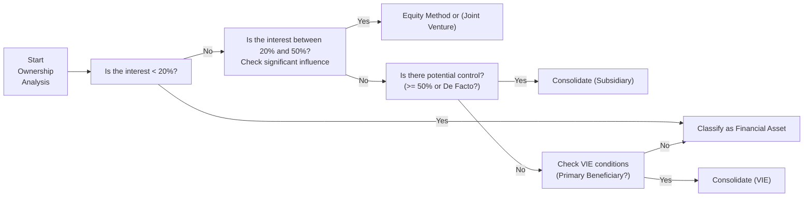

## Introduction to the Vignette Exercise

So, you’re sitting there staring at a complicated item set—multiple paragraphs of details about different entities, varying ownership levels, mentions of board seats, and talk about guaranteed returns. Sound familiar? When you reach CFA Level II, especially in Financial Statement Analysis, it's normal to feel a hint of panic—like, “Uh, how do I classify each of these investments on the parent’s financial statements?” The purpose of this vignette exercise is to help you figure out how to categorize a range of investments in practical exam-like scenarios, tying together IFRS, US GAAP, and real-world complexities. We’ll highlight typical triggers for classification changes (like going from 15% to 25% ownership) and show you how to parse text for subtle hints that an entity might need consolidation (or not!).

Let’s walk through the big puzzle: determining whether an investment is a plain-vanilla financial asset, an associate, a joint venture, or a special structure like a Variable Interest Entity (VIE). Don’t worry if you occasionally say, “Well, wait, that’s not how I originally read it.” Working step-by-step can save you from guesswork and help you lock in on the correct method.

## Recap of Key Categories

Before we jump into the vignette itself, let’s quickly bounce through the core investment categories and how they’re usually accounted for under IFRS and US GAAP. Keep your old notes from Level I handy if you need a refresher, but we’ll outline the major points here.

### Financial Asset (Minority Interest with No Significant Influence)

• Typically less than 20% ownership.  
• No board representation.  
• No power to participate in policy decisions or direct the entity’s strategic direction.  
• Measured at fair value through profit or loss (FVTPL), fair value through other comprehensive income (FVOCI), or—if it meets certain criteria—amortized cost under IFRS 9. Under US GAAP, classification could be trading, available-for-sale (prior to ASC 321 changes), or held-to-maturity for debt instruments.

### Associate (Significant Influence)

• Generally 20%–50% ownership.  
• Possibly a seat on the board of directors, or some other influence over policy decisions.  
• Accounted for using the equity method of accounting: The investor’s share of the investee’s net income flows into the investor’s income statement (in one line item), and the investment balance is adjusted for dividends, investee earnings, etc.

### Joint Venture (Joint Control)

• Often a 50/50 arrangement or similar structure indicating shared control.  
• Triggers equity method (or sometimes proportionate consolidation if it’s classified as a “joint operation” under IFRS 11).  
• Key hallmark: no single party can unilaterally direct the venture’s activities—decisions require consent from both parties.

### VIEs and De Facto Control

• Under US GAAP, you have the concept of Variable Interest Entities (VIEs). If you’re the primary beneficiary (i.e., you absorb the majority of risks and rewards, or have the power to direct the VIE’s significant activities), you must consolidate that entity, even if you own little to no majority voting interest.  
• IFRS has a similar approach under IFRS 10, focusing on the concept of de facto control. If the power to direct key operating decisions is effectively yours—even without majority voting rights—consolidation is required.

## Step-by-Step Classification Framework

While memorizing ownership thresholds is helpful, a lot of real-life or exam-like vignettes revolve around subtle hints about control or influence. You might read, “Investor X obtains two seats on the board and sets management compensation,” which is a pretty strong suggestion of significant influence. Or you might see, “Investor Y is exposed to the majority of potential losses and has guaranteed returns to outside parties.” That might mean Y is the primary beneficiary of a VIE.

To keep it straightforward, you generally want to run through these steps:

1. Ownership Percentage: Quick check—<20%, 20%–50%, 50%–100%.  
2. Qualitative Factors: Board representation, significant influence, protective rights.  
3. Potential VIE or De Facto Control: Are there special contractual structures? Guaranteed returns? Reputational or contractual support?  
4. Conclude on Classification: Financial asset, equity method, joint venture, or consolidation.  
5. Determine how it hits the financial statements (balance sheet, income statement, disclosures).

Below is a simple flowchart you might keep at the back of your mind (and hopefully replicate on scratch paper during the exam!) to systematically approach these questions:

## Practical Vignette: Multi-Entity Scenario

Let’s walk through a stylized but exam-like scenario. Suppose you’re analyzing the 20X5 financial statements of PQR Solutions, a mid-sized holding company. The CFO’s note discloses the following investments:

1. RedRock Inc. — PQR owns 15% of RedRock’s outstanding equity. PQR has no board representation but occasionally shares technology resources with RedRock.  
2. BlueWave Ltd. — PQR owns 25% of BlueWave. PQR’s CFO sits on BlueWave’s board and regularly participates in setting strategic direction.  
3. GreenTree JV — PQR has a 50% ownership and shares joint control with another investor. Both parties must agree on major decisions.  
4. SunRay SPV — PQR owns only 5% of SunRay’s equity but is contractually obligated to support any losses over a certain threshold. PQR also receives a performance-based fee from SunRay’s net income. The CFO acknowledges that PQR “bears the residual risks.”  

Alright, let’s parse each one step-by-step, matching them to the rules on classification.

### RedRock Inc. (15% Ownership, No Board Influence)

• Ownership is below 20%.  
• No meaningful input on the board or strategic decisions.  
• Conclusion: Likely a financial asset under IFRS or US GAAP, measured at fair value or amortized cost (if it meets debt instrument criteria, which isn’t specified here). Dividends would be recognized in income upon declaration, and any changes in fair value might hit either income or OCI, depending on classification.

### BlueWave Ltd. (25% Ownership, Board Seat)

• Ownership is 25%.  
• PQR’s CFO is on the board, actively influencing major decisions.  
• Conclusion: This is a textbook example of an associate under IFRS and US GAAP, triggering the equity method. PQR would recognize its share of BlueWave’s net income. Dividends from BlueWave reduce the carrying value of the investment on PQR’s balance sheet.

### GreenTree JV (50% Joint Control)

• Ownership is 50%.  
• Joint control is explicit: major decisions require both investors’ consent.  
• Conclusion: A joint venture. Under IFRS, the typical method is the equity method (unless IFRS 11 classifies it as a “joint operation,” which is rarer). Under US GAAP, it’s almost always the equity method for joint ventures. Income recognized in one line item, joint venture’s assets and liabilities are not fully consolidated.

### SunRay SPV (5% Equity but Bears Residual Risk)

SunRay is the trickiest. You see a small equity holding of only 5%, but PQR is obliged to absorb losses beyond a specified point. In addition, PQR is entitled to a performance-based fee, which might suggest an outsized exposure to variable returns. Under US GAAP’s VIE model, you would ask: “Are we the primary beneficiary?” The CFO’s admission that PQR “bears the residual risks” is a huge red flag for consolidation under a VIE framework.  
• Conclusion: Even though PQR only has 5% equity, it likely controls (or at least has the majority of risk/benefits in) SunRay. PQR should consolidate SunRay as a subsidiary under US GAAP. Under IFRS 10, you’d focus on whether PQR has power over SunRay, exposure to variable returns, and the ability to direct activities that affect returns (i.e., de facto control). It sounds like the situation meets these conditions.  

## How Classification Affects the Financial Statements

Aside from the purely academic classification, it’s worth mentioning that the choice of method has huge impacts on the reported numbers:

• **Total Assets**: With consolidation, you’ll see the entire entity’s assets (and liabilities) sweep onto your balance sheet. Under the equity method, you’d only show a single-line investment.  
• **Net Income**: If you consolidate, you recognize all the subsidiary’s revenue and expenses (with noncontrolling interest if you don’t own 100%). With the equity method, you recognize just your share of the net income. Financial assets typically report dividend income and changes in fair value, but you don’t see the underlying revenues and expenses.  
• **Equity**: Consolidation might inflate overall equity if the subsidiary has a large net worth. However, be mindful of any noncontrolling interests.  
• **Ratios**: Larger total assets and liabilities can shift key leverage and coverage ratios in ways that might alter how lenders and analysts view the company.  

Think about multi-year changes: if you buy more shares and cross a threshold (15% → 25%, for example), you might have a revaluation event, reclassify the investment, and adopt the equity method. That’s usually accompanied by a difference recognized in the income statement or in equity, depending on IFRS/US GAAP specifics.

## Comprehensive Example and Analysis

Let’s expand our scenario just a bit. Imagine that on January 1, 20X6, PQR purchased an additional 10% interest in RedRock Inc., pushing its stake from 15% to 25%. The CFO obtains one out of seven board seats and gets to weigh in on marketing and production budgets.  
• RedRock was previously measured as a financial asset. Starting on January 1, 20X6, you’d typically re-measure it at fair value on the date your classification changes (under IFRS, that’s often a recognized remeasurement gain/loss).  
• Then you switch to the equity method. That means going forward, you’ll pick up RedRock’s net income in your results. The initial carrying value becomes the new baseline, plus or minus your share of subsequent profits and dividends.  

One time, I personally managed a project assessing a mid-sized manufacturing subsidiary with exactly this sort of scenario. It was amazing to see how the classification shift changed the headline financial results for the parent: net income soared by an amount that reflected the share in the associate, while total assets (though recognized in a single-line item) also jumped in carrying value. You might be surprised how much attention management pays to these transitions, because they can highlight synergy—“we’re in deeper partnership now!”—or produce unexpected financial statement volatility.

## Common Pitfalls and Best Practices

1. **Ignoring Qualitative Factors**: Folks sometimes rely solely on the percentages. The classic slip is ignoring that a 15% stake might still come with a board seat or strong contractual rights.  
2. **Forgetting IFRS 10's De Facto Control**: Under IFRS, an investor might consolidate an entity even with ownership under 50% if other shareholders are passive or widely dispersed.  
3. **Misclassifying Joint Ventures**: Shared control is the key determinant. Just because you own 50% doesn’t automatically mean a JV—maybe you do have unilateral control. So watch for contractual clauses that block your ability to run the show alone.  
4. **Overlooking the VIE Model**: Some test-takers focus on equity percentages and forget that VIEs can exist with minimal ownership. Make sure you watch for phrases like “absorbs majority of risks,” “guaranteed returns,” “provides subordinated financial support,” or “has power to direct activities.”  
5. **Not Reassessing Over Time**: Classification can shift if you buy or sell more shares, or if new governance rights come into effect. In real life, if you’re signing a fresh contract or adjusting the board composition, you should reevaluate the classification.  

## Illustrative Table: Differences in Accounting Methods

Below is a quick reference table comparing four accounting treatments. Use it as a cheat sheet when facing exam vignettes:

| Method                                           | Typical Ownership | Key Indicators                 | Statement Impact                                                 |
|--------------------------------------------------|-------------------|--------------------------------|------------------------------------------------------------------|
| Financial Asset (FV/AC)                          | Usually < 20%     | No significant influence        | Invest at FV/AC, changes in FV to P&L or OCI, dividends in P&L   |
| Associate (Equity Method)                        | 20% – 50%         | Significant influence         | Single-line item for investment, share of income recognized      |
| Joint Venture (Equity Method or Proportionate)   | ~50% (joint)      | Joint control, contractual JV | Single-line equity method or proportionate (IFRS joint operation)|
| Consolidation (Subsidiary or VIE)               | Usually > 50%     | Control, primary beneficiary   | Full consolidation of assets/liabilities, minority interest shown|

## Looking Ahead: Reclassifications and Beyond

Throughout your CFA studies, you’ll run into more advanced situations like partial disposals, step acquisitions, impairment of equity investments, and intangible assets recognized on purchase. A big one is goodwill that arises if you consolidate or if you move from a nonconsolidating method to a controlling stake.

If you become an M&A analyst (or enjoy flipping through 10-Ks for fun), you’ll see these reclassifications happening in real companies all the time. Large conglomerates often have a hodgepodge: some associates accounted for under equity, a few subsidiaries consolidated, and maybe a special VIE or two. Our job as analysts is to see through these structures, ensuring that we don’t misread true leverage, true profitability, or the potential “hidden” assets and liabilities that might lurk in the footnotes.

## Additional References and Further Reading

• CFA® Program Curriculum (Level II)—Practice Assessment Items in Financial Reporting & Analysis.  
• IFRS.org – Implementation Examples for IFRS 10 (Consolidated Financial Statements), IFRS 11 (Joint Arrangements).  
• KPMG “Insights into IFRS”: Detailed scenario-based guides on classification and consolidation under IFRS.  
• US GAAP: ASC 810 (Consolidation), ASC 323 (Equity Method), and ASC 321 (Investments in Equity Securities).  

If time permits, it’s super helpful to skim through real corporate annual filings (e.g., Berkshire Hathaway or other holding companies) to see how they break down their interests in different affiliates. You might spot footnotes labeled “Equity Method Investments” or “Variable Interest Entities,” which can bring these concepts to life.

-----

## Test Your Knowledge: Intercorporate Investments Accounting Exercise



### Which of the following best describes the typical threshold for identifying an associate (under both IFRS and US GAAP)?

- [ ] Less than 10% ownership if the investor participates in daily operations.
- [x] Between 20% and 50% ownership with significant influence over investee decisions.
- [ ] At least 75% ownership with full operational control.
- [ ] Exactly 50% ownership, with an equal share of net assets.

> **Explanation:** An associate is usually defined as having significant influence, which often corresponds to an ownership stake between 20% and 50%. Lower ownership percentages typically signal financial assets, and 50% or more often implies control leading to consolidation unless defined as a joint venture.

---

### PQR Company owns 15% of ABC Corp. and has no board representation. PQR recognizes dividends in income and records changes in value through other comprehensive income. Which classification is this likely to be?

- [x] Financial asset measured at FVOCI.
- [ ] Joint venture with the equity method.
- [ ] Associate with partial consolidation.
- [ ] VIE requiring consolidation.

> **Explanation:** With only a 15% stake and no influence, PQR likely treats this as a financial asset. The mention of “changes in value through OCI” corresponds to FVOCI (IFRS) or classified as available-for-sale (legacy US GAAP terminology, though slightly updated in ASC 321). In any case, it’s not an associate or VIE.

---

### In a joint venture under IFRS 11 where parties share joint control, which accounting method is most often used?

- [ ] Full consolidation.
- [x] Equity method.
- [ ] Purchase method with goodwill.
- [ ] Fair value through profit or loss.

> **Explanation:** IFRS 11 generally requires using the equity method for joint ventures. Proportionate consolidation is reserved for “joint operations,” where each party has direct rights to assets and obligations for liabilities.

---

### An investor with only 5% ownership in a special-purpose entity (SPE) is obligated to absorb the majority of that SPE’s losses. Under US GAAP, this setup is most likely signaling:

- [x] The investor is the primary beneficiary of a VIE and must consolidate.
- [ ] The investor must use the equity method for an associate.
- [ ] The investor should classify it as an available-for-sale security.
- [ ] The investor has a passive minority stake, with no further accounting impact.

> **Explanation:** Under the US GAAP VIE model, absorbing the majority of an entity’s losses typically indicates primary beneficiary status, triggering consolidation, even with minimal ownership percentages.

---

### If an investor steps up ownership from 10% to 25% and gains a board seat in the investee:

- [ ] The investor continues using fair value if it wishes.
- [x] The investor likely remeasures to fair value and then applies the equity method going forward.
- [ ] The investee is reclassified as a VIE.
- [ ] No remeasurement or accounting change is required.

> **Explanation:** Moving from under 20% to over 20% (accompanied by significant influence) triggers reclassification from a financial asset to the equity method. IFRS often requires remeasuring the previously held interest at fair value, recognizing any gain or loss.

---

### Which of the following statements is correct regarding the equity method?

- [x] The investor reports a single-line item on the balance sheet for the investment and a single-line item for its share of net income on the income statement.  
- [ ] The investor consolidates all assets and liabilities of the investee.
- [ ] The investor only records dividends received as income.
- [ ] The investor must mark the investment to market each period.

> **Explanation:** Under the equity method, the investment is recorded in a single line on the balance sheet, and the investor’s proportionate share of the investee’s net income is recorded as a single-line item on the income statement. Dividends reduce the carrying value on the balance sheet.

---

### Which factor does NOT typically indicate significant influence under IFRS?

- [ ] Representation on the board of directors.
- [ ] Involvement in policy-making processes.
- [ ] Material transactions between investor and investee.
- [x] Passive investment with no contractual or governance rights.

> **Explanation:** Significant influence usually includes involvement in or authority over decision-making and policy processes. A passive investment with no special rights does not indicate significant influence.

---

### Under IFRS 10’s concept of “de facto control”:

- [ ] An investor must have at least 51% of voting rights.
- [x] Control can exist even with under 50% ownership if other investors are passive, making the investor effectively dominant.
- [ ] Joint ventures always result from de facto control.
- [ ] The term “de facto control” only applies in intangible asset valuation.

> **Explanation:** IFRS 10 stipulates that an investor can have control even without a majority stake if it can direct the relevant activities and if other shareholders are widely dispersed or likely to remain passive.

---

### A 50% ownership stake in an entity will definitely require which accounting approach?

- [ ] Full consolidation as a subsidiary.
- [ ] VIE consolidation under US GAAP.
- [x] An assessment of whether control is solely or jointly held.
- [ ] Measurement at fair value through other comprehensive income.

> **Explanation:** A 50% stake could mean joint control, leading to a joint venture classification. However, it’s possible that the investor has full control (or no control!) depending on the other owner(s). Hence, an assessment of actual control rights is needed before concluding on the accounting approach.

---

### True or False: Under US GAAP, an investor automatically gains the right to consolidate any investee in which it holds more than 50% of equity.

- [x] True
- [ ] False

> **Explanation:** Typically, more than 50% ownership implies control for US GAAP consolidation. However, do keep in mind VIE scenarios and IFRS 10’s stance on de facto control for IFRS. In standard circumstances, a majority of voting rights means the investor can consolidate, subject to special exceptions for VIE structures.


