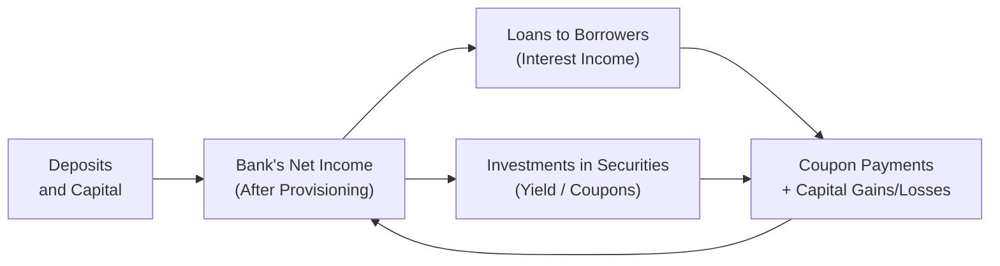

## Scenario Background

Imagine we have a mid-sized regional bank called “Arcadia Bank.” It was established 20 years ago, primarily serving small to medium enterprises and retail customers in a growing metropolitan area. Arcadia Bank’s regulatory environment falls under a jurisdiction that largely follows IFRS guidelines, though it also reports some supplementary disclosures aligned with US GAAP for its foreign listings. Kinda complicated, right? Well, hang in there. This scenario will give us the chance to see how IFRS vs. US GAAP differences can play out.

Arcadia Bank’s market focus is traditional banking: it collects deposits from customers and invests those funds primarily in various loan products—commercial real estate loans, small business lines of credit, and consumer auto loans. In recent years, it has also shifted some capital to fee-based services like asset management. But it’s still heavily reliant on net interest income.

The bank’s balance sheet is subject to IFRS 9 classification for financial assets. Under IFRS 9, Arcadia Bank must classify its financial instruments into categories such as amortized cost, FVOCI (fair value through other comprehensive income), or FVTPL (fair value through profit or loss). Meanwhile, its US GAAP supplementary disclosures categorize securities as held-to-maturity (HTM), available-for-sale (AFS), or trading, in line with ASC 320, with an expected credit loss model under ASC 326. 

## Corporate Profile Overview

Arcadia Bank at a glance:

• Total Assets: $30 billion  
• Loan Portfolio: $18 billion (dominantly commercial real estate and small-business loans)  
• Deposits: $22 billion (mix of retail and small business)  
• Equity: $2.4 billion (well-capitalized under local regulatory standards)  
• Net Interest Margin (NIM): 3.1%  

The bank also engages in off-balance-sheet items: it guarantees certain lines of credit to strategic corporate clients. Under IFRS, these are recognized if expected credit losses are probable, but under US GAAP, there might be a narrower recognition threshold. The bank’s risk management footnotes specifically mention that the largest portion of off-balance-sheet exposure stems from these unused credit commitments.

## Key Balance Sheet Items

Let’s take a look at simplified line items you might see in Arcadia Bank’s exam-style scenario:

Table: Selected Balance Sheet Excerpts (in USD millions)

| Item                             | Amount    | Notes                                                     |
|----------------------------------|-----------|-----------------------------------------------------------|
| Cash & Cash Equivalents          | 1,500     | High-quality, mostly short-term T-bills                   |
| Net Loans to Customers           | 17,500    | Net of allowances for loan losses under IFRS 9            |
| Investment Securities (AFS/FVOCI)| 6,000     | Government bonds, corporate bonds, some equity positions  |
| Property & Equipment             | 700       | Owned branches, data centers, net of depreciation         |
| Goodwill & Intangibles           | 300       | Acquired from a smaller bank merger a few years ago       |
| Other Assets                      | 1,000     | Derivatives (interest rate swaps), accounts receivable     |
| Total Assets                      | 30,000    |                                                           |
| Deposits                          | 22,000    | Mix of demand, savings, term deposits                     |
| Borrowed Funds                    | 4,000     | Medium-term notes, repo agreements, etc.                  |
| Other Liabilities                 | 1,600     | Accrued interest, derivatives liabilities, taxes          |
| Total Liabilities                 | 27,600    |                                                           |
| Equity                            | 2,400     | Common stock, retained earnings, other comprehensive inc.  |
| Noncontrolling Interests          | -         | Not applicable                                            |
| Total Liabilities & Equity       | 30,000    |                                                           |

## Income Statement Excerpts

Arcadia Bank’s net interest income and its fees drive profitability. Let’s say the bank reported:

• Net Interest Income (NII): $650 million  
• Provision for Credit Losses: $120 million  
• Net Fee & Commission Income: $180 million  
• Operating Expenses: $450 million  
• Net Income: $185 million  

Under IFRS 9, the Provision for Credit Losses arises from the Expected Credit Loss (ECL) model that requires Arcadia Bank to account for probability-weighted estimates of default and loss given default. Under US GAAP (ASC 326, often referred to as the Current Expected Credit Loss or CECL model), it’s somewhat similar but has certain differences in how expected losses are calculated for the entire life of the loan from day one. The effect? IFRS often has a more staged approach (Stage 1, Stage 2, and Stage 3) for measuring ECL, while US GAAP lumps them all into an immediate-lifetime approach. But the result is conceptually aligned: they both try to push for more forward-looking provisioning.

## Disclosure Footnotes

Arcadia Bank’s footnotes usually include:

• Risk Management Policy: The bank uses scenario analysis and stress tests to gauge potential losses, especially focusing on commercial property price cycles.  
• Capital Adequacy: Regulatory capital is measured in line with Basel III standards. Arcadia Bank currently maintains a Common Equity Tier 1 (CET1) ratio of 12.5%, comfortably above the regulatory minimum.  
• Liquidity Ratios: Arcadia’s Liquidity Coverage Ratio (LCR) stands at 130%, reflecting a robust short-term liquidity buffer.  
• Off-Balance-Sheet Exposure: Unused commitments of $2.5 billion, plus derivatives netting agreements that reduce the bank’s overall market risk exposure.  
• Sensitivity to Interest Rates: The bank estimates that a parallel increase of 100 basis points in interest rates could boost net interest income by roughly 2% over the next year—though it might hamper certain loan growth prospects.

## Risk-Related Events and Market Shifts

Now, let’s assume the environment changes. Suppose interest rates rise 75 basis points over the next quarter, the yield curve flattens a bit, and corporate clients become slightly more cautious in borrowing. Arcadia Bank notices:

• A modest slowdown in loan origination volumes.  
• Possible uptick in commercial real estate loan defaults if economic growth falters.  
• Potential improvement in net interest margin (NIM) due to repricing of variable-rate loans, albeit partially offset by higher deposit costs.  

Meanwhile, let’s say a minor recession fear triggers a slight market meltdown. Some of the bank’s investment securities in the AFS/FVOCI portfolio have fallen in fair value. Under IFRS 9, certain fair value declines are recognized in OCI; under US GAAP’s AFS category, declines might trigger an allowance for credit losses if the decline is attributable to credit factors.

## Analyzing IFRS vs. US GAAP Differences

Yes, IFRS’s ECL approach and US GAAP’s CECL approach both push for earlier recognition of credit losses—but the methods differ in details:

• IFRS 9 uses a three-stage model:  
  – Stage 1: 12-month ECL recognized if credit risk has not significantly increased.  
  – Stage 2: Lifetime ECL recognized if credit risk has significantly increased (but not defaulted).  
  – Stage 3: Asset is credit-impaired.  
• US GAAP (ASC 326) typically goes for lifetime expected credit losses on initial recognition (with some nuances for assets with credit deterioration).

For classification of securities:  
• IFRS 9: Business model and cash flow characteristics drive classification as amortized cost, FVOCI, or FVTPL.  
• US GAAP: We still see the triad: HTM, AFS, and Trading. Gains and losses from AFS securities often hit OCI unless they’re credit-related.

The net effect on Arcadia Bank? In practice, the differences might be subtle since the bank has well-established risk management processes. But exam items often ask you to see how these classification and provisioning rules alter financial statements and capital ratios over time.

## Credit Policies and Investment Portfolios

Arcadia Bank invests in high-quality government bonds as well as mid-grade corporate bonds. Under IFRS, certain mid-grade bonds might be at risk of Stage 2 classification if their credit risk has significantly increased. The bank’s management must decide whether these bonds are carried at FVOCI or FVTPL based on it’s “hold to collect and sell” vs. “hold to collect” business model.

Under US GAAP for the same bonds, the classification might differ (AFS vs. HTM), and credit losses for AFS securities could go through an allowance account rather than a direct write-down of the asset.

When analyzing investment portfolios for exam scenarios, keep these factors in mind:

• The recognized interest income might differ depending on amortized cost vs. fair value approaches.  
• Gains and losses from changes in fair value may flow through OCI or P&L.  
• ECL or CECL adjustments can shift the timing of credit-related expenses.

## Off-Balance-Sheet Exposures

Off-balance-sheet items can be tricky. Arcadia Bank has about $2.5 billion of unused credit lines—meaning it could face additional funding demands if clients draw down those lines. For IFRS, entities must measure ECL even on off-balance-sheet exposures like loan commitments and financial guarantees, applying a Stage 1–Stage 3 approach. Under US GAAP, similar CECL rules apply for off-balance-sheet credit exposures—like loan commitments over the contractual period. So if the exam question says, “Evaluate the significance of the bank’s off-balance-sheet exposures for solvency,” you’d investigate how these exposures could become actual liabilities if customers draw on them, forcing the bank to hold more capital or provisioning in worst-case scenarios.

## Ratio Assessments

Below are some quick ratio checks Arcadia Bank’s management might consider (and that you could too, if it shows up on your exam!). Let’s do a few small calculations. 

Loan-to-Deposit Ratio (LDR)  
LDR = (Total Loans) / (Total Deposits)  
= $18,000 million / $22,000 million ≈ 81.8%  

Banks generally like an LDR that’s neither too high (possible liquidity stress) nor too low (underutilization of deposit funds). An 82% LDR seems reasonable, though it’s near the middle for many banks.

Net Interest Margin (NIM)  
NIM = (Net Interest Income) / (Average Interest-Earning Assets)  
If we approximate average interest-earning assets at $21,000 million:  
NIM = $650 million / $21,000 million ≈ 3.1%  

This is a healthy margin for a mid-sized bank, in line with Arcadia’s reported figure. If rates rise, the bank’s NIM could expand—unless deposit rates reprice faster than loan yields, which sometimes happens.

Capital Adequacy Ratio  
Under Basel III, the numerator is typically composed of Common Equity Tier 1 capital (CET1) or total capital, while the denominator is risk-weighted assets. If Arcadia Bank has a CET1 ratio of 12.5% and the regulatory minimum is around 8%, they have a comfortable buffer. Good news for that test question that might ask, “Is this bank well-capitalized?”

## Potential Insurance Angle

If Arcadia Bank also had an insurance subsidiary, we’d be analyzing items like premiums earned, claims reserves, and a combined ratio. Suppose the insurance arm wrote $500 million in premiums, paid out $300 million in claims, with $100 million in operating expenses:

Combined Ratio = (Claims + Underwriting Expenses) / Net Premiums Earned  
= ($300 million + $100 million) / $500 million = 80%  

Below 100% indicates underwriting profit. But we have to be mindful of IFRS vs. US GAAP differences in how policy acquisition costs and claim reserves get recognized. IFRS 17 is the new standard for insurance contracts, while US GAAP has older guidance in ASC 944.

## Exam-Style Question Prompts

Here are some typical prompts you might see in a Level II item set:

• “Determine how an interest rate increase would affect Arcadia Bank’s net interest margin, and explain the key drivers behind that change.”  
• “Identify how the expected credit loss model (IFRS 9) influences Arcadia Bank’s loan loss provisioning assumptions when the economic environment deteriorates slightly, moving loans from Stage 1 to Stage 2.”  
• “Evaluate the significance of off-balance-sheet commitments in the bank’s overall solvency, and discuss how IFRS vs. US GAAP might treat these exposures differently.”  
• “Assess the bank’s capital adequacy ratio in light of a potential 10% increase in non-performing loans. Include IFRS guidelines for reclassifying assets if credit risk has substantially increased.”

A structured answer to each prompt would typically include:

1. A reference to the relevant accounting framework (e.g., IFRS 9 vs. CECL).  
2. A brief calculation or ratio if relevant.  
3. An interpretation of results—like liquidity risk, capital needs, or changes in interest income.  
4. A concluding statement linking the data back to the bank’s risk profile.

## Risk Factors in Focus

For financial institutions, you’ll want to watch:

• Credit Risk: Probability of borrowers defaulting, especially commercial real estate loans.  
• Market Risk: Movements in interest rates and bond yields affect the bank’s securities portfolio.  
• Operational Risk: System failures, fraud, or compliance issues can erode capital.  
• Liquidity Risk: If depositors withdraw funds unexpectedly, or if lines of credit are suddenly drawn.  

Examiners expect Level II candidates to identify how these risk categories pop up in the footnotes and what they mean for the bank’s ability to remain solvent and profitable.

## Open-Ended Regulatory Question

Looking ahead, imagine regulators toughen capital requirements or impose additional stress testing requirements. For instance, a new rule might push CET1 ratio minimums from 8% to 10%. How might that affect Arcadia Bank’s financial decisions? Possibly:

• Reassessing the loan portfolio to reduce risk weights.  
• Issuing new equity or retaining more earnings.  
• Repricing loans or deposit products to maintain margins while meeting higher regulatory thresholds.  

It’s a question with multiple angles, and that’s just what an exam item set might explore, challenging you to tie regulatory changes to the bank’s strategic and financial statement implications.

## Diagram: Financial Institution High-Level Flows

Below is a simplified illustration of a bank’s funds flow structure, showing deposits and capital powering loans and investments, with interest rate sensitivity in the mix:

## References

• “Financial Institutions Management” by Anthony Saunders and Marcia Millon Cornett.  
• BIS (Bank for International Settlements) – https://www.bis.org for Basel regulatory updates.  
• “Insurance Accounting and Systems Association” texts – https://www.iasa.org for insurance financial reporting.  

These sources can help you dig even deeper into capital adequacy, risk management, and the interplay between financial statements and real-world banking regulations.

## Test Your Knowledge: Financial Institution-Focused Scenario



### Which of the following balance sheet items is typically most impacted by IFRS 9’s three-stage Expected Credit Loss (ECL) model?

- [ ] Property & Equipment
- [x] Net Loans to Customers
- [ ] Goodwill & Intangibles
- [ ] Other Assets

> **Explanation:** Under IFRS 9, the ECL model directly affects the loan portfolio, requiring forward-looking provisioning. Property, goodwill, and other assets aren’t subject to this type of credit loss staging.

### When interest rates rise by 100bps, Arcadia Bank expects its net interest margin (NIM) to increase. Which of the following best explains why?

- [x] Variable-rate loans reprice faster than deposits.
- [ ] Deposit rates increase immediately, but loan rates are fixed long-term.
- [ ] The bank’s off-balance-sheet exposures shrink.
- [ ] The bank eliminates fee-based services.

> **Explanation:** The bank holds many variable-rate loans that allow for a quicker repricing upward, thus boosting interest income before deposit rates catch up.

### Under US GAAP’s CECL approach, which time horizon is used to estimate credit losses on loans?

- [x] Lifetime expected losses from day one
- [ ] Only 12 months of losses unless a default has already occurred
- [ ] No loss allowance needed if the loan is performing 
- [ ] A rolling 3-year historical average

> **Explanation:** CECL requires lifetime expected losses from the inception of the loan, differing from older “incurred loss” approaches.

### Which of the following statements about Arcadia Bank’s off-balance-sheet exposures is most accurate?

- [ ] They are recorded on the balance sheet at fair value.
- [ ] They have no impact on regulatory capital.
- [ ] IFRS does not require them to be measured for credit risk.
- [x] They can become actual liabilities if customers draw down lines of credit.

> **Explanation:** Unused commitments and guarantees remain off-balance-sheet until drawn or triggered, but they can convert into on-balance-sheet liabilities if utilized.

### If Arcadia Bank has a Loan-to-Deposit Ratio of 82%, which of the following risks does it most directly reflect?

- [x] Liquidity risk
- [ ] Operational risk
- [ ] Market risk
- [ ] Reputation risk

> **Explanation:** The LDR indicates the proportion of deposits lent out, highlighting potential liquidity pressure if customers suddenly withdraw funds.

### A combined ratio below 100% in the insurance sector indicates:

- [x] The insurer’s underwriting operations are profitable.
- [ ] A net underwriting loss.
- [ ] The insurer’s solvency ratio fails Basel III requirements.
- [ ] The insurer must increase customer premiums substantially.

> **Explanation:** A combined ratio under 100% means the insurer’s premiums are sufficient to cover claims and operating costs, signaling underwriting profitability.

### From a regulatory perspective, which of the following best represents Arcadia Bank’s capital adequacy framework?

- [x] Basel III guidelines and CET1 ratio
- [ ] IFRS 17 guidelines for insurance contracts
- [ ] Only GAAP methods for capital measurement
- [ ] None—capital adequacy is voluntary

> **Explanation:** Basel III is the global standard for determining capital adequacy, including the calculation of CET1 ratios.

### Which statement best describes how IFRS 9 classifies debt instruments?

- [x] Based on business model and cash flow characteristics
- [ ] Strictly as held-to-maturity or trading
- [ ] Always at fair value through profit or loss
- [ ] Using only historical cost

> **Explanation:** IFRS 9 uses an approach involving the entity’s business model for managing the instruments and the nature of the asset’s cash flows for classification.

### Why might the bank’s net interest income rise if rates increase, even though deposit rates also go up?

- [x] Loan repricing tends to be faster than deposit rate adjustments.
- [ ] The bank decides to waive credit risk monitoring.
- [ ] The ECL model eliminates provisions in a rising rate environment.
- [ ] Off-balance-sheet items vanish when rates go up.

> **Explanation:** Variable-rate assets typically adjust faster, so the bank sees an immediate bump in interest income before deposit costs fully catch up.

### True or False: IFRS 9 requires recognition of expected credit losses on off-balance-sheet loan commitments as soon as they are granted.

- [x] True
- [ ] False

> **Explanation:** IFRS 9 mandates ECL calculations for undrawn loan commitments (off-balance-sheet exposures), applying the same staging considerations used for on-balance-sheet loans.


