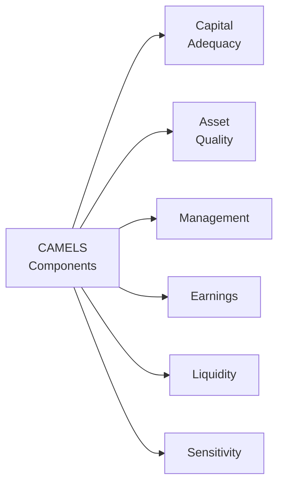
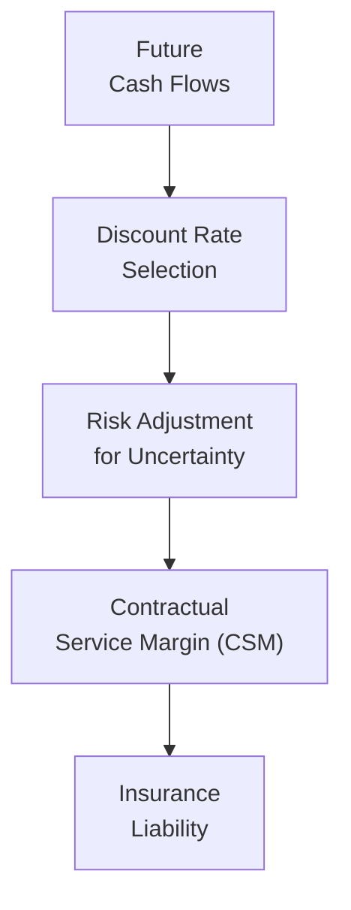

## Introduction

So, you’re probably thinking, “CAMELS? Isn’t that more about deserts than finance?” That was my first reaction, too—believe it or not. But the CAMELS framework is a crucial regulatory tool used to assess the health of banks. Meanwhile, if you look at the insurance world, you’ve got an equally interesting set of liabilities to account for, especially when you consider IFRS vs. US GAAP. It’s all connected somehow. That’s what makes these topics so fascinating—and so testable on the CFA® Level II exam.

In this section, we’ll explore:
• The CAMELS rating system (Capital Adequacy, Asset Quality, Management, Earnings, Liquidity, and Sensitivity) for banks.  
• How insurance liabilities work in both property & casualty (P&C) and life insurance contexts—and how they differ.  
• IFRS vs. US GAAP differences for banks and insurers, with a special spotlight on IFRS 17, IFRS 4, and ASC 944.  
• Regulatory parallels: RBC (Risk-Based Capital), solvency margins, and the synergy between monitoring a bank’s CAMELS rating and an insurer’s RBC requirements.  

To drive these points home, we’ll embed a few mini-vignettes reminiscent of exam day item sets. This helps tie together the theory with practical scenarios, so you can more confidently tackle financial statement analysis under exam pressure.

## Overview of CAMELS

Regulators worldwide frequently use the CAMELS framework to evaluate a bank’s overall condition. Each letter stands for a critical component:

A strong bank typically has enough capital to absorb unexpected losses (Capital Adequacy), a high-quality asset base with minimal bad loans (Asset Quality), prudent and strategic governance (Management), robust profitability (Earnings), sufficient buffers to meet deposit withdrawals or debt obligations (Liquidity), and a measured approach to market changes (Sensitivity). Regulators—like the Federal Reserve in the United States or other central banks across jurisdictions—assign numeric ratings to each of these categories, often on a scale of 1 to 5, then sum up or combine those to form an overall rating.

Even if you never plan on working at a bank, understanding CAMELS is essential for analyzing financial statements and the stability of financial institutions. The exam loves to present you with bank-level disclosures about capital or risk exposures—then ask you to piece together how this might influence the bank’s solvency or risk profile.

### Capital Adequacy

Capital Adequacy is all about whether a bank has enough high-quality capital to weather losses. Regulators divide capital into tiers (commonly Tier 1 and Tier 2). Tier 1 capital is the highest quality, usually consisting of common equity and retained earnings. Tier 2 might include revaluation reserves or certain subordinated debt instruments.

From an exam perspective, capital adequacy questions might reference Basel Accords (Basel III) and talk about risk-weighted assets (RWAs). Under Basel III, banks must meet minimum capital ratios (like CET1 ratio, Tier 1 ratio, and Total Capital ratio), each of which is expressed as a percentage of risk-weighted assets. Risk weighting is an attempt to measure the underlying credit risk of different asset classes. For instance, a loan to a high-rated sovereign might carry a low risk weight, whereas a corporate exposure might have a higher risk weight.

### Asset Quality

Asset Quality looks at the credit risk inherent in a bank’s loan portfolio and other earning assets. Regulators want to see:
• Low levels of nonperforming loans (NPLs).  
• Adequate loan-loss reserves.  
• Appropriately underwritten loans with proper collateral and risk management.  

A bank with a dangerously high percentage of nonperforming assets could see big hits to its profitability and capital if borrowers start defaulting left and right. On the exam, you might be given data about the loan classification, allowance for loan losses, or changes under IFRS 9 (Expected Credit Loss model). You’ll typically evaluate whether the bank’s provisioning is in line with actual credit risk or if it’s using aggressive assumptions to understate potential losses.

### Management

Management is partly subjective—regulators assess the leadership team’s ability to identify and control risk, craft strategies, and follow prudent governance practices. For the exam, you might see references to internal controls, compliance failures, or major governance lapses. You might also see disclosures of how a bank’s board or senior management is compensated, which can create certain incentives or conflicts of interest.  

Management also interacts with enterprise risk management (ERM) frameworks. You’ll want to check if the bank’s risk committee is robust, whether it’s employing stress tests, and how swiftly it reacts to changes in the macro environment.

### Earnings

Under the Earnings category, you evaluate the profitability of a bank across both interest income (e.g., net interest margin) and non-interest income (investment banking fees, trading revenues, etc.). Key exam metrics include:
• Return on Assets (ROA)  
• Return on Equity (ROE)  
• Net Interest Margin (NIM)  
• Efficiency Ratio (operating expenses ÷ net revenue)  

Strong earnings can offset unexpected losses and boost capital over time. On the other hand, a reliance on high-risk trading revenue might indicate volatile earnings that vanish in downturns. The exam might test your ability to parse interest income drivers, read footnotes about derivatives or structured products, and figure out if the bank’s “core” earnings are stable or propped up by one-time items.

### Liquidity

Liquidity focuses on a bank’s ability to meet its short-term obligations. Disclosures might show you how reliant a bank is on wholesale funding vs. core deposits. You might see references to:
• Liquidity Coverage Ratio (LCR): High-quality liquid assets ÷ projected net cash outflows over 30 days.  
• Net Stable Funding Ratio (NSFR): Stable funding ÷ stable funding required.  

Exam questions could present a scenario where deposit outflows spike, and you must judge if the bank can handle the run. Alternatively, you might see an item set describing how the bank tapped central bank facilities for emergency liquidity—raising broader concerns about the institution’s stability.

### Sensitivity

Finally, Sensitivity is about the bank’s exposure to market risks like interest rate risk or foreign exchange risk. If interest rates rise, does the bank’s net interest margin expand or shrink? If the local currency depreciates, does that hamper capital in foreign subsidiaries? The exam might give you a gap-reporting table or a duration-of-equity measure to see if you can interpret interest rate sensitivity. Or they might slip in details about derivative hedges, expecting you to parse how effectively management is mitigating risk.

## Insurance Liabilities: P&C vs. Life

Let’s pivot to the insurance side of things. Insurers, especially property & casualty (P&C) and life insurers, hold liabilities that are unique compared to other industries. You know, it’s quite different from a manufacturing firm that just owes suppliers.

• P&C: Typically deals with shorter-duration contracts (like car insurance or home insurance), where claims can be frequent but smaller in size. However, catastrophic events (think hurricanes or earthquakes) can spike claims.  
• Life Insurance: Often deals with longer-term contracts, including annuities and life policies with durations that can stretch decades. Actuarial assumptions—like mortality rates, discount rates, and persistency—become critical.

### IBNR and Reserve Calculations

A cornerstone in insurance liability measurement is the concept of incurred but not reported (IBNR) claims. Sometimes, insured events occur, but the insurer has not received a claim notice yet. On an exam, you might see footnotes explaining how IBNR is determined or how the insurer’s previous IBNR estimates changed after the claims actually arrived.

For P&C insurers:
• Reserves are shorter term, but can still be uncertain if large claims are reported late.  
• Catastrophic exposure can create big lumps of losses in a single year.  

For Life insurers:
• Reserves can be significantly longer term.  
• Actuarial assumptions (interest rates, longevity) play a massive role. A small tweak in these assumptions can cause large swings in liabilities.

### Catastrophic Events and Unexpected Mortality

Catastrophic events (like natural disasters) for P&C insurers or unexpected mortality changes (e.g., pandemic) for life insurers can spike claim frequencies and severities. Regulators require insurers to hold extra capital or provisions for such stress scenarios. RBC and solvency margin frameworks specifically address these kinds of tail risks.

## IFRS vs. US GAAP in Insurance

Alright, so how do these liabilities look on the balance sheet under IFRS vs. US GAAP?

### IFRS 4 vs. IFRS 17

Historically, IFRS 4 was an interim standard that basically let insurers keep using local GAAP for many measurement aspects, provided certain disclosure requirements were met. IFRS 17 is the big revamp, requiring insurers to measure insurance contracts on a current estimate basis, with more transparent reporting of profit emergence over the life of the contract. IFRS 17 tries to standardize how insurers:
• Calculate the present value of future cash flows (discount rates, risk adjustments).  
• Recognize profit over time (Contractual Service Margin).  
• Separate investment components from insurance coverage.  

Examiners love to ask about the difference in discount rates or how the Contractual Service Margin gets released into earnings. IFRS 17 also introduces more robust disclosures, letting analysts see the building blocks of insurance liabilities more clearly.

### ASC 944 Under US GAAP

Under US GAAP, insurance accounting is governed by ASC 944. While changes have been made to increase transparency, it tends to be more rules-based than IFRS 17’s principles-based approach. US GAAP historically allowed for “locked-in” assumptions at contract inception for certain long-duration contracts, with changes recognized in future periods only when assumptions actually unlocked. Meanwhile, IFRS 17 requires remeasurement to reflect current assumptions, which can introduce more volatility in reported results but arguably better economic reflection of liabilities.

One potential exam question might give you two sets of financials—one under IFRS, one under US GAAP—and ask you to highlight the differences in how life insurance reserves are measured or how changes in assumptions affect profit. Another might test your knowledge of how unearned premiums are handled differently: IFRS 17 recognizes them as a liability until the coverage is actually provided, while US GAAP has its own approach to unearned premium reserves.

### Discounting of Liabilities and Contract Boundaries

Under IFRS 17, discounting is mandatory if the effect of discounting is material. Insurers select a discount rate that reflects the characteristics of the insurance contract’s cash flows. In US GAAP (ASC 944), discounting might not always be required for certain P&C reserves or is done at rates locked in at contract inception for life policies. That discrepancy can cause big differences in reported liabilities—especially if interest rates shift significantly after contract inception.

Contract boundaries define how far into the future the insurer must consider policy premiums and obligations. IFRS 17 has specific rules for what constitutes a boundary, whereas US GAAP’s guidance is somewhat more prescriptive for certain products.

## RBC, Solvency Margins, and CAMELS for Insurers

Banks and insurers both face regulatory frameworks designed to ensure solvency, but each focuses on different risks. For banks, capital adequacy is typically framed by Basel capital requirements. For insurers, RBC in the U.S. and Solvency II in the EU detail how much capital is required based on risk exposures (underwriting risk, market risk, operational risk, etc.). RBC sets thresholds, and if the insurer’s RBC ratio is too low, regulators might step in.

Interestingly, RBC for insurers and CAMELS for banks share a common goal: they protect consumers by prompting early intervention if the financial institution’s stability is threatened. On an exam, you might be asked to compare RBC with the bank’s Tier 1 or Tier 2 capital requirements. Or you might see a question tying RBC shortfalls to potential rating downgrades that hamper the insurer’s competitiveness.

## Practice Mini-Vignettes

To get a sense of how exam scenarios might appear, let’s explore a few short setups:

### Mini-Vignette 1: Life Insurer’s Mortality Assumption

A life insurer discloses that it is updating its mortality tables for a line of annuity products due to recent changes in demographic expectations—people are living longer. Under IFRS 17, the insurer remeasures the liabilities using these updated assumptions. The remeasurement increases the present value of future benefits, lowering the current year’s net income.

A question might ask: “How does the insurer’s profit recognition pattern change under IFRS 17 compared with US GAAP?” Or “Which ratio would you examine to see whether the insurer remains adequately capitalized in the face of these changed assumptions?”

### Mini-Vignette 2: Catastrophic P&C Event

A medium-sized P&C insurer experiences higher-than-expected claim frequency and severity due to a natural disaster. The insurer’s combined ratio spikes from 95% to 120%. The insurer’s RBC ratio drops well below its historical average. Regulators inquire about the adequacy of the insurer’s reinsurance coverage and any additional capital-raising plans.

The exam might test your understanding of combined ratio (loss ratio + expense ratio), RBC thresholds, or how reinsurance can lower net exposure.

### Mini-Vignette 3: Bank Shifting from Incurred Loss to Expected Loss Model

A regional bank transitions from an incurred loss model (older approach) to the new expected credit loss model (IFRS 9). The bank’s allowance for loan losses jumps by 30%, leading to a reduction in net income. Tier 1 capital ratio is slightly affected.

You could be asked: “Explain how the shift to IFRS 9 might change the bank’s reported capital adequacy under CAMELS.” Or “Which portion of CAMELS does this transition most directly impact: Asset Quality, Earnings, or both?”

## Interpreting Results and Strategic Implications

When analyzing banks or insurers in exam scenarios, keep these implications in mind:

• Capital Shortfalls: Is the institution adequately capitalized by regulatory standards? If not, it might need to issue new equity or restructure risk exposures.  
• Reserve Inadequacies: For insurers, insufficient reserves can erode earnings and capital. They might have to revise premium rates or improve underwriting standards.  
• Adverse CAMELS Ratings: A poor CAMELS rating can hamper a bank’s ability to pay dividends or expand. Regulators might impose additional scrutiny or restrictions.  
• Shocks and Underwriting Adjustments: Catastrophic events or changing mortality assumptions can push insurers to tighten underwriting or revise pricing.  

From an exam perspective, you want to be able to interpret the footnotes, judge the financial statements in light of these changes, and propose how the institution should respond. Maybe they raise capital, maybe they shift reinsurance strategies, or maybe they de-risk their loan portfolio.

## Best Practices and Common Pitfalls

• Don’t Overlook Disclosures: Items like credit risk footnotes, reinsurance treaties, or RBC ratio thresholds can be hidden in the text. They’re usually the key to answering the question.  
• Beware of Overly Rosy Assumptions: A bank might appear healthy until you notice it has minimal loan-loss provisions. An insurer might be a bit too optimistic about mortality or expense trends.  
• Link Concepts to Ratios: The exam often wants you to connect the conceptual aspect (like a new accounting standard) to real financial metrics (like the combined ratio, RBC ratio, or Tier 1 capital).  
• Stay Alert to IFRS vs. US GAAP Nuances: The differences can make a big impact on reported income and liabilities. The exam may require you to adjust or restate certain numbers to compare two firms on an “apples-to-apples” basis.

## Quick Diagram: IFRS 17 Process

Below is a simplified representation of how IFRS 17 structures the measurement of insurance contracts:

This diagram is, of course, simplified. But under IFRS 17, each step must be updated regularly with current assumptions, which can lead to more variability in the reported liability and profit.

## Concluding Remarks

At the end of the day—and the exam—CAMELS, insurance liabilities, and IFRS vs. US GAAP interplay in ways that matter for analyzing financial institutions. Whether an insurer is preparing for a spike in claims or a bank is adjusting to IFRS 9 requirements, you’ll need to interpret how these moves alter the financial statements and the institution’s overall risk profile.

• Keep an eye on RBC or solvency margins, exactly like you watch capital adequacy at a bank.  
• Parse disclaimers about discount rates and contract assumptions for any sign that claims liabilities could balloon.  
• Connect the conceptual framework to the real metrics regulators and analysts rely on, like the combined ratio or Tier 1 ratio.  

It all comes together in a cohesive view of an institution’s financial health.

## References and Further Reading

• “CFA Institute Level II Curriculum” (2025 edition) – especially the advanced sections on financial institutions.  
• International Accounting Standards Board (IASB): https://www.ifrs.org – for IFRS 17 details and updates.  
• Financial Accounting Standards Board (FASB): https://www.fasb.org – for ASC 944 clarifications and ongoing pronouncements.  
• Basel Committee on Banking Supervision – for reading on Basel III capital standards.  

Remember, the exam loves to emphasize conceptual mastery plus practical application. So, keep practicing with mini-vignettes, dig into IFRS 17 vs. US GAAP differences, and you’re well on your way to acing the session on financial statement analysis for banks and insurers.

---

## Test Your Knowledge: CAMELS and Insurance Liabilities Quiz



### Under the CAMELS framework, which of the following categories most directly examines a bank’s reliance on wholesale funding and core deposits?

- [ ] Earnings
- [ ] Capital Adequacy
- [ ] Sensitivity
- [x] Liquidity

> **Explanation:** Liquidity evaluates the ability to meet short-term cash needs. This includes reliance on wholesale funding versus stable, core deposits.

### A bank transitions to the IFRS 9 expected credit loss model. Which CAMELS component is most immediately affected by the increased loan-loss provisions?

- [ ] Liquidity
- [ ] Management
- [x] Asset Quality
- [ ] Sensitivity

> **Explanation:** The allowance for expected credit losses directly impacts Asset Quality, as higher provisions indicate a recognition of increased credit risk in the loan portfolio.

### In a life insurance context, “incurred but not reported” (IBNR) reserves primarily address:

- [x] Claims that have happened but have not yet been reported to the insurer.
- [ ] Claims that have been reported but remain under investigation.
- [ ] Premiums due in the future but not yet received.
- [ ] Catastrophic events that may or may not occur.

> **Explanation:** IBNR reserves fund for losses that have occurred but have not been reported. They ensure the insurer has enough reserves for unrecognized claims.

### What is the primary difference between IFRS 17 and IFRS 4 regarding insurance contracts?

- [ ] IFRS 4 is more complex and prescriptive than IFRS 17.
- [ ] Both standards treat discounting identically.
- [ ] IFRS 17 allows local GAAP carryovers more than IFRS 4.
- [x] IFRS 17 establishes a comprehensive measurement model for insurance liabilities, unlike IFRS 4.

> **Explanation:** IFRS 4 was essentially an interim standard; IFRS 17 introduces a complete approach to measuring insurance liabilities, including discounting, risk adjustments, and the Contractual Service Margin.

### A P&C insurer’s combined ratio jumps to 115%. Which statement is likely true?

- [x] The insurer is spending more on claims and expenses than it earns in premiums.
- [ ] The insurer has a high regulatory capital ratio, which indicates strong financial health.
- [x] The insurer might need to increase premium rates or reduce expenses.
- [ ] The insurer’s RBC ratio is unaffected by the combined ratio.

> **Explanation:** A combined ratio above 100% indicates underwriting losses (the insurer pays out more in claims and expenses than it collects in premiums). This typically necessitates price or cost adjustments and might also impact RBC ratios.

### Under US GAAP (ASC 944), how are long-duration life insurance contracts often measured?

- [ ] Remeasured with every change in assumptions.
- [ ] Not discounted at all.
- [ ] Only recognized upon policyholder claims.
- [x] Often “locked-in” assumptions at inception, with certain unlocking events.

> **Explanation:** US GAAP historically locks in certain assumptions for long-duration contracts, revising them only under specific circumstances.

### If a bank’s CAMELS rating for Earnings is deteriorating, what might this indicate?

- [x] The bank’s net interest margin or non-interest revenues are likely declining.
- [ ] The bank has too much capital relative to its assets.
- [x] The bank’s operating expenses could be outpacing revenues.
- [ ] The bank is unaffected unless the Liquidity rating also declines.

> **Explanation:** Earnings deterioration usually points to reduced profitability (e.g., lower net interest margin, decreased fee income, or elevated expenses) relative to revenues.

### Under the Basel Accords, a significant decline in Tier 1 capital relative to risk-weighted assets would:

- [ ] Only affect the Sensitivity component of CAMELS.
- [x] Potentially place the bank under regulatory scrutiny for capital adequacy.
- [ ] Not affect the CAMELS rating if other components are healthy.
- [ ] Be offset by higher loan-loss allowances automatically.

> **Explanation:** Tier 1 capital is central to a bank’s solvency. If it falls below regulatory minimums, regulators may step in or require corrective measures.

### Which ratio is most critical when analyzing a life insurer’s capability to pay out long-term benefits?

- [x] Solvency margin or RBC ratio.
- [ ] Combined ratio.
- [ ] Net Interest Margin.
- [ ] Efficiency ratio.

> **Explanation:** RBC and solvency margins measure whether an insurer has sufficient capital to meet long-term policyholder obligations. Though combined ratio is relevant for P&C underwriting, RBC/solvency margin is key for long-term sustainability.

### When IFRS 17 mandates remeasurement of insurance liabilities, is it true that no immediate impact is recognized in profit or loss?

- [x] True
- [ ] False

> **Explanation:** Actually, IFRS 17 remeasurement can affect profit or loss when changes in estimates don’t relate to the Contractual Service Margin (CSM). If the adjustments exceed the CSM balance, or involve changes in the risk adjustment, they can indeed flow through profit or loss.


