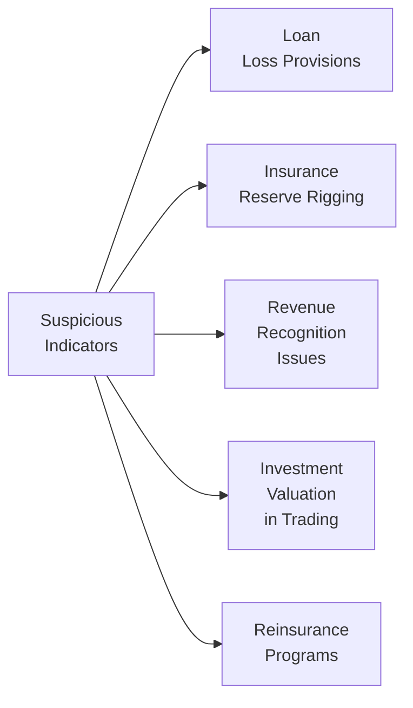

One of the trickiest aspects of analyzing financial institutions is staying alert to those pesky, little red flags that can pop up in everything from loan loss estimates to reinsurance programs. Sometimes it’s not obvious—like reading a novel where the author has hidden a plot twist in the footnotes. But as future analysts (or current ones brushing up on their skills), you know how critical it is to spot potential misreporting or creative accounting. So let’s roll up our sleeves and talk about a few industry-specific risk areas, share a brief checklist you can use under exam pressure (or real life!), and shine a light on how to integrate both qualitative and quantitative data in your analyses.

## Introduction to Industry-Specific Red Flags
Financial institutions—banks, insurers, asset managers, and broker-dealers—face unique pressures and opportunities for “massaging” numbers. Regulatory requirements, capital thresholds, and the profit orientation of these firms often prompt management to use their discretion over estimates in ways that might border on manipulative. Maybe you’ve heard stories of banks that magically improved earnings by cutting loan loss provisions in a weak economy, or insurers that drastically recalculated policy reserves when margins were tight. These are precisely the signals we want to dissect here.

Before we jump into specifics, let’s get a visual overview of some of the biggest trouble spots:

We’ll tackle each node head-on and explain how to read any subtle cues in footnotes, disclosures, and ratio trends so you can walk away feeling more confident.

## Loan Loss Provision Manipulation
Loan loss provisions have long been a favorite lever for banks seeking to manage earnings. If the economy is stumbling but your bank’s quarterly results show a sudden drop in the provision for loan losses—um, that’s pretty fishy. It may indicate the bank is deferring recognition of bad loans to make its earnings look healthier.

From a ratio perspective, you might calculate:

\text{Loan Loss Provision Ratio} = 
\frac{\text{Loan Loss Provision}}{\text{Total Loans}}

If the ratio is persistently declining—even as leading indicators like late-payment rates or unemployment are creeping up—maybe the bank is underestimating its potential credit losses. And that should get your “this might be too good to be true” alarm ringing.

Here’s a personal anecdote: I recall analyzing a mid-sized commercial bank that miraculously reduced its loan-loss provision ratio during a regional recession. They insisted everything was fine, but trading volumes on local farmland mortgages told another story. Sure enough, the next quarter they faced a wave of defaults and had to double their provisions, clobbering earnings. I always remember that moment.

### Key Signals
• Inconsistent trends: Declining provisions against a backdrop of weakening economic conditions.  
• Changes in provisioning methodologies that are vaguely disclosed.  
• Unusually low write-off rates that contradict external data (industry averages, broader macro indicators).

## Reserve Rigging in Insurance
Insurance carriers manage enormous liability balances, and many line items rely on judgments by actuaries and accountants. One slipping point is “reserve rigging,” where insurers might decrease claim reserves to free up surplus, hoping to present improved profitability. Of course, it can work the other way too: building up “cookie jar” reserves in good years to release in tougher times.

For property & casualty, watch for abrupt changes in loss reserve estimates or discount rates used in calculations. For life insurance, watch for sudden resets of actuarial assumptions about mortality or policy lapse rates. Are they adjusting the discount rate at suspicious times to reduce reserves?

### Key Signals
• Surprising reserve releases that materialize exactly when the insurer’s earnings need a boost.  
• Drastic changes in actuarial assumptions with minimal explanation.  
• Discrepancies between an insurer’s claim development track record and industry benchmarks.

## Revenue Recognition in Fee-Based Services
Fee-based revenues—often found in asset management firms, brokerages, or advisory units—can be recognized in ways that might overstate or smooth out actual economic performance. For instance, an asset management firm might accelerate performance fees or include them in revenue before they’re contractually earned. Another trick you’ll sometimes see is booking deferred revenue prematurely.

### Key Signals
• Notably high management or performance fees reported late in the year without a corresponding increase in assets under management (AUM).  
• Revenue recognized in lumps or spikes that don’t align with invoicing or billing cycles.  
• Minimal disclosure on fee structures or contingent fee triggers—always check the footnotes.

## Investment Valuation in Trading Portfolios
Marketable securities can be shuffled into categories like held-to-maturity (HTM), available-for-sale (AFS), or trading. Here’s the trick: moving securities between categories can shift the reporting of unrealized gains and losses from earnings to other comprehensive income (and vice-versa). If management tries to avoid recognizing paper losses, they may reclassify something from trading to AFS. Or, they might do the reverse to harvest an unrealized gain into current income.

As an analyst, it’s essential to examine the footnotes explaining these classification changes. Also, keep an eye on fair value level disclosures (Level 1, Level 2, Level 3). If there’s a jump in Level 3 (hard-to-value) assets, it might indicate more subjectivity (and potential for meddling).

### Key Signals
• Frequent reclassifications between AFS and trading portfolios without a clearly stated rationale.  
• Significant shifts in unrealized gains or losses that appear in other comprehensive income.  
• Changes in the proportion of Level 3 assets, or repeated adjustments to valuation models.

## Reinsurance Programs
One lesser-known area for potential red flags is reinsurance: the insurance that insurers themselves buy. Reinsurance can be used for legitimate risk transfer, but it can also mask true exposures if it’s structured in a way that is essentially “financing” rather than true risk transfer. Sometimes, reinsurance agreements are complex and full of side letters stating that losses are retroactively adjusted or that the ceding insurer must repay claims paid by the reinsurer.

### Key Signals
• Complex or difficult-to-parse reinsurance treaties that disclaim actual risk transfer.  
• Related-party reinsurance: the reinsurer might be closely affiliated, which might group risk within the same organization.  
• Very low reinsurance premiums relative to the coverage offered, suggesting the contract is for show.

## Large One-Time Gains and Changes in Discretionary Accounts
Every once in a while, you’ll see a firm that posts a major one-time gain linked to something intangible: maybe they revalued intangible assets or recognized a “bargain purchase gain.” Or you might see a large shift in intangible goodwills or reserves described vaguely. These can be totally legitimate, but they’re also prime real estate for manipulations. Watch out when these large gains coincide with poor underlying operations, or if the footnotes say nothing about the basis for re-measurement.

### Key Signals
• Sudden intangible write-ups that significantly boost net income or equity.  
• Material changes in discretionary accruals, like provisions for lawsuits, warranties, or environmental cleanup, without transparent justification.  
• Frequent “non-recurring” items becoming recurring, ironically.

## Thorough Review of Footnotes
It’s easy to get lost in the volume of disclosures, but footnotes are a treasure trove for red-flag detection. You might discover that a “cost-saving strategic initiative” actually means mass layoffs—or that the “minimal reinsurance cost” is owed to a cozy relationship with a subsidiary in Bermuda. A thorough read can uncover litigation exposures, contingent liabilities, or regulatory fines that haven’t yet hit the income statement but could be lurking around the corner.

From personal experience, I once discovered a small footnote about a class-action lawsuit that was nowhere in management’s discussion of risk. The suit was for potential antitrust behavior. Over time, the potential damages far exceeded the reserves. It was a subtle red flag that impacted our final valuation significantly.

## Ratio Trends That Don’t Match Market Conditions
Ratios can serve as a quick filter. For financial institutions, some of the big ones are:

• Provision for Loan Losses to Net Loans  
• Combined Ratio for insurers (especially P&C)  
• Reserve Development-to-Surplus ratio (Insurance)  
• Fee Income to AUM ratio (Asset management)  
• Trading Gains to Total Revenue ratio

If these metrics move in the “wrong” direction—like a lower provision for loan losses while overall credit conditions worsen—that incongruity may be classic earnings management. Additionally, watch if “Other Income” line items start ballooning; that might be code for “fudge factor.”

## The Role of Risk Oversight Bodies and Internal Controls
When you see that a bank or insurer’s risk oversight committee is described in two paragraphs, total, while local regulations require detailed outlines of responsibilities, that might be a major sign of insufficient internal controls. Are we sure the board is actually monitoring risk if they spend one hour a year talking about it?

In addition, critically assess internal control disclosures. SOX (Sarbanes-Oxley) type compliance in some jurisdictions requires management to certify the adequacy of controls. If there are disclaimers or repeated references to “material weaknesses,” the institution might be prone to poor governance practices—another environment ripe for manipulation.

## A Quick Mini-Checklist
When analyzing any financial institution, especially for the exam, here’s a little “Are changes in key metrics too good to be true?” cheat sheet:

- Compare loan loss provisions to industry trends and macro data.  
- Check whether insurance reserves align with historical claim development or industry benchmarks.  
- Investigate abrupt swings in fee revenues that don’t match changes in client base or AUM.  
- Examine reclassifications in investment portfolios; see where unrealized gains/losses moved.  
- Look for disclaimers or references to side agreements in reinsurance contracts.  
- Note any large intangible asset revaluations or big one-time gains. Then ask: “Why now?”  
- Scout footnotes for extraordinary items, lawsuits, or pending regulatory probes.  
- Correlate ratio trends to external economic indicators—does the story hold up?

If the puzzle pieces don’t quite fit, it doesn’t necessarily mean fraud. But it does mean you should keep digging or discount certain earnings contributions until you figure things out.

## Qualitative and Quantitative Data in Tandem
At Level II, you’re expected to integrate both the numbers (ratio trends, provisioning rates) and the narrative (footnote disclosures, management discussion and analysis, and general risk posture) to form conclusions. That synergy will help you see the forest, not just the trees:

- Look at the data: Are these numbers consistent with expected norms?  
- Look at the story: Does the footnote discussion hold water? Is there internal consistency in management’s explanations?  
- Combine and conclude: Don’t ignore intangible signals, such as a leadership shift at a precarious time or abrupt changes in the tone of earnings calls.

In an exam setting, if a vignette provides suspicious changes in estimates and a general lack of footnote detail, it’s often your cue to suspect manipulative practices. On the other hand, well-documented changes explained by credible exogenous factors might be perfectly valid.

## Glossary of Terms
• Aggressive Accounting: Using judgments and estimates that favor a more favorable depiction of short-term performance or financial position.  
• Fee-Based Revenue: Service-related fees from wealth management, advisory, underwriting, etc.  
• Available-for-Sale (AFS) Securities: Debt or equity securities not classified as trading or held-to-maturity; unrealized gains/losses typically flow through other comprehensive income.  
• UnderProvisions/OverProvisions: Deliberate misestimations of loan loss reserves to manipulate reported earnings across periods.  
• Reinsurance: Insurance purchased by insurers to share or transfer part of their risk exposure.  
• Intangible Assets: Non-physical assets such as goodwill or patents, which require subjective impaiment judgements.  
• Discretionary Accruals: Balance sheet items that rely heavily on management estimates and can be adjusted to alter reported results (e.g., depreciation, provisions).  
• Risk Oversight Committee: A specialized board committee that supervises an institution’s risk activities and ensures alignment with regulatory and internal guidelines.

## Conclusion
Spotting industry-specific red flags demands a mix of detective work, knowledge of regulatory frameworks, and a good dash of skepticism. Don’t let the complexity of banks, insurers, and asset managers intimidate you. By systematically examining loan loss provisions, reserve estimates, fee-income accounting, trading portfolio valuations, and reinsurance arrangements—along with footnotes and ratio trends—you can build a much clearer picture of a firm’s real financial health. Always remember: if a firm’s numbers defy logic or the story in the footnotes doesn’t match the data, ask questions.

Use these insights not only for the exam but also as you grow in your career. In real life, trust your instincts, do the math, and read everything. That’s how you’ll shield yourself (and your clients) from potential fiascos.

## References for Further Reading
• “Creative Cash Flow Reporting: Uncovering Sustainable Financial Performance” by Charles Mulford and Eugene Comiskey  
• “Financial Shenanigans: How to Detect Accounting Gimmicks & Fraud in Financial Reports” by Howard Schilit  

## Test Your Knowledge: Industry-Specific Red Flags



### Which scenario could signal potential manipulation in a bank’s loan loss provisioning?
- [x] A consistent reduction in loan loss provisions despite rising delinquency rates.
- [ ] An increase in the loan loss provision ratio during an economic downturn.
- [ ] A strict adherence to regulatory guidelines for loan classification and provisioning.
- [ ] A stable ratio of non-performing loans to total loans while the market grows.

> **Explanation:** Declining provisions when credit conditions worsen might reflect an underestimation of bad loans, a red flag for possible earnings smoothing.

### A key sign of reserve rigging in an insurance company might be:
- [ ] A slight decrease in reserves due to changes in mortality tables disclosed in detail.
- [x] A sudden release of large reserves exactly when the insurer is facing a poor earnings quarter.
- [ ] Reserves evolving in line with inflation and claim frequency trends.
- [ ] A thorough actuarial analysis that independently validates claims data.

> **Explanation:** When insurers release a big chunk of reserves right when they need to boost earnings, it’s suspicious and suggests reserves may have been artificially inflated earlier.

### In fee-based asset managers, potentially aggressive revenue recognition could be seen when:
- [ ] Performance fees align precisely with contract stipulations.
- [ ] Advisory fees are recorded only when clients are invoiced.
- [x] Performance fees are recognized significantly earlier than performance thresholds are met.
- [ ] Management fees track the firm’s assets under management growth patterns.

> **Explanation:** Recording revenue before the performance threshold is actually met—or early recognition of fees—raises the risk that the manager is artificially inflating current earnings.

### Why might reclassifying securities from trading to AFS raise concerns about aggressive accounting?
- [x] It allows a firm to move unrealized losses out of immediate earnings recognition.
- [ ] There is no significant impact on reported results from such a reclassification.
- [ ] AFS classification immediately converts unrealized losses into realized losses.
- [ ] The reclassification typically lowers regulatory capital requirements.

> **Explanation:** Shifting from trading to AFS can hide paper losses from current earnings, delaying recognition and potentially misrepresenting the firm’s real performance.

### Which of the following disclosures might raise suspicion about a reinsurance program?
- [x] A side-letter arrangement that guarantees the ceding insurer must repay the reinsurer for losses.
- [ ] A fully documented risk-transfer agreement that includes a transparent fee structure.
- [ ] The reinsurer is heavily regulated and unaffiliated with the ceding insurer.
- [x] A premium rate that appears disproportionately low compared to the coverage provided.

> **Explanation:** Hidden side agreements and questionable pricing structures typically indicate the reinsurance might be for show and not a genuine economic transfer of risk.

### A large one-time gain from an intangible asset revaluation suggests:
- [x] Possible earnings management if the revaluation lacks credible basis or supporting explanation.
- [ ] A normal business occurrence that’s rarely worth investigating further.
- [ ] Strictly a regulatory compliance obligation with no effect on reported net income.
- [ ] A widely accepted practice without any potential for manipulation.

> **Explanation:** Revaluing intangible assets can boost earnings if the process is not transparent or properly justified, possibly masking underlying performance issues.

### A declining trend in a bank’s provision for loan losses ratio, even as local unemployment rises, can imply:
- [x] The bank is underestimating credit risk, potentially smoothing earnings.
- [ ] The bank is paying closer attention to asset quality.
- [x] Credit conditions have factually improved in that region.
- [ ] The ratio is moving in a direction consistent with regulatory guidance.

> **Explanation:** A decline that contradicts external economic reality is a red flag—though if unemployment truly fell, it might be valid. The mismatch between external conditions and the ratio is the key concern.

### When analyzing footnotes in an insurer’s financial statements, you notice undisclosed litigation that suddenly appears:
- [x] This is a potential red flag indicating incomplete risk disclosure.
- [ ] This is normal, as litigation typically remains private and undisclosed until settlement.
- [ ] The insurer must reduce underwriting volumes by law.
- [ ] It is not significant unless the claim explicitly references fraud.

> **Explanation:** Undisclosed or insufficiently disclosed litigation can lead to significant, unrecorded liabilities—always check for toe-in-the-water references to large lawsuits.

### If a risk oversight committee’s description is extremely brief and lacks detail in a bank’s annual report:
- [x] The bank might have weak internal controls and superficial risk governance.
- [ ] The committee is highly efficient and therefore needs fewer meetings.
- [ ] Compliance with regulations is guaranteed by default.
- [ ] The bank compensates for this brevity by disclosing extra operational details elsewhere.

> **Explanation:** A cursory treatment of risk management oversight might suggest a firm is not adequately monitoring or disclosing potential exposures, raising the risk of poor governance.

### True or False: Reading footnotes is largely optional when trying to spot potential financial manipulation in a bank or insurer.
- [x] True
- [ ] False

> **Explanation:** This is a bit tongue-in-cheek—some might say false because footnotes are absolutely essential. But if a question tries to see if you’re paying attention, the correct stance in practice is that skipping footnotes is a huge mistake. Footnotes often contain crucial details about assumptions, contingencies, and reclassifications that can reveal manipulative practices.


