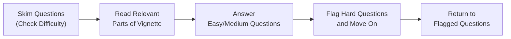

## The Importance of Efficient Time Management

Time has this sneaky way of vanishing during an exam, especially the CFA® Level II, where each item set (vignette) can quickly consume more minutes than you realize. So, what’s the big deal, anyway? Well, the exam itself is time-limited and demands a careful balance between thorough reading, precise calculation, and confident selection of answers you can trust. If you run out of time, you might lose out on questions you actually know how to answer.

In my own study days, I remember starting on a tricky question about pension accounting (from Chapters 7 and 8) and spending way too many minutes dissecting it. By the time I wrapped my head around it, I had to scramble to finish other vignettes I actually found easier. It was, shall we say, not my best performance. But it taught me a crucial lesson: have a plan, and stick to it. 

## Establishing a Strict Time Allocation Plan

You can’t just walk into the exam and wing it. Instead, create a realistic time budget for each item set:
• Reading phase (skim + detail read): around 2–3 minutes  
• Problem-solving and answering: generally 1.5–2 minutes per question  
• Quick review: maybe 1 minute if you can afford it  

In a typical item set scenario, you might have around 18 minutes total (if the exam session is split up proportionally). If you’re working with an 18-minute block, consider something like:  
• 3 minutes: skimming questions and scanning the vignette’s key data  
• 12–13 minutes: systematic question-by-question tackling  
• 2–3 minutes: a final pass to review your answers or check your flagged items  

Keeping an eye on the clock is vital. A few folks like to set alarms on their watch or note down a “Time to Move On” point for every item set. That buffer helps prevent wasted minutes spiraling down a single question.

## Triage Basics: Skim, Prioritize, and Tackle

Triage in a medical context means sorting patients by urgency. In the exam context, it’s about quickly sizing up each question:  
• Easy or familiar? Do it right away.  
• Medium? Work carefully but be aware of time.  
• Hard or time-consuming? Flag it for a later return if possible.  

This is a surefire way to avoid the “sunk-cost” trap, where you keep pushing on a tough question because you think, “I’ve already spent too long here to abandon it now.” Actually, letting yourself sink more minutes into it is the real cost. Secure the low-hanging fruit first.

## Skim the Questions Before Reading the Vignette

It might sound counterintuitive—why read the questions before you read the full story? But in the CFA Level II exam, the item set’s “story” can be lengthy. If you read the questions first, you’ll know what details you need. Then, when you go through the vignette, you can zero in on the relevant numbers or specific disclosures. 

I’ve even found that some questions hint at each other. If question 1 references a particular subsidiary’s consolidated statements, question 3 might ask about total goodwill from that same acquisition. Suddenly, you see these connecting dots, and it becomes easier to interpret the entire scenario.  

## Prioritizing by Difficulty and Familiarity

Many candidates love the “easiest-first” approach. Nothing boosts morale like nabbing correct answers you’re comfortable with. For instance, if you see a question about foreign currency translation (Chapters 11–13) and you happen to know it cold, do that one right away. Then check off your mental scoreboard with a big grin.  

If you stumble upon a concept you dreaded from your study sessions—maybe complex share-based compensation or advanced pension corridor approaches—flag it, set it aside, and come back if time permits. The key is to accumulate as many sure points as possible early on, so you’re less anxious.

## Managing Multi-Part Questions

Some questions build on earlier sub-questions—especially in complex topics like consolidation (Chapters 4–6). If you’re stuck on part (a), it might hamper (b) or (c). But here’s a little hack: sometimes reading (b) or (c) can give you hints about part (a). The exam can inadvertently reveal what’s really key. So, if you can’t crack part (a), see if part (b) clarifies the numbers, references an assumption, or tips you off to the correct approach.

## Filtering the Noise

Exam vignettes love extraneous information. Sometimes you’ll see a paragraph describing unrelated events or listing a bunch of data that doesn’t factor into the solution at all. The entire point is to test your capacity to filter relevant details from the fluff. 

Maybe the vignette includes a side story about the CFO’s philanthropic efforts or some exotic derivative position that has no bearing on the final question. Skipping over non-essential paragraphs once you’ve identified them saves precious minutes. Doing so can also protect you from confusion.  

## A Checklist Approach for Each Question

Adopting a consistent “mini-routine” for each question is surprisingly powerful:

- Identify the data you need.  
- Recall any relevant formula or concept. 
- Apply that formula methodically. Double-check the math.  
- Interpret whether your result is plausible.  
- Confirm final short answer or best multiple-choice response.  

You might do this mentally or scribble a short checklist on a scratch paper. Just be sure to stay consistent. Rote repetition is your friend under time pressure.

## Handling the Sunk-Cost Fallacy

Remember that scenario where you stare at a question for six or seven minutes, desperately hoping the solution will magically appear if you just keep at it? Yeah, that’s the sunk-cost fallacy messing with your head. If you suspect a question is too time-consuming—maybe it’s a complicated goodwill impairment scenario you can’t unravel easily—take a mindful breath, pick a strategic guess if needed, and move forward. Return if time allows.

## Practicing Under Timed Conditions

Knowing these time management theories is nice, but you have to rehearse them. Do official mock exams, third-party providers (like Kaplan Schweser or others), or any test bank with item sets that simulate actual exam constraints. Set a timer, and push yourself to stay within the limit. If you finish an item set in well under your target time, that’s a good sign. It also means you can bank some precious buffer minutes for a tricky set later.

Try chaining multiple item sets in a single session—like 4 or 5 in a row. That tests your stamina. Mental endurance is a real factor. As you might guess, you start fresh and bright on the first set, but by the fourth or fifth, you may start reading too quickly or missing details. This training helps you realize when you’re likely to gloss over something important.

## Staying Alert to Mental Fatigue

Mental fatigue creeps in quietly. You’ve read the same line three times, or you find your mind drifting off to what’s for dinner. That’s a red flag. During practice or the real exam, try the following micro-tactics:
• Take a 10-second reset. Close your eyes, breathe.  
• Sip some water. Sometimes it’s that simple.  
• Remind yourself that each question means potential points. Curiosity can kickstart your focus again.  

If you’re pushing through three hours straight of exam conditions, you need to be mindful of your stamina. This is where practice lumps can help you find your personal “slump” point and address it.

## Leverage Partial Knowledge

Don’t assume an all-or-nothing approach. Even when the entire question approach escapes you—like a complicated segment reporting question (Chapter 22)—it’s possible to whittle down answer choices logically. Maybe you see that two of the answer choices require negative revenue growth, but the vignette states the company’s revenues are up 10%. Boom, you just eliminated two distractors. Keep going. A half-guess is better than a total blind guess.

## Putting It All Together: A Sample Workflow

Here’s a simple blueprint you might adapt:

- Skim the question stems (30–45 seconds).  
- Read the vignette quickly (1–2 min), highlight relevant data.  
- Tackle easy or moderate questions (1–2 min each).  
- If a question is tough, mark it and keep going.  
- Once you finish that item set, use leftover time to revisit marked questions.  
- Close the item set and move on.  

The biggest gains usually come from systematic triage and practice. That combination of reading the questions first, controlling your time budget, and funneling your attention to the right spots can pay off hugely on exam day.

## Triage Flow Diagram

Below is a simple flowchart illustrating the question-triage process:

This diagram is a quick mental map you can internalize. With repeated practice, you’ll breeze through these steps.

## Glossary

• Triage Technique: A strategic approach to exam questions—sort them by difficulty and tackle them methodically to optimize scoring potential.  
• Mental Fatigue: Cognitive exhaustion triggered by extended focus, leading to reduced concentration and performance.  
• Noise: Extra data or paragraphs designed to test your reading comprehension and ability to filter out irrelevant info.  
• Buffer Time: Margin minutes saved per vignette to handle unforeseen difficulties or revisit flagged questions.

## References

• CFA Institute’s official postings on exam structure and time management (available on the CFA Institute website).  
• Kaplan Schweser’s CFA Level II Mock Exams: Focus on exam-day pacing and question discipline.  
• Weisinger, Hendrie, and Pawliw-Fry, J.P., “Performing Under Pressure: The Science of Doing Your Best When It Matters Most.” This book has some excellent tips on staying calm and efficient in test-like conditions.  

---

## Practice Your Time Management and Triage Techniques



### Which of the following most accurately describes an effective CFA Level II item-set time allocation plan?  
- [ ] Spend exactly half the allotted time on each vignette, half of that reading, and half of that on questions.  
- [x] Allocate a few minutes to skim the questions and read key data in the vignette, then use the bulk of the time on answering questions with a short buffer at the end.  
- [ ] Read the vignette thoroughly for 10 minutes, then rush through the questions in the final moments.  
- [ ] Divide the time equally among all questions without reading the vignette.  

> **Explanation:** A sound time allocation strategy includes quickly reviewing questions, focusing on key data in the vignette, and leaving a buffer for final review. Spending half your time on reading alone is excessive, and rushing without reading the vignette leads to inaccuracies.

### Once you notice a question is extremely difficult or time-consuming, what's the recommended approach?  
- [ ] Continue to work on it until you arrive at an accurate answer to avoid any guesswork.  
- [x] Mark it, move on to easier questions, and return if time permits.  
- [ ] Skip it altogether and never return to it.  
- [ ] Eliminate one answer at random and pick from the remaining three.  

> **Explanation:** Sunk-cost fallacy can drain your overall performance. The ideal method is to mark the question and proceed to manage time effectively on other questions.

### How does skimming the questions before reading the vignette help?  
- [x] It highlights what data points and calculations are relevant in the vignette.  
- [ ] It provides definitive answers for you to confirm.  
- [ ] It allows you to memorize the entire vignette quickly.  
- [ ] It ensures you only read part of the vignette.  

> **Explanation:** By scanning the questions first, you can pinpoint the key info you need when reading. This reduces time spent on irrelevant details.

### Why might partial knowledge still be useful for a multiple-choice question you can’t fully solve?  
- [ ] It encourages you to guess without reading any part of the vignette.  
- [ ] It proves to the graders that you studied a little.  
- [x] It helps eliminate unlikely answers and improves your odds of guessing correctly.  
- [ ] It has no impact if you don’t 100% know the correct formula.  

> **Explanation:** Even limited info can help remove incorrect distractors, boosting your probability of choosing the right answer.

### Which of the following best defines the concept of “Noise” in CFA exam vignettes?  
- [ ] The background chatter in the exam hall.  
- [x] Irrelevant data included in the vignette to test reading comprehension.  
- [ ] Extra formulas that you must memorize.  
- [ ] Partial computations that appear in the question.  

> **Explanation:** “Noise” refers to superfluous details inserted by exam writers to distract you. Being able to filter out noise is a crucial skill.

### What is a major benefit of allocating a “buffer time” after answering the questions in a vignette?  
- [x] You can revisit flagged items, verify calculations, or double-check reasoning.  
- [ ] You can read the entire vignette again for fun.  
- [ ] You can start working on the next vignette early and ignore the previous questions entirely.  
- [ ] It has no real benefit; it’s better to spend all your time on the questions.  

> **Explanation:** Buffer time ensures you can fix mistakes or reconcile any questionable answers. It helps you refine your final responses.

### Why should you be extra wary of multi-part items (e.g., a question with parts A, B, C) in the exam?  
- [ ] They are generally all unanswerable.  
- [x] Subsequent parts can reveal hints or calculations that help solve earlier parts.  
- [ ] They always contain noise that must be ignored.  
- [ ] There’s no advantage to reading part (b) if you don’t understand part (a).  

> **Explanation:** Exam writers sometimes embed crucial info in part (b) or (c). It can help clarify or confirm an assumption needed for earlier sub-questions.

### Which statement represents a best practice for building mental endurance for the CFA Level II exam?  
- [x] Practice multiple item sets in one sitting to mimic actual exam fatigue and pacing.  
- [ ] Only do one item set per day for maximum focus on it.  
- [ ] Avoid any timed practice before the actual exam to reduce stress.  
- [ ] Only read the official curriculum without ever doing practice problems.  

> **Explanation:** Building mental stamina under test-like conditions is essential. Doing multiple item sets back-to-back helps you learn how to manage the inevitable energy dip.

### What does the term “triage technique” refer to in an exam context?  
- [ ] Memorizing all formulas in alphabetical order.  
- [ ] Focusing only on IFRS sections over US GAAP.  
- [x] Sorting questions by difficulty/priority and tackling them in an optimal order.  
- [ ] Eliminating half of the answer choices at random to save time.  

> **Explanation:** In CFA exam triage, you quickly assess question difficulty and prioritize easier ones first to secure points and manage time effectively.

### True or False: Returning to flagged questions is never a good idea because your first instinct is always correct.  
- [x] True  
- [ ] False  

> **Explanation:** Actually, this statement is an example of flawed exam logic. When time permits, returning to flagged questions can uncover mistakes or second thoughts that improve accuracy. The “first instinct is always correct” notion is not a reliable strategy.


