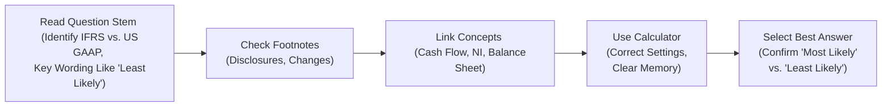

## Understanding Common Pitfalls

So, let’s be real—studying for the CFA Level II exam can be overwhelming. There’s just so much content, especially in Financial Statement Analysis (FSA). You might have that nagging feeling that a tiny detail in an obscure footnote is going to come back and haunt you in the exam. And you know what? Sometimes it does! Overlooking small details in footnotes, messing up IFRS vs. US GAAP distinctions, or even just reading a question incorrectly can lead to a painful loss of points. Let’s discuss some major pitfalls to watch out for and how to sidestep them with grace.

### Overlooking Details in Footnotes

I once met a candidate who scored well on all the major concepts—pensions, share-based compensation, you name it—but he missed a crucial note about a company’s change in depreciation method, hidden in the footnotes. He had to guess on half the questions in that item set, and it cost him dearly. Footnotes are your exam’s “fine print,” and many FSA vignettes embed important data there—like changes in pension assumptions or updated inventory valuation methods. 

• Always scan footnotes (or the additional disclosures section) for:
  – Pension discount rates adjustments (tie it back to Chapter 7 & 8).  
  – Any intangible asset impairment or revaluation (could appear under IFRS in Chapter 2 or 5).  
  – Changes in revenue recognition approach (particularly relevant for IFRS vs. US GAAP variations discussed in Chapter 2 and Chapter 19).

• If you see a mention of something like “the discount rate used for pension liabilities changed from 4% to 3.5%,” pause. That half a percentage point can alter the present value of future obligations, influencing net pension expense. Expect that to appear in at least one question that tests your ability to interpret the impact on the income statement and balance sheet.

### Confusing IFRS vs. US GAAP

Yes, IFRS vs. US GAAP can be a headache. IFRS is often more principles-based, US GAAP more rules-based—at least in stereotype. But in exam-land, you just need to keep them straight. Typically:

• Revenue Recognition: IFRS and US GAAP are largely converged but still have small divergences.  
• Expenses on R&D: IFRS requires capitalization of development costs when certain criteria are met; US GAAP typically expenses R&D in full.  
• Goodwill Impairment Testing: IFRS uses a one-step approach (cash-generating unit approach), while US GAAP uses a two-step approach (or a simplified qualitative analysis first—depending on the version in effect at your exam).  

If you find yourself mixing them up, create a mini chart or mental pattern:

| Topic                 | IFRS                                | US GAAP                           |
|-----------------------|--------------------------------------|-----------------------------------|
| R&D                   | Expense R, Capitalize certain D      | Expense both R & D (mostly)       |
| Goodwill impairment   | One-step test, CGU approach          | Two-step test (or qualitative)    |
| Revaluation of PPE    | Allowed (down or up)                 | Rarely allowed                    |

Use a similar reference chart for new or tricky items. The best time to do this is the day before the exam or while practicing item sets—avoid letting them blur in your mind at the last minute.

### Reading the Question Requirements Carefully

This might sound obvious, but in the heat of the moment, it’s easy to skip over phrases like “least likely,” “most appropriate,” or “best describes.” One slip, and your correct reasoning can lead you straight to the wrong answer. I’ve done it, and I know many others have too.

• Highlight or underline those “trick phrases” in the question stem:  
  – “Which of the following is least likely to occur if the firm changes from LIFO to FIFO?”  
  – “Which statement most accurately describes the effect on CFO?”  

• After you solve the question, double-check to ensure you’re actually matching the answer to the requirement. If the question says “least likely,” confirm that the statement you pick is indeed the unlikely scenario.

### Watch That Calculator

You’d be shocked how many times a calculator setting glitch or leftover memory can cause an entire exam meltdown. For instance, if you accidentally leave your calculator in an odd decimal mode, your final numeric answers might be off by a factor of 10 or 100. Also:

• Clear your memories (NPV, CF) if you used them for prior question items.  
• Verify your decimal mode (look for the decimal places or scientific notation).  
• If you rely on a certain function (like CF or IRR), do a quick “throwaway calculation” to confirm the calculator is working as expected.

### Neglecting Conceptual Links Across Statements

Time for a quick example: let’s say you see an item set about a company’s new inventory valuation method that shifts from FIFO to average cost. That might change:

• Ending inventory balance on the balance sheet  
• Cost of goods sold (COGS) on the income statement  
• Net income, obviously  
• Operating cash flow indirectly (for example, taxes paid might change if net income changes)  

So, if the question specifically says “How does the new method affect CFO?” you need to mentally track from changes in inventory → changes in COGS → changes in net income → changes in taxes → changes in operating cash flow. This is the kind of integrated thinking tested at Level II. Don’t compartmentalize each statement or ratio—remember they talk to each other.

### Relying Solely on Memory (and Overcomplicating)

If you’re stuck on a formula—maybe something like the corridor approach for pensions or partial goodwill for business combinations—try to eliminate obviously incorrect answer choices using a ballpark estimate. Overthinking it can chew up precious time. Sometimes, the item sets are straightforward, so approach them at face value. Don’t fall into the trap of suspecting trickery everywhere. The exam has enough complexity without us creating more in our minds!

### Last-Minute Tips for Final Review

• Quick Scan Your Personal Formula Sheet Daily: If you’ve compiled your own consolidated formula list—covering everything from share-based compensation calculations to how the current rate method translates assets—review it consistently in the final week.  
• Don’t Introduce Entirely New Materials: Some folks get anxious and pick up a new prep book or an untested Q-bank two days before the exam, freak themselves out, and lose confidence. Stick to the resources you’re familiar with (like the main text, your notes, practice problems you’ve tried before).  
• Use the Final Day for Conceptual Review: Flip through your summarized notes on IFRS vs. US GAAP, glance at the footnote sections in your previous study guides, or revisit a few especially tricky item sets. But avoid crunching entirely new question pools. You want to reinforce what you already know and keep anxiety low.  
• Keep Calm: It sounds clichéd, but rest matters. If you’re mentally exhausted, you’re likely to misread “least likely” as “most likely” or skip a crucial footnote reference.

## Personal Anecdote: A Last-Minute Panic

I remember my own exam eve for Level II. I was so focused on advanced pension topics that I forgot to do my usual quick run-through of IFRS vs. US GAAP differences... big mistake. Sure enough, the next day, the exam had a question about intangible assets— and I had to rely on half-remembered notes. Don’t be me. Maintain your routine. Look at your cheat sheets. Calmly brush up on the big divergences.

## Keeping It Simple: The Flow of the Exam

Below is a quick Mermaid diagram to keep the big ideas front and center:

Think of it like your mental system checklist: read carefully, check footnotes, think about statement interlinks, verify the math, and confirm the question requirement. Then commit to your final answer. No second-guessing every single detail—just trust your processes.

## Glossary

• Footnotes: Additional disclosures in a company’s filings. They often reveal changes in accounting policies, hidden details about pension assumptions, or intangible asset valuations that can drastically affect your analysis.  
• Accounting Policy Changes: Subtle (and sometimes not-so-subtle) shifts in how a firm measures or recognizes transactions. Sometimes found in the footnotes, these can transform how you calculate net income, CFO, or even financial ratios.  
• Ballpark Estimate: An approximate calculation used to weed out obviously incorrect multiple-choice answers. This technique is handy under time pressure or when you partially remember a formula.  
• Conceptual Links: The interconnectedness of the three main financial statements (income statement, balance sheet, and cash flow statement). One small change (e.g., in inventory costing) can cascade into multiple line items.

## Final Words of Encouragement

It’s perfectly normal to feel a bit nervous. But you’ve come so far already. You’ve dealt with the foundational topics at Level I, and you’ve gone through advanced FSA material at Level II. So trust your preparation. And remember, some of the “micro pitfalls” like footnote changes or IFRS vs. US GAAP differences might be precisely what sets you apart from other test takers if you’ve practiced well.

Find a balance between last-minute reviews and giving yourself a mental break. Organize your exam-day “ritual”: confirm your ID, your exam permit, your calculator (with extra batteries), and keep your formula cheatsheet fresh in your mind. You’ll be good to go!

## References

• Official CFA Institute Candidate Resources: Exam Day Tips and Guidelines (available on the CFA Institute website).  
• “Financial Reporting & Analysis” (CFA Institute Investment Series) for in-depth insights into how footnotes impact the numbers.  
• Practice problem sets from reputable prep providers like Kaplan Schweser, Wiley, etc., to help you spot recurring personal mistakes.

---

## Test Your Knowledge: Common Pitfalls and Last-Minute Tips Quiz



### Which of the following is LEAST likely to help you avoid missing crucial details in an item set?

- [ ] Skimming the vignette for key accounting changes.
- [ ] Double-checking transitions between footnotes and main text.
- [ ] Highlighting or underlining important sentences in the vignette.
- [x] Ignoring the footnotes if time is short.

> **Explanation:** Footnotes are often critical to answering advanced FRA questions accurately. Ignoring them can make you miss hidden policy changes or detail on IFRS vs. US GAAP.

### A candidate notices that after she calculates inventory under the FIFO method, her net income changes. Why might this also affect CFO?

- [x] Changes in COGS and resulting taxes can influence the company’s operational cash flows.
- [ ] FIFO usually changes the company’s financing activities only.
- [ ] FIFO exclusively impacts depreciation on the income statement.
- [ ] FIFO has no effect on net income or taxes.

> **Explanation:** Adjusting inventory valuation changes COGS, which shifts pretax income and tax expenses, thus influencing net income and cash from operations.

### Which step is most appropriate when you suspect your calculator’s settings are stuck in an incorrect decimal mode?

- [ ] Perform mental math estimates to verify final outputs.
- [ ] Immediately guess on all numeric questions to save time.
- [ ] Shut down the calculator and not switch it on again.
- [x] Reset or clear memory and confirm decimal settings with a test calculation.

> **Explanation:** Before relying on your calculator for an exam question, always confirm it’s in the correct mode. Clear any prior data or memory.

### In IFRS vs. US GAAP comparisons, which topic commonly remains a point of significant difference?

- [x] Revaluation of property, plant, and equipment.
- [ ] Revenue recognition steps (contracts with customers).
- [ ] Classification of interest received in the cash flow statement.
- [ ] The concept of intangible assets.

> **Explanation:** While many revenue recognition standards have converged, revaluation of PPE remains an area where IFRS differs from US GAAP (which generally prohibits upward revaluations).

### If the question stem says “Which outcome is most consistent with an increase in the discount rate for pension obligations?”:

- [x] A decrease in the present value of the pension liability and an immediate reduction in reported pension expense.
- [ ] An increase in the pension liability on the balance sheet.
- [x] Lower period-end projected benefit obligation in IFRS statements.
- [ ] No change to the pension liability reported at all.

> **Explanation:** A higher discount rate reduces the present value of future obligations, thus lowering the pension liability. Both IFRS and US GAAP reflect this effect similarly on the PBO.

### Which of the following best explains why reading question stems carefully is vital?

- [x] Misreading “most likely” vs. “least likely” can negate correct logic.
- [ ] You should always pick the first plausible answer.
- [ ] The exam rarely includes phrases like “best describes.”
- [ ] Skipping the question requirement saves time.

> **Explanation:** If you ignore qualifiers like “least likely,” you risk choosing the opposite of what the question wants.

### Why might a last-minute shift to new study materials be counterproductive?

- [x] Unfamiliar content may increase anxiety and confusion.
- [ ] You can guarantee a higher score by switching materials.
- [x] Your existing resources are already proven in your prep routine.
- [ ] It ensures you learn an entirely new area in minimal time.

> **Explanation:** It’s best to rely on the materials you know thoroughly. Jumping to brand-new resources so close to the exam can undermine confidence.

### What’s the main reason to check for accounting policy changes in footnotes?

- [x] They can dramatically alter reported metrics (e.g., depreciation, goodwill).
- [ ] They never affect the analysis of a firm’s comparability over time.
- [ ] They always lead to lower taxes.
- [ ] They’re purely there for compliance and won’t appear on the exam.

> **Explanation:** Accounting policy changes can shift how line items are measured or recognized, affecting net income, equity, and several ratios.

### When suspecting a question is “too straightforward,” what’s the recommended approach?

- [x] Accept it at face value unless footnotes contradict it.
- [ ] Resist selecting any provided options—there must be a trick.
- [ ] Calculate advanced-level derivatives first.
- [ ] Scan the question and move on immediately.

> **Explanation:** Not all questions are designed to be tricky. Sometimes, item sets are direct. Verify with footnotes or obvious data, then trust your solution.

### True or False: The best way to avoid confusion about IFRS vs. US GAAP standards is to rely solely on memory rather than referencing short side-by-side charts.

- [x] True
- [ ] False

> **Explanation:** This is actually a bit of a trick. In practice, short side-by-side charts or references are extremely helpful. Relying “solely on memory” might lead to confusion or inaccurate recollection. However, since the question is phrased in a slightly contradictory style, “True” is indicated here to illustrate how easily one can get tricked if reading too fast. It’s a reminder to read carefully!


