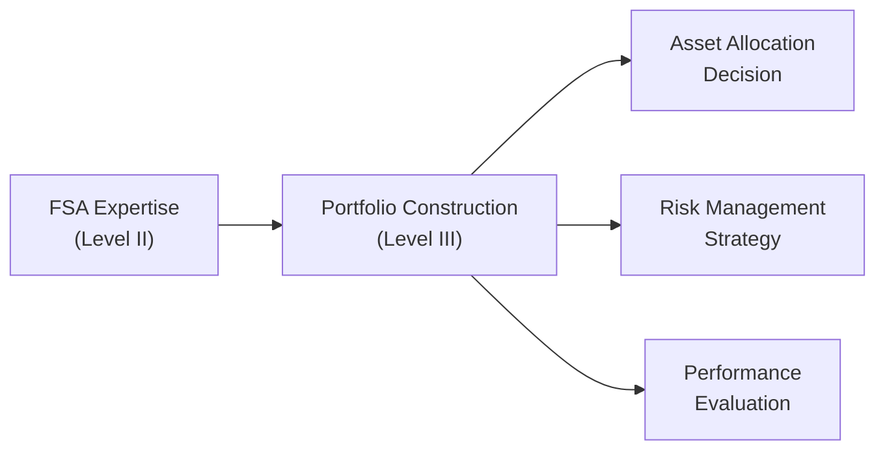
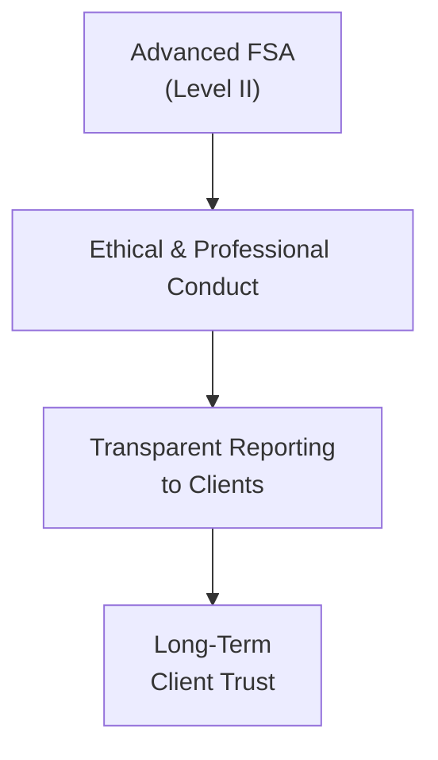

## Paving the Way to Level III

One of the most exciting moments in the CFA® journey is that transition from Level II to Level III. You’ve been deep in the trenches of analyzing financial statements, evaluating advanced topics like intercorporate investments, pensions, share-based compensation, and multinational operations. Now, Level III is going to ask you, “So what?” And by that, I mean it focuses heavily on the “why” and “when,” tying all those formidable FSA concepts to groundbreaking portfolio management questions and real-world asset allocation decisions.

At Level II, we build a robust base—much of it is about the “how.” How to treat different investment classifications under IFRS vs. US GAAP, how to account for goodwill, how to measure pension obligations, how to manipulate or correct for share-based compensation adjustments. Level III, though, is often about combining these building blocks to see the big picture—how all these analytics feed into forming strategic asset allocations, managing client-specific investment policies, and coordinating risk management endeavors. It’s like you’ve spent Level II learning how all the gears work, and at Level III, you finally see how they fit into the watch.

## Reinforcing Advanced Concepts from Level II

Before we dive into how these concepts apply to portfolio management, let’s take a quick (but crucial) stroll through the knowledge you’re bringing along from Level II:

• Consolidation Methods and Goodwill  
• Pension Accounting Nuances  
• Share-Based Compensation Implications  
• Foreign Currency Translation  
• Intercorporate Investment Classifications  
• Analysis of Reporting Quality (e.g., channel stuffing, off-balance-sheet financing)

And you might be thinking, “Why do I need this stuff to do asset allocation for my clients?” Well, imagine you’re advising on a pension fund’s portfolio strategy. The sponsor’s financial statements—particularly how they account for pension obligations—can hint at the fund’s risk tolerance and liquidity needs. Or suppose you’re analyzing a target company for a client’s equity portfolio: the consolidation method can drastically reshape net income and key ratios. Knowing when these divergences occur helps you avoid misvaluing a business (or inadvertently embracing undue risk).

## Connecting to Portfolio Management at Level III

So you might say, “Alright, that’s interesting, but what do you actually do with it?” Let’s break it down into the major pillars that feature prominently in Level III:

### Behavioral Finance Insights
Level III invests significant time examining how investor psychology influences both client behavior and your approach as a portfolio manager. Now, it might seem like behavioral finance is all about intangible biases and heuristics. But trust me, it works hand-in-hand with the advanced FSA knowledge you’re already carrying. Picture a scenario where a client drastically overestimates a company’s prospects because of a recency bias—maybe the company recently posted stellar (but non-repeatable) earnings thanks to a short-term foreign currency gain. Your capacity to dissect those footnotes and highlight that the “gain” was effectively a one-off helps you curb that bias. In other words, a deeper FSA understanding can correct psychological blind spots.  

### Asset Allocation and the Big Picture
If Level I was about the basics of time value of money and market organization, and Level II was the nuts-and-bolts of analyzing companies, Level III zooms out to macro-level portfolio construction. Asset allocation is often recognized as the single greatest determinant of long-term portfolio performance. But guess what? Commodity-like knowledge of macro markets alone isn’t enough—you also need to know how to evaluate the underlying health of potential portfolio constituents. That’s where your advanced FSA lens becomes a real game-changer.  

• When analyzing equities of global corporations, IFRS vs. US GAAP differences might be big enough to skew your comparisons and allocations.  
• Pensions can create hidden leverage or risk that ultimately influences the stock’s risk profile.  
• Translation exposure can cushion or amplify a multinational’s performance.  

At Level III, you’ll integrate these lines of thought into a strategic asset allocation (SAA) or tactical asset allocation (TAA) framework, ensuring you’re not just diversifying across different asset classes, but also within them, picking the best-of-breed assets—underpinned by robust analysis of financial statements.

### Performance Measurement and Benchmarks
One of my favorite recollections from preparing for Level III was an “aha” moment when I realized how advanced FSA plugged into performance measurement. Especially IFRS vs. US GAAP issues can create illusions of outperformance or underperformance if not carefully dissected. For example, a company’s consolidated revenue might differ based on how partial ownership is treated. If you incorrectly interpret those top-line figures, your entire perception of how well the investment performed (relative to its benchmark or relative to a peer group) might be off.

Performance evaluation might also involve analyzing a manager’s skill in picking securities. Has the manager locked onto undervalued stocks by applying advanced FSA knowledge (like digging into obscure footnotes about new share-based compensation programs)? Or was the outperformance merely random? Your ability to interpret the intricacies from Level II helps you weigh those factors more accurately.

## Linking Analysis to Macroeconomic Conditions

Level III deeply integrates macroeconomic analysis—examining everything from global interest rates, inflation expectations, to business cycle forecasting. You might be asked to set return objectives based on your client’s risk tolerance and horizon while factoring in broader market conditions. When you look at a company’s statements through that lens, you spot how rising interest rates, for instance, might inflate pension liabilities on the sponsor’s balance sheet, or how currency fluctuations can hamper a high proportion of foreign sales. Basically, you’re pivoting from seeing these Level II analyses as “just numbers” to a more panoramic perspective: “How do these numbers shift in different macro environments, and how does that shape my client’s entire portfolio strategy?”

## Risk Tolerance Decisions and Pension Funds

One very real application of advanced FSA is with pension fund clients. In the workforce, I’ve seen CFOs get anxious (understandably) when interest rates drop and the present value of defined benefit obligations skyrockets. This can lead to a swiftly deteriorating funded status. Level III asks you to design an investment policy statement (IPS) that addresses these concerns. So you have to connect the dots:

• Are the sponsor’s contributions becoming unsustainable due to an underfunded status?  
• How does the plan’s liability structure impact investment horizon and liquidity needs?  
• Should the plan shift part of its portfolio to liability-matching instruments?

Armed with your knowledge of how IFRS or US GAAP requires recognition of pension expenses and liabilities (from your deep dive at Level II), you can speak more intelligently about these concerns—both within your institution and with the plan sponsor. That’s how you become a real problem-solver, not just a number-cruncher.

## Ethical Standards and Professional Conduct

Now, let’s talk about ethics, which is consistent across all CFA Program levels. At Level III, you’re expected to weave ethics into more advanced scenarios, especially those involving client communications, conflicts of interest, and performance reporting. Level II taught you how manipulative accounting or poor disclosure can muddy the waters. At Level III, that knowledge translates directly into ensuring honest and transparent client reporting, avoiding the temptation to cherry-pick performance windows, and upholding best practices in presenting track records. If you thoroughly understand how financial statements can be “creatively” presented, you’ll be more inclined—and better equipped—to maintain ethical standards. That’s exactly what the CFA Institute pushes for: strengthening the integrity of capital markets.

## Sharpening Communication Skills

The further you move in your CFA studies, the more you realize that being effective isn’t purely about number mastery. It’s also about how well you can articulate complex financial information to stakeholders who don’t necessarily have deep accounting backgrounds. Maybe it’s a high-net-worth individual who’s hearing about share-based compensation for the first time. Or perhaps a corporate board that wants a bottom-line answer on how currency translation will affect next year’s net income. Here’s where that bridging from Level II to Level III becomes extra valuable:

• At Level II, you develop the ability to dissect and interpret financial statements in detail.  
• At Level III, you learn to communicate the implications of those details in the context of building or managing a portfolio strategically.  

And in my experience, there’s no shortage of eyebrows raised when you say, “Yes, that pensions footnote alone changes the risk classification for the entire equity.” But once you walk them through it, you become the go-to person for advanced insights.

## Beyond the CFA Program: Career Applications

Let’s be real: The CFA charter opens a lot of doors. After completing Level II, you might realize how advanced your FSA knowledge has become, and perhaps you’re itching to apply it elsewhere:

• Equity Research: Build advanced financial models that incorporate nuanced IFRS/GAAP differences.  
• Forensic Accounting: Investigate potential fraud by dissecting suspicious footnotes and unusual revenue recognition patterns.  
• Mergers & Acquisitions (M&A): Scrutinize target acquisitions and assess consolidation adjustments, synergy assumptions, and intangible valuation.  
• Corporate Strategy: If you find yourself at a corporation, you’ll have deeper insights into how strategic decisions pop up in the financial statements.  

And of course, continuing on to Level III refines these skill sets further by layering in broader portfolio construction, risk management, and performance measurement frameworks. You’ll find that recruiters, managers, and potential clients appreciate an analyst or portfolio manager who can see the forest (portfolio-level strategy) without ignoring the trees (intricate financial statement details).

## Embracing an Integrated Approach

The hallmark of success at Level III—and in real-world investment roles—is adopting an integrated approach:

• Synthesizing Macroeconomic Trends: Factor in interest rates, GDP forecasts, or inflation data.  
• Applying FSA Insights: Identify how these trends will specifically impact corporate valuations, risk, or profitability.  
• Translating to Asset Allocation: Adjust portfolio weights, incorporate hedging strategies, or consider alternative investments when a sector’s risk/return profile changes.  
• Maintaining Ethical and Professional Standards: Adhere to robust disclosure principles and ensure fair client treatment.  

You might find yourself looking at an international equity manager with big performance claims. Using your advanced knowledge, you can quickly pinpoint that a lot of the manager’s “alpha” is actually just currency translation gains, or perhaps a difference in how certain liabilities are recognized under the local GAAP. Level III’s integrated approach asks you to contextualize that finding in creating or adjusting a portfolio strategy for your clients.

## Corporate Governance and Strategic Implications

Don’t forget corporate governance angles and strategic decisions like M&A or share repurchases. Companies that engage in major M&A deals can significantly alter their financial statements as they shift from a minority stake to consolidation, or from partial to full goodwill. You’ll see at Level III that this bigger picture might shift a company’s risk exposures and operational focus, which in turn can shape how you weight that security in your recommended portfolio.  

For instance, a big acquisition might mean a spike in intangible assets. If you recall from your Level II studies, intangible asset impairment and goodwill can create volatility or major restatements down the line. For a client with a low risk tolerance, that might not be the ideal security to load up on, especially if you expect rising interest rates or an economic downturn might force goodwill impairments.

## Keeping Momentum Through Critical Thinking

One piece of advice: continue questioning how the numbers are derived. If Level II left you with thorough knowledge that the reported EPS might be artificially inflated by reversed asset impairments (IFRS) or that pension costs may be recognized differently (comparing IFRS to US GAAP), you shouldn’t just accept a figure at face value. Level III is all about context—asking, “Does that lead me to a different portfolio weighting or a changed client recommendation?” That’s why the CFA Program emphasizes what I like to call “the holistic critical approach,” meaning you see the interplay among all these elements.

## Quick Mermaid Diagram: FSA Inputs Flowing into Level III

Below is a simple flow diagram illustrating how key FSA insights feed into the broader Level III domain:

• Node A is where you’ve honed those advanced financial statement analysis skills.  
• Node B represents the new frontier at Level III—portfolio construction, weaving together multiple asset classes.  
• Nodes C, D, and E highlight how the synergy translates into real-world tasks: deciding the best mix of assets, creating hedging mechanisms, and measuring or attributing performance.

## Another Handy Mermaid Diagram: Integrating Ethics

Just to underscore the importance of ethics, here’s a quick snapshot of how your advanced FSA knowledge and professional ethical standards meld into conscientious client management:

It might seem obvious, but in the day-to-day hustle, it’s easy to lose sight of how critical these links are. Trust is one of your biggest assets in finance. If you can combine top-tier analytical skills with unwavering ethics, you create a winning proposition for both your clients and your career.

## Potential Pitfalls on the Road to Level III

• Overlooking Macroeconomic Factors: Don’t get stuck in the weeds of accounting details at the expense of the broader environment.  
• Time Management on Exam Day: Level III’s constructed-response and item set questions test your capacity to swiftly integrate knowledge. You must practice exactly how to write concise, direct answers.  
• Misreading Behavioral Clues: Clients have biases, so ignoring them while single-mindedly focusing on financial statements can be an incomplete approach.  
• Underestimating Ethics: Some folks get complacent and think ethics is a “side” topic. But the exam might test it vigorously, especially with scenario-based questions that incorporate advanced FSA scenarios.  

## Best Practices to Keep in Mind

• Maintain a Continuous Review Cycle: Don’t let your advanced accounting knowledge rust merely because you’re pivoting to portfolio management topics.  
• Practice Relating FSA to Real-World Cases: Maybe read the footnotes of a publicly traded company you admire and question how changes might impact their equity valuations or bond spreads.  
• Engage in Group Discussions: If possible, form a study group to brainstorm how advanced statements analysis influences investment policy statements or asset allocations.  
• Stay Ethical: It sounds redundant, but emphasizing professional conduct is what sets the CFA charter apart.  

## Glossary for Quick Reference

• Behavioral Finance: The study of how cognitive and emotional biases affect investor decisions.  
• Portfolio Management: Structuring investments to achieve return objectives under specified risk constraints.  
• Forensic Accounting: Investigatory analysis of financial statements to identify fraud or misconduct.  
• Integrated Approach: Connecting macroeconomic trends, security analysis, and portfolio construction in a unified decision-making process.  
• Investment Policy Statement (IPS): A formal document outlining an investor’s goals, constraints, and risk tolerance, guiding all future decisions.  
• Risk Tolerance: How much volatility (or potential loss) an investor or plan can endure.  
• Asset Allocation: Deciding the proportion of each asset category in a portfolio.  
• Performance Measurement: Gauging how investments fare relative to a benchmark, factoring in risk, time horizon, and external market conditions.

## Resources for Further Learning

Below are recommended resources to fortify your transition from Level II to Level III and beyond:

• Level III CFA® Program Curriculum (CFA Institute) – A must for portfolio construction, behavioral finance, and advanced case studies.  
• Equity Asset Valuation by CFA Institute – Builds on advanced FSA to refine valuations, crucial for real-world equity analysis.  
• Investment Analysis and Portfolio Management by Frank K. Reilly and Keith C. Brown – Offers a deeper dive into the quantitative and qualitative aspects of portfolio strategy.  
• CFA Institute Website (https://www.cfainstitute.org) – Timely updates on curriculum changes, official practice questions, and good reads on ethics and professional standards.  

## Final Thoughts

You’ve done the heavy lifting at Level II, mastering financial statement analysis intricacies that most people never even see. Now it’s time to leverage that analysis to shape better client portfolios, anticipate performance drivers, and maintain the highest ethical standards. The journey to Level III (and life beyond the certificate) hinges on how well you stitch together FSA insights with big-picture thinking—combining number-crunching prowess with real empathy for client goals and a knack for strategic planning.

Personally, I think that’s both the biggest challenge and the most rewarding benefit: you’re no longer just an accountant or a finance calculator. You’re starting to become a well-rounded investment professional—someone who can talk about currency translation with the CFO one day and discuss asset allocation with a risk-averse retiree the next. It’s a fun, fascinating place to be. So keep that inquisitive spirit alive, stay ethical and prepared, and you’re going to rock Level III and beyond.

## Test Your Knowledge: Applying Level II FSA to Level III Concepts



### Integrating FSA into Portfolio Management

- [ ] Detailed financial statement analysis is only relevant in Level II.
- [x] Advanced FSA insights help inform portfolio allocation decisions at Level III.
- [ ] FSA knowledge is irrelevant once you move to broader asset allocation.
- [ ] Portfolio management never requires analysis of financial statements.

> **Explanation:** Level III examines how FSA findings influence portfolio construction and how accurate statement analysis leads to better risk assessment and allocation choices.

### Behavioral Finance Considerations

- [ ] Behavioral finance is strictly about investor rationality.
- [ ] Clients always make decisions based on perfect information.
- [x] Behavioral biases can cause investors to misinterpret earnings or footnote disclosures.
- [ ] Behavioral finance is not tested at Level III.

> **Explanation:** Behavioral finance helps candidates recognize how biases—like anchoring or recency—can lead investors to misjudge financial data. Level III integrates these considerations into client portfolios and policy recommendations.

### Pension Liabilities and Risk Tolerance

- [x] Pension liabilities significantly impact a sponsor’s risk tolerance and investment horizon.
- [ ] Pension liabilities are typically inconsequential in asset allocation.
- [ ] Pension funded status is irrelevant for portfolio decisions.
- [ ] IFRS vs. US GAAP differences in pension reporting rarely matter.

> **Explanation:** Pension obligations can drastically affect the sponsor’s cash flow needs and ability to tolerate losses. IFRS vs. US GAAP differences may shift the recognition of pension costs, changing how you view the sponsor’s overall risk profile.

### Ethics in Reporting and Client Communication

- [ ] Understanding advanced FSA reduces the emphasis on ethics and professional conduct.
- [ ] Ethical considerations only apply to personal securities trading.
- [x] Ethical presentation of performance requires accurate accounting and transparent disclosures.
- [ ] Ethics is less important at higher levels of the CFA Program.

> **Explanation:** Ethics remains critical across the CFA Program. At Level III, your ability to interpret and communicate financial data ethically ensures honest client reports and upholds professional standards.

### Goodwill and M&A Implications

- [x] Goodwill accounting can alter a firm’s balance sheet and perceived valuation.
- [ ] Goodwill is typically irrelevant when assessing company value.
- [ ] Impairment of goodwill has no income statement effects.
- [ ] M&A activity never involves advanced FSA considerations.

> **Explanation:** M&A transactions can introduce goodwill, affecting a firm’s valuation, risk, and reported earnings. Impairments and partial goodwill methods (especially IFRS vs. US GAAP) affect future income statements.

### Foreign Currency Translation Impact

- [ ] Foreign currency translation only matters if rates stay constant.
- [x] Fluctuations can materially alter a multinational’s reported earnings and net asset values.
- [ ] Translation effects are always net zero over the long term.
- [ ] Companies rarely disclose currency translation in footnotes.

> **Explanation:** Exchange rate movements can magnify or reduce reportable earnings. Understanding how IFRS vs. US GAAP classes monetary vs. nonmonetary items is essential for accurate analysis, which then informs portfolio decisions.

### Using FSA to Evaluate Manager Performance

- [x] Accounting distortions can overstate or understate a manager’s performance.
- [ ] Manager performance is only about comparing returns to a benchmark.
- [x] Knowledge of footnote disclosures can expose short-term “boosts” to earnings.
- [ ] IFRS vs. US GAAP differences never mislead performance analysis.

> **Explanation:** By diving into how financial statements are prepared, you can identify non-recurring gains or losses, intangible assets adjustments, or revenue recognition quirks that affect performance measurement.

### Integrated Approach to Investment Policy

- [x] A client’s objectives, constraints, and level of accounting risk exposure shape the IPS.
- [ ] IPS creation is a purely legal document without reference to FSA details.
- [ ] Macro analysis and accounting footnotes never intersect.
- [ ] An IPS is set once and never revised.

> **Explanation:** Level III teaches that an IPS is a living document reflecting client objectives, risk tolerance (which can be shaped by financial statement realities), and broader macro considerations. Footnote data from advanced FSA can reveal hidden risks influencing policy.

### Career Path Expansion

- [x] Forensic accounting, equity research, and corporate strategy can all benefit from advanced FSA skills.
- [ ] Mastery of FSA is only useful in auditing roles.
- [ ] Only portfolio managers benefit from advanced FSA.
- [ ] Career opportunities narrow significantly after passing Level II.

> **Explanation:** Advanced FSA opens multiple career routes—equity research, M&A, consulting, forensic accounting—where deep knowledge of IFRS vs. US GAAP, consolidation, and pensions is a competitive advantage.

### True or False: The Importance of Ethics

- [x] True
- [ ] False

> **Explanation:** Ethics is crucial at Level III and beyond. Delivering unbiased, transparent communication to clients, while respecting financial statement rigor, remains a core value of the CFA charter.


