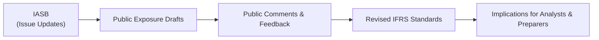

## Introduction

Staying on top of IFRS and US GAAP developments can be a bit like trying to keep your balance on a fast-moving treadmill. You know how it is: new revenue recognition rules appear almost overnight, and lease accounting transforms how you evaluate liabilities from one reporting period to the next. One day you’re comfortable with a particular framework for classifying financial instruments, and then—bam!—the standard changes. For many of us, the first time we got caught off-guard by an update, it felt like we’d missed an important memo. The good news? With the right mindset and strategies, you can remain well-informed, nimble, and confident in your financial statement analyses.

The CFA Level II exam invests considerable effort in exploring financial statement analysis (FSA) across IFRS and US GAAP. But these standards are not static. They evolve in response to new business models (like subscription services or digital assets), as well as the growing emphasis on sustainability. In other words, if you want to become a top-tier financial analyst—someone who can serve as a trusted advisor—continuous learning must become a core part of your professional life.

## Why IFRS and GAAP Keep Changing

Economies, business practices, and investor expectations keep shifting. Standard setters like the International Accounting Standards Board (IASB) and the Financial Accounting Standards Board (FASB) respond to these shifts through exposure drafts, public consultations, and the eventual issuance of new or revised guidance. For instance, IFRS 15 and ASC 606 on revenue recognition emerged to unify and clarify how companies record and disclose revenue streams. IFRS 16 and ASC 842 shook up the lease accounting space, ensuring that a wider range of lease commitments are properly reflected on the balance sheet. Meanwhile, IFRS 9 replaced IAS 39 for classifying and measuring financial instruments and reimagined the standards for impairment and hedge accounting. Plus, IFRS 17 overhauled insurance contract accounting for companies operating in that very specialized sector.

Even if a revised standard looks “minor,” it can have a domino effect on how you analyze an organization’s profitability, liquidity, and leverage. Valuations may need recalibration. Scenario analyses might shift. Return metrics could look wildly different if certain assets or liabilities are reclassified. If you want your modeling and client recommendations to remain solid, you have to dig into the details.

Below is a simple flowchart illustrating how IFRS developments typically come about:



The FASB follows a similar pattern with exposure drafts, comment periods, and final Accounting Standards Updates (ASUs). Staying up to date on these processes ensures that your analyses incorporate the latest, most relevant guidance.

## Practical Ways to Stay Informed

### Official Publications and Technical Summaries

• Sign up for IASB and FASB newsletters. Subscribe to alerts so that each new exposure draft and updated standard lands in your inbox.  
• Download technical summaries from IASB’s website (ifrs.org) or from the FASB Accounting Standards Codification (asc.fasb.org). These summaries boil down extensive guidance into bite-size insights that you can reference quickly.  
• Keep track of the “effective date” and “transition” requirements for major standards. Some standards permit early adoption, while others might have staggered effective dates based on company size.

One of the things I love about these official sources is that they rarely pull punches—they’ll give you the full rationale behind each revision. Sure, it’s sometimes a bit dense, but it means you can get a sense for the conceptual motivations behind the changes, which helps you interpret them more intuitively in your daily analysis.

### Subscribe to Premier Accounting Journals and Periodicals

• Journals such as The CPA Journal, Journal of Accountancy, and Accountancy Europe can help you catch a broader perspective on how these standards affect global businesses.  
• Many professional bodies (AICPA, ACCA, CPA Australia) publish monthly or quarterly updates highlighting pressing issues in FSA.  

These periodicals offer plenty of examples, case studies, and discussion around new or proposed standards, often accompanied by opinions from accounting professionals on how companies are adapting. This real-world angle can be invaluable, especially when your Level II exam’s item sets get you to analyze vignettes that mirror real corporate behavior.

### Conferences and Webinars for Continuous Professional Development

• Conferences hosted by organizations like the AICPA or ACCA often feature thought leaders and experienced professionals dissecting hot topics. They also feature sessions on emerging areas like integrated reporting (IR) or environmental, social, and governance (ESG) disclosures.  
• Webinars offered by audit firms (Deloitte, EY, KPMG, PwC) provide quick updates on newly issued standards. The Q&A portion can reveal practical challenges that you won’t find in standard-setter publications.  

I once attended a webinar right after IFRS 16 was issued. The host—a leasing expert—pointed out an area where interpretational differences could cause companies to adopt widely varying approaches to embedded leases. I actually used that tip the next week to advice a client who was uncertain how to structure their operating lease disclosures. So, trust me, these events can be gold.

### Networking and Collaborative Learnings

• Compare notes with your peers in corporate accounting or auditing. They’re often on the front lines of implementing new standards and can share practical takeaways you might never glean from a textbook.  
• If you belong to a professional accounting organization, you can join industry-specific committees or roundtables. These groups frequently discuss challenges and best practices around new or proposed standards.

### Integrating Non-Financial Reporting: ESG and Integrated Reporting

As a CFA candidate, you’ve probably heard that the lines between pure financial metrics and sustainability metrics are becoming blurred. IFRS is exploring ways to incorporate sustainability disclosures, while the International Sustainability Standards Board (ISSB) is unveiling frameworks that eventually align with IFRS-based financial reporting. Similarly, the US Securities and Exchange Commission has started to propose new rules around climate-related disclosures.

• Familiarity with ESG frameworks (GRI, SASB, TCFD) can give you a huge advantage. If you see references to integrated reporting or the <IR> framework, that’s a signal that more data points—beyond plain old net income—are being pulled into the spotlight.  
• Investors and regulators are also increasingly interested in forward-looking information on climate risks, social impacts, and governance structures. Analysts who understand how to interpret and model these disclosures can provide deeper insight.

In many ways, the game is evolving from “just IFRS vs. GAAP” to a more holistic perspective. If you can keep pace with both financial and non-financial measurement approaches, you’ll become an invaluable resource—someone who can see the bigger picture rather than focusing solely on historical cost or fair-value adjustments.

## Leveraging Technology and Data Analytics

We live in a time when technology can almost magically streamline your learning. Data analytics platforms—like Power BI, Tableau, and certain AI-driven solutions—can integrate real-time IFRS or GAAP updates.

• Some accounting software vendors build in automated trackers for new standards. That might mean less manual scanning of official pronouncements.  
• Advanced modeling tools allow for “what-if” analyses based on upcoming IFRS or GAAP changes. This can be a game-changer if you’re advising clients or adjusting your equity valuations.

Here’s a tiny Python code snippet that demonstrates how you might programmatically keep tabs on IFRS updates:

```python
import requests

url = "https://www.ifrs.org/issued-standards/"
response = requests.get(url)
if response.status_code == 200:
    print("Successfully retrieved IFRS updates!")
    # parse content to extract new IFRS updates
else:
    print("Failed to retrieve IFRS updates. Check your network.")
```

Naturally, you’d expand on that code to parse the HTML, store the latest updates in a database, or even send yourself an email alert when a new pronouncement is published. The main point is: technology can be a buddy that spares you from having to wade through endless PDFs.

## Quick Comparison: Key Areas of Ongoing Updates

Below is a concise table summarizing some ongoing areas of difference or updates in IFRS and US GAAP. While the fundamentals of these standards might be well-known, new interpretations or extended guidance can pop up any time.

| Topic                   | IFRS Guidance | US GAAP Guidance       |
|-------------------------|--------------:|------------------------|
| Revenue Recognition     | IFRS 15      | ASC 606                |
| Leases                  | IFRS 16      | ASC 842                |
| Financial Instruments   | IFRS 9       | ASC 320, 321, 326      |
| Insurance               | IFRS 17      | ASC 944                |

Sometimes these differences can look trivial until you open up a real company’s financial statements and see how material the changes can be. That’s why it’s so critical to track the details.

## Continuous Learning Mindset

Embracing ongoing learning is, in a sense, your safeguard. Here’s why:

• Boosted Credibility: When colleagues or clients know you’re ahead of the curve on standard changes, they’ll lean on your analyses.  
• Fewer Surprises: Learning about IFRS or GAAP updates before (rather than after) they become effective spares you from last-minute panic.  
• Career Mobility: You can position yourself not just as a “numbers person,” but also as a resource for strategic decision-making.  
• Confidence in Exams: The CFA Program might continually integrate updated accounting standards into future exam cycles. So the knowledge you gain now can pay dividends later.

Honestly, I recall a personal story: I was assisting an organization with a potential cross-border acquisition. The mismatch in local GAAP and IFRS-based valuations caused friction. After referencing IFRS 3 (Business Combinations) updates, we realized there were new nuances to identifying intangible assets that the entire team had overlooked. That moment drilled into me the lesson that if you’re not up to date, the risk of misinterpretation—and a poor business decision—skyrockets.

## Practical Recommendations for Your Ongoing Journey

• Schedule regular “review blocks” in your calendar to read about IFRS or GAAP updates, perhaps once a month.  
• Maintain a personal knowledge base. That could be a simple Excel file, a Word doc, or an online repository summarizing each new standard, its effective date, and core impact on the financial statements.  
• Attend at least one major conference per year or a handful of shorter webinars. Use these sessions to pose questions about real issues you’re facing at work.  
• Engage in peer study groups. Magic happens when you dissect a new standard together, comparing interpretations and best practices.

## Final Thoughts for CFA Level II Candidates

Continuous learning is not just a buzzword; it’s a lifeline in modern accounting. Whether it’s IFRS or US GAAP, all these frameworks are designed to better reflect economic reality. We as analysts are bridging the gap between the numbers and the underlying business stories. By staying current—subscribing to official updates, diving into professional development, leveraging data analytics, and broadening your scope to include sustainability reporting—you give yourself an edge that will resonate well beyond Level II. You’ll be firmly on track to becoming the trusted advisor employers, clients, and colleagues rely on.

And sure, it might seem daunting to juggle these constant updates. But with a solid strategy and consistent habits, you can transform what feels like an ever-shifting landscape into a journey of professional growth.

## References, Further Reading, and Resources

• [IFRS Updates](https://www.ifrs.org/issued-standards/) – Official site for tracking new pronouncements, exposure drafts, and conceptual framework changes.  
• [FASB Accounting Standards Codification](https://asc.fasb.org/) – The go-to resource for US GAAP.  
• “Corporate Governance and Ethics” by Zabihollah Rezaee – Explores how governance, ethics, and sustainability integrate into modern finance.  
• “Sustainability Accounting and Integrated Reporting” by Charl de Villiers and Warren Maroun – Describes how ESG and integrated reporting frameworks fit into financial analysis.  
• AICPA, ACCA, and other professional bodies – Check out their websites for webinars, publications, certificate courses, and conferences.  

## Test Your Knowledge: Continuous IFRS/GAAP Updates and Professional Development



### When a new accounting standard is introduced, which of the following statements is most accurate regarding its potential impact on company financial statements?

- [ ] It rarely affects financial statement ratios.
- [ ] It has minimal impact on cross-border valuation metrics.
- [x] It can significantly alter reported profitability and leverage.
- [ ] It only impacts disclosure notes and does not affect stated performance.

> **Explanation:** New standards can change how transactions are recognized and measured, influencing profitability, liquidity, and leverage. This in turn affects valuation metrics and ratio analysis.

### Which of the following resources is most directly focused on official US GAAP guidance?

- [ ] IFRS Technical Summaries
- [x] FASB Accounting Standards Codification (ASC)
- [ ] IASB Exposure Drafts
- [ ] CFO Magazine

> **Explanation:** The FASB Accounting Standards Codification (ASC) is the authoritative source for US GAAP standards. IFRS Technical Summaries and IASB Exposure Drafts address IFRS, whereas CFO Magazine is not an official standard.

### Which type of professional event often includes interactive Q&A sessions that detail how companies are practically implementing new accounting standards?

- [x] Webinars hosted by large audit firms
- [ ] Local business expos without regulatory content
- [ ] Advertising conferences
- [ ] Only AI-driven tutorials with no presenter interaction

> **Explanation:** Many large audit firms host webinars that provide updates on final or proposed standards, illustrating real-world application challenges and solutions.

### An analyst hoping to understand global trends in evolving accounting practices should focus on:

- [ ] Only US GAAP updates
- [ ] Only local tax code changes
- [x] Both IFRS and US GAAP, as well as emerging sustainability frameworks
- [ ] Simplified private-company GAAP that does not change frequently

> **Explanation:** Given globalized capital markets and cross-border transactions, an analyst needs awareness of IFRS, US GAAP, and developing frameworks like ESG for a comprehensive perspective.

### Which of the following statements best captures the role of integrated reporting (IR)?

- [x] IR combines financial and non-financial elements, including sustainability metrics, to present a holistic view of a firm’s performance.
- [ ] IR replaces all historical financial statements with sustainability data.
- [ ] IR only focuses on governance metrics, ignoring environmental factors.
- [ ] IR is solely a branding approach with no regulatory backing.

> **Explanation:** Integrated reporting (IR) weaves together financial, environmental, social, and governance data for a fuller understanding of a firm’s long-term value creation.

### Which of the following describes the primary benefit of joining professional accounting bodies like the AICPA or ACCA?

- [x] Access to specialized training, seminars, and up-to-date technical resources
- [ ] Guaranteed career promotion without additional tests
- [ ] Complete exemption from future accounting standard changes
- [ ] No real advantages, as all information is open source

> **Explanation:** Membership offers exclusive training, webinars, and timely technical updates—and can significantly enhance your continuous learning efforts.

### If an analyst rarely consults updated IFRS or US GAAP resources:

- [x] They risk using outdated assumptions that could distort valuations.
- [ ] Their models become more accurate due to less “noise” from new change.
- [x] They might overlook critical reclassifications in the current financials.
- [ ] They strengthen their credibility among clients and peers.

> **Explanation:** Neglecting changes can easily lead to outdated assumptions and errors in financial analysis and valuation, diminishing credibility.

### Adopting a continuous learning approach to accounting standards is crucial because:

- [ ] Changes in standards are only relevant to auditors.
- [x] They help analysts remain accurate and credible in a dynamic reporting landscape.
- [ ] Standard updates are merely administrative details.
- [ ] Once you’ve read the primary IFRS and GAAP books, you’ll never need additional info.

> **Explanation:** Continuous learning supports thorough, up-to-date analyses, ensuring that shifts in accounting rules don’t catch you off guard.

### How might technology assist analysts in monitoring standard updates?

- [ ] By eliminating the need to read official pronouncements
- [ ] Through manual data entry tools that require frequent user updates
- [x] Via automated web-scraping and real-time feeds from standard-setter websites
- [ ] By sending generic alerts without detail on new standards

> **Explanation:** Automated tools can crawl standard-setter websites and databases, alerting analysts to new or updated guidance more efficiently than manual monitoring.

### True or False: Embracing both financial and sustainability reporting frameworks can augment an analyst’s ability to provide a more holistic assessment of a company.

- [x] True
- [ ] False

> **Explanation:** Integrating ESG or sustainability frameworks with financial statement analysis helps capture multiple dimensions of a company’s performance and risks, thus offering a more comprehensive viewpoint.


