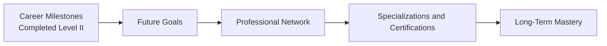

## Celebration and Reflection  

Wow—look at you. You’ve just tackled a huge body of knowledge on Financial Statement Analysis (FSA) at the CFA® Level II depth. That’s no small feat, right? I remember when I was in your shoes, feeling both the thrill of accomplishment and a bit of that, “So, what comes next?” kind of mix. But let me say, you’re at a fantastic turning point. This entire Volume 4 has equipped you with the skills to analyze and interpret complex financial statements across different global accounting standards, and to see how all those puzzle pieces (pensions, intercorporate investments, FX translations, and more) come together into a holistic financial story.

There’s something so satisfying about completing your second milestone in the CFA journey. You’ve solidified your understanding of IFRS vs. US GAAP differences (remember Chapter 2?), dissected the complexities of pension accounting (hello, Chapters 7 and 8), and navigated the intricacies of consolidation (Chapters 3–6). You even uncovered ways to identify potential reporting quality issues (Chapters 18–21) and integrated advanced ratio analysis with forecasting techniques (Chapters 24–25). All in all, you’ve built a robust bedrock of FSA knowledge. Now it’s time to figure out how to expand on those insights, both for the upcoming Level III exam (if you’re continuing the CFA path) and for your long-term career.

## Creating a Personalized Development Plan  

It’s easy to feel a bit overwhelmed at this stage—there’s so much you can do! But a well-defined plan takes you from “What now?” to “Let’s get it done.” First, reflect on your career goals. Maybe you want to move into a specialized field like forensic accounting, or perhaps you’re aiming for a portfolio management track, or even something more entrepreneurial. Whatever your aspirations, write them down. Then assess the top skills, credentials, or experiences that best align with that aim.  

• If your dream is to manage multi-asset portfolios, you’ll likely benefit from completing Level III and perhaps exploring advanced training in risk modeling.  
• If you’re more into the corporate side, especially M&A or strategic consulting, you might consider delving deeper into business combinations and valuations (Chapters 4, 5, and 26).  
• If you love digging into possible fraud scenarios (like me—there’s a certain thrill in detective work), forensic accounting courses or certifications can be super helpful.  

A big part of planning is scheduling your path forward. When do you plan to sit for Level III? Are there local or online workshops you can attend to broaden your skill set? Do you want to shadow someone in your firm who’s already an expert on, say, pension auditing? Create a tangible timeline with milestones—something that holds you accountable.  

## Expanding Your Professional Network  

Let’s be honest: simply studying numbers can get a little lonely, and one of the best ways to break out of that isolation is by engaging with fellow professionals. I used to be quite shy about approaching seasoned analysts—but once I pushed myself to start attending local CFA Society events, it opened up a whole new world of possibilities. You exchange experiences, find new job prospects, discover mentors, and even form great friendships.  

And here’s the thing about networking: it’s not just about piling up business cards. Instead, it’s about serving a mutual interest. Share thoughts on upcoming regulatory changes, new IFRS updates, or even pass along an interesting article about business combination trends. Your “Professional Network”—that circle of colleagues, mentors, and peers—will become your sounding board for future endeavors.  

• Attend relevant conferences or online forums.  
• Volunteer at workshops—teaching or assisting is an amazing way to reinforce your own knowledge (we learn better when we teach!).  
• Don’t forget online communities. LinkedIn, specialized analyst groups, and even certain finance Slack channels can be gold mines for forging meaningful relationships.  

## Turning Numbers into Stories  

One skill that can put you miles ahead of your competition is “Storytelling in FSA.” Yes, the data matters—obviously. But your ability to interpret and communicate financial statements in a relatable manner is what resonates with decision-makers.  

When you see a jump in intangible assets on some company’s balance sheet, try weaving a story around it. Are they heavily investing in brand-building or new patents? Or consider a multinational with complicated FX gains and losses. Instead of rattling off the changes in currency translation adjustments, ask yourself, “What’s the impact on the firm’s competitive positioning abroad? On its real profitability?”  

Bringing the data to life can even help you to highlight potential red flags, such as channel stuffing or quietly bloated inventory levels. By painting a clear picture of potential consequences—like liquidity risk, legal vulnerabilities, or reputational damage—you become a trusted advisor, rather than just “the numbers person.”  

## Sustaining Your Knowledge: Avoiding Decay  

Let’s keep it real: if you don’t use it, you lose it. That “Knowledge Decay” factor can creep up on you quicker than you think. When I first studied pension accounting, I was gung-ho about memorizing every formula for projected benefit obligation, interest costs, and net periodic pension costs. But six months of not touching the subject and—poof—so many details vanished from my mind.  

Periodic refresher sessions are a saving grace. Make sure you revisit high-level concepts:  
• Consolidation and equity method intricacies (Chapters 3–6).  
• Goodwill impairment testing techniques (Chapter 5).  
• FX translation methods (Chapters 11–13).  
• Reporting quality pitfalls (Chapters 18–20).  

Even scheduling a half hour every two weeks to skim your notes or rework a relevant item set question can keep those topics fresh. If you’re actively working in finance, consider applying the knowledge to real companies. You’ll remember IFRS 9 classification rules much better if you have to apply them to an actual bond portfolio at your firm.

## Maintaining an Ethical Mindset  

No matter how sharp your analytical acumen, or how precise your modeling, it doesn’t mean a thing if it’s not done ethically. We’ve all seen too many cautionary tales where brilliant analysts or executives let their moral compass slip, leading to massive legal troubles or reputational black holes.  

The CFA Institute’s Code of Ethics is your North Star; it anchors your integrity and trustworthiness. This doesn’t just mean avoiding obvious infractions like insider trading. It means being transparent about assumptions, treating clients fairly, and speaking up when you notice something off in the books. Especially as you move up in responsibility, an “Ethical Mindset” is absolutely critical.  

## A Glimpse into Long-Term Opportunities  

Who says your path ends at the charter? Sure, obtaining your CFA designation is a narrative highlight, but plenty of interesting directions await:  

• “Forensic Accounting”: If you love detective work, you can investigate corporate fraud, evaluate compliance for M&As, or even assist with legal proceedings in financial disputes.  
• “Strategic Insights”: If you’re intrigued by how FSA shapes competitive advantage, you could pivot into strategic consulting or corporate development.  
• “Career Goals”: Define them for yourself, whether that’s leadership at an asset management firm, becoming a CFO, or launching your own consultancy.  

FSA is such a broad field that you can apply it in countless specialized niches. People often think of “accounting” as number-crunching. In reality, you’re equipped to craft and evaluate strategies that significantly influence corporate growth and public trust.  

Below is a quick flowchart summarizing the journey from earning your Level II knowledge to building a sustainable, long-term career:

## Keep Practicing and Evolving  

Even as you move forward, keep your materials handy. After all, the advanced ratio analysis from Chapter 25, or extended case examples from Chapters 28–30, will remain relevant whether or not you choose to pursue Level III. Stay curious—seek mentorship from seasoned professionals, scour publicly available financials for interesting real-world examples, and maybe set up a monthly “study group” with equally motivated peers to discuss complex scenarios.  

One tip if you’re proceeding to Level III: the emphasis shifts more toward portfolio management and the “big picture,” but your robust FSA background will give you the context you need to do a deeper dive into equity valuation, risk analysis, or integrated case studies. In other words, you aren’t done with financial statements; you’ll just be layering on more complexities from the vantage point of portfolio managers and institutional investors.  

## References, Further Reading, and Resources  

• “International Financial Statement Analysis” (CFA Institute’s Official Text)  
A fantastic resource for continuing mastery post-exam. Contains deeper-dive discussions, more advanced examples, and updated references to IFRS.  

• “Winning the Loser’s Game” by Charles Ellis  
A classic that emphasizes long-term strategies and prudent decision-making—both of which pair well with rigorous FSA knowledge.  

• [CFA Society Events](https://www.cfainstitute.org/en/membership/societies)  
An official gateway to discovering local events, seminars, and networking gatherings.  

• [Ethical and Professional Standards](https://www.cfainstitute.org/ethics-standards)  
Regularly revisiting the CFA Institute’s code ensures that your ethical foundation remains fresh and top of mind.  

Ultimately, FSA goes beyond passing an exam. It’s about weaving together numbers, corporate narratives, and ethical perspectives into a cohesive framework that drives real-world decisions. I hope you’ll carry these insights forward and keep cultivating your analytical mindset in everything you do—whether that’s forging a path in investment management or shaping strategic direction in corporate finance. Congratulations on completing this critical step, and here’s to the exciting journey ahead.  

## Test Your Knowledge: Concluding Remarks and Next Steps in FSA



### Which of the following best describes an effective strategy to avoid knowledge decay in FSA over time?

- [ ] Avoiding exposure to new case studies to prevent confusion  
- [ ] Relying solely on memory without periodic reviews  
- [x] Scheduling regular refresh sessions and applying concepts to real data  
- [ ] Ceasing to read financial news or analyses  

> **Explanation:** Knowledge decay is combated by actively revisiting material at regular intervals, particularly through real-world application.

---

### Why is the concept of “Storytelling in FSA” considered valuable?

- [ ] It helps analysts avoid numerical calculations.  
- [x] It allows analysts to interpret data in context and communicate insights clearly.  
- [ ] It reduces the need for thorough quantitative analysis.  
- [ ] It is primarily used to hide negative trends from clients.  

> **Explanation:** Storytelling brings charts and numbers to life, offering context and practical implications that resonate with stakeholders and clients.

---

### Which chapter in this volume primarily addressed Goodwill Impairment Testing?

- [ ] Chapter 2: IFRS and US GAAP—High-Level Differences  
- [x] Chapter 5: Business Combinations and Goodwill  
- [ ] Chapter 18: Evaluating Reporting Quality—Overview  
- [ ] Chapter 7: Pension Accounting—Defined Benefit Basics  

> **Explanation:** Goodwill recognition, measurement, and impairment testing are covered extensively in Chapter 5.

---

### According to this section, what action should you consider when growing your professional network?

- [ ] Limiting discussions to only your direct colleagues  
- [ ] Avoiding local CFA Society events to conserve study time  
- [ ] Keeping your insights to yourself to maintain a competitive edge  
- [x] Sharing insights on new regulations, IFRS updates, or relevant industry articles  

> **Explanation:** Networking is enriched by the mutual exchange of knowledge, experience, and resources.

---

### Which statement about ethical conduct is most correct?

- [ ] Exceptional technical skills justify occasional ethical lapses.  
- [ ] Ethics only matters in passing the CFA exam.  
- [ ] Ethical standards do not apply to consolidated financial analysis.  
- [x] Integrity and transparency must guide an analyst’s approach, regardless of specialization.  

> **Explanation:** Upholding integrity is essential across all areas of financial work, consistent with the CFA Institute’s Code of Ethics.

---

### What is a key advantage of using local or online workshops post- Level II?

- [x] Reinforcing knowledge through teaching or applying FSA concepts in practical settings  
- [ ] Ensuring that you never deviate from textbook solutions  
- [ ] Guaranteeing advanced knowledge of untested exam material  
- [ ] Restricting your exposure to new financial developments  

> **Explanation:** Actively engaging in workshops, whether as an attendee or a mentor, deepens your understanding and cements concepts in long-term memory.

---

### When considering forensic accounting as a career path:

- [ ] It involves ignoring legal and compliance frameworks.  
- [x] It can help uncover potential fraud and support legal disputes.  
- [ ] It requires no background in FSA or auditing.  
- [ ] It is unrelated to analysis of corporate transactions.  

> **Explanation:** Forensic accounting focuses on detailed investigative analysis of financial records, often in the context of fraud detection or litigation support.

---

### Which exam-related tip might be most beneficial if you decide to move on to Level III?

- [ ] Disregard your FSA knowledge since Level III only covers ethics.  
- [x] Leverage your FSA expertise to contextualize more advanced portfolio management scenarios.  
- [ ] Avoid practicing item set questions as Level III does not require them.  
- [ ] Skip reading about IFRS because GAAP is more widely used.  

> **Explanation:** Level III emphasizes portfolio management, where FSA knowledge continues to be highly relevant for asset pricing, strategy, and risk assessment.

---

### Which resource is specifically recommended for advanced reading on financial statements post-exam?

- [x] “International Financial Statement Analysis” (CFA Institute’s Official Text)  
- [ ] A random marketing blog  
- [ ] Non-finance best-seller novels  
- [ ] Personal emails from your colleagues  

> **Explanation:** “International Financial Statement Analysis” is directly aligned with CFA topics and offers deeper insights for continuing education.

---

### Achieving the CFA® charter implies:

- [x] You have a robust analytical foundation, coupled with ongoing ethical obligations.  
- [ ] You are free from adhering to any professional standards going forward.  
- [ ] You should stop all professional networking efforts.  
- [ ] You no longer need continuous learning in financial analysis.  

> **Explanation:** CFA charterholders remain committed to lifelong learning and must uphold ethical standards as they progress in their careers.


