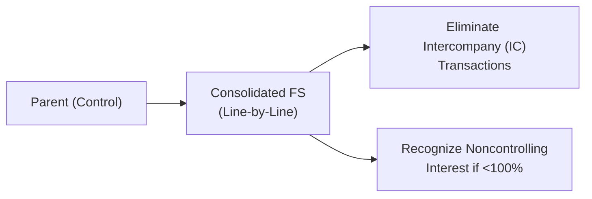
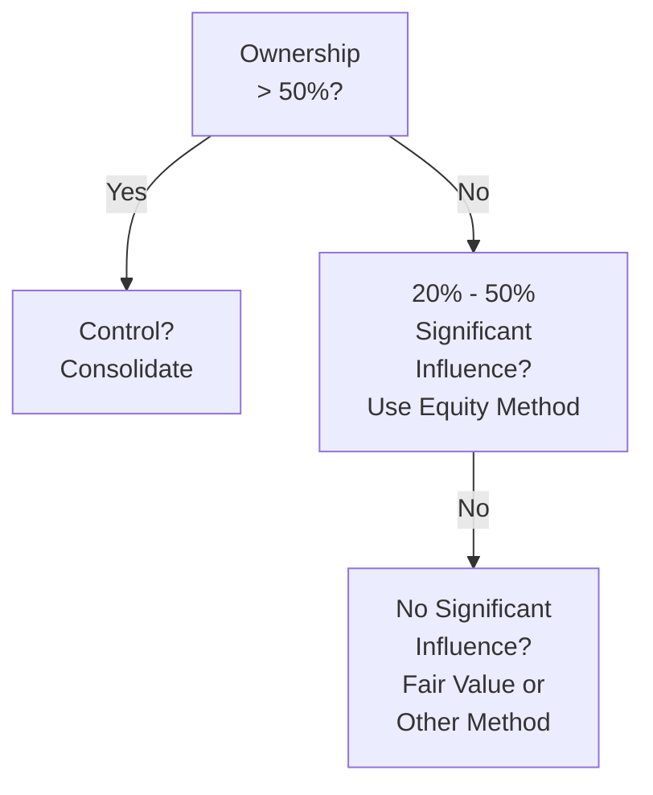

## Revisiting the Scope of Influence
So, let’s jump right in. Whenever I think about consolidation versus the equity method, I remember a phone call from a colleague who was scratching his head over whether his client needed to consolidate a recently acquired subsidiary. They had a 51% stake—enough to qualify as control, but the colleague wasn’t 100% sure if partial-year consolidation was required. Spoiler alert: it was.

In everyday accounting parlance, “control” generally means owning more than 50% of the voting stock or otherwise directing the investee’s key decisions. That’s your typical scenario for consolidation. By contrast, if you hold between roughly 20% and 50% of voting rights, you usually have “significant influence” rather than outright control. In that case, the equity method is more appropriate. It’s not always cut and dried, but this framework is a good place to start.

If you’re wondering about the rationale behind these thresholds: The thinking is that if you can sway the direction of the business—like influencing critical financial and operating decisions—then you’re more than just a passive investor. But if you hold a majority share, you basically set the entire strategy. That’s where consolidation usually comes into play.

## Consolidation Mechanics
When you consolidate, you combine the financial statements of the parent and the subsidiary line by line. Assets, liabilities, revenues, and expenses of both entities are merged into a single set of financial statements, as though you’re one grand entity. The notion is: the group is controlled by the parent, so let's present it as a single economic unit.

• Line-by-Line Combination: You add the subsidiary’s assets to the parent’s assets, the subsidiary’s liabilities to the parent’s liabilities, and so forth, forming a consolidated balance sheet and income statement.

• Elimination of Intercompany Transactions: If the parent sold goods to the subsidiary, that sale is effectively “internal” to the group. We need to eliminate intercompany sales, cost of goods sold, profits, loans, or any other internal transactions—otherwise we’d be counting them twice.

• Noncontrolling Interests (NCI): If the parent doesn’t own 100% of the subsidiary (say, only 80%), the remaining 20% interest belongs to external shareholders (the “noncontrolling interest”). On the equity section of the consolidated balance sheet, you present the NCI portion of the subsidiary’s net assets as a separate component.

I recall another scenario where a client had a 60% stake in a small tech company. We had to do elimination entries for intangible assets that were transferred. The intangible assets had an intercompany profit margin, so we had to strip that out on consolidation—kind of tedious, but definitely necessary for correct statements.

### Consolidation at a Glance (Mermaid Diagram)

The diagram above shows a simplified perspective of how consolidation typically works. You start from the parent, recognize control, and present a single consolidated financial statement. Along the way, you remove effects of intercompany trading and reflect any minority interest in equity.

## Equity Method Mechanics
When you only have significant influence—rather than control—the equity method is usually the go-to. Let’s talk about how it works:

• Single Investment Line Item: On the balance sheet, your investment in the associate typically sits on one line, often called “Investment in Associate.” No line-by-line merging of assets and liabilities.

• Pro-Rata Share of Income: On the income statement, you (the investor) recognize your share of the investee’s net income. If you own 30% of the associate, you typically pick up 30% of their net income. That amount boosts your investment balance on the balance sheet—like a rolling update of the investee’s equity.

• Dividends as Return of Capital: If your associate pays dividends, they reduce your investment balance. In other words, dividends aren’t recognized as revenue under the equity method but rather as a return of capital.

I had a friend who was constantly mixing up the equity method with a fair value approach. Each time the associate declared a dividend, he inadvertently credited dividend income. No, that’s not correct—under the equity method, the accounting entry typically debits cash (the dividend you received) and credits the investment account. The net effect on the income statement is zero.

## Comparative Impact on Ratios
One of the biggest differences between consolidation and the equity method shows up in financial ratio analysis. A quick example always helps:

Imagine you own 60% of a subsidiary, Sub A, which has $300 million in total assets. Under consolidation, those $300 million are pulled right into your group balance sheet—plus Sub A’s liabilities too. Under the equity method (if you somehow only had significant influence and not control), you might only show a fraction (your proportion of Sub A’s equity) as the “Investment in Sub A” on your balance sheet, which could be drastically less than $300 million. Let’s see how that plays out:

• Profitability Ratios (e.g., Net Margin):  
  – Consolidation typically shows higher total revenue and expenses, since Sub A’s entire revenue and expense lines are included. Your net margin might look smaller if the subsidiary’s margins are lower than your parent’s.  
  – The equity method only brings the share of net income from the associate, not top-line revenue, so your overall net margin might be higher compared to a consolidated view.

• Leverage Ratios (e.g., Debt/Equity):  
  – Consolidation lumps the subsidiary’s liabilities into your balance sheet. If the subsidiary is heavily leveraged, your reported Debt/Equity may jump.  
  – Under the equity method, the associate’s debt is off your books, because you don’t incorporate that line by line. This can make your leverage ratio look more favorable.

• Return on Assets (ROA):  
  – Consolidation typically inflates your total asset base because you include everything from the subsidiary. Any net income is from the entire group. That tends to reduce your ROA if the subsidiary’s assets are large in comparison to net income.  
  – With the equity method, you only carry a single investment line. The lower asset base could boost your ROA.

### An Illustrative Mini-Example
Let’s say the parent alone has $500 million in total assets. We’ll also suppose the subsidiary has $300 million in total assets. If fully consolidated, the group shows $800 million of assets (subject to adjustments for intercompany items). Meanwhile, if the parent invests in an associate with a 40% stake, and that associate’s total equity is, say, $100 million, the investment line on the parent’s balance sheet might be around $40 million (ignoring fair value adjustments and other complexities). So, you see how drastically the total assets can differ between the two methods.

## Disclosure Requirements
Under IFRS and US GAAP, there are pretty detailed disclosure rules:

• IFRS 10 (Consolidated Financial Statements) and IAS 28 (Investments in Associates) lay out the principles for deciding whether to consolidate or to apply the equity method. Similarly, IFRS 12 requires you to disclose critical judgments in making that decision.  
• ASC 810 (Consolidation) does something similar for US GAAP, explaining when you must consolidate a variable interest entity or a voting interest entity. FASB also clarifies equity method rules in ASC 323.  
• Typical footnotes will describe the ownership structure, how you concluded on consolidation or significant influence, and any quirks, like partial-year acquisitions or changes in ownership during the period.

From an exam standpoint, you want to pay attention to footnotes or vignettes describing the nature of the investor-investee relationship. If you see lines like “Investor exercised significant influence,” that’s your clue for the equity method. If you see “Independent Board of Directors,” “Investor doesn’t hold a controlling share,” or “Investor representation on the Board,” it might also hint at significant influence. The exam questions might revolve around these subtle details.

## Key Exam Tips
• Intercompany Transactions: You gotta watch out for inventory sales from a parent to subsidiary or vice versa. Any unrealized profit in inventory carried over at period-end must be eliminated. The exam might present a scenario with the parent selling goods at a markup to the subsidiary, requiring you to remove that markup from consolidated net income.  
• Partial-Year Acquisitions: If you gained control mid-year, you normally consolidate only from the date of acquisition. The exam might ask you to prorate or do a partial-year consolidation.  
• Ratio Evaluations: Don’t forget to adjust the target or peer group’s statements if they are using different methods. The exam might ask how to better compare two companies, one of which consolidates while the other uses the equity method for a major investment.  
• Judgment on “Control” vs. “Significant Influence”: The borderline cases—like 45% ownership or “golden share” arrangements—can trip you up. The exam might highlight that an investor with less than 50% still wields control due to contractual rights or governance structures.

## Common Pitfalls and Best Practices
I’ve seen folks repeatedly stumble over the same issues:

• Confusing dividends under the equity method: Dividends from the associate are not considered revenue— they reduce the carrying amount of the investment.  
• Overlooking Elimination Entries: Missing those intercompany profits can lead to overstated revenue or profit.  
• Failing to Distinguish NCI: If the parent doesn’t own 100% but still consolidates, you have to separate the portion of the subsidiary’s equity and income that you do not own. That portion is the noncontrolling interest.  
• Time Apportionment: If you buy or sell a controlling interest mid-year, you may only consolidate (or deconsolidate) the subsidiary’s results for the relevant portion of the year.

## Real-World Perspective
I had a CFO once, you know, who was absolutely certain that because they hit exactly 50% ownership, the equity method was still appropriate. But contractually, they had the power to direct the key activities of the investee—turns out they needed to consolidate. Summarizing that situation: sometimes ownership percentages alone don’t tell the full story. You may need to examine contractual rights, potential voting rights, or presence on the Board. IFRS 10 is quite big on the concept of “de facto control.”

## Visual Overview: Consolidation vs. Equity Method

## References
• IFRS 10, IFRS 12, IAS 28 – IFRS Foundation:  
  https://www.ifrs.org  
• ASC 810 (Consolidation) and ASC 323 (Investments – Equity Method) – FASB:  
  https://www.fasb.org  
• Kieso, Weygandt, and Warfield: “Intermediate Accounting.”  
• CFA Institute’s “International Financial Statement Analysis.”  

----

## Test Your Knowledge: Consolidation vs. Equity Method Accounting



### If an investor owns more than 50% of an entity's voting shares, which accounting treatment is typically required?
- [x] Consolidation of the subsidiary
- [ ] Equity method
- [ ] Fair value method
- [ ] Cost method

> **Explanation:** Generally, ownership above 50% implies control, requiring consolidation in most circumstances, subject to any unusual contractual or legal constraints.

### How are intercompany transactions treated during consolidation?
- [x] They are eliminated to prevent double counting
- [ ] They are recognized as external transactions
- [ ] They are disclosed but not eliminated
- [ ] They are only eliminated for inventories

> **Explanation:** Consolidated financial statements present the parent and subsidiary as if they are a single entity. Hence, any transactions between the parent and subsidiary must be removed.

### Under the equity method, when an investee declares and pays a dividend, how does it affect the investor's financial statements?
- [ ] It increases dividend income
- [x] It reduces the carrying amount of the investment
- [ ] It has no effect on the investor's balance sheet
- [ ] It increases net operating income

> **Explanation:** Under the equity method, dividends received from the associate are treated as a return of capital and thus reduce the investment account, rather than being recorded as income.

### Which of the following ratios often appears higher under the equity method compared to consolidation, all else being equal?
- [x] Return on Assets (ROA)
- [ ] Debt/Equity
- [ ] Net Margin
- [ ] Current Ratio

> **Explanation:** Under the equity method, the total assets included on the investor’s balance sheet are lower than in a consolidation scenario, often resulting in higher ROA because the numerator (share of associate's net income) remains the same, but the denominator (assets) is smaller.

### What is an important disclosure requirement under IFRS for entities deciding whether to consolidate or apply the equity method?
- [x] The significant judgments and assumptions made in determining control or influence
- [ ] A detailed forecast of the investee’s net income
- [ ] The historical equity method share percentage for the past five years
- [ ] None of the above

> **Explanation:** IFRS (especially IFRS 10 and IFRS 12) requires entities to disclose their reasoning and judgments behind how they deemed an entity controlled or significantly influenced.

### A parent owns 80% of a subsidiary. In the consolidated financial statements, where is the 20% not owned by the parent recognized?
- [ ] As a minority liability on the consolidated balance sheet
- [ ] It is ignored because the parent has control
- [ ] Deducted from the subsidiary’s assets
- [x] As noncontrolling interest in the equity section

> **Explanation:** The portion of net assets not owned by the parent is shown as noncontrolling interest within shareholders’ equity on the consolidated balance sheet.

### An investor has a 45% ownership stake in Company X, but does not have control. They do, however, have a seat on the Board and actively influence policy decisions. Which method is most likely appropriate?
- [ ] Consolidation
- [x] Equity method
- [ ] Fair value method
- [ ] Acquisition method at all times

> **Explanation:** When you hold between 20% and 50%, and you actively influence financial and operating policy, the equity method is typically used.

### Under consolidation, how does revenue from the subsidiary appear on the parent’s income statement?
- [x] The subsidiary’s revenue is added line by line to the parent’s revenue
- [ ] The parent only includes its proportional share of the subsidiary’s revenue
- [ ] It is recognized only if the parent has guaranteed the subsidiary’s operations
- [ ] It appears as a gain from investments

> **Explanation:** Consolidation adds the subsidiary’s revenues, expenses, assets, and liabilities into one set of financial statements, combining them with the parent’s line by line.

### Which statement about partial-year acquisitions is correct?
- [ ] The parent consolidates the subsidiary’s results for the entire year
- [ ] The equity method must be applied for the entire year regardless of acquisition date
- [x] Consolidation typically starts from the date of acquisition forward
- [ ] No adjustments are needed if the acquisition is mid-year

> **Explanation:** When control is obtained mid-year, the subsidiary is included in the consolidated financial statements from the date the controlling interest was acquired.

### True or False: Dividends from an associate under the equity method increase the investor's reported net income.
- [ ] False
- [x] True

> **Explanation:** Actually, this is a bit of a trick: under the equity method, dividends reduce the investment account, but they do not directly increase net income. Therefore, the statement is false.  


