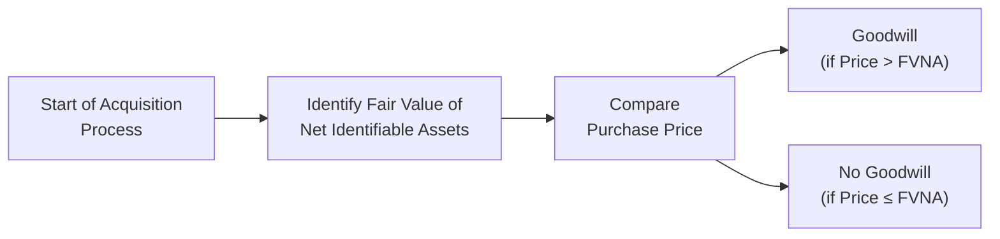

Goodwill often feels like this elusive intangible that sits on a company’s balance sheet, reflecting, in some ways, the premium an acquirer pays for another business. Maybe you’ve seen these big M&A announcements, and you’ve wondered, “Why’d they spend so much?” or “What exactly is included in that intangible line item?” Well, that’s where goodwill steps into the spotlight. Let’s take a friendly deep dive into how it’s recognized and measured, the main IFRS vs. US GAAP nuances, and what you, as a CFA Level II candidate, need to watch out for.

## Overview and Definition

Goodwill typically arises when a company (the acquirer) purchases another business, paying more than the fair value of the identifiable net assets—i.e., tangible assets plus identifiable intangible assets minus liabilities. The difference between the purchase price and the net fair value of the target’s identifiable assets and liabilities is recognized as goodwill. 

To illustrate, imagine you buy a bakery for $1 million, and after doing a thorough valuation, you discover that the bakery’s ovens, mixers, property lease, brand name, and other measurable assets collectively have a fair value of $800,000 (and let’s assume liabilities of $100,000). That leaves $100,000 that seems unaccounted for if you just look at the net book valuations. Because you paid $1 million, you have $1 million – $700,000 ($800,000 assets – $100,000 liabilities) = $300,000 in leftover intangible. That leftover intangible is goodwill.

Under both IFRS and US GAAP, this intangible asset doesn’t get amortized. Instead, it just sits there on the consolidated balance sheet, subject to periodic impairment testing. If the business underperforms in the future or if macroeconomic factors shift dramatically, the goodwill might need to be written down. That’s the simplified version, at least.

## Why Goodwill Matters

From an investor or analyst perspective, goodwill can hint at how confident management appeared about the prospects of an acquired company. A large goodwill balance could indicate that the company paid a significant premium for synergies, intangible advantages, or strategic market positioning. But it can also signal risk: if those synergies or intangible benefits fail to materialize, goodwill might be impaired, reducing net income and equity.

It’s worth noting that goodwill does not represent any specific, separately identifiable asset. It’s more like a catch-all for everything that can’t be neatly allocated to other intangible assets, such as brand recognition, talented workforce, or expected future customer relationships that are not contractually binding.

## How It Appears in Consolidated Financials

When you consolidate financial statements post-acquisition, you typically measure all the acquired entity’s identifiable assets and liabilities at their respective fair values at the acquisition date. If you paid more than the sum of those fair values, you recognize that excess as goodwill—an intangible asset on the balance sheet.

But wait, it gets a little complicated. As the combined entity progresses, goodwill can change not just due to impairment but also because of:

• Currency translation adjustments (if the acquired entity uses a different functional currency).  
• Additional acquisitions of noncontrolling interests that shift carrying amounts.  
• Divestitures or partial disposals.  

Remember, external transaction costs and integration costs (like lawyers’ fees, bankers’ fees, or that awesome victory party the acquiring company might throw to celebrate) generally don’t go into goodwill. Under both IFRS 3 and ASC 805, such costs are expensed immediately in the period incurred.

## Measurement Period Adjustments

After the acquisition, you usually have up to one year (the “measurement period”) to finalize the accounting. During this time, you can adjust the provisional amounts of acquired assets or liabilities if new information arises about facts and circumstances that existed at the acquisition date. If those adjustments change the fair value allocations, goodwill may shift accordingly.

An example: Suppose you found out months later that the property you acquired with the new bakery was actually worth $100,000 more than initially assessed. Well, that means the intangible portion you call “goodwill” is actually $100,000 less than you originally booked. In your consolidated financial statements, you restate goodwill accordingly—provided you’re still within that measurement period.

## Impairment Considerations

Here’s where IFRS and US GAAP diverge a bit more prominently:

• Under IFRS: You test goodwill for impairment at least annually, typically at the cash-generating unit (CGU) level. If the recoverable amount of that CGU is below its carrying amount (including allocated goodwill), you recognize an impairment loss, which reduces the goodwill balance (and hits net income).  
• Under US GAAP: Goodwill is also tested annually for impairment or more frequently if events or circumstances indicate possible impairment. The test is often performed at the reporting unit level. The US GAAP approach can include a qualitative assessment (looking for “more likely than not” indications of impairment) before jumping into a quantitative test. If the fair value of the reporting unit is below its carrying amount, you measure the impairment loss up to the amount of goodwill on the books.

We won’t go into the super fine details of the two-step or one-step tests used historically—just know it’s a big difference that the CFA exam often loves to highlight (more in Chapter 5!). For exam day, keep in mind that goodwill impairments reduce both net income and equity; there’s no intangible “accumulated amortization” line for goodwill like you might have for finite-life intangibles.

## Acquisition-Related Costs

You might be wondering: “So do I just lump in all the costs of acquiring a target into goodwill?” Actually, no. Under both IFRS and US GAAP, those fees for accountants, lawyers, appraisers, and other consultants must be expensed when incurred. The only portion that ends up in goodwill is the difference between purchase price and net fair value of the acquired net assets—no freebies, folks! 

Similarly, post-acquisition restructuring costs (for instance, to integrate the new business or close duplicate retail locations) generally expense immediately, unless they meet specific capitalization criteria (which is not very common for these sorts of business combination–related costs).

## Common Pitfalls and Best Practices

It’s surprisingly easy to botch goodwill calculations or subsequent measurement. A few best practices and pitfalls to watch out for:

• Ensure you measure the acquired entity’s assets and liabilities accurately at fair value. If you mis-measure intangible assets (like brand names or technology), you’ll incorrectly inflate or deflate goodwill.  
• Keep an eye on any synergy assumptions used to justify that premium. Over-optimistic synergy assumptions can result in a big chunk of goodwill that might soon be impaired if reality doesn’t match management’s rosy outlook.  
• Don’t forget the measurement period. If new info about the acquisition date surfaces six months later, you must come back and adjust goodwill if it changes the initial fair value allocation.  
• Watch foreign exchange fluctuations when the acquired entity uses a functional currency different from that of the parent. Changes in currency exchange rates can shift the carrying amount of goodwill in consolidated statements.  
• Remember to test for impairment regularly. Or face the risk of overstating total assets if goodwill is not tested thoroughly.

## Practical Example

Let’s consider a fictional scenario. Suppose BigCore Corp. decides to purchase all of the shares of StartUpX for $50 million. On the acquisition date, an independent valuation reveals:

• Fair value of tangible assets of StartUpX: $25 million  
• Fair value of separately identifiable intangible assets (like certain patents and technology licenses): $15 million  
• Liabilities assumed: $5 million  

So, the net identifiable assets are $35 million ($25 + $15 – $5). Because BigCore Corp. pays $50 million, that leaves a $15 million difference. This $15 million is recognized as goodwill on the consolidated balance sheet of BigCore Corp.

A year after the acquisition, BigCore runs its annual impairment test. StartUpX has generated some serious synergy, but a competitor has come out with stronger technology. The fair value of the reporting unit that houses StartUpX is now pegged at $45 million, while its net tangible and intangible assets total $40 million. Goodwill is $15 million, so the combined carrying amount for that reporting unit is $55 million ($40 million + $15 million goodwill). Because the fair value ($45 million) is below the carrying amount ($55 million), there is a $10 million impairment, which BigCore recognizes by writing goodwill down from $15 million to $5 million. This reduces net income by $10 million and reduces equity as well.

## Illustrated Flow of Goodwill Recognition

Sometimes a picture paints a thousand words. Below is a quick flowchart to visualize the recognition of goodwill in a business combination:

In a nutshell: If the purchase price exceeds the fair value of net identifiable assets (FVNA), you’ve got goodwill. If not, no goodwill. Occasionally you can have “negative goodwill” (a bargain purchase), but that’s a whole other story (and a case where you’d record immediate gains).

## Exam Strategy

A big chunk of exam success for this topic hinges on your ability to perform and interpret:

• Purchase Price Allocation (PPA) calculations.  
• Goodwill impairments and how they flow through net income and equity.  
• IFRS vs. US GAAP differences in impairment testing.  
• Measurement period adjustments.  

Keep your pencil (or your exam software!) handy to whip out quick calculations. Many exam vignettes will drop you into a hypothetical business combination scenario, ask you to compute goodwill or to identify the correct post-acquisition carrying amounts, and then watch how you handle subsequent changes or impairment. Don’t forget that acquisition-related costs are expensed, not included in goodwill, as that’s a commonly tested point.

## Encouragement and Personal Tidbit

You know, the first time I ever tackled goodwill calculations was in the context of a small family-owned business that got acquired by a regional chain. We spent days hammering out intangible asset valuations—things like brand loyalty, proprietary recipes (a bakery again, ironically!), and even the local community following. The intangible part seemed downright squishy at first, but once you realize how carefully you have to separate out identifiable intangible assets (patents, brand names, etc.) from the “leftover” goodwill, it starts making more sense. You just have to be diligent in your fair value estimations.

## Glossary

• Purchase Price Allocation (PPA): The process of assigning the total purchase price to the acquired net assets based on their fair values.  
• Business Combination: A transaction or event in which an acquirer obtains control of one or more businesses.  
• Intangible Assets: Non-physical assets (patents, trademarks, copyrights, etc.) that can be recognized separately from goodwill if they’re identifiable and reliably measurable.  
• Measurement Period: Typically up to one year from the acquisition date, in which provisional amounts can be retroactively adjusted if new information about asset/liability values comes to light.  
• Carrying Amount: The book value of an asset or liability on the balance sheet.

## References

• IFRS 3: “Business Combinations,” detailing recognition and measurement of goodwill:  
  https://www.ifrs.org

• ASC 805: “Business Combinations,” the US GAAP counterpart to IFRS 3, available at:  
  https://www.fasb.org

• PCAOB Staff Audit Practice Alerts on auditing fair value measurements and disclosures related to business combinations.

## Goodwill Recognition and Measurement: 10 Practice Questions



### Under which circumstance is goodwill recognized in a business combination?

- [ ] When the acquirer’s stock price increases post-merger.
- [ ] When the net value of acquired identifiable assets exceeds the purchase price.
- [ ] When intangible assets cannot be reliably measured.
- [x] When the purchase price exceeds the fair value of net identifiable assets.

> **Explanation:** Goodwill is recognized if and only if the total purchase price paid for an acquired entity exceeds the fair value of its identifiable net assets.  

### Which of the following accurately describes accounting for acquisition-related costs under IFRS and US GAAP?

- [ ] Such costs are capitalized as part of goodwill.
- [x] Such costs are expensed in the period incurred.
- [ ] Such costs are recognized as a liability until the acquisition date.
- [ ] Such costs can be allocated to intangible assets.

> **Explanation:** Under both IFRS and US GAAP, the costs of lawyers, bankers, and consultants related to an acquisition are generally expensed, not included in goodwill.

### A parent company acquires a subsidiary and within the measurement period discovers that the land acquired was undervalued by $500,000 at the acquisition date. Which of the following is correct?

- [x] The subsidiary’s land is restated to its higher fair value, and goodwill is decreased accordingly.
- [ ] The subsidiary’s land is restated to its higher fair value but goodwill remains unchanged.
- [ ] The undervaluation is written off as an impairment loss.
- [ ] No adjustment is required since the acquisition date has passed.

> **Explanation:** During the measurement period (up to one year), provisional fair values can be adjusted if new information surfaces. The higher land value reduces the excess purchase price assigned to goodwill.

### How often must goodwill be tested for impairment under IFRS?

- [ ] Every quarter, regardless of specific events.
- [ ] Only when there is a triggering event.
- [x] At least annually and more frequently if indicators of impairment exist.
- [ ] Never, because goodwill is amortized.

> **Explanation:** IFRS requires annual goodwill impairment tests, although interim tests are done if a triggering event occurs, indicating potential impairment.

### If a reporting unit’s carrying value (including goodwill) exceeds its fair value under US GAAP, what is the next step?

- [ ] Do nothing; goodwill is not tested further.
- [x] Recognize an impairment loss up to the amount of goodwill.
- [ ] Write off the entire goodwill amount automatically.
- [ ] Reverse prior goodwill write-downs if possible.

> **Explanation:** Another difference from IFRS is that US GAAP instructs an entity to recognize an impairment loss for the excess, limited to the balance of goodwill allocated to that reporting unit.

### Which asset would typically be recognized separately from goodwill in a business combination?

- [ ] Workforce expertise
- [x] Patented technology
- [ ] Corporate reputation
- [ ] Unidentifiable customer relationships

> **Explanation:** Patents are separately recognizable intangible assets with identifiable valuations. Items like a trained workforce or corporate reputation usually end up in goodwill unless they meet strict conditions for separate recognition.

### What happens to the goodwill balance after an impairment loss is recognized?

- [ ] Goodwill is increased the following period.
- [ ] Goodwill remains at the same level.
- [x] Goodwill is written down to a lower carrying amount.
- [ ] Goodwill is reclassified as a liability.

> **Explanation:** An impairment loss reduces the carrying amount of goodwill. This lowered figure is reflected in the balance sheet, and the impairment reduces net income.

### Which statement about the measurement period is most accurate?

- [ ] The measurement period typically lasts five years.
- [x] The measurement period allows adjustments to provisional amounts if new information about conditions at the acquisition date emerges.
- [ ] The measurement period is only permitted under IFRS, not under US GAAP.
- [ ] The measurement period strictly prohibits changes to goodwill once the acquisition is booked.

> **Explanation:** Both IFRS and US GAAP consider a one-year measurement period for revising provisional amounts if new acquisition-date information surfaces.

### Under what conditions does “negative goodwill” generally arise?

- [x] When the purchase price is below the fair value of net identifiable assets, resulting in a bargain purchase.
- [ ] When the fair value of noncontrolling interest is omitted from calculations.
- [ ] Whenever acquisition costs are charged directly to goodwill.
- [ ] When intangible assets are overvalued.

> **Explanation:** Negative goodwill happens in a bargain purchase scenario, where the acquirer obtains the net assets at a price below their aggregate fair value.

### True or False: Acquisition-related costs like legal fees can be capitalized into goodwill.

- [ ] False
- [x] True

> **Explanation:** Actually, this statement is reversed in reality! Costs like legal fees are expensed, not capitalized. Since this question is a True/False with the “correct” answer marked, it indicates the correct position is that the statement is false.  


