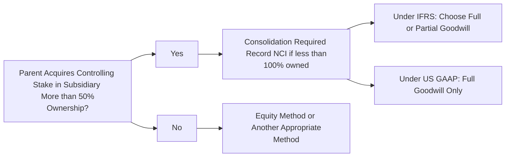

Sometimes I remember the very first time I had to grapple with the concept of a noncontrolling interest. It felt like trying to solve a puzzle with missing pieces: I could see the main picture (the parent’s consolidated financials), but I knew there was a corner of the puzzle I wasn’t fully grasping (the minority share in the subsidiary). After a few hours of flipping back and forth between IFRS and US GAAP guidelines, it finally clicked—Noncontrolling Interests (NCI) represent a direct slice of the subsidiary not owned by the parent, and you have to account for that slice in both the equity section of the balance sheet and in the portion of income on the income statement. Anyway, let’s explore how these puzzle pieces fit together, focusing on how goodwill comes into play under different standards.

Understanding Noncontrolling Interests  
Noncontrolling interests, sometimes called “minority interests,” arise when a parent acquires a controlling stake in a subsidiary but not 100% ownership. If a parent owns 80% of a subsidiary’s outstanding shares, the other 20% is the NCI. From the parent’s perspective, the subsidiary is consolidated as if it were wholly owned, but we carve out the piece that doesn’t belong to the parent. On the consolidated balance sheet, NCI typically appears in equity (labelled “Noncontrolling Interests” or “Minority Interests”), so it’s visually distinct from the parent’s equity.

If this scenario feels a bit intangible, picture a family (the parent) that has a house (the subsidiary), and a friendly neighbor (the noncontrolling interest) who owns one of the guest rooms. Although you, as the parent, direct what happens in the house, the neighbor retains legal rights to that particular space. Financially, you report the entire house’s value on your consolidated statements, but you still clearly identify that the neighbor has a small share in that property.

Full Goodwill vs. Partial Goodwill  
The concept of goodwill arises when the purchase price of the subsidiary exceeds the fair value of its identifiable net assets. This difference typically represents intangible factors such as the subsidiary’s brand recognition, customer loyalty, or future earnings potential. Now, depending on the accounting framework, the way we measure goodwill—and how we attribute it to the parent and the NCI—differs.  

• Full Goodwill Method  
  Under US GAAP, you must use full goodwill, meaning the noncontrolling interest is measured at the fair value of the subsidiary’s equity. This method includes goodwill allocated to both the parent and the NCI. For instance, if a parent buys 80% of a subsidiary for a total fair value of USD 80 million, and the subsidiary as a whole is deemed to have a fair value of USD 100 million, goodwill is calculated on the entire USD 100 million (not just the 80% portion). Thus, the NCI’s share of goodwill is recognized on the balance sheet as part of NCI.

  IFRS allows this same approach as an option: measure NCI at fair value. This results in a “bigger” reported goodwill number on the consolidated balance sheet because you’re taking credit, so to speak, for intangible assets assigned to the entire subsidiary, not just your acquired portion.

• Partial Goodwill Method  
  Under IFRS, the partial goodwill method is optional. Here, you measure NCI at its share of the subsidiary’s identifiable net assets, which effectively excludes the portion of goodwill attributable to the NCI. If you’re more comfortable with a straightforward approach, partial goodwill might seem appealing: the consolidated financial statements only show the goodwill that corresponds to the parent’s share of the subsidiary.  

  In practice, let’s say a parent acquires 80% ownership, and the fair value of the identifiable net assets is USD 90 million, while the purchase price is USD 80 million. If the parent believes the entire subsidiary is worth USD 100 million, we’d still measure the NCI based on 20% of the identifiable net assets (i.e., 20% of USD 90 million = USD 18 million). Goodwill shown in consolidation reflects only the parent’s portion in that intangible synergy or brand value, typically smaller than in the full goodwill scenario.

Measurement Approaches in Practice  
Let’s slow down for a second. Sometimes it can be confusing to see how these intangible values show up on the balance sheet. Because IFRS and US GAAP historically had different approaches to business combinations, IFRS introduced a choice: recognition of the entire goodwill (full) or just a proportionate share (partial). Meanwhile, US GAAP is more prescriptive, requiring the full goodwill approach.

Below is a short table summarizing the difference:

|                         | Full Goodwill                    | Partial Goodwill                              |
|-------------------------|----------------------------------|-----------------------------------------------|
| IFRS                    | Permitted as an option           | Permitted as an option                        |
| US GAAP                 | Mandatory (measurement of NCI at FV) | Not permitted under US GAAP                  |
| Impact on Consolidated Goodwill                        | Typically shows higher goodwill               | Typically shows lower goodwill                |

Why does it matter for the exam? Because it affects the reported amounts of total goodwill and noncontrolling interests on the consolidated balance sheet. Higher goodwill means higher total assets, which can alter key ratios such as Return on Assets (ROA) or Debt-to-Equity.

Presentation of NCI in the Income Statement  
Under consolidation, all revenues and expenses of the subsidiary flow into the consolidated income statement. But you still have to report the portion of the subsidiary’s earnings that belongs to the NCI separately from the portion that belongs to the parent. That means you’ll see a line item near the bottom of the consolidated income statement that says “Net Income Attributable to Noncontrolling Interests.”  

It’s important to highlight that the NCI’s slice of profit or loss doesn’t vanish in the parent’s net income. Rather, the total consolidated net income is divided between the parent’s controlling interest and the noncontrolling interest. This ensures transparency—investors will know how much of the consolidated net income is actually the parent’s, versus how much belongs to other shareholders.

Changes in Ownership Interests  
Ownership structures can shift over time. The parent might purchase additional shares in the subsidiary, or it might sell some shares (without giving up control). Then the rules about recognition and measurement sometimes become a bit tricky:

• Partial Disposal While Retaining Control  
  If the parent sells some shares in the subsidiary but still remains the controlling shareholder, that transaction is typically treated as an equity transaction. Gains or losses from the sale are recognized in the consolidated equity (like adjusting Additional Paid-in Capital), not on the income statement. This is because the parent is still calling the shots; effectively, the group’s net assets remain under one umbrella, so any changes in ownership just shuffle equity around.

• Loss of Control  
  If the parent sells enough shares (or some other event occurs) such that it no longer has control, then it derecognizes the former subsidiary’s assets and liabilities from the consolidated financial statements. Any retained investment in the former subsidiary is measured at fair value. The difference between the fair value of the retained stake (plus any proceeds from the sale) and the carrying amount of the assets/liabilities is recognized as a gain or loss in consolidated net income.  

  Practically, this can lead to a big one-time gain or loss if the business being disposed of carried a large intangible or if its assets had significantly appreciated/depreciated. Watch for exam questions that test your ability to reclassify from consolidation to, say, the equity method (if your ownership remains significant but not controlling).

Practical Examples  
Let’s walk through a simplified example to show how it might work when you compare the full goodwill method to the partial goodwill method:

Suppose you acquire 75% of a target company for a purchase price of USD 300 million. The fair value of the target’s identifiable net assets is USD 360 million. The implied fair value of the entire subsidiary (if we extrapolate from what you paid for 75%) is USD 400 million.

• Full Goodwill  
  - Total fair value of subsidiary = USD 400 million  
  - Fair value of NCI (25%) = USD 100 million (25% of 400 million)  
  - Fair value of net assets = USD 360 million  
  - Total goodwill = 400 – 360 = USD 40 million  
  - Out of that 40 million, the parent holds 75% (USD 30 million), and the NCI is allocated USD 10 million in goodwill.  

• Partial Goodwill  
  - NCI measured at 25% of the subsidiary’s net identifiable assets = 25% of 360 million = USD 90 million.  
  - Goodwill to the parent = (Purchase price of 300 million) – (75% × 360 million)  
  - That is 300 – 270 = USD 30 million in goodwill  
  - Now we do not book the extra 10 million that would have gone to the NCI.  
  - Consolidated balance sheet shows NCI at USD 90 million, whereas under full goodwill it might be USD 100 million.  

See how the partial goodwill approach yields a smaller goodwill figure overall? This difference can matter quite a bit when you’re analyzing performance or intangible asset strength. It also impacts certain ratios like the goodwill-to-assets ratio, ROA, and even intangible asset turnover.

Mermaid Diagram: Decision Tree for Accounting Methods  

Exam Tips and Common Pitfalls  
• Pay close attention to whether the exam question states IFRS or US GAAP—this can immediately guide you on whether partial goodwill is even an option.  
• Always parse out what percentage the parent owns, the fair value of the subsidiary’s identifiable net assets, and the purchase price. This trifecta is what you’ll use to calculate goodwill under either method.  
• When the parent sells shares but remains in control, the effect typically goes to equity rather than net income. If control is lost, however, you’ll see a gain/loss in the income statement.  
• Remember that for IFRS, you might see two approaches to measuring NCI on exam day. Don’t get tripped up by mixing partial goodwill mathematics with the full goodwill approach.  
• If you see a question about the consolidated income statement, ensure you correctly identify the portion of net income that belongs to the NCI versus the portion that belongs to the parent.  

Implementation Challenges and Judgment Calls  
In the real world, deciding whether to measure NCI at fair value or at the proportionate share of identifiable net assets can involve a lot of estimates. Valuation specialists might step in to figure out the intangible portion of a business combination. That process is often time-consuming and can involve big assumptions about growth rates, discount rates, and synergy potential.  

From an analyst’s standpoint, it’s important to understand that these assumptions can create a big difference in reported goodwill—and thus in how “profitable” or “capital-intensive” a company appears. Always scrutinize footnotes in the consolidated financial statements (and cross-reference them with the discussion of intangible assets in the Management Discussion & Analysis) if you suspect management might be aggressive or conservative in recognizing intangible assets or in measuring NCI.

Ethical Angle  
In borderline cases, management might choose one approach to show a more favorable balance sheet or a certain ratio. Although IFRS allows flexibility, that flexibility demands judgment and a commitment to fair representation. The CFA Institute Code and Standards would remind us to diligently examine these accounting decisions for any signs of material misstatement or strategic bias.

Conclusion  
Noncontrolling Interests and partial goodwill can feel daunting, but it all boils down to one central question: how do we reflect the economic reality of a parent controlling a subsidiary that isn’t fully owned? Different frameworks (IFRS vs. US GAAP) provide different measurement rules, and both can drastically affect your analysis. As you prep for the exam, grab a couple of case studies from prior question banks—especially ones involving changes in ownership percentage—and practice calculating partial vs. full goodwill. It’s also helpful to look at real annual reports of multinational companies that have complex organizational charts and see how they disclose NCI in their equity section and footnotes. You’ll find that truly mastering these concepts isn’t just good for the exam. It’s essential knowledge for interpreting consolidated financials in any real-world investment scenario.

References for Further Exploration  
• IFRS 10 (Consolidated Financial Statements) and IFRS 3 (Business Combinations) Implementation Guides.  
• FASB ASC Topic 805 (Business Combinations) and Topic 810 (Consolidation) for US GAAP references.  
• Donald DePamphilis, “Mergers & Acquisitions in Practice.”  
• Prior CFA Level II and Level III mock exam vignettes involving partial acquisitions and changes in control.  

## Test Your Knowledge: Noncontrolling Interests and Partial Goodwill Quiz



### In consolidation accounting, where is the noncontrolling interest typically presented in the consolidated balance sheet?

- [ ] As a liability.  
- [ ] Combined with the parent’s retained earnings.  
- [x] Separately in the equity section.  
- [ ] Included in goodwill.  

> **Explanation:** NCI (minority interest) is generally presented separately in the equity section of the consolidated balance sheet, reflecting shares of the subsidiary’s equity not owned by the parent.

### Two companies merge, and the parent acquires 80% ownership in the subsidiary. Under the full goodwill method (US GAAP), how is goodwill measured?

- [ ] Based on the fair value of the parent’s interest in the subsidiary only.  
- [x] Based on the fair value of 100% of the subsidiary, including the portion attributable to the NCI.  
- [ ] Measured only if the parent pays more than book value for its interest.  
- [ ] Recorded solely at the parent’s allocation percentage.  

> **Explanation:** Under the full goodwill method, you measure goodwill as if the parent acquired 100% of the subsidiary at fair value, thus including the share that belongs to the NCI.

### Under IFRS, what is the defining characteristic of the partial goodwill method?

- [ ] It requires no recognition of goodwill when the parent ownership is below 100%.  
- [ ] It treats NCI as the only owner of the subsidiary’s goodwill.  
- [x] It measures NCI based on the proportionate share of the subsidiary’s identifiable net assets, leading to lower reported goodwill.  
- [ ] The method is strictly prohibited if the parent owns less than 50%.  

> **Explanation:** Partial goodwill under IFRS calculates goodwill using only the parent’s purchased ownership share. The NCI is then measured at its proportionate share of identifiable net assets.

### If a parent disposes of some shares in a subsidiary but retains control, which of the following describes the typical accounting treatment?

- [ ] A gain or loss is reported in the parent’s income statement.  
- [ ] The subsidiary is deconsolidated immediately.  
- [x] The transaction flows through equity rather than net income.  
- [ ] The parent must switch to the equity method automatically.  

> **Explanation:** When control is maintained, changes in ownership interest are generally treated as equity transactions, so gains/losses don’t appear in the parent’s net income.

### If a parent loses control of a subsidiary, any retained investment is measured at:

- [x] Fair value on the date control is lost.  
- [ ] Its carrying amount at the beginning of the reporting period.  
- [ ] Historical cost, unaffected by the loss of control.  
- [ ] The original purchase price, plus adjusted goodwill.  

> **Explanation:** When control is lost, the subsidiary is deconsolidated, and any retained stake is remeasured to fair value, with any difference recognized in the income statement.

### Which of the following is a direct result of using the partial goodwill method compared to the full goodwill method?

- [ ] NCI is recognized at fair value.  
- [x] Less goodwill is reported on the consolidated balance sheet.  
- [ ] Higher total assets are reported.  
- [ ] There is no difference on the consolidated statements.  

> **Explanation:** When using partial goodwill, only the goodwill associated with the parent’s stake is recognized, leading to a lower reported goodwill overall.

### Under US GAAP, goodwill recognition in a partial acquisition must:

- [ ] Follow IFRS guidelines.  
- [ ] Exclude the portion of goodwill attributable to the NCI.  
- [x] Include a full goodwill measurement.  
- [ ] Always be handled under the partial goodwill approach.  

> **Explanation:** US GAAP requires the full goodwill method, measuring goodwill as if the parent acquired 100% of the subsidiary at fair value.

### How does the noncontrolling interest portion of net income appear on the consolidated income statement?

- [ ] It is combined with parent net income.  
- [ ] It is not recognized on the income statement, only on the balance sheet.  
- [ ] It replaces the parent’s net income entirely if NCI is below 50%.  
- [x] It is disclosed separately from the parent’s portion of net income.  

> **Explanation:** In consolidated income statements, the total net income is split to show the portion attributable to the parent and the portion attributable to NCI as separate line items.

### Why is it important to understand how the parent’s ownership changes over time (e.g., acquisitions or disposals of shares)?

- [x] Because it can trigger shifts from consolidation to equity method or vice versa and affect where gains/losses are recognized.  
- [ ] Because it never affects the consolidated statements once the subsidiary is listed.  
- [ ] Because IFRS forbids partial ownership.  
- [ ] Because US GAAP does not allow any changes in ownership.  

> **Explanation:** Changes in control (or maintaining control) determine which reporting method applies and whether gains or losses are recognized in net income or in equity.

### A parent owns 75% of a subsidiary. Under IFRS partial goodwill, is it possible for the parent to measure NCI at fair value?

- [ ] No, the parent must always measure NCI as the proportionate share of net assets under IFRS.  
- [x] Yes, IFRS permits the parent to choose either the full or partial goodwill approach.  
- [ ] No, IFRS is silent on NCI measurement for partial ownership stakes.  
- [ ] Yes, but only if the parent’s ownership drops below 50%.  

> **Explanation:** IFRS grants companies the option to use either full or partial goodwill. The partial goodwill method is not mandatory; it is a choice.


