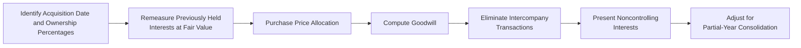

Welcome to this deep dive into consolidation complexities arising when a firm transitions from a noncontrolling financial-asset stake to a controlling equity investment. It’s a journey that touches multiple hot-button areas—remeasurement gains, goodwill calculations, noncontrolling interests (NCI), and partial-year financials. Perhaps you’ve seen exam settings where these concepts get crammed together in a tricky vignette, prompting frantic calculations and second-guessing. Let’s walk through how to handle them without breaking a sweat.

Scenario Setup  
Imagine Company A acquires an additional 45% equity stake in Company B on July 1 of this year, after previously holding a 15% interest in B that was reported initially as a financial asset at fair value through profit or loss (FVPL). As soon as that new 45% stake is signed, sealed, and delivered, A gains a 60% controlling interest in B. Under both IFRS and US GAAP, that triggers the need for consolidation—meaning Company A now incorporates Company B’s financials onto its own, starting from the date control is obtained. This scenario also calls for remeasuring the previous 15% equity interest at fair value, with any resulting gain or loss flowing through net income.

Key Consolidation Steps  
When an exam vignette describes a mid-year acquisition, it’s easy to get overwhelmed by where to begin. The essential steps can be tackled methodically:

• Identify the Acquisition Date and Ownership Percentages  
  - Confirm the exact date of control’s establishment—here, July 1.  
  - Verify that the new ownership stake plus previously held interest add up to 60%.  

• Remeasure Previously Held Interests at Fair Value  
  - The old 15% stake goes from its carrying amount to fair value on July 1.  
  - Record the resulting gain or loss in net income for the period.  

• Purchase Price Allocation (PPA)  
  - Allocate the acquisition cost (i.e., the additional 45% purchase and the fair value of the old 15%) to the fair values of B’s identifiable assets and liabilities.  
  - Any leftover after these allocations becomes goodwill.  

• Compute Goodwill  
  - Under IFRS, you may see full goodwill or partial goodwill.  
  - Under US GAAP, only the full goodwill method is permitted.  

• Eliminate Intercompany Transactions  
  - Remove any intra-group sales, loans, or service fees that took place after July 1 because those do not create extra “real” income or expenses at the group level.  

• Present Noncontrolling Interests (NCI)  
  - Show the outside shareholder portion of B’s net assets on the consolidated balance sheet as NCI.  
  - Share the portion of net income that belongs to NCI holders on the consolidated income statement.  

• Adjust for Partial-Year Consolidation  
  - Only consolidate B’s income and cash flows from July 1 forward, not for the entire year.  

Common Pitfalls  
• Forgetting to remeasure that previously held 15% stake. This remeasurement is often tested—it’s a classic exam trick.  
• Treating post-control changes in ownership as gains or losses (instead of equity transactions) if control is retained.  
• Mixing up partial goodwill with full goodwill, or incorrectly applying IFRS vs. US GAAP.  
• Overlooking partial-year consolidation. Consolidation starts the date control is achieved—mid-year means half-year income consolidation (or six months, or however many months remain in the fiscal year).

IFRS vs. US GAAP: Key Differences  
Under IFRS 3 (Business Combinations), an acquirer can elect either partial goodwill or full goodwill on a transaction-by-transaction basis. Partial goodwill means you measure goodwill only for the parent’s share of net assets at fair value. Full goodwill, on the other hand, measures goodwill as if the parent acquired 100% of the subsidiary, with a corresponding full measurement of NCI.  

US GAAP (ASC 805) prescribes only the full goodwill method. This difference often leads to distinct goodwill and NCI amounts in IFRS vs. US GAAP scenarios, even if the underlying transaction is identical.

A Quick Practical Example  
Let’s illustrate a simplified version. Suppose:  
• Before July 1, Company A held a 15% stake in Company B, carried at $300,000.  
• On July 1, the fair value of that 15% stake is $400,000. A pays $1.2 million for an additional 45% stake, thus bringing total ownership to 60%.  
• The fair value of B’s net identifiable assets at July 1 is $2.0 million.  

Step 1: Remeasure the old stake  
• The old stake carrying value = $300,000  
• Fair value at acquisition date = $400,000  
• Remeasurement gain = $400,000 – $300,000 = $100,000 recognized in net income  

Step 2: Determine total implied value for 100%  
• The new purchase cost for 45% is $1.2 million, so that implies a total fair value of $1.2 million / 0.45 ≈ $2.667 million for 100% of B’s equity.  
• Alternatively, we might also factor in the remeasured old stake (but the primary method is typically to rely on the new purchase price).  

Step 3: Allocate purchase price to assets, liabilities, and goodwill  
• B’s net identifiable assets are valued at $2.0 million, but the total implied value is $2.667 million.  
• The difference = $0.667 million, which may be recognized as goodwill (if nothing else is specifically identified to adjust).  

Step 4: Measure NCI  
• Under full goodwill (assuming IFRS choice or US GAAP requirement), NCI is measured at fair value of the entire enterprise, times the 40% outside ownership.  
• Under partial goodwill (allowed by IFRS), you measure NCI at 40% of B’s net identifiable assets (and allocated goodwill based on the parent’s portion only).  

Step 5: Consolidate partial-year operations  
• From July 1 onward, incorporate B’s revenues, expenses, assets, and liabilities, plus a proportionate share of net income to NCI.  

Visually Summarizing the Process  

All these boxes are standard steps in a mid-year consolidation scenario. The exam might emphasize just one or two steps or might require you to piece them together—like a puzzle.

Partial-Year Consolidation Nuances  
One key aspect is how you report B’s net income. Because the acquisition date is July 1, the first six months (January to June) are not consolidated—Company A didn’t have control then. Instead, for that first half-year, if A had been using fair value accounting, changes in B’s stock price would have been recognized in net income or other comprehensive income, depending on the classification. From July 1 through December 31, any revenue and expenses from B appear fully in the consolidated statements, with 40% allocated to NCI (assuming no changes in B’s ownership structure in the second half).

Best Practices and Exam Tips  
• Keep track of how many months you’re recognizing in the consolidated statements. Check the day and month of acquisition in vignettes.  
• Look for any footnote references to partial goodwill vs. full goodwill. This choice drastically changes the NCI and goodwill calculations under IFRS.  
• Pay attention to the classification of the previous stake. If it was held-to-maturity or FVPL, the remeasurement rules might differ slightly (especially if you initially measured it at amortized cost, etc.).  
• If the exam question lumps everything into one big “fair value” scenario, then you can assume the standard approach: remeasure, record gain/loss, and proceed.  

Glossary  
• Remeasurement Gain/Loss: The net income effect from bringing a previously held equity investment to fair value upon a step acquisition.  
• Purchase Price Allocation (PPA): Process of assigning the acquirer’s cost to acquired assets and liabilities based on fair values.  
• Noncontrolling Interest (NCI): The portion of net assets of a subsidiary not owned by the parent.  
• Partial Goodwill: Under IFRS, an option to only measure goodwill attributable to the acquirer’s portion of the net assets.  

References  
• KPMG: “Guide to Valuations for Mergers & Acquisitions.” A handy real-world reference on purchase price allocations and intangible valuations.  
• IFRS 3 Illustrative Examples: Discuss step acquisitions, remeasurement, and partial goodwill in official IFRS materials.  
• Deloitte: “Business Combinations and Noncontrolling Interests.” Comprehensive coverage of partial acquisitions, fair value aspects, and advanced consolidation scenarios.

Now that you’ve got a deeper look at how step acquisitions and partial-year consolidations work, it’s time to test your knowledge with a practice quiz.

## Consolidation Challenges Practice Quiz



### Which of the following statements about a step acquisition is correct?

- [ ] The previously held interest is not remeasured.
- [x] The previously held interest is remeasured to fair value at the acquisition date.
- [ ] The previously held interest is remeasured only if the parent acquires more than 70%.
- [ ] The previously held interest under IFRS is remeasured, but not under US GAAP.

> **Explanation:** Under both IFRS and US GAAP, when the investor steps up to control, any previously held ownership interest is remeasured to fair value, and the resulting gain or loss flows through net income.

### Under IFRS, which goodwill measurement choice is permitted in a business combination?

- [ ] Full goodwill only.
- [ ] No goodwill recognition unless the fair values exceed net assets by a significant margin.
- [x] Either full goodwill or partial goodwill, as elected by management on a transaction-by-transaction basis.
- [ ] Partial goodwill only, but it applies only when NCI is below 25%.

> **Explanation:** IFRS 3 allows the acquirer to measure NCI at fair value (full goodwill) or at the proportionate share of net assets (partial goodwill). US GAAP requires the full goodwill method exclusively.

### What happens to intercompany transactions in consolidated financial statements after a mid-year acquisition?

- [ ] They are recognized as external transactions.
- [x] They are eliminated to avoid double-counting in the consolidated statements.
- [ ] They are recognized only if the subsidiary’s share is under 25%.
- [ ] They are disclosed only in the footnotes without adjusting consolidation.

> **Explanation:** Intercompany transactions must be eliminated so that only transactions with outside parties are reflected in the consolidated financial statements.

### How is partial-year income from the newly acquired subsidiary generally presented?

- [ ] It is included for the entire year if the acquisition happens before the end of the fiscal year.
- [ ] It is included only if the subsidiary is profitable.
- [ ] It is always ignored until the next reporting period.
- [x] It is included from the acquisition date forward.

> **Explanation:** Under both IFRS and US GAAP, the parent consolidates the subsidiary’s income for the portion of the year post-acquisition date.

### If the acquirer held the investee as an available-for-sale (AFS) financial asset before obtaining control, how is the step acquisition gain or loss treated at the acquisition date?

- [ ] There is no gain or loss recognized.
- [ ] It is recorded in other comprehensive income (OCI) indefinitely.
- [ ] It is recognized only if the new stake is more than 75%.
- [x] It is reclassified from OCI to net income and remeasured at fair value on acquisition date.

> **Explanation:** Under IFRS and US GAAP, any accumulated gains (or losses) in OCI for an AFS security are reclassified to net income at the date control is obtained, and the investment is remeasured to fair value.

### Which of the following best describes the difference between partial goodwill and full goodwill?

- [ ] Partial goodwill excludes intangible assets.
- [x] Partial goodwill measures goodwill only for the acquirer’s share of the net assets, while full goodwill measures total goodwill as if the acquirer purchased 100% of the subsidiary.
- [ ] Full goodwill allocates less tangible assets to the parent.
- [ ] Partial goodwill is used only under US GAAP.

> **Explanation:** By design, partial goodwill in IFRS recognizes goodwill proportionate to the controlling interest, whereas full goodwill values the entire goodwill as though the parent acquired 100% of the subsidiary.

### In consolidation, how is noncontrolling interest (NCI) presented on the balance sheet?

- [ ] It is included with the parent’s equity without disclosure.
- [x] It is displayed as a separate component of equity, reflecting the NCI’s ownership in the subsidiary.
- [ ] It is removed from equity and listed under liabilities.
- [ ] It is recognized only if the NCI is at least 20%.

> **Explanation:** NCI is shown within equity, separately from the parent’s equity portion, representing the outside shareholders’ interest in the subsidiary’s net assets.

### In a mid-year acquisition, what is one common trap exam candidates often fall into?

- [ ] Including the subsidiary’s revenues and expenses from the entire year.
- [ ] Forgetting to disclose intangible assets.
- [x] Failing to “time” the subsidiary’s earnings correctly and consolidating the entire year instead of only from the acquisition date.
- [ ] Over-allocating intangible amortization to the parent.

> **Explanation:** One classic mistake is to consolidate the subsidiary’s results as if the parent owned it for the entire year rather than from the date control was established.

### A remeasurement gain occurs when:

- [ ] The subsidiary’s fair value of net assets is lower than anticipated.
- [x] The carrying amount of the previously held interest is lower than its fair value at acquisition.
- [ ] The carrying amount of the previously held interest is higher than its fair value at acquisition.
- [ ] The acquisition date is before the prior fiscal year-end.

> **Explanation:** A remeasurement gain is recognized if the old stake’s carrying value is below fair value on the date control is acquired. The difference is recognized in net income.

### True or False: Under US GAAP, a parent can choose either partial or full goodwill when consolidating a new subsidiary.

- [x] True
- [ ] False

> **Explanation:** Actually, this statement is false in reality. US GAAP requires the full goodwill method. IFRS permits partial goodwill as an option. However, if an exam question tests your knowledge of IFRS vs. US GAAP on goodwill measurement, you should know that US GAAP does not allow partial goodwill.


