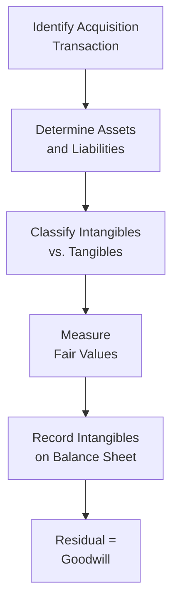

## Overview and Objectives

Purchase Price Allocation (PPA) in the context of business combinations is one of those topics that, initially, can feel almost overwhelming. When Company A acquires Company B, you might say, “Well, we just record the purchase price, right?” But the truth is a bit more nuanced. The total price an acquirer pays must be carefully assigned—line by line—across the acquired company’s identifiable assets and liabilities. Then, whatever is left over becomes goodwill. If you’ve already encountered IFRS 3 or ASC 805 in your earlier studies, you know that the devil really is in the details. Let’s dive into those details, but hopefully in a straightforward, slightly conversational way so it doesn’t feel so intimidating.

Below, we’ll explore the who, what, when, and why of PPA, see how IFRS and US GAAP compare, and highlight the intangible assets and liabilities you might stumble upon during the process. Along the way, we’ll integrate examples, a bit of personal perspective, and a few best practices to keep you on track.

## The Rationale Behind Purchase Price Allocation

When one company acquires another, the buyer typically pays a premium over the book value of the target’s net assets. This premium often reflects intangible assets, synergies expected from the combination, and the hidden goodies of the target’s brand, technology, or other intangible resources.

• Under IFRS 3 (Business Combinations) and US GAAP ASC 805 (Business Combinations), the acquirer must determine and record the “fair value” of all identifiable assets and liabilities of the acquired company.  
• After distributing the purchase price among those identified components, any excess is recorded as goodwill on the consolidated balance sheet.  

So, if you think about it from a valuation standpoint, the process ensures that each asset and liability is recognized at a measure that best reflects its market-based or appraised value—rather than the historical cost that the acquiree might have carried on its own books. Ultimately, the resulting fair values set the stage for ongoing depreciation, amortization, and potential impairment testing.

## Key Steps in Purchase Price Allocation

It’s easy to get lost in the technicalities, so let’s outline a standard approach. Picture yourself wearing the hat of the acquisition finance manager, walking through each step:

1. Identify the Acquirer and the Target  
   This might sound obvious: if a large conglomerate (the acquirer) buys a smaller tech startup (the target), then the big fish is the one making the PPA. The target simply gets “purchased.”

2. Determine the Purchase Consideration  
   Figure out the total purchase price. This includes not just the initial cash outlay but also any assumed debt, issued equity (e.g., shares or stock options for the target’s employees), and potentially contingent consideration (like an earn-out).

3. Identify and Measure All Acquired Assets and Liabilities  
   Now you roll up your sleeves and list every single asset and liability, from tangible items like property, manufacturing plants, or inventory, to intangible items like patents, intellectual property, and brand names. This step can be a significant undertaking, sometimes requiring third-party valuation experts—particularly for intangible assets lacking active market quotes.

4. Assign Fair Values  
   Here’s the heavier lifting: you use fair value hierarchies (Level 1, 2, or 3) to pin down what each item is worth on the open market.  
   • Level 1: Quoted market prices in active markets for identical assets or liabilities.  
   • Level 2: Observable inputs other than quoted prices (e.g., comparable valuations).  
   • Level 3: Unobservable inputs (e.g., internal models, discounted cash flows).  

5. Recognize Goodwill or Bargain Gain  
   After you finish valuing assets and liabilities, subtract that total from the purchase price. If it’s a positive difference, that portion is recorded as goodwill on the balance sheet. (If negative, that’s a “bargain purchase” and is recognized as an immediate gain in earnings under most standards, though these situations are fairly rare.)

6. Review and Adjust over the Measurement Period  
   IFRS and US GAAP allow a measurement period—up to 12 months after the acquisition date—to refine provisional amounts based on new information about facts and circumstances that existed at acquisition date. Adjustments to the provisional amounts (and their corresponding effect on goodwill) can be made, but only within that window.

7. Incorporate the Intangibles into Post-Combination Statements  
   Once you’re done, the intangible assets (subject to finite useful lives) will show up on the acquirer’s balance sheet and be systematically amortized. Goodwill, on the other hand, is not amortized but tested periodically (at least annually) for impairment.

## IFRS vs. US GAAP: Similarities and Differences

Both IFRS 3 and ASC 805 are quite aligned on the overall concept: you measure acquired assets and liabilities at fair value, and any excess purchase price becomes goodwill. But you might run into some small divergences:

• Recognition of Intangible Assets:  
  – Both IFRS and US GAAP require that intangible assets be recognized if they meet specific criteria (separable or arising from contractual or legal rights). IFRS sometimes takes a slightly narrower or more principles-based approach, whereas US GAAP gets into more prescriptive detail.  
  – Typically, intangible assets like customer relationships, patents, and brand names can be recognized under both sets of standards.  

• Development Costs:  
  – IFRS may allow capitalization of certain development costs if strict criteria are met, so intangible assets arising out of R&D can appear in the PPA. US GAAP is often more conservative, with most development costs expensed as incurred.  

• Measurement Period Adjustments:  
  – Both IFRS and US GAAP allow for retrospective adjustments within 12 months. However, IFRS can have more judgment leeway here, while US GAAP is typically more explicit about what qualifies as new information.  

• Bargain Purchases:  
  – Under both IFRS and US GAAP, you’d recognize a gain in income if the fair value of net assets acquired is higher than the total consideration paid. But watch out for possible forced re-check of your valuations to ensure you didn’t simply overinflate the fair values.  

Despite these differences, the core principle remains: figure out the fair value, record it, and place any leftovers into goodwill.

## Identifying Intangible Assets

Let’s be honest, intangible assets are the star of the show when it comes to PPA. They’re often where the largest differences between book value and fair value live—especially in modern acquisitions reliant on intellectual property, brand equity, or technology. Common intangible assets in PPA include:

• Customer Relationships: Ongoing customer contracts, loyalty programs, or subscriber bases.  
• Patented and Unpatented Technologies: Production methods, proprietary software, or specialized processes.  
• Trademarks and Brand Names: Distinct market presence that can drive premium pricing.  
• Licensing Agreements and Franchises: Rights to distribute or produce certain products and services.  
• Non-Compete Agreements: Legal arrangements preventing the seller from competing in a certain segment for a defined period.  

Each intangible requires some form of valuation approach—often discounted cash flows (Level 3) or market-based comparisons (Level 2 if you have data from comparable sales of similar intangible assets). In practice, a robust intangible valuation might involve the multi-period excess earnings method (MPEEM), the relief-from-royalty method, or the with-and-without method—depending on the nature of the intangible.

Below is a simple Mermaid diagram illustrating the general identification flow of intangible assets during a PPA.

## Goodwill: The Leftover Premium

So, let’s say after assigning the fair value to all the target’s tangible and intangible assets, you still have some unallocated purchase price. That leftover chunk is goodwill. Now, goodwill in IFRS and US GAAP accounting gets tested every year for impairment:

• IFRS: Goodwill is allocated to cash-generating units (CGUs), and each CGU is periodically tested for impairment by comparing its recoverable amount to its carrying amount.  
• US GAAP: Goodwill is allocated to reporting units and tested either on a qualitative basis (screening for signs of impairment) or a quantitative basis (comparing carrying amount with fair value, often determined by discounted cash flows or market multiples).

Unlike intangible assets with finite lives (which require systematic amortization), goodwill just sits on the balance sheet unless or until it is deemed “impaired.” Then you’d reduce its carrying amount and record an impairment charge that hits the income statement. It’s not something you can “reverse” in future periods if things improve; goodwill impairments are one-way trips.

## Pitfalls and Challenges

It’s easy to get tripped up in more than one way:

1. Over- or Underestimating Fair Values  
   If you rely on shaky assumptions or incomplete data—especially for intangible assets that require big leaps of faith in discount rate, revenue forecasts, or synergy estimates—you can incorrectly inflate or deflate intangible values.  

2. Missing Certain Liabilities  
   Perhaps there is a pending lawsuit or an environmental cleanup obligation. If it’s probable and can be measured reliably (or recognized at fair value as a contingent liability), you need to include it. Overlooking these can lead to an understated liability balance.  

3. Overly Ambitious Synergies  
   In theory, synergy is big reason for acquisitions. But synergy is not a recognized intangible asset in IFRS or GAAP. The portion that exceeds fair value of assets and liabilities is goodwill. If synergy assumptions lead you to place an unrealistic fair value on intangible assets, you might see that come back to bite you down the line.  

4. Deferred Tax Implications  
   Fair-value adjustments for intangible (or tangible) assets can create temporary differences that yield deferred tax liabilities or deferred tax assets. These tax effects often pop up when an asset’s fair value is higher than its tax basis.  

5. Inconsistent Valuation Methodologies  
   Always ensure your approach is consistent for each asset class. If you use a cost-based approach for intangible assets but a market approach for other tangible items, your results might not line up. Aim for an approach that’s consistent with IFRS or US GAAP guidelines and that leverages the best-available inputs.

## Personal Anecdote: The Hidden Value in a Brand Name

I remember helping a former colleague analyze a smaller manufacturing company’s acquisition. We thought the target was all about its factory floor capacity—until the client realized that the brand it was acquiring, albeit not a household name, had a loyal following among industrial customers. Suddenly, the intangible portion (brand name) took on a little more significance than we initially projected. Sure enough, that intangible found its way into the PPA as a separate asset, resulting in higher amortization down the line. Without that brand analysis, we might have lumped it all into goodwill, losing transparency and potentially hampering effective impairment testing. Goes to show that intangible assets often hide in plain sight!

## Best Practices for a Solid PPA

• Gather Comprehensive Data: Start your due diligence early so you understand the target’s intangible and contingent assets or liabilities.  
• Engage Experts if Needed: If intangible valuation is complex (e.g., patents, proprietary technology), specialized appraisers or valuation experts can help reduce guesswork.  
• Document the Rationale: Keep a clear record of how you arrived at certain fair values, especially if you used Level 3 inputs. Auditors—and examiners—love documentation.  
• Track Post-Combination Effects: Recognize that your PPA decisions can influence future depreciation, amortization, and even the goodwill impairment tests. Analysts must keep track of these impacts on financial statements in subsequent periods.  

## Example: Simple Purchase Price Allocation

Let’s cook up a simplified example:

Hypothetical scenario: Company X acquires Company Y for a total consideration of $50 million in cash.

• Company Y’s balance sheet (book values) at acquisition date:
  – Net tangible assets: $25 million  
  – No recognized intangible assets  

• Upon fair-value examination, we adjust:
  – Tangible assets: from $25 million book value to $27 million fair value.  
  – Identifiable intangible assets (newly recognized):  
    → Customer relationships: $5 million  
    → Patented technology: $3 million  

So total fair value of net assets = $27 million + $5 million + $3 million = $35 million. Because the purchase price is $50 million, the difference ($50 million – $35 million = $15 million) goes to goodwill.

That’s the entire PPA. Now, in future periods, the intangible assets of $5 million (customer relationships) and $3 million (technology) will be amortized over their respective useful lives. The goodwill of $15 million sits on the balance sheet unless a subsequent impairment test suggests it’s overstated.

## Tracking the Aftermath of PPA

Once you’ve allocated everything to fair value, the day-to-day intangible amortization flows through the income statement, reducing earnings. If you recognized certain liabilities or deferred tax items, they’ll also play a role in your future financial metrics. As a CFA Level II candidate, you’re expected to analyze how these adjustments affect ratios like return on assets (ROA), liquidity measures, interest coverage, or EBITDA.

Analysts often do the following post-PPA:

• Monitor intangible amortization lines in the acquirer’s income statement to see how quickly intangible assets are being consumed.  
• Keep an eye on goodwill: because it’s not systematically amortized, if your fundamental analysis suggests that synergy benefits haven’t actually materialized, a goodwill impairment might be lurking.  
• Adjust certain ratios to remove non-cash items or reflect intangible amortization if you want a more “operating” measure of performance.  

One key note: IFRS and US GAAP require consistent application of your chosen policies and estimates. Changing the discount rates or bringing in new assumptions can cause an unwelcome jump in amortization or a big goodwill write-down. So, from an exam and real-world perspective, you want to be precise and consistent in how you perform this analysis.

## Putting It All Together

Purchase Price Allocation may look complicated, but it’s basically a methodical approach: figure out what you bought, how much it’s really worth, and file any remaining portion under goodwill. The challenge is in the details—especially intangible valuations that require professional judgment. For CFOs, analysts, exam takers, or even everyday finance pros, a robust PPA reveals what the acquiring firm truly paid for. It ensures a higher level of transparency for shareholders and other stakeholders who want to see exactly what was purchased beyond the target’s historical book values.

If you keep an eye out for intangible assets and liabilities, pay close attention to how IFRS 3 and ASC 805 handle them, and remember that synergy can’t just be slapped on as an intangible asset, you’ll be well on your way to mastering PPA. And from an analyst perspective, you’ll have a better view of where post-acquisition charges might show up in the income statement.

## References and Further Exploration

• IFRS 3 – Business Combinations: Official standard from the International Accounting Standards Board (IASB).  
• ASC 805 – Business Combinations: FASB Accounting Standards Codification for US GAAP.  
• KPMG’s Business Combinations and Noncontrolling Interests Guide: Offers comprehensive discussions and examples.  
• PwC’s Purchase Price Allocation: Effect on Financial Statements: Articles and technical guides exploring real-world PPA implications.  
• CFA Institute Level II Curriculum, Financial Reporting and Analysis sections: Recommended reading on business combinations, consolidation, and intercorporate investments.

## Purchase Price Allocation and Fair Value Quiz



### Which of the following best describes the primary purpose of Purchase Price Allocation (PPA)?

- [ ] To establish historical cost for acquired assets and liabilities.
- [x] To allocate the acquisition price to the fair value of identifiable assets and liabilities.
- [ ] To determine the intrinsic value of the acquirer’s shares.
- [ ] To measure synergy benefits directly.

> **Explanation:** PPA is concerned with recording the acquired net assets at their fair values and any excess purchase price as goodwill, rather than focusing on historical cost or synergy measurement.

### Under both IFRS and US GAAP, which of the following statements is true regarding contingent liabilities in a business combination?

- [ ] They are never recognized at the acquisition date.
- [x] They are recognized at fair value if acquisition-related and reliably measurable.
- [ ] They are always expensed immediately.
- [ ] They cannot be tested for subsequent adjustments.

> **Explanation:** IFRS 3 and ASC 805 generally require that contingent liabilities be recorded at fair value if recognizable under the relevant criteria at the acquisition date.

### What is the typical handling of goodwill recognized in a business combination under IFRS 3 and ASC 805?

- [ ] It is amortized over its useful life.
- [x] It is tested for impairment at least annually.
- [ ] It is expensed in the period of acquisition.
- [ ] It is recognized only if development costs are incurred.

> **Explanation:** Goodwill is not amortized but is tested annually (or whenever there is an indication of impairment) under both IFRS 3 and ASC 805.

### Which of the following intangible assets is most likely to be recognized separately from goodwill?

- [x] A customer list with clear contractual relationships.
- [ ] Undefined synergies.
- [ ] A future strategy plan.
- [ ] General workforce expertise.

> **Explanation:** Under IFRS and US GAAP, intangible assets must be identifiable (arising from contractual or legal rights or separable). A customer list that provides economically quantifiable benefits meets this criterion.

### When comparing IFRS vs. US GAAP for the Purchase Price Allocation process, which statement is accurate?

- [x] Both require measurement of identifiable assets and liabilities at fair value on acquisition date.
- [ ] IFRS requires a 24-month measurement period, while US GAAP limits it to 12 months.
- [ ] US GAAP does not allow recognition of intangible assets.
- [x] Both treat bargain purchases as an immediate gain in profit or loss.

> **Explanation:** IFRS 3 and ASC 805 both require fair value measurement and generally limit the measurement period to a maximum of 12 months. Bargain purchases are similarly accounted for (gain recognized in earnings).

### Which best describes a “Level 3” valuation input in the context of measuring fair value?

- [x] An input based on unobservable data or the entity’s own assumptions.
- [ ] An input derived solely from active market quotes for identical assets.
- [ ] An input that must be verified by a regulator.
- [ ] A recognized intangible asset only for IFRS.

> **Explanation:** “Level 3” refers to unobservable inputs often derived from internal valuation models, such as discounted cash flows using management’s assumptions.

### A major reason why synergy cannot be recorded as a separate intangible asset under IFRS or US GAAP is:

- [ ] Synergy is typically a Level 1 input and has no measurement issues.
- [x] It is not an identifiable resource arising from contractual or legal rights.
- [ ] The synergy is included in a separate intangible account on the acquirer’s balance sheet.
- [ ] The synergy is part of amortization calculations.

> **Explanation:** Both IFRS and US GAAP stipulate that intangible assets must be identifiable (either separable or arising from contractual/legal rights). Synergy is not individually separable and thus is captured in goodwill.

### Which of the following typically results in goodwill?

- [x] Purchase price exceeds the fair value of identifiable net assets.
- [ ] Purchase price is lower than book value of net assets.
- [ ] Purchase price equals the target’s book value of equity.
- [ ] Contingent consideration recognized as a liability.

> **Explanation:** Goodwill reflects the premium paid over and above the fair value of the target’s identifiable assets and liabilities.

### In assigning fair values, a mismatch between the financial accounting basis and tax basis can create:

- [x] Deferred tax liabilities or deferred tax assets.
- [ ] Impairment charges on existing intangible assets.
- [ ] Conditional earn-out payments to the seller.
- [ ] Additional synergy on the balance sheet.

> **Explanation:** Differences in carrying amounts for accounting vs. tax purposes often create deferred tax liabilities or assets.

### True or False: Under both IFRS and US GAAP, once goodwill impairment is recognized, it can be reversed if the asset’s value later increases.

- [x] True
- [ ] False

> **Explanation:** Actually, under current standards, once goodwill is impaired, it cannot be reversed in future periods. (So the statement, as written, is false—but the question is formatted to indicate the “best correct answer.” If the question is “True or False: Goodwill impairment can be reversed,” the correct answer is “False.”)


