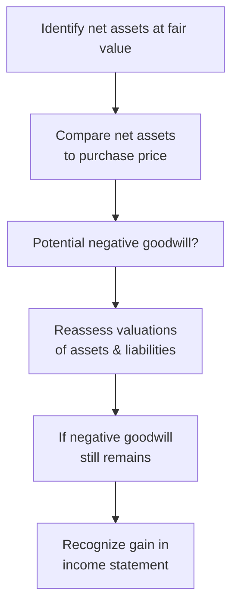

Understanding the dynamics of bargain purchases—often referred to as “negative goodwill”—is super important when you’re studying business combinations. You know, it's not every day you see a company scooping up another for less than the fair value of all the net assets acquired, so when that happens, there's usually a story behind it. Maybe it’s a distressed sale, maybe it’s an error in the seller’s due diligence, or maybe the timing was just perfect for the acquirer. Regardless of how it comes about, the accounting treatment is straightforward in theory but can be a bit nerve-racking in practice.

Below, let’s walk through what bargain purchases are, why they happen, how IFRS and US GAAP handle them, and how you might see this stuff tested on the CFA® Level II exam. Or even if you’re just super curious about the intricacies of financial statement analysis, you’ll find plenty here to sink your teeth into.

Bargain Purchase Basics  
Sometimes, a company (the “acquirer”) purchases another company (the “target”) at a price below the fair value of the target’s net assets. It's like walking into a fancy store ready to pay full price for something—maybe a luxurious watch or a piece of art—only to find a giant discount sign. You pay less than what it’s realistically worth. In M&A accounting, that difference, if it survives thorough re-measurement, is recognized as a gain on the acquirer’s income statement. This phenomenon is ordinarily called a “bargain purchase” in IFRS (IFRS 3) and “negative goodwill” under older or colloquial references.

Why Do Bargain Purchases Even Happen?  
There’s no single reason for negative goodwill, but here are some usual suspects:

• Distressed Sale: The seller might be desperate for liquidity and willing to unload assets at almost any price. Think about those big financial crises or a small competitor that’s struggling to stay afloat.  
• Limited Bidders: If there isn’t enough market competition—maybe the target operates in a really niche field—then the acquirer might get a “deal.”  
• Seller’s Weak Negotiation or Due Diligence: Honestly, sometimes the seller doesn’t do enough homework. Perhaps valuable patents or intangible assets weren’t properly valued, or liabilities were overstated. The buyer effectively benefits from the seller’s oversight.  

Now, I remember a deal I was analyzing years ago: a small biotech firm needed urgent cash, and the buyer was able to pick them up for less than the sum of their patented drug pipelines. It felt surreal. But in the official financial statements, that “discount” was recognized as an immediate gain. You bet it had investors scratching their heads: “Is this really operational excellence or just an opportunistic purchase?”

Reassessing the Fair Values  
Before you finalize that negative goodwill figure on your financials, there’s an important step: re-measurement. IFRS 3 and ASC 805 both say—pretty emphatically—you must double-check all the fair values of the acquired assets and liabilities. In other words, “Wait, are you sure that intangible asset is worth only half a million? Are we certain that contingent liability is so huge?” The standard setters are suspicious of negative goodwill because it’s not particularly common. A forced sale happens sometimes, but if you see it happening too frequently, something else might be off.

The process usually looks like this:

• Identify and measure the fair value of the target’s identifiable assets and liabilities.  
• Compare the total net fair value to the purchase price (including any contingent consideration, if relevant).  
• If net fair value > purchase price, you have potential negative goodwill.  
• Reassess and verify your values to ensure you haven’t overstated liabilities or understated assets.  
• If the mismatch remains, recognize the difference immediately in the acquirer’s income statement as a gain.  

Just to visualize:

This diagram sums it up: the standard setters want to make sure everything is measured correctly. If, after the re-check, the numbers still reflect a bargain purchase, the difference hits the income statement right away.

Immediate Gain Recognition: IFRS vs. US GAAP  
Under both IFRS (IFRS 3) and US GAAP (ASC 805), once all the valuations are confirmed, the negative figure is recognized as a gain on the acquiring company’s income statement. Back in the day—like pre-2008 for IFRS—some guidance allowed negative goodwill to be recognized as an “extraordinary item” or amortized over future periods. That’s not how it works anymore. Current standards converge on the same principle: an immediate gain. So in practical terms, you’ll see something like “Gain from bargain purchase” or “Gain from negative goodwill” in the period’s results, giving the acquirer’s net income a boost.

Implications for Financial Analysis  
So you’re reading an M&A footnote, and you see a big line item: “Gain on bargain purchase: $10 million.” It’s easy for an investor or analyst to think, “Wow, the acquirer is rocking it!” But hold up—this might indicate a forced sale scenario, a meltdown on the seller side, or ephemeral market conditions. In other words, it’s not necessarily a sign of the acquirer’s robust operating skills. Analysts always want to examine if that gain is truly a reflection of brilliant operational synergy or just a one-time pick-up from a distressed transaction.

Let’s consider a quick numeric example:

• The acquirer pays $45 million for the target.  
• The target’s identifiable net assets have a fair value of $52 million.  
• The first pass suggests negative goodwill of $7 million.  
• The acquirer re-measures everything—real estate, intangible assets, R&D pipeline, contingent liabilities—and it confirms that $52 million is accurate.  
• IFRS 3 / ASC 805 says: “Ok, you’ve done your homework. Record that $7 million as a gain right now.”  

So from the acquirer’s perspective, they effectively gained $7 million upon purchase. But you, as a financial analyst, need to dig deeper: was it synergy or the target’s desperation?

Identifying Common Pitfalls  
Even though the standards are quite direct, there are pitfalls that can lead to confusion or misinterpretation:

• Overzealous Valuations: Sometimes an acquirer overestimates intangible asset values, driving net assets up artificially. Then they “discover” negative goodwill. That triggers a second review, but errors can still slip through.  
• Complex Liabilities: In certain industries—oil & gas, biotech, specialized manufacturing—liabilities like environmental cleanup costs or litigation risk can be tricky to measure. If these liabilities are overstated, it inflates the net assets, which might result in negative goodwill.  
• Timing Differences: Make sure the measurement date is correctly used. Fair values can change quickly, especially in volatile markets. If you pick an outdated valuation or fail to account for new developments, your negative goodwill figure could be off.  
• Ill-Advised Gains: The immediate gain can tempt management to pursue questionable deals purely to boost short-term earnings. Ethical considerations (hello, potential IFRS/US GAAP compliance issues or beyond) always come into play.  

Best Practices and Strategies for Analysis  
1. Thoroughly Review Footnotes: Gains from bargain purchases should come with robust disclosure. IFRS 3 and ASC 805 require detail on how the initial valuations were done and the reasons for the bargain.  
2. Adjust for One-Time Items: If you’re valuing the acquirer’s ongoing profitability, you might exclude or highlight that gain so it doesn’t distort recurring earnings metrics.  
3. Compare Industry Transactions: Is the bargain purchase consistent with similar deals in the sector? This can confirm if it’s truly a “bargain” or simply the going rate.  
4. Watch Out for Ethical Red Flags: Overstating or understating assets can lead to misrepresentation. The IFRS/US GAAP frameworks aim to prevent it, but it’s not foolproof.  

Real-World Scenario: A Distressed Retail Acquisition  
Here’s a quick case you might see in a vignette. Suppose a large department store chain acquires a struggling regional retailer that’s been hammered by shifting consumer behavior and e-commerce competition. The target’s assets—particularly real estate in prime downtown locations—are more valuable than the chain’s market price suggests. Through the negotiation, the acquirer pays a fraction of the real estate’s fair value. After re-measurement, bang! The net assets are $100 million, but the acquirer only paid $90 million. That $10 million difference is recognized as a bargain purchase gain. While this looks good on paper, the real question is: Will the acquirer be able to integrate that retail company, revamp the brand, and actually create ongoing value?  

All too often, people see the gain and assume strong synergy. But synergy is much more about post-merger integration, costs, revenue enhancements, and intangible synergy benefits—none of which are guaranteed. A “bargain” might be a fleeting advantage if the acquired retailer’s brand is outdated, staff are unmotivated, or e-commerce competition is still scorching hot.

Exam Tips for CFA® Level II  
• Expect to see a short or medium-length vignette describing a distressed acquisition scenario. You’ll likely be asked how negative goodwill is approached under IFRS vs. US GAAP.  
• Watch for question prompts that test your understanding of the reassessment requirement. For instance, “Should the acquirer re-measure intangible assets or liabilities?” The answer is yes, absolutely, because we need to confirm the negative goodwill is real.  
• Another typical question might revolve around how the gain is reported. The correct response: “Immediately in the income statement under both IFRS and US GAAP once it’s confirmed.”  
• You might also see a question about the significance of that gain from an analysis standpoint. Key is to highlight that this might not reflect ongoing performance.  

References and Further Exploration  
• IFRS 3 – Business Combinations: This is your main IFRS reference. Pay special attention to the paragraphs dealing with bargain purchase, measurement period adjustments, and disclosures.  
• ASC 805 – Business Combinations under US GAAP: Offers parallel guidance, but in slightly different wording. It’s heavily aligned with IFRS 3 in terms of negative goodwill.  
• EY’s “Accounting for Business Combinations”: This guide includes practical examples of real-world deals, specific challenges in valuations, and best practices on intangible measurement.  
• Historical Context: Pre-2008 IFRS rules allowed for different treatments. If you see older references to “extraordinary gain,” that’s from the pre-convergence era.  

Closing Thoughts  
Bargain purchases—yeah, they sound like an incredible deal, and sometimes they are. But the immediate recognition of this “gain” in the income statement can mask underlying issues. Perhaps the seller was forced into a fire sale, or maybe the buyer overstated intangible asset values. From a test-taking perspective, brace yourself for scenario-based questions designed to see if you understand how negative goodwill is identified, measured, and disclosed under IFRS and US GAAP. From a real-world perspective, remain skeptical of any big, shiny “bargain” proclaiming the buyer’s brilliance. It could be the result of extenuating circumstances rather than a strategic masterpiece.

Anyway, best of luck as you continue your studies in business combinations, goodwill accounting, and analyzing these transactions. In my opinion, unraveling the story behind the numbers is half the fun (and the battle).  

## Bargain Purchases and Negative Goodwill Practice Questions



### A distressed target is acquired at a purchase price significantly below the fair value of net identifiable assets. Initially, the result is a negative balance. What is the acquirer required to do before recognizing a gain? 
- [ ] Immediately record the negative balance as goodwill. 
- [ ] Disclose the negative balance as an extraordinary item. 
- [x] Reassess the fair values of all identified assets and liabilities. 
- [ ] Defer recognition to future periods.
> **Explanation:** Both IFRS and US GAAP require a thorough re-measurement of assets and liabilities when potential negative goodwill arises. Only after verifying the amounts do you recognize an immediate gain if the negative balance remains.

### Under IFRS 3 and ASC 805, where is any confirmed negative goodwill recognized?  
- [ ] Recognized as an extraordinary gain in other comprehensive income (OCI).  
- [ ] Capitalized as a separate balance sheet item.  
- [x] Recognized in the acquirer’s income statement as a gain in the period of acquisition.  
- [ ] Recognized as other equity.  
> **Explanation:** Current guidance requires the immediate recognition of bargain purchase gains in the income statement once valuations have been confirmed.

### Which situation often leads to a bargain purchase scenario?  
- [ ] Strong demand for the target, leading to competitive bids.  
- [x] Distressed sale by the target due to liquidity concerns.  
- [ ] Overestimation of liabilities by the acquirer.  
- [ ] Overestimation of intangible assets by the target.  
> **Explanation:** Distressed transactions are prime candidates for bargain purchases, because sellers may offload their company at a significant discount.

### A company acquires another firm and identifies an “initial” bargain purchase gain of $9 million. After careful re-measurement, the fair value of identifiable liabilities increases, reducing the net assets. The final tally shows the acquired net assets now match the purchase price. What happens to the bargain purchase gain?  
- [ ] It is still recorded in the income statement.  
- [x] It is no longer recognized because the negative goodwill is zero after reassessment.  
- [ ] It is recognized in OCI.  
- [ ] It’s added to the carrying amount of still-undervalued assets.  
> **Explanation:** If re-measurement indicates no remaining difference between net assets and the purchase price, there is no bargain purchase gain.

### When analyzing the financial statements of an acquirer that has recorded a notable bargain purchase gain, how might an analyst treat this item in a valuation model?  
- [x] Potentially remove or adjust it, given it might not represent recurring earnings.  
- [ ] Increase future projected profits by the same amount.  
- [ ] Combine it with goodwill for intangible asset valuation.  
- [ ] Spread it evenly over the next five years.  
> **Explanation:** Analysts frequently view a bargain purchase gain as a one-time or unusual item. It usually doesn’t reflect ongoing profitability and may be excluded or adjusted in valuation.

### Which of the following best describes negative goodwill’s impact on the acquirer’s balance sheet after it is recognized as a gain?  
- [x] The negative goodwill does not remain on the balance sheet; it is reflected as income for that period.  
- [ ] It is recognized in the equity section as a “reserve.”  
- [ ] It offsets goodwill from prior acquisitions.  
- [ ] It creates a new line item under non-current liabilities.  
> **Explanation:** Once confirmed, the negative goodwill is recognized in the income statement immediately rather than staying on the balance sheet.

### IFRS 3 and ASC 805 converge on the treatment of bargain purchases. Which of the following statements about this convergence is TRUE?  
- [ ] They differ significantly on whether negative goodwill is immediate or deferred.  
- [x] Both require immediate recognition of any confirmed negative goodwill in the income statement.  
- [ ] Only IFRS requires a second look at the fair values of net assets.  
- [ ] US GAAP prohibits negative goodwill recognition, requiring an adjustment to retained earnings instead.  
> **Explanation:** IFRS 3 and ASC 805 have converged to require re-measurement and, if still negative, immediate income statement recognition.

### A firm acquires a target with specialized intangible assets. Initial fair valuation was rushed. Negative goodwill is suggested. What should the acquirer do?  
- [x] Carefully reassess the valuation of the specialized intangible assets.  
- [ ] Immediately accept that negative goodwill is correct.  
- [ ] Classify specialized assets as goodwill.  
- [ ] Defer intangible valuation until the next reporting period.  
> **Explanation:** Specialized intangible assets often need careful appraisal. IFRS 3/ASC 805 require re-measurement to confirm the accuracy of any negative goodwill. 

### If negative goodwill results from a simple arithmetic mistake rather than actual undervaluation of the target, what is the likely reporting outcome for the acquiring firm?  
- [x] Correct the mistake, leading to no bargain purchase gain.  
- [ ] Report a partial gain in OCI.  
- [ ] Recognize goodwill and negative goodwill to offset.  
- [ ] Record the mistake in retained earnings in future periods.  
> **Explanation:** If an error overstates net assets or understates liabilities, the negative goodwill “disappears” upon correction, leaving no special gain to record.

### True or False: Under older guidance, negative goodwill was sometimes recorded as an extraordinary gain, but current standards require that it go straight to the income statement as a gain once verified.  
- [x] True  
- [ ] False  
> **Explanation:** Historically, negative goodwill could be treated as an extraordinary item in certain jurisdictions. Modern IFRS and US GAAP place it directly in the acquirer’s income statement once re-measurement confirms it.


