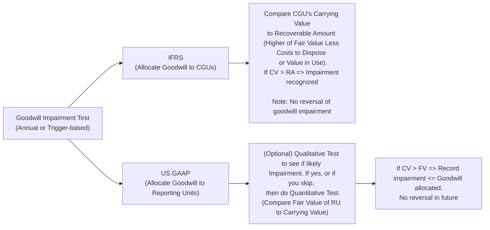

Goodwill impairment tests can be tricky—seriously, I've seen entire teams take deep breaths in unison when faced with a year-end goodwill review. It’s one of those topics that might seem simple on the surface (“just test for impairment, right?”) but unfolds into a patchwork of guidelines once you peel back the layers. This section walks you through goodwill impairment testing under IFRS and US GAAP, highlighting the reasons behind each approach and, of course, providing plenty of tips to help you handle exam vignettes like a pro.

Remember, goodwill itself arises when a company purchases another entity for more than the fair value of its net identifiable assets—so you’re essentially buying intangible benefits like synergy, brand recognition, loyal customers, or a strong research portfolio. Under both IFRS and US GAAP, goodwill isn’t amortized but is tested annually (or more frequently if certain events raise red flags). Let’s see how each framework tackles the test.

Understanding the Basics of Goodwill Impairment  
Under both IFRS and US GAAP, the overall theme is:  
• Check if goodwill is carrying an inflated value.  
• If yes, reduce (impair) it on the balance sheet so the financial statements reflect a more accurate economic reality.  

But how each standard defines the asset groups to test, the steps to measure impairment, and the possibility (or impossibility) of reversing that impairment can differ. These distinctions often become important to analysts—particularly when comparing companies under different frameworks.

IFRS Approach to Goodwill Impairment  
IFRS structures goodwill impairment testing around the concept of a “Cash-Generating Unit” (CGU). Let’s break it down:

• CGU Allocation: Goodwill is allocated to the CGU(s) that are expected to benefit from the combination synergies. A CGU might be a product line, a division, or a segment—essentially, the smallest group of assets that independently generates cash inflows.

• Recoverable Amount: IFRS compares the CGU’s carrying amount (including allocated goodwill) to its recoverable amount, which is the higher of:  
  1. Fair Value Less Costs of Disposal: The price you’d realistically fetch if you sold that CGU, minus the costs directly attributable to the disposal process.  
  2. Value in Use: The present value of estimated future cash flows from the CGU (often determined using a discounted cash flow approach).

• Impairment Recognition: If the CGU’s carrying amount exceeds its recoverable amount, IFRS requires you to record an impairment. This write-down does not exceed the total amount of goodwill allocated to that CGU. Other assets in the CGU might also be tested if additional impairment is required.  

• No Reversals for Goodwill: If you later discover the CGU’s value rebounds (maybe the market recovers or your synergy truly materializes), IFRS doesn’t allow you to reverse a previously taken goodwill impairment. You can’t magically bring that goodwill back onto your books.

US GAAP Approach to Goodwill Impairment  
The US GAAP method focuses on reporting units rather than CGUs.

• Reporting Unit Definition: A reporting unit is an operating segment, or one level below, that typically includes the businesses or activities that the goodwill was originally allocated to. This grouping sometimes differs from the IFRS CGU concept, which can change the timing or magnitude of recognized impairments.

• Qualitative (Step 0) Test: US GAAP allows an optional “Step 0” test. In plain English, it’s a screening test: management looks at macroeconomic info, industry trends, and overall operating performance. If there are no obvious red flags, you’re done—no further testing needed.  

• Quantitative Test: If you flunk Step 0 or simply skip it, you perform the quantitative test. You compare the fair value of the reporting unit to its carrying amount.  
  – If Fair Value ≥ Carrying Amount: No impairment.  
  – If Carrying Amount > Fair Value: Record an impairment for the difference, not to exceed the amount of goodwill on the books for that reporting unit.

• Single-Step Impairment: Previously, US GAAP used a “two-step” approach to determine “implied goodwill” and measure impairment. But that’s now history. The standard has simplified everything into the single-step approach.

A Quick Visual Comparison  
Here’s a simple diagram to illustrate the different approaches to goodwill impairment under IFRS vs. US GAAP:

Real-World Example of the Differences  
Let’s say Company X acquires Company Y. Under IFRS, the synergies from Y are allocated to CGU 1 and CGU 2 because each generates independent cash inflows from the acquired business lines. Meanwhile, for US GAAP reporting, management decides it’s more appropriate to fold Y entirely into a single reporting unit because that’s how the business is organized operationally. If a market downturn leads to a potential impairment:

• IFRS might pick up an impairment in CGU 1 earlier (due to poor performance there), while CGU 2 is fine.  
• US GAAP, however, might push everything into that single reporting unit. If that entire unit still has enough fair value to cover the carrying amount, no impairment is recognized—despite poor performance in part of the business.  

In your exam or in real life, you might see IFRS filers taking partial impairments on a specific slice of goodwill, while US GAAP filers keep the entire goodwill intact because, overall, the relevant reporting unit is still doing okay.

Implications and Key Timing Differences  
• Level of Testing: IFRS focuses at the CGU level, US GAAP focuses at the reporting unit level. Sometimes these coincide. Often, they don’t.  
• Frequency and Single-Step: US GAAP’s single-step approach and optional qualitative test can streamline or delay recognition, depending on your perspective. IFRS, by contrast, typically heads straight into a fundamental quantitative approach—no formal “screening test.”  
• No Goodwill Reversals: Neither IFRS nor US GAAP allow for reversals of goodwill impairments (although IFRS does allow reversal of impairment for many other assets, but not goodwill). This means once you write down goodwill, it’s generally gone for good.  
• Potential Income Statement Volatility: Companies with a chunk of goodwill can face large hits in a single period, especially when macroeconomic shifts drastically erode the fair value of their CGUs or reporting units.

Practical Considerations & Pitfalls  
• Overly Optimistic Cash Flow Forecasts: Under IFRS, if you overestimate your “value in use,” you might avoid recognizing an impairment that, in reality, is overdue.  
• Qualitative Test Pitfalls: Under US GAAP, some might be tempted to rely on “Step 0” each year, claiming no sign of trouble. If that’s done improperly, you could delay an impairment until conditions get so bad they’re undeniable.  
• Changing Allocations: Over time, reorganizations or changes in management structure might require re-allocating goodwill to different CGUs (IFRS) or reporting units (US GAAP). In your exam, pay attention to footnotes that detail such reorganizations or realignments.

Anecdote: The “Late Night Surprise”  
I recall working with a mid-sized tech firm that had recently acquired a smaller competitor. Everything looked rosy at the start, but we noticed a slump in demand about six months later. Under IFRS, they tested each new business line separately, and one line clearly wasn’t pulling its weight. They took a goodwill impairment, reported the loss up front, and moved on. Meanwhile, a US subsidiary of the same group applied US GAAP to a different reporting unit. Because the healthier lines boosted the entire unit’s fair value, that part of the business recognized no impairment—at least not until the slump infected the broader product mix a year later. It was a perfect illustration of how the two frameworks can produce different results in the short-to-medium term.

Exam Relevance and Strategy  
Expect multi-step vignettes testing your mastery of IFRS vs. US GAAP differences in goodwill impairment. You might see multiple lines of data: discount rates, future cash flow estimates, or fair values. Then you’ll be asked to determine whether an impairment is required and, if so, how much. When tackling these questions:

• Step 1: Identify which framework is used (IFRS or US GAAP).  
• Step 2: Determine the relevant unit of measurement (CGU vs. reporting unit).  
• Step 3: Check if a “qualitative test” is being performed under US GAAP.  
• Step 4: Evaluate the fair value or value in use carefully—make sure you’re using the correct measure.  
• Step 5: If an impairment is required, calculate the difference and ensure it doesn’t exceed the total amount of goodwill allocated.

References for Further Exploration  
• IFRS 3 (Business Combinations) and IAS 36 (Impairment of Assets) for IFRS requirements.  
• ASC 350 (Intangibles—Goodwill and Other) for US GAAP guidelines.  
• Deloitte’s “Goodwill and Impairment: A Guide to Key Concepts and Best Practices.”  

In addition to these, you might want to check out earlier chapters and references on business combinations (see Section 5.1 for purchase price allocation insights) and Intercorporate Investments (Chapters 3 and 4) to see how goodwill fits into the broader context of consolidated financial statements.

Anyway, that’s the gist. Keep these details fresh in your mind, practice with example vignettes, and you’ll wrangle goodwill impairment tests whether they come at you IFRS style or US GAAP style.

## Goodwill Impairment Testing IFRS vs. US GAAP – Practice Questions



### Which statement best describes how IFRS typically allocates goodwill for impairment testing?

- [x] Goodwill is allocated to the smallest group of assets that generates independent cash inflows, known as the CGU.
- [ ] Goodwill is allocated across the entire entity if the purchase was material.
- [ ] Goodwill is always allocated to corporate-level assets first.
- [ ] Goodwill can only be allocated to fully owned subsidiaries.

> **Explanation:** Under IFRS, goodwill is allocated to a CGU (Cash-Generating Unit) or group of CGUs that benefit from the synergies of the acquisition.

### Which of the following best characterizes the “qualitative” test under US GAAP for goodwill impairment?

- [x] It’s an optional screening that checks for indications of impairment based on macro and micro factors before proceeding to a quantitative analysis.
- [ ] It’s a mandatory step focusing solely on calculating value in use to see if it exceeds the carrying amount.
- [ ] It’s the final step before an impairment reversal.
- [ ] It’s identical to IFRS’s approach.

> **Explanation:** US GAAP allows a “Step 0” qualitative test before a quantitative test. If the qualitative test suggests no impairment, the quantitative test may be skipped.

### Under IFRS, if the carrying amount of a CGU (including goodwill) is greater than its recoverable amount:

- [x] An impairment is recognized, up to the amount of goodwill, and no reversal of goodwill impairment is allowed later.
- [ ] No impairment is recognized unless a negative revaluation reserve exists.
- [ ] The entire CGU is written off.
- [ ] Goodwill is reclassified as an intangible asset with a definite life.

> **Explanation:** IFRS requires recognizing an impairment when carrying amount exceeds recoverable amount. Goodwill impairment cannot be reversed once recorded.

### Which of the following is true regarding goodwill impairment under US GAAP after the “two-step test” was eliminated?

- [x] There is now a single-step test comparing the reporting unit’s fair value with its carrying amount, recognizing impairment for the shortfall.
- [ ] Companies must still compute an implied fair value of goodwill in a second step.
- [ ] The single-step test only applies to intangible assets other than goodwill.
- [ ] The old two-step approach is optional but encouraged by regulators.

> **Explanation:** US GAAP revised its guidance to apply a single-step method, foregoing the old second step that calculated implied goodwill.

### When comparing IFRS and US GAAP, which factor might lead to different impairment results for the same acquisition?

- [x] IFRS tests goodwill at the CGU level, while US GAAP tests at the reporting unit level, which could group assets differently.
- [ ] IFRS requires goodwill impairment tests only once every five years, US GAAP requires annual tests.
- [x] US GAAP allows a separate intangible asset approach that IFRS does not.
- [ ] Both frameworks classify all intangible assets the same as goodwill.

> **Explanation:** Because IFRS and US GAAP define “unit of account” differently (CGU vs. reporting unit), the grouping of assets differs, potentially causing timing and magnitude differences in impairments.

### Which method does IFRS commonly use to determine the recoverable amount for goodwill impairment testing?

- [x] The higher of fair value less costs of disposal or value in use.
- [ ] The lower of the CGU’s revenue and operating cash flows.
- [ ] Strictly discounted future revenue.
- [ ] Strictly net present value of net income.

> **Explanation:** IFRS specifically compares the carrying amount with the higher of fair value less costs of disposal and value in use.

### Under US GAAP, if the fair value of a reporting unit is less than its carrying amount:

- [x] An impairment is recognized for the difference, limited by the allocated goodwill balance.
- [ ] An impairment is recognized for the full difference, even if it exceeds allocated goodwill.
- [x] A second step is performed to calculate the implied fair value of goodwill.
- [ ] The entity can choose to reverse the prior goodwill impairment if fair value recovers.

> **Explanation:** Impairment under US GAAP is limited to the goodwill balance. The old second step concept is eliminated but is sometimes still referenced. There is no reversal of goodwill impairments once recorded.

### Which of the following is not a reason why IFRS and US GAAP goodwill impairment tests can produce different results?

- [x] IFRS uses the CGU concept, while US GAAP relies on reporting units.
- [ ] IFRS does not allow qualitative tests, while US GAAP does.
- [ ] IFRS permits goodwill reversals in certain cases, while US GAAP does not.
- [ ] Differences in discount rates may lead to different valuation outcomes.

> **Explanation:** IFRS does not allow reversals of goodwill impairments. Both IFRS and US GAAP forbid reversing goodwill impairments.

### Why might a “Step 0” (qualitative) test under US GAAP lead to a delay in recognizing goodwill impairment?

- [x] If management concludes qualitatively there’s no impairment, a quantitative test is skipped, potentially postponing an impairment that exists but isn’t immediately apparent.
- [ ] Because IFRS requires a “Step 0” test as well, leading to synergy in testing methods.
- [ ] The rule states that no impairment can occur in the first two years after acquisition.
- [ ] US GAAP demands an external audit of all qualitative factors first.

> **Explanation:** US GAAP’s qualitative assessment can streamline the process and sometimes delay the recognition of impairment if potential red flags go unnoticed or are dismissed.

### True or False: Both IFRS and US GAAP allow the reversal of previously recorded goodwill impairment if the circumstances that led to the impairment improve significantly.

- [x] True
- [ ] False

> **Explanation:** This is a trick question: actually, both IFRS and US GAAP prohibit reversing goodwill impairments once they’re recorded. The correct answer is False (the statement as presented is false).


