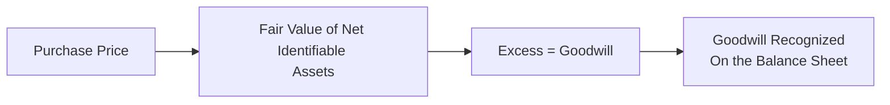

## Introduction

Goodwill can be a pretty big deal on a company’s balance sheet—especially after a major acquisition. In some cases, it might even represent a hefty chunk of total assets. If you’re preparing for the CFA® Level II exam (or even if you’re just curious about the nuts and bolts of business combinations), understanding how goodwill is created, measured, and managed will be an essential part of your skill set. In this “showcase,” we’ll walk through a practical vignette scenario to explore goodwill’s unique role and highlight how IFRS and US GAAP handle impairment testing.

## Why Goodwill Matters

When one company acquires another, the purchase price may exceed the fair value of the acquired firm’s net identifiable assets (think of intangible value from a technology patent, or maybe the brand power of a new product lineup). That difference is goodwill. It represents things like the target firm’s high-skilled workforce, synergy potential, brand recognition, or unique R&D pipeline.

Because it’s not something you can literally “touch,” goodwill requires special accounting. And sure, you might say, “I get it, intangible assets are a bit fuzzy,” but goodwill is arguably even fuzzier. It doesn’t always follow the same impairment rules as other intangible assets like patents or trademarks. So, let’s see how it might play out in real life.

## Understanding the Vignette

Imagine that Company X, a large electronics manufacturer, acquires a niche technology firm called Company Y in an all-cash deal. At first, it might look like a textbook example of synergy:

• Company Y’s expertise in cloud-based connectivity solutions.  
• Company X’s solid manufacturing and distribution infrastructure.

But the story gets interesting when we see that the purchase price exceeded the fair value of Y’s identifiable net assets by 20%. With that premium, the newly recognized goodwill ends up comprising nearly 15% of Company X’s total assets post-acquisition. Fast-forward a year, and a wave of new market entrants undermines Company Y’s pricing power—and guess what emerges as a concern? Potential goodwill impairment. Nervous yet?

## Recognizing Goodwill

Let’s outline the straightforward equation for goodwill calculation:

Purchase Price – Fair Value of Net Identifiable Assets = Goodwill

Here’s a quick visual representation:

• Purchase Price: The total amount paid by the acquirer (Company X).  
• Fair Value of Net Identifiable Assets: The sum of all tangible and intangible assets, minus liabilities, of the acquiree (Company Y).  
• Excess = Goodwill: The intangible “premium” for future benefits, brand, synergies, etc.

## Initial Allocation and Disclosure

After any acquisition, you’ll usually see a robust set of footnotes detailing the purchase price allocation. In the Company X–Company Y scenario, you’d expect a breakdown of intangible assets such as software licenses or customer relationships, plus any special intangible items (like brand recognition). Managers and auditors typically follow these steps:

• Identify each asset or liability’s fair value.  
• Recognize intangible assets separately if they meet recognition criteria (e.g., patents, trademarks, non-compete agreements).  
• Residual goes to goodwill.  

A tip for Level II exam prep: exam vignettes might bury these details in footnotes, so checking disclosures thoroughly is critical.

## The IFRS vs. US GAAP Landscape

Goodwill impairment is tested differently depending on the accounting framework. Under IFRS, we often speak in terms of “cash-generating units” (CGUs). Under US GAAP, the term is more like “reporting units.” Here’s a simplified breakdown:

### IFRS

• Goodwill is allocated to a CGU that’s expected to benefit from the acquisition.  
• Impairment is a one-step approach: compare the CGU’s carrying amount (including goodwill) with its recoverable amount (the higher of fair value less costs of disposal or value in use).  
• If the carrying amount exceeds the recoverable amount, goodwill is written down to the recoverable amount, resulting in an impairment loss.

### US GAAP

• Goodwill is allocated to a reporting unit.  
• Historically, impairment was a two-step test. However, updated standards (ASC 350) allow for an optional qualitative assessment. If that indicates a potential impairment, you then move on to a quantitative test comparing the unit’s fair value to its carrying amount.  
• If carrying value is above fair value, the difference is recognized as impairment, not to exceed the goodwill balance of that reporting unit.

And, something many of us tend to gloss over until it’s exam time: under IFRS, once goodwill is impaired, that write-down is permanent—no reversals allowed. Under US GAAP, the same irreversibility applies to goodwill impairment; it doesn’t get written back up if performance improves in the future.

## Spotlight on Impairment Indicators

Now, let’s circle back to our fictitious Company X. One year post-acquisition, new competitors are flooding the market. Margins on the tech solution are tanking. We might see:

• Slowing or negative sales growth.  
• Reduced projected cash flows.  
• A big intangible asset that no longer has the same “oomph.”  

These changes spark a formal goodwill impairment test. The CFO might say, “Hey, it’s time to dust off our DCF models and re-check those assumptions.” That’s because discount rates could be moving, cost structures might be shifting, or synergy expectations might be falling short.

In an exam context, watch out for a narrative like “Management revised down two-year forecasts and expects operating margin to drop by 30%.” That’s a big red flag for potential goodwill impairment.

## Vignette: Impairment Analysis

Let’s introduce some hypothetical numbers to see how an impairment test might unfold. Suppose the carrying amount of the CGU (which includes goodwill) is $1,000 million at year-end, and the allocated goodwill is $150 million. Management’s best estimate of the recoverable amount under IFRS is $900 million. This shortfall ($1,000 million – $900 million = $100 million) suggests the CGU is impaired.

Under IFRS, you’d have an impairment loss of $100 million, which would reduce the goodwill from $150 million to $50 million. The $100 million difference goes onto the income statement as an impairment expense. US GAAP would be somewhat similar in outcome, though the mechanics might involve a different process (quantitative step, fair value of the reporting unit, etc.).

## Market Reactions and Share Price Consequences

Sometimes, the equity market is, well, not exactly forgiving if it thinks your goodwill is a ticking time bomb. Investors might suspect that if goodwill is overinflated:

• Future earnings could suffer from impairment losses.  
• Accounting management might be too optimistic in synergy assumptions.  
• Potential credit rating concerns if the balance sheet is weaker than it looks.

If you’re analyzing a real-world case, you’d keep an eye on share price fluctuations, especially around quarterly earnings—impairment news can surprise markets.

## Work the Footnotes, Or Else

Analysts should always check the footnotes for:

• How goodwill is partitioned among business segments or CGUs.  
• What discount or growth rate assumptions are used in impairment models (these can be found in the intangible asset section).  
• Sensitivity analyses: small changes in assumptions can lead to big swings in implied fair value.

In the exam item set (or in real practice), reading the footnotes is often half the battle. If the exam question states something like “Company X used a 12% discount rate for intangible assets related to the CGU but external analysis suggests the rate should be 15%,” guess what? That might be a hint that an impairment is lurking.

## Best Practices for Analysts

• Re-check the arithmetic: ensuring you didn’t accidentally skip intangible assets in the fair value calculation.  
• Compare synergy assumptions vs. actual realized synergy. If synergy synergy synergy is repeated 17 times in a row, be cautious—overhyped synergy illusions can lead to inflated goodwill.  
• Look for prior acquisitions by the same firm. If they’ve recorded goodwill impairments in the past, management’s assumptions could be overly rosy.  

## A Quick Table: IFRS vs US GAAP Impairment Testing

| Feature                                       | IFRS                                          | US GAAP                                          |
|-----------------------------------------------|-----------------------------------------------|--------------------------------------------------|
| Allocation Concept                            | CGU                                           | Reporting Unit                                   |
| Impairment Approach                           | One-step (Carrying vs. Recoverable Amount)    | Optional Qualitative, then Quantitative Test     |
| Impairment Measurement                        | Write down goodwill to recoverable amount     | Impairment = Carrying – Fair Value (not > Goodwill) |
| Reversal of Impairment?                       | Not permitted for goodwill                    | Not permitted for goodwill                       |
| Key Considerations                             | Value in use or fair value less disposal costs| Fair value approach, with possible “Step Zero” test |

## Conclusion and Key Takeaways

I remember once looking at a real company (not our fictional Company X—though it might as well have been) that had booked massive goodwill following an acquisition spree. For a while, everything looked fine. But big competition changes spurred a goodwill impairment that nearly wiped out their reported earnings for the year. The lesson? Goodwill can be a huge intangible bullseye on your financial statements, and ignoring it can lead to unpleasant surprises.

From a CFA® Level II perspective:

• Make sure you’re fluent in the mechanics of IFRS vs. US GAAP impairment.  
• Keep your eyes peeled for footnote red flags in item-set vignettes.  
• Understand that synergy assumptions drive that intangible bump known as goodwill—test those assumptions critically.  

The better you grasp these details, the more prepared you’ll be to dissect exam vignettes and spot the real story hidden in the disclosures.

## Additional References

• Official CFA® Institute Curriculum on Intercorporate Investments and Business Combinations.  
• ASC 350 (US GAAP) and IAS 36/IFRS 3 (IFRS) for detailed accounting guidelines.  
• Company 10-Ks or annual reports for real-world examples of footnotes on acquisitions and goodwill impairments.  
• Professional accounting journals and Big Four publications for updates on impairment testing rules.

## Practice Questions on Goodwill Measurement and Impairment

Below is a set of sample exam-style questions designed to test your understanding of goodwill’s recognition, allocation, and impairment under IFRS and US GAAP. Each item includes an explanation to help you learn from any mistakes—just like practicing for the real exam.

## Goodwill on Balance Sheets Practice Quiz



### Under IFRS, goodwill is required to be:
- [ ] Amortized over an expected useful life of 10 years.
- [ ] Tested for impairment only if there is a clear indicator of decline.
- [x] Allocated to a cash-generating unit for an impairment test at least annually.
- [ ] Deferred until the acquirer disposes of the subsidiary.

> **Explanation:** Under IFRS, goodwill is allocated to a CGU and tested for impairment at least annually (or whenever there is an indication of impairment). IFRS does not allow goodwill amortization.

### Which of the following best describes a primary difference between IFRS and US GAAP in goodwill impairment testing?
- [x] US GAAP may use a qualitative ("Step Zero") assessment to decide if a quantitative test is needed, whereas IFRS does not have such an option.
- [ ] IFRS does not allow goodwill impairment under any circumstances, whereas US GAAP does.
- [ ] US GAAP requires dual reporting if intangible assets exceed 20% of total net assets, but IFRS does not.
- [ ] Under IFRS, impairment reversals are permitted, while US GAAP strictly prohibits them.

> **Explanation:** Under ASC 350, US GAAP permits a qualitative assessment to determine if a quantitative test is necessary. IFRS maintains an annual impairment test requirement without the optional qualitative step. Also, neither IFRS nor US GAAP allow goodwill impairment reversals.

### If a CGU’s carrying amount is $1,500 million and the recoverable amount is $1,300 million under IFRS, the goodwill impairment charge would generally be:
- [ ] $1,500 million.
- [x] $200 million.
- [ ] $0 million.
- [ ] $1,300 million.

> **Explanation:** Goodwill impairment under IFRS is the difference between the CGU’s carrying amount and its recoverable amount. Here, $1,500 million – $1,300 million = $200 million.

### In a post-acquisition scenario, which event most obviously indicates the possibility of goodwill impairment?
- [ ] A new CFO is hired who prefers more conservative estimates.
- [x] The acquired company’s operating margins drop significantly due to market competition.
- [ ] Implementation of a new marketing strategy after the merger.
- [ ] The parent company re-brands the acquired subsidiary’s product line.

> **Explanation:** A sudden decline in operating margins is a tangible indicator that expected future cash flows (and thus value) might be lower than originally forecast, triggering an impairment test.

### Under US GAAP, if a company decides to perform the optional qualitative assessment for goodwill impairment and concludes that it is not more likely than not that goodwill is impaired:
- [ ] It must still proceed with the quantitative goodwill impairment test.
- [x] It can bypass the quantitative test and carry goodwill at its current amount.
- [ ] It must write down goodwill by 10% of its carrying amount.
- [ ] It should switch to IFRS guidelines for further action.

> **Explanation:** The US GAAP "Step Zero" test permits companies to skip the quantitative test if their qualitative analysis suggests an impairment is unlikely.  

### Which of the following outcomes typically follows the recognition of a goodwill impairment?
- [x] A reduction in reported net income for the period.
- [ ] A subsequent upward revaluation of goodwill if conditions improve.
- [ ] Deferred recognition on the balance sheet until a future period.
- [ ] An immediate reduction in equity but no effect on net income.

> **Explanation:** Once goodwill impairment is recognized, it is an expense on the income statement. Goodwill cannot be revalued upward after impairment under both IFRS and US GAAP.

### Company X acquired Company Y, recognizing $80 million of goodwill. If, after an impairment test under IFRS, Company X writes off $20 million of goodwill, its new goodwill balance is:
- [x] $60 million.
- [ ] $80 million (not adjusted).
- [ ] $0 million, since the entire goodwill must be written off once impaired.
- [ ] $20 million.

> **Explanation:** Impairment under IFRS reduces goodwill by the impairment amount to $60 million ($80 million – $20 million). The balance is carried forward unless further impairment is indicated.

### Under IFRS, which amount is used to compare against the carrying value to determine impairment for a CGU?
- [ ] Net book value of intangible assets only.
- [ ] Historical cost minus accumulated depreciation.
- [x] Higher of fair value less costs of disposal or value in use (recoverable amount).
- [ ] Coverage ratio of intangible assets to total liabilities.

> **Explanation:** IFRS defines recoverable amount as the higher of (1) fair value less costs of disposal or (2) value in use. This determines if there is a shortfall compared to carrying value.

### Management of Company X claims no impairment loss is needed even though competitors have significantly eroded the profitability of the acquired subsidiary. As an analyst, the most effective step to verify this would be to:
- [ ] Rely on management’s explanation without further review.
- [ ] Check the entity’s stock price movement only.
- [ ] Perform a historical cost analysis of intangible assets.
- [x] Examine footnotes for discount rate assumptions, growth forecasts, and intangible asset valuations in the CGU impairment test.

> **Explanation:** To confirm the lack of impairment, an analyst should scrutinize disclosures related to how management conducted the impairment test, including key assumptions. This helps identify whether management might be overly optimistic.

### Goodwill can be:
- [x] Tested for impairment but never re-amortized under IFRS or US GAAP.
- [ ] Amortized over 10 years under both IFRS and US GAAP.
- [ ] Valued using the lower of cost or market technique at each reporting date.
- [ ] Uplifted in value if synergy benefits exceed management forecasts.

> **Explanation:** Goodwill is tested for impairment under both IFRS and US GAAP. It is not amortized or revalued upward if synergy benefits outperform expectations.


