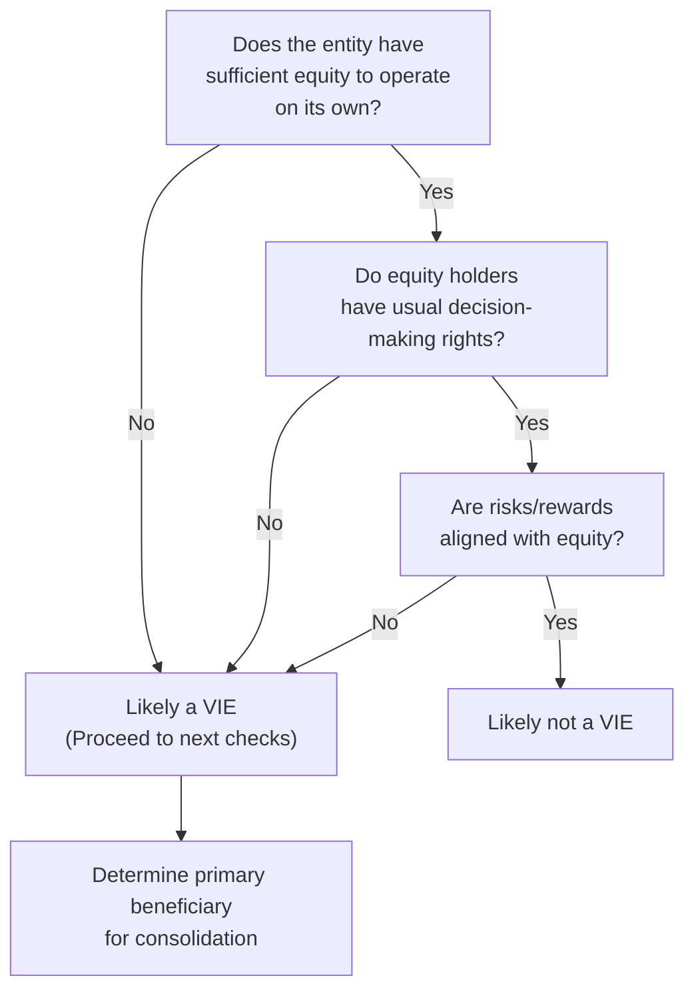

## VIE Definition and Purpose
Variable Interest Entities (VIEs) are unique structures designed, in many cases, to provide financing or isolate risks. Now, let me just say, the first time I came across a VIE, I remember thinking, “Um, is this thing basically a hidden company off the balance sheet?” Well, not exactly. But it’s true that VIEs are often used to shift or redistribute risks and rewards.

A VIE—under US GAAP (ASC 810)—is an entity that:
• May have insufficient equity at risk to support its operations without extra backing.  
• Does not grant typical decision-making powers to equity holders.  
• Has equity owners who do not absorb the usual benefits or losses.

IFRS uses the term “structured entity” (primarily under IFRS 10 and IFRS 12) but, honestly, the high-level concept feels the same: it’s about who controls the entity and who truly reaps the benefits or shoulders the losses.

These entities are often formed to accomplish specific objectives, such as:  
• Securitizing different types of assets (like mortgages or credit card receivables).  
• Facilitating lease financing.  
• Creating bankruptcy-remote structures (to minimize risk).  
• Managing research-and-development costs in collaborative ventures.

## Key Attributes That Differentiate VIEs
When analyzing whether an entity qualifies as a VIE (or a “structured entity” under IFRS), expect to look for some telltale signs:

### Insufficient Equity Investment at Risk
If the entity’s equity is so small that it cannot operate without additional financial support (maybe from a sponsoring firm or from guaranteed loans), that’s your first red flag. This begs the question: “Who is really financing the entity?” If there’s a distinct sponsor taking on most of the risk, the entity could very well be a VIE.

### Lack of Decision-Making Rights
Typically, equity holders vote on major business decisions. In a VIE, though, we might see a structure where folks who hold only a minor equity stake (or even zero stake) call the shots. Equity investors might not even have meaningful voting rights, so they can’t direct operations. That mismatch is another potential sign of a VIE.

### Disproportionate Exposure to Risks and Rewards
One big reason VIEs exist is to shift risk. So, if an entity is receiving benefits (like interest income or residual profits) or bearing the brunt of losses in a manner that appears disproportionate to its nominal equity interest, that’s a strong indicator. This might happen with guaranteed returns (i.e., the sponsor steps in if a default occurs), or with a sponsor that reaps the bulk of the entity’s income even though it doesn’t hold a big slice of equity.

## Typical Uses and Examples
VIEs pop up in a variety of ways. Let’s highlight a few common uses:

• Securitizations: Think mortgage-backed securities or other asset-backed securities. A VIE might buy a pool of mortgages from a bank, then furnish bonds or notes to investors, using the mortgage payments as cash flows.  
• Lease Financing: Some companies form a special entity to own and lease equipment, guaranteeing the lessor (the new VIE) a certain return.  
• Asset-Backed Commercial Paper (ABCP) Conduits: These are short-term funding structures that purchase pools of receivables and finance them by issuing commercial paper.  
• R&D Joint Ventures: Instead of performing R&D on their own balance sheets, partnering firms might create a separate entity to handle research costs and share risks.

Honestly, it’s kind of ingenious. The sponsoring firm (e.g., a major industrial manufacturer) might only own a fraction of the joint venture’s equity but guarantee a certain loan or be obligated to purchase intellectual property from that venture at a set price. This effectively means the sponsor is on the hook if things go south—illustrating that the real risk is not carried by the R&D entity’s equity investors, but by the sponsor.

## Regulatory Framework
### US GAAP: ASC 810
Under US GAAP, ASC 810 provides guidance on consolidation. The critical question is whether one entity is a “primary beneficiary” of a VIE. If so, it must consolidate that VIE’s financials into its own. The process goes something like this:
• Assess if you (the sponsor) have a variable interest in the entity (i.e., do you receive variable returns, or do you guarantee losses?).  
• Evaluate whether the arrangement is indeed a VIE (insufficient equity, unusual voting rights, and so forth).  
• If the sponsor is the primary beneficiary—the one that absorbs the majority of expected losses/returns—then that sponsor consolidates.

### IFRS: IFRS 10 and IFRS 12
IFRS calls these “structured entities” but again, it’s basically the same principle. IFRS 10 lays out the notion of control:  
• You have power over the investee.  
• You’re exposed to variable returns from that investee.  
• You can use that power to affect your returns.

IFRS 12 also requires robust disclosures about the nature of any interests in other entities. So, it’s prudent to read the footnotes carefully whenever you suspect a structured entity. IFRS 12 demands clarity around the nature of the relationship, the potential risks, and the possible effects on a company’s financial position.

## Relevance for Financial Statement Analysis
At Level II, you need to be able to spot situations where a company might be using a VIE to keep certain items off the balance sheet. That can heavily skew your ratio analysis. For instance:
• Leverage Ratios: If a VIE carries a lot of debt that is not consolidated, the sponsor’s consolidated balance sheet might look artificially strong. You might see a lower debt-to-equity ratio, which arguably misrepresents the true risk.  
• Liquidity Metrics: Some VIE structures can obscure real liquidity needs or obligations.  
• Profitability Measures: If the sponsor is basically absorbing the losses or reaping the gains from the VIE, but not consolidating, net income or return on assets might be out of line with economic reality.

Be mindful that IFRS vs. US GAAP can produce different consolidation outcomes. The main theme, though, is consistent: if you effectively control the entity (or are the primary beneficiary), you should be consolidating it.

## Real-World Example: The Enron Case
It’s almost impossible to talk about off-balance-sheet shenanigans without mentioning Enron. Back in the early 2000s, Enron famously used a wide array of special purpose entities (SPEs) to hide debt and inflate profits. Many of these SPEs would easily qualify as VIEs under today’s accounting standards. But at the time—before the rules were tightened—they could be kept off Enron’s balance sheet. When the full extent of Enron’s liabilities finally came to light, the company collapsed. This fiasco spurred significant reforms in accounting standards, culminating in stricter guidelines for identifying and consolidating VIEs.

## Identifying a VIE: A Simple Decision Tree
Below is a simple flowchart you might find handy when evaluating whether an entity is likely a VIE or structured entity under IFRS. Admittedly, in practice, you’d want more detailed steps, but this is a nice, quick snapshot:

• If you find insufficient equity, or the equity holders don’t really control the entity, or the risk/reward structure is odd, you likely have a VIE.  
• Next, figure out if your firm is the primary beneficiary. If yes, you’d consolidate the VIE into your financial statements.

## Best Practices and Pitfalls
I like to remind folks that no matter how flamboyant or complicated a VIE structure appears, it’s not unstoppable or magical. Here’s how to approach it:

• Check the Disclosures: IFRS 12 and ASC 810 require disclosures about off-balance-sheet entities. Footnotes are your best friend.  
• Beware of Aggressive Structures: If you see a company with consistently lower leverage than peers, examine whether they’re using VIEs.  
• Understand the Personal Guarantee: Sometimes, a sponsor’s CFO or major shareholder might guarantee debt. That’s a sign risk hasn’t magically disappeared; it’s merely shifted.  
• Look for Protective Provisions: If an outside sponsor covers deficits or ensures returns, that’s a clue as to who’s really wearing the risk hat.

Common pitfalls include ignoring the footnotes or assuming that if something’s not consolidated, it’s inconsequential. As Enron taught everyone—some of the “hidden” items can be game-changing.

## Conclusion
Variable Interest Entities (VIEs) exemplify how accounting standards try to capture economic reality when legal structures might obscure it. Whether you’re working under US GAAP with ASC 810 or IFRS 10/12, the core question is about control, risk, and reward. If a sponsor effectively controls an entity or stands to absorb most of its gains and losses, that sponsor should bring the entity onto its balance sheet. 

From an analyst’s perspective, the presence of VIEs can significantly affect leverage, profitability, and liquidity ratios. So, read footnotes, examine disclosures, and stay vigilant for any mismatch between nominal equity ownership and the actual economic burdens and benefits. In my opinion, this is what financial statement analysis is all about: piercing the veil of sometimes-fancy structuring to see the real picture underneath.

## References and Further Reading
• [Financial Accounting Standards Board (FASB) ASC 810](https://www.fasb.org/jsp/FASB/Page/SectionPage&cid=1176156316498)  
• [IFRS 10: Consolidated Financial Statements](https://www.ifrs.org/issued-standards/list-of-standards/ifrs-10-consolidated-financial-statements/)  
• [IFRS 12: Disclosure of Interests in Other Entities](https://www.ifrs.org/issued-standards/list-of-standards/ifrs-12-disclosure-of-interests-in-other-entities/)  
• Financial Shenanigans by Howard Schilit (for insights on off-balance-sheet financing and revenue manipulations)  

## Test Your Knowledge: Variable Interest Entities (VIEs)



### Which of the following is generally a characteristic of a VIE?
- [ ] It must have a 100% equity stake by its primary beneficiary.
- [x] It often has insufficient equity to finance its activities without additional support.
- [ ] It always operates in regulated industries only.
- [ ] It can only be formed under IFRS, not US GAAP.

> **Explanation:** A typical characteristic of a VIE is having insufficient equity to operate independently. It is not limited to regulated industries, may not be 100% owned by the primary beneficiary, and exists under both IFRS and US GAAP (though with different terminology).

### Under US GAAP, determining the primary beneficiary of a VIE requires evaluating which party:
- [x] Absorbs the majority of the entity’s expected losses and/or receives the majority of its residual returns.
- [ ] Has the largest voting interest in the entity.
- [ ] Owns the greatest number of shares in the entity.
- [ ] Provides the initial seed funding for the entity.

> **Explanation:** ASC 810 focuses on expected losses and residual returns. Voting interest alone may not reflect controlling financial interest for a VIE.

### What is one major difference between a VIE under US GAAP and a structured entity under IFRS?
- [x] US GAAP uses the term “VIE,” while IFRS commonly refers to “structured entities,” although both seek to identify off-balance-sheet risks and consolidate when control exists.
- [ ] IFRS absolutely does not allow for off-balance-sheet entities.
- [ ] US GAAP structures never require enhanced disclosure of controlled entities.
- [ ] IFRS consolidates all SPEs without exception.

> **Explanation:** The main difference is largely in terminology and certain technical guidelines. Both frameworks aim to capture entities that should be consolidated but might be hidden.

### Which of the following could result in unusual risk/reward characteristics that suggest a VIE?
- [ ] Equity investors assume all risks equally.
- [x] A sponsor guarantees returns or covers losses beyond its equity investment.
- [ ] The entity’s charter states it will list shares on a major exchange.
- [ ] The entity maintains a robust credit rating without external support.

> **Explanation:** If the sponsor guarantees returns or covers losses, it typically means the sponsor bears risk and/or obtains reward disproportionate to its voting stake, hinting at a VIE.

### Which is NOT a typical use of a VIE?
- [ ] Securitizing assets for mortgage-backed securities.
- [x] Basic operating activities for small retail shops on Main Street.
- [ ] Facilitating off-balance-sheet lease financing.
- [ ] Housing R&D initiatives in a separate entity.

> **Explanation:** VIEs are usually created for specialized financing, securitizations, or risk shifting, not for simple, everyday store operations.

### Which statement accurately describes a reason companies create VIEs?
- [ ] To push liabilities onto the balance sheet so investors can see them clearly.
- [x] To isolate certain risks or achieve financing advantages sometimes kept off the primary balance sheet.
- [ ] To ensure all profits are shared equally among shareholders.
- [ ] To abide by IFRS 12, which bans off-balance-sheet disclosures.

> **Explanation:** A major reason for forming VIEs is to isolate specific risks or achieve beneficial financing structures. In some cases, these arrangements can result in off-balance-sheet items if not consolidated.

### Under IFRS 10, an investor must consolidate a structured entity when:
- [ ] The investor holds more than 50% of the voting equity.
- [x] The investor has power over the entity and is exposed to variable returns that can be affected by its control.
- [ ] The entity is considered immaterial in size and scope.
- [ ] The investor can contractually demand management fees.

> **Explanation:** IFRS 10 sets out that control is the guiding principle: power over the investee plus exposure to variable returns.

### Which Enron practice highlighted the need for stricter VIE guidelines?
- [x] Using special purpose entities to hide debt and inflate reported earnings.
- [ ] Disclosing all liabilities openly in footnotes.
- [ ] Issuing convertible bonds at fair interest rates.
- [ ] Implementing robust corporate governance practices that consolidated SPEs.

> **Explanation:** Enron used SPEs (today recognized as VIEs) improperly to stash liabilities and inflate earnings, which later led to collapse and subsequent regulatory changes.

### What is a key pitfall when conducting financial statement analysis on companies with potential VIEs?
- [ ] Overestimating the company’s leverage by including VIE debt as company debt.
- [x] Misreading disclosures and failing to acknowledge off-balance-sheet liabilities or risk exposures.
- [ ] Focusing too heavily on footnotes and ignoring the primary financial statements.
- [ ] Believing that IFRS statements are never subject to manipulation.

> **Explanation:** One of the biggest mistakes analysts can make is overlooking footnotes or failing to see how risk is being borne by the sponsor. VIE disclosures are critical to understanding true financial health.

### True or False: If a company only has a small voting stake in a VIE, it cannot be the primary beneficiary.
- [ ] True
- [x] False

> **Explanation:** Even if a company holds a small voting stake, it can be the primary beneficiary if it absorbs most of the risks and rewards and has power over the entity’s significant activities.  


