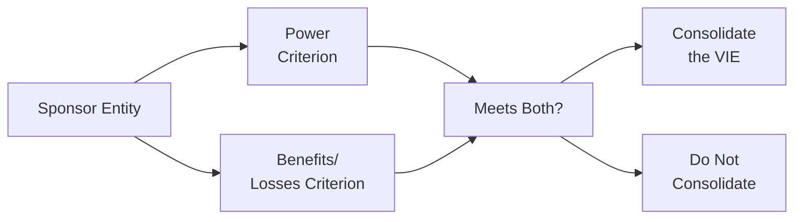

## Introduction
Sometimes when I first encountered the topic of Variable Interest Entities (VIEs), I found myself—well—totally baffled. I remember a colleague saying, “You need to figure out who’s the real boss (the primary beneficiary) behind the scenes, or you’ll never know which balance sheet is going to blow up.” That casual statement sort of woke me up. In essence, if you have the power to significantly influence a VIE’s activities and you absorb the majority of its risks or reap most of its rewards, you may be that “boss”—the primary beneficiary—who must consolidate the VIE onto your own financial statements.

This section looks at how US GAAP and IFRS define and identify a primary beneficiary. We’ll also explore how consolidation changes the sponsor’s financial statements, the risks involved for investors, and some best practices. So, let’s jump right in.

## US GAAP: The Primary Beneficiary Model
Under US GAAP (ASC 810-10), a primary beneficiary is the party required to consolidate the VIE. This determination depends on two main criteria:

### The Power Criterion
The first piece of the puzzle is power. If you can decide which assets to buy and sell, how to structure the entity’s capital, or manage cash flows in a way that significantly affects the VIE’s performance, you meet the power requirement. For instance, consider an investment firm that sets bond investment policies for a structured financing entity. If that firm single-handedly decides what bonds the entity holds, it likely holds the power.

Now, power often stems from contractual authority. Imagine reading a big chunk of a VIE’s foundational documents: you might see a clause giving a sponsor the right to manage or replace the asset manager. If that sponsor can truly direct the activities that drive the entity’s economic performance, watch out—they could be the one on the hook for consolidation.

### The Benefits/Losses Criterion
Then there’s the benefits or losses side. If you get the major slice of the entity’s returns (for example, you earn a disproportionately large portion of the residual profits if everything goes well) or you absorb the bulk of losses if the structure collapses, that’s the second test. It could be spelled out through guarantees, credit default protection, or a first-loss arrangement.

To be a primary beneficiary, you need both the power piece and the economic exposure piece. A sponsor might have unlimited power but minimal financial interest, or vice versa. You only consolidate a VIE if both conditions are met.

## IFRS Approach (Control Definition)
IFRS 10 uses a slightly different labeling but similar logic. Under IFRS, consolidation is required when an entity:

• Has power over the investee (similar to the ‘power’ concept under US GAAP).  
• Has exposure, or rights, to variable returns from involvement with the investee.  
• Can use its power to affect those returns.

We often call VIEs “structured entities” under IFRS. But the hallmark remains the same: do you control the structured entity, and can you sway financial outcomes through your decisions? If so, IFRS expects consolidation.

### Similarities and Differences
While IFRS 10’s language about “variable returns” and “power to affect them” parallels US GAAP, IFRS typically frames its guidance more principles-based. US GAAP rules, ironically, can be more prescriptive about identifying that primary beneficiary. However, the outcome—who consolidates and how—often ends up resembling the US GAAP approach.

## Risk Analysis and Implications for Investors
Understanding these rules isn’t just about passing an exam. In practice, if you’re analyzing a company that might be the primary beneficiary of a VIE, you want to check:

• Funding agreements: Who stumps up the capital first, and who’s left holding the bag if assets go bad?  
• Guarantee arrangements: Are there layers of protection or disclaimers that shift risk from one party to another?  
• Contractual obligations: Certain complex derivatives or credit enhancements give overbearing control and risk absorption to one party.

If a sponsor is forced to consolidate a VIE, it can radically inflate total assets and liabilities. This means leverage, debt ratios, and other solvency metrics might change overnight, fundamentally altering the view you had of a company’s credit risk and financial health. Indeed, for some big banks in the past, failing to consolidate certain VIEs masked the real scale of their liabilities. That’s what can cause major surprises for investors, regulators, and credit analysts.

## Impact on Financial Statements
Let’s highlight the key shifts that occur once you consolidate a VIE.

- Assets: The primary beneficiary’s balance sheet now includes the VIE’s assets—perhaps structured loans, securitized notes, or intangible assets.  
- Liabilities: The sponsor picks up the VIE’s obligations (e.g., issued debt), potentially ballooning total liabilities.  
- Noncontrolling interest: If others hold equity in that VIE, the sponsor typically reports a noncontrolling interest section within equity.  
- Income statement: Gains and losses from the VIE now flow into the sponsor’s consolidated net income, subject to any portion allocated to noncontrolling interests.

Here’s a quick visual overview of the conceptual consolidation flow:

If you answer “yes” to the question “Meets Both?” under US GAAP (or if IFRS 10’s control definition is satisfied), you end up consolidating the VIE’s assets and liabilities. Otherwise, no consolidation.

## Step-by-Step Example: Identifying the Primary Beneficiary
Suppose Company A sets up a structured entity (SECure) to invest in mortgage-backed securities (MBS):

1. Company A invests $2 million as equity in SECure.  
2. Third-party investors buy $5 million of debt instruments from SECure.  
3. Company A has the right to modify investment policies—like deciding if SECure invests in prime or subprime mortgages.  
4. Company A also provides a guarantee to third parties that if the MBS portfolio loses value beyond a certain point, Company A covers the gap.

Step 1: Check for power. In this scenario, Company A truly calls the shots; it picks the MBS strategy. So, the power criterion is likely met.  

Step 2: Check economic exposure. Because Company A offers that guarantee, it’ll absorb major losses if the MBS portfolio crashes. Also, as a main equity holder, it reaps a huge share of the upside if the MBS appreciates. So, it has significant exposure to variable returns.  

Conclusion: Company A would be the primary beneficiary under US GAAP. Under IFRS, we’d say Company A controls SECure and must consolidate.  

## Before and After Consolidation: A Hypothetical Look
Below is a simplified illustration showing how consolidation can transform a sponsor’s balance sheet metrics. Let’s say Company A’s balance sheet (in millions) before consolidating SECure is:

• Total Assets: $100  
• Total Liabilities: $70  
• Equity: $30  
• Debt/Equity Ratio: 70/30 = 2.33

Now, if Company A consolidates SECure with $5 million of additional liabilities and $5.5 million of assets, the new top-line figures might be:

• Total Assets: $105.5  
• Total Liabilities: $75 (including the structured entity’s $5 million debt)  
• Equity: $30.5 (the extra $0.5 million representing net equity from the VIE net of noncontrolling interest)  
• Debt/Equity Ratio: 75/30.5 ≈ 2.46

Although these numbers are quite small for real-world companies, it shows how consolidation can shift key metrics. A jump in total liabilities can heighten the sponsor’s perceived leverage, possibly affecting its credit rating or investor perception.

## Common Pitfalls and Best Practices

• Failing to Assess All Contracts: Analysts sometimes ignore side agreements like liquidity guarantees or total return swaps. These can tilt risk exposure.  
• Overlooking Liquidation Provisions: If an entity’s docs say the sponsor needs to fund deficits upon liquidation, that might trigger the benefits/losses test.  
• Not Reviewing Power Carefully: A minor equity holder might still hold controlling power through special voting rights or contractual authorities.  
• Reviewing IFRS vs. US GAAP Differences: Under IFRS, the question is about control, but the approach can be more principles-based. Ensure your conclusion under IFRS lines up with the standard’s three-part test.

It’s always best to—well—consult the original documents thoroughly. The CFO might say, “We don’t consolidate this entity because, trust me, we’re not at risk.” But if the legal documents say otherwise, the CFO might be in for a rude awakening.

## Exam Tips and Reminders
• Practice carefully reading vignettes for contractual details that give sponsors either power or exposure to losses.  
• Use the two-step approach under US GAAP: (1) Identify who has the power, (2) Confirm that party’s share of the entity’s economic returns or losses.  
• For IFRS, match your reading to the “control test.” That means power plus variable returns plus the ability to use that power to influence the returns.  
• Always keep your eyes on disclosures: sometimes the sponsor’s footnotes about VIE liabilities are the key to revealing consolidation triggers.

## References and Further Reading
- CFA Institute Level II Curriculum on Intercorporate Investments and Consolidations  
- ASC 810-10-25 Guidance on Primary Beneficiary Determination (https://asc.fasb.org/)  
- IFRS 10 Consolidated Financial Statements  
- Academic journals on VIE consolidation—for instance, articles in The Accounting Review that study off-balance-sheet financing impacts  

## Test Your Knowledge: Primary Beneficiary Determination and Risks



### 1. Under US GAAP, which of the following is necessary for an entity to be considered the primary beneficiary of a VIE?

- [ ] Holding a majority equity interest in the VIE.
- [x] Having the power to direct the VIE’s most significant activities and absorbing the majority of the VIE’s expected losses or returns.
- [ ] Being the original sponsor of the VIE regardless of contractual arrangements.
- [ ] Having a controlling financial interest as evidenced by over 50% ownership of the voting shares.

> **Explanation:** US GAAP’s primary beneficiary definition requires both the power to direct the entity’s key activities and the obligation to absorb the majority of its losses or returns.

### 2. Which statement best captures the IFRS notion of control for consolidating a VIE (structured entity)?

- [ ] Control is solely determined by voting rights.
- [ ] Control arises only if the investor owns more than 75% of the entity’s shares.
- [x] Control necessitates power over the investee, exposure to variable returns, and the ability to use that power to affect the returns.
- [ ] Control exists only when the investor provides over 50% of the funding for the entity.

> **Explanation:** IFRS 10 states that control is established when the investor has power, variable returns, and can use its power to affect these returns.

### 3. When evaluating whether a sponsor has “power” under US GAAP guidelines for VIEs, analysts should primarily look at:

- [ ] Legal jurisdiction of the sponsor’s formation.
- [x] Rights and obligations in the VIE’s governing documents that determine who directs significant operating and financing decisions.
- [ ] Organizational charts and employee headcounts.
- [ ] The sponsor’s common stock ownership percentage in the VIE.

> **Explanation:** Power generally comes from contractual rights and responsibilities that allow a sponsor to direct the activities most affecting a VIE’s performance.

### 4. How can the consolidation of a VIE affect a sponsor’s debt/equity ratio?

- [x] It can increase the debt on the sponsor’s balance sheet and thus raise the debt/equity ratio.
- [ ] It always decreases the debt/equity ratio.
- [ ] It has no impact on leverage ratios if the VIE is majority-owned.
- [ ] It inflates revenues but reduces perpetual debt obligations.

> **Explanation:** Consolidation adds the VIE’s liabilities to the sponsor’s balance sheet, very often increasing leverage ratios.

### 5. Which of the following best describes the difference between US GAAP and IFRS when it comes to VIE consolidation?

- [ ] IFRS allows sponsors to consolidate a VIE only if they have a formal contract to absorb 100% of its losses.
- [x] Both frameworks focus on power and economic returns, but IFRS employs a more principles-based approach (IFRS 10’s control model).
- [ ] US GAAP approval from the SEC is necessary for consolidation, while IFRS requires an investor referendum.
- [ ] IFRS has no concept of VIEs and thus never requires consolidation of such entities.

> **Explanation:** IFRS 10 uses a principles-based definition of control, while US GAAP uses the specific “primary beneficiary” approach. Both revolve around similar power and returns concepts.

### 6. A sponsoring company shares in 60% of the potential losses of a VIE but has minimal decision-making power regarding the entity’s core investments. What is the most likely outcome under US GAAP?

- [ ] The sponsor must consolidate because it has a majority stake in losses.
- [x] The sponsor does not consolidate because it lacks the power criterion, regardless of loss absorption.
- [ ] The sponsor consolidates since it funds more than 50% of the VIE’s investment pool.
- [ ] The sponsor consolidates if it can replace the asset manager at any time.

> **Explanation:** Both power and benefits/losses must be met. Absorbing losses alone without decision-making authority typically won’t trigger consolidation under US GAAP.

### 7. An IFRS reporter invests in a structured entity but only exercises power in routine managerial tasks that do not significantly impact the entity’s returns. What does IFRS 10 suggest about consolidation?

- [ ] Automatic consolidation because the entity is structured.
- [ ] Consolidation since the investor performs some managerial roles.
- [x] Non-consolidation, as the investor lacks the power to affect the significant activities that drive returns.
- [ ] Consolidation only if it also has an equity stake in the structured entity.

> **Explanation:** IFRS 10 focuses on significant activities that affect returns. Routine tasks do not confer effective power for consolidation purposes.

### 8. Which of the following is a common pitfall when evaluating VIE consolidation status?

- [ ] Reviewing contractual clauses and risk-sharing agreements.
- [x] Ignoring side agreements (e.g., guarantees, liquidity support) that confer risk absorption on a sponsor.
- [ ] Verifying the VIE’s formation documents.
- [ ] Checking how the entity is reported under local tax regulations first.

> **Explanation:** Often, side agreements can shift risk or power to a particular sponsor, making ignoring them a major oversight.

### 9. Secondary financing agreements and credit default swaps for a VIE typically influence:

- [ ] The sponsor’s share price volatility but not consolidation treatment.
- [ ] The classification between operating leases and finance leases.
- [x] Who effectively bears the risk of the underlying assets, thus affecting the “benefits/losses” criterion.
- [ ] The sponsor’s intangible asset valuation.

> **Explanation:** These agreements can significantly alter who is truly on the hook for losses, affecting whether a sponsor meets the benefits/losses criterion.

### 10. True or False: Once a VIE is consolidated, IFRS and US GAAP generally require the sponsor to include the VIE’s assets, liabilities, income, and expenses in its consolidated financial statements.

- [x] True
- [ ] False

> **Explanation:** Under both IFRS and US GAAP, consolidation means presenting the structured entity’s (VIE’s) assets, liabilities, and results as part of the sponsor’s consolidated statements.


