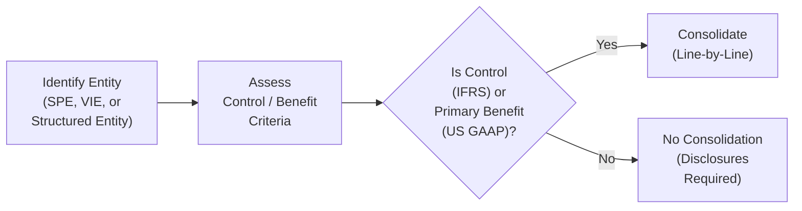

## Introduction

When I first encountered Variable Interest Entities (VIEs) as a junior analyst—some years ago—my immediate reaction was, “Wait, why do these special entities have all these weird off-balance-sheet complexities?” I remember reading footnotes of certain companies that had these quirky “structured” vehicles, trying to figure out if it all belonged in the consolidated financial statements or not. If you’ve ever peeked at a real estate developer’s financial statements or large banking disclosures, you’ve probably seen references to “special purpose” or “structured entities” that exist for some distinct, pre-defined purpose. The million-dollar question for any analyst—and what will show up in a major way on the CFA Level II exam—is whether these cleverly designed entities belong on a sponsoring company’s balance sheet.

In this section, we’ll walk through the key policies for consolidating Special Purpose Entities (SPEs) and VIEs under both US GAAP and IFRS, and we’ll do it in a way that hopefully feels a bit like a friend explaining a tricky concept. We’ll also dig into how consolidation can drastically alter financial ratios (like debt-to-equity) and how to spot potential off-balance-sheet risk that might lurk in the footnotes. Understanding these details makes you a stronger analyst and helps you avoid being blindsided by hidden leverage.

## Overview of SPEs and VIEs

Before jumping into consolidation policies, let’s briefly ensure we have our definitions straight:

• Special Purpose Entities (SPEs): These are entities created for a very narrow or specialized objective—think securitizing a pool of receivables, housing a lease arrangement, or isolating financial risk from the sponsor.  
• Variable Interest Entities (VIEs): Under US GAAP, a VIE is generally an entity where the equity at risk is insufficient to finance its activities without additional support or the equity investors lack the usual characteristics that define ownership (e.g., voting rights or obligations to absorb losses).

The reason we pay so much attention to SPEs and VIEs is that they can shift large chunks of assets or debt off a sponsor’s balance sheet—at least until you figure out whether consolidation triggers are met. Both IFRS and US GAAP have frameworks to address these issues, but the approaches differ slightly in terminology and emphasis.

## US GAAP Approach: ASC 810 and the Primary Beneficiary

Under US GAAP, consolidation for VIEs is governed primarily by ASC 810. The first question you ask is whether you’re dealing with a VIE. Let’s break down the criteria:

1. The entity (SPE) might not have sufficient equity investment at risk to operate independently, or  
2. The equity investors don’t control the entity’s activities in the typical way equity owners do (e.g., limited voting rights or inability to direct operations), or  
3. The equity investors are not exposed to all the potential gains or losses in the normal equity holder sense.

If any of those conditions apply, you’re probably dealing with a VIE. Next, you must identify the primary beneficiary: the party who has (1) the power to direct activities that significantly affect the economic performance of the VIE, and (2) an obligation to absorb losses or a right to receive benefits that could be significant. Whoever is the primary beneficiary consolidates the entity by combining all of its assets, liabilities, revenues, and expenses into a single set of financial statements, effectively “line-by-line.”

### Steps Under US GAAP

1. Determine whether the entity is a VIE:  
   – Check equity sufficiency and the nature of voting or decision-making rights.  
   – Assess risk distribution (who’s absorbing losses or receiving returns?).  

2. Identify the primary beneficiary:  
   – "Power criterion": Who has the power to make key decisions affecting the entity?  
   – "Losses/benefits criterion": Who stands to gain or lose the most based on results?

3. Consolidate if you’re the primary beneficiary:  
   – Bring in 100% of the VIE’s assets, liabilities, revenues, and expenses into your financial statements.  
   – Recognize any non-controlling interest in the equity section if other parties also have a stake.  
   – Provide robust disclosures about the nature, purpose, size, and risks of these entities.

4. Disclosure:  
   – Document your decision process: why you concluded it’s a VIE, how you determined who the primary beneficiary is, and how you measure the consolidated amounts.  
   – Offer a thorough footnote explaining the relationship, any potential guarantees, or other risk exposures.

#### Quick Example

Suppose a major bank sets up a separate entity to securitize mortgage loans. The entity issues asset-backed securities to outside investors. The bank then guarantees certain aspects of the credit default risk. Even though the bank might not own the majority of voting shares, it’s on the hook for losses and retains significant decision-making authority about how mortgages are managed. Hence, it’s likely the bank is the primary beneficiary and must consolidate this mortgage-securitization vehicle under US GAAP.

## IFRS Approach: IFRS 10 and Structured Entities

IFRS has its own approach under IFRS 10 (Consolidated Financial Statements). It focuses heavily on whether an investor has “control” over the investee. IFRS sets out three major components to define control:

1. Power over the investee (i.e., the investor can direct the relevant activities).  
2. Exposure (or rights) to variable returns from its involvement with the investee.  
3. The ability to use that power to affect those returns.

For entities that are specifically designed to serve a narrow objective—called structured entities under IFRS—the analysis is quite similar to the VIE determination in US GAAP. IFRS is basically asking: “Who really calls the shots here, and who bears the risk?” If you can answer that with one particular investor or sponsor, that sponsor likely needs to consolidate.

### IFRS vs. US GAAP: Control vs. Primary Beneficiary

The essence is very similar, but the IFRS approach is a bit more principles-based. Instead of the US GAAP concept of “primary beneficiary,” IFRS asks whether you effectively have “power” and “variable returns,” which is conceptually parallel. If you do, you must consolidate. IFRS 12 then kicks in to require additional disclosures to help financial statement users gauge the nature and extent of a firm’s interests in these structured entities.

#### Quick Example

Imagine a real estate development company under IFRS that sets up a partnership with outside investors to build a new property. The developer invests only 20% of the equity, but arranges the financing, oversees construction, and has the first right to majority of the returns beyond a certain threshold. IFRS 10 would conclude that the developer has control because it directs relevant activities (construction and financing decisions) and is exposed to variable returns (profits when the project finishes). So the developer must consolidate the partnership’s balance sheet and income statement into its own.

## Consolidation vs. Non-Consolidation: What Changes?

One of the biggest questions in analysis is: how does the sponsor’s financial profile change when they consolidate? And what if they choose (correctly or incorrectly) not to consolidate?

### If You Consolidate

• Balance Sheet Impact: The sponsor must add in all of the SPE’s or VIE’s assets and liabilities. That can significantly increase total assets, total debt, and possibly intangible assets or goodwill (depending on the design of the entity).  
• Income Statement Impact: Revenues and expenses of the VIE become part of the sponsor’s consolidated results, boosting top line and expense items. Profits might look higher or lower depending on the VIE’s performance. Intercompany transactions are eliminated, so if the sponsor sells something to the VIE, that’s removed from the consolidated view.  
• Ratios: Debt-to-equity often jumps. Return on assets (ROA) and return on equity (ROE) might shift. You might see certain leverage or liquidity ratios get skewed if you ignore the footnotes.  

### If You Don’t Consolidate

• Off-Balance-Sheet Treatment: The sponsor reports only its direct investment in (or loan to) the entity. The rest of the VIE’s liabilities remain off the sponsor’s books, potentially masking leverage.  
• Potential Risk Concealment: If you’re not carefully reading disclosures, you might not see the full extent of risk (e.g., sponsor’s guarantee of the entity’s debt, or obligations to absorb losses).  
• Footnotes: Typically, IFRS and US GAAP still require you to disclose the nature of involvement, maximum exposure to losses, or any forms of continuing involvement with the entity.

## The Disclosure Factor

Under both IFRS and US GAAP, the need for robust disclosures has grown significantly post-financial crisis. Some companies might not consolidate a structured entity, but that doesn’t mean the story ends there. They must disclose:

• The judgments and assumptions used in deciding not to consolidate.  
• The potential exposure to losses, such as guarantees or performance obligations.  
• The nature and purpose of the structured entity or VIE.  

Analysts should always read these disclosures carefully. If you find a footnote mentioning that a sponsor “guarantees” the debt of an entity, or that it will “absorb losses up to $1 billion,” that’s a major risk factor. Even if the entity doesn’t appear on the balance sheet, the sponsor might still be “on the hook.”

## Best Practices, Pitfalls, and Strategies for Analysts

1. Read Every Footnote: Yes, footnotes can be long and sometimes boring, but that’s typically where the gold is. Look for commentary on unconsolidated entities, risk exposures, and any mention of “structured transactions.”  
2. Look for Guarantees: Summaries of maximum exposure to loss, or lines referencing indemnities or recourse obligations, often indicate a real economic relationship that might not be fully captured on the balance sheet.  
3. Evaluate Impact on Ratios: If a significant VIE is consolidated, recalculate key metrics. For instance, see how the debt-to-equity ratio changes if the VIE’s liabilities are added vs. if it’s off the books. Your viewpoint on the company’s leverage or liquidity might shift meaningfully once you incorporate those numbers.  
4. Compare IFRS vs. US GAAP Disclosures: If you’re analyzing an international company that reports under IFRS vs. a domestic company under US GAAP, the specific procedures differ. However, in practice, the outcome is often quite similar—whoever controls or primarily benefits from the entity typically ends up consolidating.

## Visualizing the Consolidation Decision Process

Below is a simplified flow diagram illustrating how a sponsor firm might decide whether to consolidate an entity under either IFRS or US GAAP. While the details differ, the overarching logic is comparable.

• Step A: Establish that you have a special entity with potential off-balance-sheet nature.  
• Step B: Investigate the criteria, focusing on decision-making power, benefit, or exposure to risk.  
• Step C: Conclude if you meet the threshold for control (IFRS) or are the primary beneficiary (US GAAP).  
• Step D: If yes, you consolidate.  
• Step E: If no, you don’t, but you still provide thorough disclosures.

## Real-World Illustration: Sample Footnote

Here’s a hypothetical footnote that might appear in a set of consolidated financial statements:

“Our Company has one VIE, structured as a financing partnership to securitize accounts receivable. The Company provides credit enhancements and has decision-making authority over the securitization process. We are thus the primary beneficiary. Accordingly, we consolidate 100% of this entity’s assets ($500 million) and liabilities ($450 million). The VIE’s creditors have no recourse against our Company’s other assets. We eliminated $50 million of intercompany receivables in consolidation.”

As an analyst, you’d find that extremely helpful. You’d see the size of the consolidated assets and liabilities added to the sponsor’s balance sheet, as well as some info on the recourse situation.

## Industry Perspectives

Certain industries tend to have more widespread usage of SPEs or VIEs:

• Financial Services: Banks often securitize mortgages or credit card receivables.  
• Real Estate: Developers create partnerships or joint ventures for property development.  
• Energy: In some big projects, SPEs might be set up to finance large capital outlays (like a pipeline or power plant).  
• Leasing: Entities established to house leased assets and manage financing can often be VIEs.

When you come across these industries, a small tip is to pay extra attention to structured vehicles. A lot of the time, the entire success of the sponsor can hinge upon the performance or risk-laden structure of these off-balance-sheet activities.

## Practical Example: Ratio Analysis

Imagine a scenario where a company sponsors a VIE that holds $100 million in assets, financed by $90 million of debt and $10 million of equity contributed by outside investors. The sponsor meets the US GAAP primary beneficiary criteria and consolidates the VIE’s finances. Let’s see the effect on the sponsor’s key ratio, debt-to-equity (D/E), under two scenarios.

• Sponsor’s standalone D/E ratio (pre-consolidation): 1.5×, with $300 million total debt, $200 million equity.  

• Post-consolidation D/E ratio:  
  – New total debt = $300 million + $90 million = $390 million  
  – New total equity = $200 million + $10 million (non-controlling interest) = $210 million  
  – D/E ratio = $390 / $210 ≈ 1.86×

That’s a noticeable jump in measured leverage—potentially concerning to lenders or credit analysts. If the sponsor didn’t consolidate, the ratio would remain 1.5×, so you can see why the consolidation decision is so important to an analyst. Always keep an eye out for how these changes might mask (or reveal) the real economic exposure.

## Conclusion

Ultimately, the impetus behind consolidation policies for SPEs and VIEs is straightforward: accounting standards aim to reflect economic reality over mere legal form. If a sponsor effectively controls an entity or is the one really “on the hook” for the majority of risks and rewards, that sponsor should bring the entity on its balance sheet. It’s that simple. The technical rules can get intricate, and many real-world complexities show up in footnotes with disclaimers or nuanced structures—but that’s precisely why it’s important to master these concepts for the CFA Level II exam.

Remember, from an analyst’s perspective, our job is to see behind the formality of legal structures to the underlying economic reality. If you see large undisclosed or lightly mentioned entities in the footnotes, dig deeper. Understand who truly benefits, who shoulders the risks, and how significantly it affects the sponsor’s financial statements. Armed with this knowledge, you’ll spot hidden exposures that might not show up in conventional ratio analysis. That, in turn, can shape your valuation, risk assessment, and overall opinion of the company.

-----

## Test Your Knowledge: Consolidation and VIE Policies Quiz



### Which of the following is the primary determinant under US GAAP for consolidating a VIE?

- [ ] Having more than 50% of the voting shares.  
- [ ] Having a significant portion of the equity ownership.  
- [x] Being identified as the primary beneficiary who has power to direct significant activities and absorbs majority of the losses/benefits.  
- [ ] Having a contractual arrangement to lease assets from the VIE.  

> **Explanation:** Under ASC 810, it’s not about strict voting share control but rather identifying the “primary beneficiary,” which hinges on power over activities and significant exposure to losses or benefits.

### In IFRS, an investor is required to consolidate an investee when:

- [ ] The investor is the sole equity owner.  
- [x] The investor controls the investee by having power, variable returns, and the ability to affect those returns.  
- [ ] The investor has provided more than 50% of the funding.  
- [ ] The investor has a separate reporting agreement with the investee.  

> **Explanation:** IFRS 10 requires consolidation if the investor has control, typically evidenced by power over the investee, exposure to variable returns, and the ability to use that power to affect the returns.

### Which of the following best describes the impact of consolidating a VIE on a sponsor’s financial ratios?

- [x] Consolidation can increase total reported debt and change leverage measures significantly.  
- [ ] Consolidation rarely changes the sponsor’s overall financial profile.  
- [ ] Consolidation must always improve profitability metrics.  
- [ ] Consolidation typically eliminates any disclosure requirements.  

> **Explanation:** When consolidating, the sponsor must bring the VIE’s debts and assets onto its own balance sheet. This often increases reported debt and can substantially affect leverage and liquidity ratios.

### Where are off-balance-sheet obligations typically disclosed when a sponsor does not consolidate a VIE under IFRS or US GAAP?

- [ ] They are not disclosed.  
- [ ] They appear in the equity section of the balance sheet.  
- [x] They are disclosed in the footnotes, along with potential obligations/risks.  
- [ ] They are included as an extraordinary item on the income statement.  

> **Explanation:** Both IFRS and US GAAP mandate thorough footnote disclosures for unconsolidated VIEs, including the nature of involvement and potential risk exposures.

### Which statement correctly compares IFRS 10 and US GAAP ASC 810 regarding consolidation?

- [ ] IFRS 10 requires voting control, whereas US GAAP focuses on contract-based control.  
- [x] Both focus on the concept of who actually controls (IFRS) or is the primary beneficiary (US GAAP), though the terminology differs.  
- [ ] US GAAP never requires consolidation for VIEs unless the sponsor has >50% voting rights.  
- [ ] IFRS 10 does not allow for disclosure in lieu of consolidation.  

> **Explanation:** Both GAAP and IFRS revolve around identifying who really has power over the entity’s relevant activities. They differ somewhat in terminology: IFRS sets out “control,” while US GAAP uses the “primary beneficiary” concept.

### An example of an entity likely classified as a VIE under US GAAP is one where:

- [x] Equity investors do not have the ability to make key operating decisions and the entity has insufficient equity at risk.  
- [ ] The entity holds a wide range of voting rights among diverse shareholders.  
- [ ] The sponsor is an equal 50-50 partner with complete voting control.  
- [ ] The entity has no debt financing.  

> **Explanation:** A VIE often lacks the normal equity structure or decision-making power among equity holders, with insufficient equity to finance operations independently.

### Why might a sponsor prefer to avoid consolidating a VIE?

- [x] To keep certain debt or liabilities off its balance sheet, potentially improving profitability and leverage ratios.  
- [ ] To avoid paying taxes.  
- [x] To reduce volatility in reported earnings.  
- [ ] To comply with IFRS 10’s requirements automatically.  

> **Explanation:** Sponsors sometimes prefer non-consolidation for aesthetic ratio and performance presentation. However, if they are indeed the primary beneficiary (US GAAP) or have control (IFRS), they must consolidate regardless of preference.

### IFRS 12 requires an entity to provide which type of disclosures regarding its involvement with structured entities?

- [ ] No disclosures unless there is a loss.  
- [ ] Only the level of equity investment.  
- [ ] A summary of share price movements of the structured entity.  
- [x] The nature, extent, and financial effects of the entity’s involvement, including risks and exposures.  

> **Explanation:** IFRS 12 expands the disclosure requirements to ensure users understand the nature of interests in structured entities, the associated risks, and potential impacts on the investor’s financial statements.

### An SPE established for the purpose of securitizing receivables will likely be consolidated under US GAAP if:

- [ ] It is formed in a tax haven.  
- [ ] It issues stock to the sponsor.  
- [x] The sponsor has the power to direct significant activities and absorbs a majority of its risks or benefits.  
- [ ] The sponsor is a minority investor in the SPE.  

> **Explanation:** Even if the sponsor owns little or none of the equity, if it meets the “primary beneficiary” criteria, the SPE must be consolidated.

### Under US GAAP, variable interest entities were introduced primarily to:

- [x] Prevent off-balance-sheet financing by requiring consolidation of entities with insufficient equity or unusual control structures.  
- [ ] Provide a safe harbor for companies to keep risk exposures off the balance sheet.  
- [ ] Allow for more creative accounting methods.  
- [ ] Align with IFRS exactly.  

> **Explanation:** VIE rules aim to prevent companies from hiding liabilities or assets through special vehicles that they effectively control or guarantee.



-----

**References and Further Reading**  
• [ASC 810 (Sections on Consolidation Procedures)](https://www.fasb.org/)  
• [IFRS 10 Application Examples](https://www.ifrs.org/issued-standards/list-of-standards/ifrs-10-consolidated-financial-statements/)  
• Deloitte’s “A Roadmap to Consolidation – Identifying a Controlling Financial Interest”  

As you push forward in your CFA journey, keep practicing how to spot off-balance-sheet exposures and hidden liabilities. A well-trained eye can catch little details that signal big implications for a company’s financial health. That’s precisely the skill examiners (and future employers) love to see!
