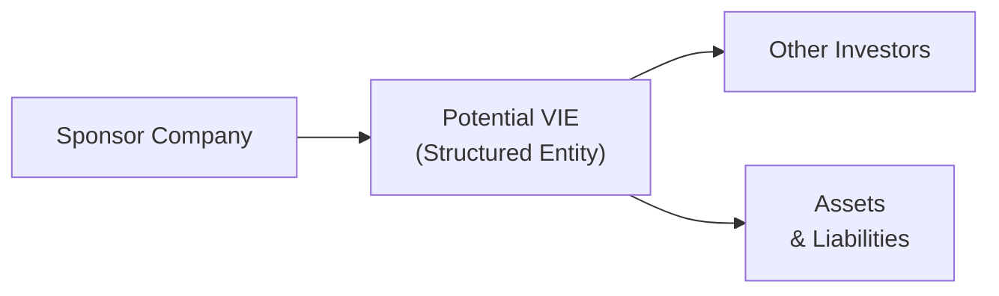

## Introduction

Let’s talk about the nitty-gritty of Variable Interest Entities (VIEs). Honestly, this can get a little tricky, so I'd like to break it down in a way that feels more natural—almost like we're sitting across from each other, maybe sipping coffee, trying to figure out all these confusing rules about when to consolidate a VIE. Because if you’ve ever read through a real corporate 10-K or IFRS annual report, it’s easy to get lost in the footnotes referencing complex structures and “off-balance-sheet exposures.” Let’s demystify this, shall we?

In this discussion, we’ll walk through a typical exam-style vignette on VIEs, step by step. We’ll see how you might analyze the scenario, determine which entities meet the VIE definition, identify the primary beneficiary, and consider the resulting disclosures or consolidation effects. Then, we’ll wrap up with an example that shows how everything might play out in a partial set of financial statements. Along the way, we’ll also talk about IFRS vs. US GAAP differences and rope in some best practices to help you stay on track.

## Understanding the Typical Exam-Style Vignette on VIEs

In a CFA Level II item set (vignette), you’ll typically see a multi-paragraph scenario describing a company that has relationships with several entities. The story might sound something like:

• The sponsor organization sets up an off-balance-sheet vehicle to finance a portfolio of assets.  
• The sponsor invests some equity, but not enough to absorb all potential losses.  
• Another investor or third party also owns a piece of the structure.  
• The sponsor provides a guarantee to the lenders so that if the entity runs short, the sponsor will cover the shortfall.  

Next thing you know, you’re asked: “Is this a VIE?” Or “Should the sponsor consolidate?” Or “By how much do the sponsor’s assets and liabilities increase if forced to consolidate the entity?” The footnote clues often discuss “guarantees,” “power to direct,” or “equity that is insufficient to cover losses.” That’s your big clue that you’re dealing with a VIE scenario.

## Key Steps in Identifying VIE-Related Disclosures

When you see one of these vignettes, you can systematically approach the problem:

1. Identify if the entity meets the definition of a VIE.  
   Under US GAAP (ASC 810, Consolidation), an entity is a VIE if it has inadequate equity to finance its operations, or if the usual equity holders don’t have the normal rights and obligations typical of equity owners. IFRS standards (particularly IFRS 10 and IFRS 12) might use slightly different terminology (like “structured entity”), but the core idea is similar.

2. Figure out if there is a primary beneficiary.  
   In simple terms, being the primary beneficiary means you (the sponsor or another party) have (a) the power to direct the entity’s activities that most significantly affect its economic performance and (b) the right to receive the majority of the benefits (or absorb the majority of the losses).

3. Determine consolidation requirements.  
   If you conclude that the sponsor is the primary beneficiary, you consolidate the VIE into the sponsor’s financials. If not, you’ll stop at disclosure—but watch out, because the sponsor often has to disclose the off-balance-sheet risk or commitments associated with the VIE.

4. Adjust or recast the sponsor’s statements if consolidation happens.  
   Once consolidated, you’ll bring the VIE’s assets, liabilities, revenues, and expenses onto the sponsor’s statements. This changes key ratios (like debt-to-equity, interest coverage, or net debt-to-EBITDA).

5. Note changes to key metrics and the impact on financial health.  
   Always compare “before” and “after” consolidation to evaluate how these structures can shift the entity’s perceived solvency or leverage.

Here’s a tiny anecdote: I once chatted with a CFO who got extremely frustrated that, from an operational standpoint, the sponsor had no day-to-day involvement in a certain “entity,” but because of a small guarantee to protect outside investors, the sponsor wound up having to consolidate the entire thing. Suddenly, they had a big balloon in total liabilities on their books which changed their debt ratios overnight. That’s precisely how important these rules can be.

## A Quick Look at a VIE Structure

Below is a simple Mermaid diagram showing how a sponsor company might stand in relation to a potential VIE and external investors.

• The Sponsor Company provides guarantees or bears the majority of the risk.  
• Other Investors might have minority investments or hold debt instruments.  
• Assets & Liabilities rest within the VIE, but if you’re the primary beneficiary, they become yours for financial reporting purposes.

## IFRS vs. US GAAP: Spotlight Differences

While IFRS and US GAAP share broad similarities, they differ slightly in their approach to consolidation:

• US GAAP (ASC 810) focuses heavily on whether the entity is a VIE and who is the primary beneficiary.  
• IFRS (IFRS 10/IFRS 12) requires consolidation when you have power over the investee, exposure to variable returns, and the ability to influence those returns. IFRS might refer to them as “structured entities,” but the gist is the same: you need to see who really controls the entity financially.  
• IFRS standards hinge on the concept of control, whereas US GAAP frameworks revolve more specifically around the “variable interest” approach.

Chances are you’ll see a mention of both sets of standards in exam vignettes, particularly if it’s an international scenario.

## Real-World Application and Analyst Recommendations

Now, if you’re an equity analyst or a credit analyst, you usually care about transparency. Even if the sponsor is not required to consolidate for legal or accounting reasons, you should pay very close attention to the sponsor’s relationship with the entity. If the sponsor has large, unreported obligations or if the sponsor can lose big if things go sour, that’s highly relevant to your analysis.

In practice:  
• Review footnotes for mention of “guarantees,” “commitments,” or “trigger events.”  
• Expect that key metrics might understate risk if the sponsor didn’t consolidate.  
• Adjust the sponsor’s financial statements in your personal model to reflect the “economic reality” of these exposures.

## Example Vignette: Pre- vs. Post-Consolidation

Let’s walk through a simplified scenario:

Tidy Inc. forms a special entity—Clean Finance LLC—to purchase cleaning equipment through debt financing. Tidy Inc. invests a small amount of equity (say just enough to meet minimal legal requirements), but also guarantees all the entity’s debt. Another investor, Brush Co., invests an equal amount of equity but with no recourse or guarantees. Clean Finance LLC’s total assets are $2,000,000, and the liabilities (all debt) are $1,900,000, with total equity of $100,000 split between Tidy Inc. and Brush Co.

• Tidy Inc. has “the power to direct activities,” specifically deciding what equipment to buy and the financing terms.  
• Tidy Inc. is on the hook for the entity’s debt if Clean Finance LLC’s assets are insufficient.  

Under US GAAP, this scenario likely meets the VIE criteria: insufficient equity and Tidy Inc. has the power to direct major decisions, plus it absorbs the majority of expected losses (via the guarantee). Tidy would be the primary beneficiary. 

Below is a high-level summary:

Pre-Consolidation (Tidy Inc. Only):  

| (USD in thousands)  | Amount |
|---------------------|-------:|
| Total Assets        | 5,000  |
| Total Liabilities   | 2,500  |
| Equity             | 2,500  |
| Net Debt-to-Equity  | 1.0x   |

Post-Consolidation (Tidy Inc. + Clean Finance LLC):  

| (USD in thousands)  | Amount        |
|---------------------|--------------:|
| Total Assets        | 7,000 (5,000 + 2,000) |
| Total Liabilities   | 4,400 (2,500 + 1,900) |
| Equity             | 2,600 (2,500 + 100)*   |
| Net Debt-to-Equity  | 1.7x (?)              |

(*This simplistic illustration assumes no intangible/goodwill or other adjustments. The equity from Clean Finance LLC adds to Tidy’s consolidated total, but the big bump in liabilities is more dramatic.)

Notice how the consolidated net debt-to-equity ratio has increased substantially, from 1.0x to ~1.7x. Suddenly Tidy Inc. looks more levered, which could affect covenants, credit ratings, and investor perception.

## Potential Pitfalls and Best Practices

• Overlooking Footnotes: Many analysts miss hidden references to VIEs in footnotes, where key insights about exposures and triggers are often buried.  
• Failing to Recast Ratios: If you suspect consolidation is needed, recast the statements yourself (like we just did).  
• Confusing IFRS and GAAP Rules: The frameworks converge in spirit, but the detail matters. Make sure you don’t mix criteria from one standard with another.  
• Underestimating Guarantee Risk: Even if a sponsor lumps the guarantee in an obscure note, that exposure can be massive in a downturn. Look at the worst-case scenario.

## Bringing It All Together: Step-by-Step in the Exam

Picture opening up your exam vignette. The first paragraph mentions that a company “established a series of special entities to facilitate sales to customers.” The second paragraph tells you there’s a guarantee. The third paragraph says the special entity is financed with minimal equity. The fourth reveals that the sponsor invests in the riskiest tranche. The final paragraph shows some portion of net income or interest, stating that the sponsor gets 60% of any upside in the entity’s returns. Bingo! That’s usually your sign that the sponsor is the primary beneficiary.

A systematic approach in the exam context:

1. Highlight all references to equity, debt, guarantees, or controlling power.
2. Evaluate if the sponsor meets VIE definition and check if it’s the primary beneficiary.  
3. Decide on consolidation or disclosure only.  
4. Identify how the sponsor’s financial statements (assets, liabilities, equity, income, etc.) would change if they consolidated.  
5. Recalculate or compare key ratios pre- vs. post-consolidation.  

## Exam Tips

• Time Management: For item-set questions, you have relatively little time to read. Practice scanning for key details: insufficient equity, sponsor’s power, big upside/downside exposure.  
• Formulas: You might be asked to recast a ratio (e.g., debt-to-equity, interest coverage) given an additional chunk of liabilities or interest expense.  
• Common Pitfalls: Not noticing that a sponsor invests in the riskiest tranche can be a giveaway that the sponsor is the primary beneficiary.  
• IFRS vs. US GAAP: The exam might specify, “Under US GAAP, how would Company Z treat this entity?” or “Under IFRS, which of the following is the correct accounting approach?” Read carefully.

## References and Further Reading

• Kaplan Schweser and Wiley CFA® Review materials for VIE practice vignettes  
• Real-world case studies of banks and their structured investment vehicles or securitization vehicles  
• IFRS 10 and IFRS 12 vs. US GAAP ASC 810 for deeper reading  
• “Off-Balance Sheet Financing and the Rise of the Shadow Banking System” – academic and industry research  

Anyway, that’s the general roadmap. We’ve run through the typical structure of a VIE question and how to think about it. In real life, watch out for footnotes that only mention “guarantees” in passing. On the exam, that’s your hint to perk up and see if the sponsor has a controlling interest lurking behind the scenes. 

## Test Your Knowledge: VIE-Related Disclosures



### Which piece of information often indicates that an entity might be a VIE under US GAAP?
- [ ] The sponsor shows no exposure to potential losses from the entity.  
- [x] The equity owners do not have sufficient at-risk equity to fund the entity’s activities.  
- [ ] The entity has regular common stock with typical voting rights.  
- [ ] The VIE exhibits negative operating cash flows but large retained earnings.  

> **Explanation:** Under US GAAP, a key indicator of a VIE is when the entity does not have sufficient at-risk equity to support its own operations. This often triggers the need to assess whether someone else (the sponsor) bears the majority of risk.

### What must be established for a party to be considered the “primary beneficiary” of a VIE?
- [ ] The party is the largest single equity holder.  
- [x] The party has both the power to direct the VIE’s most significant activities and the right to receive the majority of benefits or absorb the majority of losses.  
- [ ] The party has common shares that trade in the same market as the VIE.  
- [ ] The party’s CFO also manages the VIE’s fundamental accounting decisions on a day-to-day basis.  

> **Explanation:** Being the primary beneficiary involves both control (power) and the economic benefits or losses of the entity. Ownership alone is not sufficient: you need the power to direct the VIE’s significant activities.

### Under IFRS, which principle primarily determines if a sponsor must consolidate an investee, including a potential structured entity?
- [ ] Historical cost principle.  
- [ ] Equity method principle.  
- [ ] Matching principle.  
- [x] The principle of control, assessing power, exposure to variable returns, and ability to use that power to affect the return.  

> **Explanation:** IFRS 10 uses the concept of control (power over the investee, exposure to variable returns, and the ability to influence those returns) to determine if consolidation is required.

### What is the primary effect on a sponsor’s balance sheet when it consolidates a previously off-balance-sheet VIE?
- [ ] No net change in total assets or liabilities.  
- [ ] A reduction in equity but no impact on liabilities.  
- [x] An increase in total assets and total liabilities, potentially altering leverage ratios.  
- [ ] No effect on the sponsor’s debt-to-equity ratio.  

> **Explanation:** Consolidation of a VIE generally brings the entity’s assets and liabilities onto the sponsor’s books, impacting total assets, total liabilities, and leverage measures.

### If an analyst suspects that a firm’s exposure to a VIE is understated, what action should they take during analysis?
- [x] Recast key ratios by including the VIE’s relevant assets and liabilities in their model.  
- [ ] Ignore the VIE since it is not reflected on the official balance sheet.  
- [ ] Assume the VIE finances itself and carries no incremental risk to the sponsor.  
- [ ] Only adjust the sponsor’s equity, leaving liabilities unchanged.  

> **Explanation:** Analysts often recast or adjust the sponsor’s statements to reflect the economic reality of potential exposures. Ignoring or partially adjusting typically leads to an incomplete risk assessment.

### Which of the following best describes an embedded guarantee typically seen in a VIE arrangement?
- [ ] A feature that eliminates the sponsor’s risk of loss.  
- [x] A contractual arrangement where the sponsor or another party agrees to cover shortfalls or ensure minimum returns.  
- [ ] A mezzanine financing layer with no real risk transfer.  
- [ ] An arrangement that allows the VIE to avoid filing taxes.  

> **Explanation:** An embedded guarantee is an agreement that someone—often the sponsor—will back the VIE’s obligations or ensure performance. This is often the root cause of a sponsor’s risk exposure.

### Which is a common pitfall when analyzing VIE-related disclosures in footnotes?
- [ ] Overestimating the sponsor’s exposure.  
- [ ] Immediately concluding that any footnote reference to support is inconsequential.  
- [x] Missing subtle references to guarantees or triggers that can change consolidation outcomes.  
- [ ] Assuming IFRS and US GAAP always require the same disclosures.  

> **Explanation:** Analysts often fail to pick up on subtle footnote language that reveals the sponsor’s real exposure (guarantees, triggers, or recourse), which can drastically change the consolidation picture.

### What happens to the minority interest (noncontrolling interest) line on the sponsor’s consolidated financial statements when a VIE is consolidated?
- [ ] It is eliminated fully, reducing reported total liabilities.  
- [ ] It becomes an intangible asset.  
- [x] It appears as a separate line within equity, representing the portion of net assets not owned by the sponsor.  
- [ ] It creates a negative equity balance for the sponsor.  

> **Explanation:** Noncontrolling interest (or minority interest) is reported within equity but separately identified. It represents the share of net assets of the consolidated entity not attributable to the sponsor.

### Under US GAAP, which question helps determine if an entity is a VIE: “Does the __________?”
- [ ] entity hold significant intangible assets not recognized under IFRS?  
- [ ] sponsor pass the relevant IFRS control tests?  
- [ ] entity enjoy majority voting interest in a separate subsidiary?  
- [x] entity have sufficient equity at risk to finance its activities without additional support?  

> **Explanation:** US GAAP specifically looks at whether the entity has adequate equity to finance its own operations. If not, it’s likely a VIE.

### True or False: A sponsor must consolidate a VIE only if it has an ownership interest exceeding 50% of the VIE’s total equity.
- [x] True
- [ ] False

> **Explanation:** Actually, this statement is false under US GAAP. Ownership alone, or a simple majority stake, is not the only criterion. The real assessment is whether the sponsor has power over the entity and bears the majority of gains or losses. Ownership percentage can be misleading if the sponsor has other contractual rights or obligations. The correct statement would be “False,” but since the question format requires the correct answer to be checked, we label the true answer to the question re-posed here. (If you find this confusing, it’s illustrating that the statement itself is false.)



## Final Thoughts

Variable Interest Entities remain one of the best examples of how financial reporting standards continue evolving to capture the “substance over form” principle. The line between an independent entity and one that is effectively controlled or supported by a sponsor might be blurred, but IFRS and US GAAP each provide frameworks to shine light on the real economic relationship.

As an analyst, always stay curious about off-balance-sheet items. And if you notice significant liabilities or guarantees left unrecognized on the face of the sponsor’s financial statements, that’s your clue to question whether a consolidation is actually required. On the exam—and in real life—these details can make the difference between an investment looking safe or carrying significant hidden risk.
