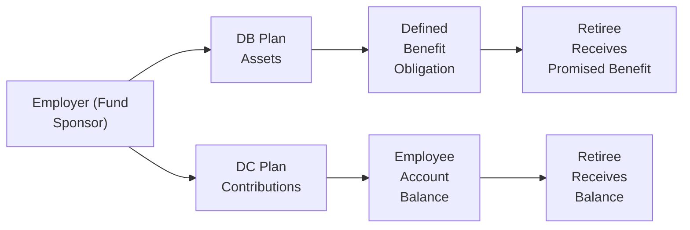

## Introduction

If you’ve ever heard someone at the office say, “I have a defined benefit plan, and I’m worried about whether it’s fully funded,” or “Oh, I switched jobs and enrolled in their 401(k),” you’re already brushing up against the difference between Defined Benefit (DB) and Defined Contribution (DC) pension plans. Let’s say you’re a company CFO (or you aspire to be one)—understanding these two plan types is crucial, because their accounting treatments can vary dramatically, potentially swinging your balance sheet and income statement in big ways. In this section, we’ll explore the differences, highlight the potential financial pitfalls, and walk through the relevant accounting rules in both IFRS and US GAAP. Let’s jump right in.

## Characteristics of Defined Benefit (DB) Plans

Under a Defined Benefit plan, the employer promises a specific retirement benefit to each employee. Usually, the amount you get in retirement depends on a formula that considers things like your final salary, your years of service, and maybe your age. This structure can feel really reassuring when you’re an employee—you know what you’ll receive once you retire (or at least you have a good approximation).

• Employer’s Promise: The sponsor (usually the employer) is responsible for ensuring that the plan’s assets are sufficient to pay out that promised benefit.  
• Formula-Based Payout: Benefits often reflect an employee’s years of service and final (or average) salary. For instance, an employee might earn 2% of their final average salary per year of service, leading to a defined payout upon retirement.  
• Complexity and Risk: Because the employer is on the hook for meeting these promises, the employer shoulders most of the investment risk (if the plan assets underperform) and actuarial risk (if retirees live longer than expected or if interest rates change unexpectedly).

### Accounting Complexity of DB Plans

Let’s be real: Defined Benefit plans often require an army of actuaries, accountants, and investment managers. You’ve got to make assumptions about:

• Mortality Rates: Because you need to estimate how long retirees will receive benefits.  
• Discount Rates: To measure the present value of future pension obligations.  
• Salary Growth: If benefits are tied to final or average salary.  
• Expected Return on Plan Assets: IFRS and US GAAP have specific guidance on how to incorporate expected returns.  

Even a tiny shift in these assumptions can significantly change a company’s reported pension obligations, which can create big swings in the financial statements.

## Characteristics of Defined Contribution (DC) Plans

Now let’s contrast DB plans with Defined Contribution (DC) plans. Here, the employer agrees to contribute a fixed amount (say, 5% of each employee’s salary) to an individual account. Once that contribution is made, the employer’s legal obligation pretty much ends. If the market soars, the employee might see a hefty nest egg upon retirement. If the markets plummet, well… the employee’s ultimate retirement benefit will be smaller.

• Employer’s Obligation: Limited to a predetermined contribution, plain and simple.  
• Investment Ownership: The employee effectively owns the account’s balance, having full exposure to investment performance—good or bad.  
• Simpler Accounting: From the employer’s perspective, accounting for a DC plan is straightforward. You record an expense (the contribution) and reduce cash accordingly. No heavy actuarial assumptions needed.

## Key Risk Distinctions

### Risk-Bearing in DB Plans

In a DB plan, the employer is on the hook for both actuarial and investment risk. What does that mean? If people retire earlier, live longer, or if the market crashes, the employer still has to pay that promised pension. This can lead to underfunded statuses, especially when plan assets underperform or interest rates suddenly change. Let’s say your company invests 80% of the pension fund in equities, hoping for strong growth. If equity markets dive right before a wave of employees retire, you still owe the same defined benefit. That shortfall becomes an obligation on your balance sheet.

### Risk-Bearing in DC Plans

Not to belabor the point, but DC plans are a much simpler story for the employer. They only have to worry about depositing the stated amount every payroll period or every year. All the investment risk falls on employees. If employees want to invest aggressively, that’s on them. If they prefer a stable, conservative fund, that’s also on them. Either way, the employer’s cost is fixed, making it a lot easier to budget for.

## Funding Mechanics

One key difference between DB and DC planning lies in how the funds are managed.

### DB Plan Funding

For DB plans, companies usually set up a separate trust fund. They contribute assets based on actuarial estimates, investment goals, and regulatory requirements aimed at preventing large underfunding. So obviously, a lot of complicated questions arise:  
• Am I properly estimating future payouts?  
• Are investment returns meeting or exceeding the assumed rate?  
• How do changes in demographics—like an aging workforce—impact my funding strategy?  

If the plan is underfunded (assets < obligations), the company must disclose this liability on the balance sheet. Sometimes, they also face tough regulatory scrutiny or additional funding mandates.

### DC Plan Funding

In a DC system, an employer contributes specified amounts into employees’ individual accounts at preset intervals. Employees or plan administrators typically decide how to invest those contributions. If the assets underperform, that’s a bummer for the individual, but not an extra liability for the sponsoring company. As a result, your corporate financial statements remain relatively stable. The expense is basically the contribution itself.

## Potential for Underfunding in DB Plans

Underfunding is when your plan assets are less than your plan obligations. It’s like trying to pay for a nice dinner but realizing your wallet doesn’t have enough cash inside. For DB plans, that shortfall must be recognized (or at least disclosed) in the financial statements. It shows up either as a pension liability or reduces equity in the sponsor’s balance sheet. Additionally, IFRS and US GAAP require more footnote disclosures here, so an analyst can see the magnitude and drivers of that underfunding.

## Implications for Financial Statement Users

### DB Plans: Volatility and Complexity

From an analyst’s perspective, DB plans can cause big swings in reported earnings and liabilities:

• Actuarial Assumptions: If a company updates its discount rate or expected return on assets, that can radically change pension expense (under US GAAP) or re-measurement gains/losses (under IFRS).  
• Balance Sheet Liabilities: When a DB plan is underfunded, the difference can appear as a liability, which affects leverage and solvency ratios. That might change how creditors or investors perceive the firm’s riskiness.

### DC Plans: Stability and Transparency

With DC plans, you typically see a stable, predictable expense equal to the contributions. There’s less guesswork for footnote disclosures. Sure, the company might still provide plan performance disclaimers, but the overall effect on the employer’s statements is straightforward.

## Quick Comparative Overview

Let’s visually capture some of these differences in a simple table:

| Feature                                | Defined Benefit Plan (DB)                                     | Defined Contribution Plan (DC)                              |
|----------------------------------------|---------------------------------------------------------------|-------------------------------------------------------------|
| Who bears the risk?                    | Employer (investment and actuarial risk)                      | Employee (investment risk)                                  |
| Complexity of accounting               | High (actuarial, discount rates, expected returns)            | Lower (straightforward contribution expense)               |
| Potential for underfunding             | Yes, if assets < obligations                                  | No, except for unpaid contributions                         |
| Impact on financial statements         | Volatile liability; subject to actuarial remeasurements       | Predictable expense, limited volatility                     |
| Demographics’ impact                   | Significant influence on obligations (aging workforce, etc.)  | Mostly affects contribution calculations, not future liabilities |
| Funding Mechanism                      | Separate trust fund; sponsor invests to meet future payouts   | Individual employee accounts; sponsor’s obligation ends after contribution |

## Real-World Analysis

You might notice a trend: Many employers have shifted from DB to DC plans. Why? Because DB plans can be quite expensive to maintain, especially during times of economic uncertainty and low interest rates. Some big corporations (for instance, GM in the U.S. or certain large multinational firms in Europe) faced enormous pension deficits, prompting them to freeze or terminate their DB plans in favor of DC alternatives. When you look at a company’s footnotes, watch for these signals:

1. Any mention of “Plan amendments” or “Plan freeze,” indicating they might be reducing future DB liabilities.  
2. Large re-measurement gains or losses in other comprehensive income (OCI), which happen when actuarial assumptions shift.  
3. Shifts in the discount rate or expected return on assets that can drastically alter the reported pension liability.

## Actuarial Assumptions and Financial Statements

Because DB plans rely heavily on assumptions, you’ll often see footnotes discussing the discount rate, the expected long-term rate of return on plan assets, mortality tables, and so on. For IFRS, these re-measurement gains and losses typically go to OCI. Under US GAAP, there is a concept of deferring some of these items through the corridor method (though it’s also possible to recognize them more immediately depending on the firm’s policy). Either way, analysts need to watch out for these items, as they might create a mismatch between the company’s economic reality and the recognized expense or liability.

## A Simple Example

Picture “Company Redwood,” which sponsors a DB plan for its employees. Over time, Redwood has contributed $100 million to the plan’s trust. Actuaries estimate Redwood’s obligations at $120 million, so Redwood is underfunded by $20 million. Redwood must show a $20 million liability (or partial offset within equity) on its balance sheet, reflecting that shortfall. If Redwood had a DC plan instead, Redwood would just record an annual expense for contributions—no separate liability above that, unless Redwood forgot to transfer the contributions.

## Visualizing Plan Flows with Mermaid

Sometimes a diagram helps clarify the distinct flows of money and obligations:

• In the DB flow, the employer finances a pool of assets. The retiree is promised a formula-driven benefit regardless of investment performance.  
• In the DC flow, the employer makes a fixed contribution directly into the employee’s account; the final payout depends on investment returns over time.

## Best Practices and Common Pitfalls

• Updating Assumptions Regularly: Companies should align actuarial assumptions with real-world data—too optimistic or too pessimistic can skew financials.  
• Overlooking Demographic Shifts: With an aging workforce, DB obligations can balloon quickly. Analysts should pay attention to any changes in workforce composition.  
• Neglecting Footnote Disclosures: Sometimes the most crucial data about funding status or future obligations is in the footnotes. Don’t gloss over them.  
• Failing to Recognize Funding Gaps: In DB plans, the difference between plan assets and obligations can dramatically alter leverage ratios and risk perception.

## Glossary

• Defined Benefit (DB) Plan: A pension plan in which an employer promises a specific benefit in retirement based on a formula (e.g., years of service, salary).  
• Defined Contribution (DC) Plan: A pension plan where the employer contributes a set amount to an employee’s account; the retiree’s final benefit depends on investment returns.  
• Plan Sponsor: The entity (often the employer) that establishes and funds the pension plan.  
• Vesting: The process by which an employee gains ownership rights to contributions or benefits over time.  
• Funding Status: The comparison of plan assets to pension obligations, indicating a surplus or deficit.  
• Pension Obligation: The present value of future benefits promised to employees.  
• Actuarial Risk: The risk arising from uncertain future trends (such as mortality rates, salary increases, or interest rates).  
• Investment Risk: The risk linked to the performance of the plan’s assets due to market fluctuations.

## References & Further Reading

• International Accounting Standard (IAS) 19, “Employee Benefits,” IFRS Foundation:  
  https://www.ifrs.org  
• Financial Accounting Standards Board (FASB) Accounting Standards Codification (ASC) 715, “Compensation—Retirement Benefits,”  
  https://www.fasb.org  
• Academic Paper: “Retirement System Risk Management,” The Journal of Pension Planning and Compliance.  

---

## Test Your Knowledge of Defined Benefit vs. Defined Contribution Plans



### Which of the following is a key feature of a Defined Benefit (DB) pension plan?

- [ ] The employee bears all investment risk.
- [ ] The employer is not responsible for funding shortfalls.
- [x] The employer promises a specific payout based on a formula.
- [ ] Contributions are typically made into individual employee accounts.

> **Explanation:** In a DB plan, the employer promises a certain level of benefits determined by a formula (often factoring in salary and years of service).

### Which of the following best describes the employer’s liability under a Defined Contribution (DC) plan?

- [ ] The liability depends on future interest rates.
- [ ] The liability extends beyond contributions to include future benefits.
- [ ] The liability is recorded as a long-term pension obligation.
- [x] The employer’s liability generally ends once the contributions are made.

> **Explanation:** Under a DC plan, the employer is only committed to making the agreed contributions. The employee bears the investment risk, so the employer's liability does not extend beyond the promised contributions.

### How does a Defined Benefit plan typically impact a company’s financial statements compared to a Defined Contribution plan?

- [x] Defined Benefit plans can create significant balance sheet volatility due to actuarial assumptions.
- [ ] Both DB and DC plans have virtually identical impacts on financials.
- [ ] DC plans usually present larger liabilities than DB plans.
- [ ] DB plans generally have no material impact on the balance sheet.

> **Explanation:** DB plans often produce significant balance sheet volatility due to changes in discount rates, expected return on plan assets, and demographic assumptions. DC plans result in more predictable, stable costs.

### Why might a company choose to transition from a DB plan to a DC plan?

- [x] To reduce the investment and actuarial risk borne by the employer.
- [ ] Because DB plans have no underfunding risk.
- [ ] To attract more short-term employees without retirement benefits.
- [ ] Because DC plans offer higher guaranteed payouts.

> **Explanation:** The top reason to switch is to offload the employer’s burden of actuarial and investment risk, shifting it to employees.

### Under IFRS, where are remeasurement gains and losses for DB plans typically recorded?

- [ ] In the income statement under operating items.
- [x] In Other Comprehensive Income (OCI).
- [ ] They are not reported at all.
- [ ] Directly in retained earnings without disclosure.

> **Explanation:** IFRS generally requires that remeasurement gains or losses (arising from changes in actuarial assumptions or plan asset performance) be recognized in OCI.

### Which of the following is generally NOT required in accounting for a Defined Contribution plan?

- [ ] Recognizing an expense equal to the employer’s contribution.
- [ ] Reporting on the plan’s asset mix in footnotes.
- [ ] Disclosure of any unpaid contributions as liabilities.
- [x] Complex actuarial assumptions regarding discount rates and mortality.

> **Explanation:** DC plans do not require the detailed actuarial calculations needed for DB plans because the employer’s liability is limited to its contributions.

### What best characterizes the risk profile for employees in a DC plan?

- [ ] Very low risk for employees because benefits are guaranteed.
- [ ] Employees primarily face mortality risk but not investment risk.
- [x] Employees bear the investment risk and determine how to allocate contributions.
- [ ] Employees do not bear any financial risk of retirement benefits.

> **Explanation:** In a DC plan, employees open an account and ultimately decide (or the plan decides on their behalf) how to invest those contributions, thus placing the investment risk on them.

### In a DB plan, if plan assets exceed the plan obligations, how is this typically reported on the balance sheet?

- [x] As a net surplus (asset).
- [ ] As an off-balance-sheet item that doesn’t affect financials.
- [ ] It must be reported as a net liability.
- [ ] No reporting is required until employees retire.

> **Explanation:** When plan assets exceed the present value of obligations, the sponsor may record a net surplus (asset) position in its financial statements, subject to certain IFRS or GAAP rules regarding asset recognition limits.

### If a DB plan becomes underfunded, what is the potential impact on the employer’s financial statements?

- [ ] No balance sheet impact, but an income statement loss appears.
- [ ] A large credit to equity will appear.
- [x] An increase in liabilities and potential impact on equity.
- [ ] It is only reported as a footnote with no financial statement effect.

> **Explanation:** Underfunding requires the employer to report a net pension liability, which can reduce equity depending on the magnitude and classification of pension costs or remeasurement items.

### True or False: Under a Defined Benefit plan, an employer’s exposure to risk diminishes as employees approach retirement.

- [ ] True
- [x] False

> **Explanation:** The employer’s exposure remains or even becomes more pronounced for DB plans as employees approach retirement, because the plan sponsor must ensure sufficient assets to meet the promised benefits.


