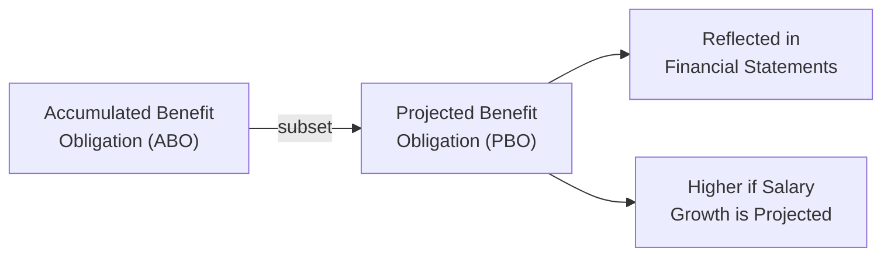
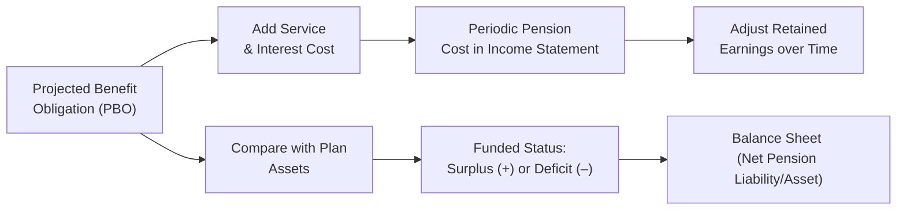

## Introduction

Have you ever peeked into a company’s annual report and felt a little overwhelmed by the pension section? Well, you’re definitely not alone—pension accounting can feel daunting. But once you understand the fundamental building blocks, something magical happens: it all starts to click. In this section, we’ll dig into two critical measures of pension obligations—Accumulated Benefit Obligation (ABO) and Projected Benefit Obligation (PBO)—and explore how they link to the service costs that show up in a firm’s financial statements.

We’ll also talk about discount rates, how small changes in assumptions might have a huge impact on the numbers, and how IFRS and US GAAP handle these concepts. You’ll see that pension accounting is basically a combination of actuarial science, finance, accounting, and sometimes a pinch of artful estimates. Let’s roll up our sleeves and dig in, shall we?

## Measures of Pension Obligations

When we’re looking at pension accounting, one of the first things is to understand how the total pension obligation is actually measured. Two of the most common measures you’ll see are ABO and PBO.

### Accumulated Benefit Obligation (ABO)

The ABO captures the present value of all pension benefits earned by employees up to the measurement date, but crucially, it’s based on employees’ current compensation levels. In other words, it’s like saying, “Let’s imagine time froze right now. Nobody’s going to get a future raise. How much do we owe everyone for what they’ve earned so far?” 

• The ABO leaves out future salary increases.  
• It’s typically less than the PBO, especially in situations where significant wage growth is expected over time.  
• Under US GAAP, ABO serves as a measure for minimum pension liability calculations (though modern standards often focus more on PBO).  

### Projected Benefit Obligation (PBO)

The PBO, on the other hand, attempts to look into the crystal ball and anticipate future wage increases. It says, “Let’s factor in not just what employees have earned, but also the raises they’re likely to get.” Not surprisingly, the PBO is usually bigger than the ABO because it reflects higher anticipated compensation in later years.

• The PBO is the most common measure for recognized liabilities under US GAAP (and in practice under IFRS as well).  
• Because it includes projected salary growth, it’s closer to the “true” cost of fulfilling pension promises if wages keep increasing.  
• It’s updated each year to reflect changes in assumptions (e.g., discount rates, turnover), and also to account for another year of service cost.

To help visualize these relationships, see the diagram below:

ABO is essentially a subset of the PBO. Once you factor in the effect of future salaries, you get the PBO.

## Key Components of Periodic Pension Costs

Now that you understand ABO and PBO, let’s look at how the expense (often called net periodic pension cost or net pension expense) is calculated. There are several building blocks:

### Service Cost

Think of service cost as the amount employees “earn” in pension benefits during the current year. If each year of service translates into an additional slice of the pie, service cost is the present value of that slice.

• Under IFRS, current service cost is included as an expense in the income statement.  
• Under US GAAP, it’s also recognized in the income statement, typically as part of compensation costs.  
• It’s usually the biggest element of pension expense because it captures the real growth of the obligation.

### Interest Cost

Because pension obligations are long-term, we have to account for the time value of money. The interest cost is calculated by multiplying the discount rate by the beginning balance of the pension obligation (usually the PBO).

• Higher discount rates increase interest cost as a nominal figure, but ironically reduce the PBO itself (since you discount future cash flows at a larger number).  
• Under both IFRS and US GAAP, the discount rate is generally the yield on high-quality corporate bonds in the region where the entity operates (e.g., AA-rated bonds).

### Expected Return on Plan Assets (US GAAP) or Net Interest (IFRS)

Pension plans typically invest in assets—stocks, bonds, perhaps alternative investments—to meet future obligations. Under US GAAP, the employer estimates an “expected return on plan assets,” which often reduces the recognized pension cost. IFRS uses a slightly different approach by applying the same discount rate to the net pension liability (or asset), calling it “net interest.”

• US GAAP: 
  - The employer picks an expected long-term rate of return on plan assets.  
  - Net periodic pension cost = Service Cost + Interest Cost − Expected Return on Plan Assets ± other components.

• IFRS:
  - The net pension liability (or asset) is multiplied by the discount rate to derive “net interest.”  
  - There is no separate “expected return on plan assets” line item; it’s effectively “discount rate × net funding status.”

### Actuarial Gains and Losses

Here’s where things get a bit more interesting. Actuarial gains and losses arise when actual developments differ from assumptions or when those assumptions get revised. For instance, maybe the plan assumed that 10% of employees would retire early, but only 2% actually did. That difference hits your actuarial calculations.

• Under US GAAP, actuarial gains/losses can be recognized in Other Comprehensive Income and then potentially amortized into the income statement using the “corridor approach.”  
• Under IFRS, these remeasurements go straight to Other Comprehensive Income and generally stay there (no subsequent reclassification to the income statement).  
• Because of the smoothing approaches under US GAAP, it’s crucial to check footnotes to see exactly how large these unrecognized gains/losses might be.

### Past Service Cost (Prior Service Cost)

Sometimes, a company might amend its pension plan to grant higher benefits for years already served (like a retroactive raise for retirement benefits). The cost of these amendments is called past service cost (IFRS) or prior service cost (US GAAP).

• Under IFRS, past service cost hits the income statement immediately.  
• Under US GAAP, prior service cost is initially recorded in Other Comprehensive Income and then amortized over the remaining service life of the affected employees.  

The key takeaway here: if a company sweetens the pension deal retroactively, the plan sponsor must recognize extra expense that reflects the cost of that generosity.

## Discount Rate Determination

Ever wonder how a company picks the discount rate? This is one of the biggest judgment calls in pension accounting. It’s typically based on the yield of high-quality corporate bonds (e.g., AA-rated), matching the currency and duration of the pension obligations. Under IFRS, it’s spelled out in IAS 19; under US GAAP, it’s guided by ASC 715-30.

• Lower discount rate:
  - Increases the present value of obligations (makes them more expensive).  
  - Boosts the interest cost as a percentage of the inflated liability.  
• Higher discount rate:
  - Reduces the present value of obligations.  
  - Lowers the reported liability on the balance sheet, which might make a company appear less leveraged.

It sounds great to just pick a higher discount rate and shrink your pension liability, but auditors and regulators will frown if the selected rate is not justifiable. This is why high-grade corporate bond yields are commonly used: it keeps things consistent and less ripe for manipulation.

## Challenges in Selecting Actuarial Assumptions

Discount rates are only part of the story. Employers and actuaries also have to guess about future salary increases, employee turnover, mortality rates, and more. Let me tell you, the difference between an assumed 3% annual salary increase versus a 4% annual salary increase can blow up your obligations, especially if you’re dealing with a young workforce that has decades to go.

• Salary Growth Rate: Affects the PBO calculation under final-pay plans.  
• Mortality Tables: If employees live longer than expected, the plan pays out more.  
• Employee Turnover: If turnover is higher, fewer employees may earn the full benefit, actually lowering total liability.  
• Inflation: Driving future wage growth and cost-of-living adjustments, if any.  

Small changes can lead to big swings in the recognized liability and expense. This is why pension footnotes often include a “sensitivity analysis” stating how a 0.5% shift in discount rate or wage growth assumption might alter the pension obligation by millions of dollars.

## Impact on Financial Statements and Ratios

Think about how these measurements flow through an income statement and balance sheet. The bigger the pension liability, the higher a firm’s leverage can appear. Pension deficits reduce equity, since a liability beyond funded assets effectively sits on the company’s balance sheet.

• Debt-to-Equity Ratio: If the pension liability is large, debt-to-equity may climb.  
• Return on Assets (ROA): Pension assets (if recognized as part of total assets) can inflate the denominator, but in many statements, plan assets are netted against the liability.  
• Profit Margins: Service cost and net interest cost can significantly reduce operating profit if the pension plan is large relative to the size of the company.

From an analyst’s point of view, you want to see how stable or volatile these obligations might be. A big chunk of unrecognized actuarial losses sitting in Other Comprehensive Income is like a ticking time bomb—it might cause unexpected hits to equity in the future if remeasurements must be recognized more fully.

## Best Practices in Reviewing Footnotes

Pension footnotes are your friend. They give all the goodies: discount rates, expected returns, mortality tables, etc. This is where you find out if a plan sponsor is using assumptions that seem, uh, let’s say “optimistic.” I used to joke with colleagues: footnotes are like the map to hidden treasure. Intersection of footnotes and a calculator is where the real detective work begins!

Look specifically for:  
• The discount rate used and how it compares to market yields.  
• The expected long-term rate of return on assets, which might be too high if the plan invests in conservative instruments.  
• A breakdown of plan assets: is the fund heavily in equities, or are they more conservative fixed income?  
• Methods for recognizing gains/losses (corridor approach under US GAAP, immediate recognition under IFRS).  
• Sensitivity analyses for mortality, discount rate, and compensation growth changes.  

## A Quick Numerical Illustration

Say we have a small plan that starts the year with a PBO of $100 million. The discount rate is 4%, and the service cost for the current year is $5 million. Assume the plan assets also start at $80 million, and the expected return on assets (US GAAP) is 6%.

• Interest Cost on the PBO = 4% × $100 million = $4 million  
• Service Cost = $5 million  
• Expected Return on Plan Assets = 6% × $80 million = $4.8 million  

So the net periodic pension cost (before any amortization or recognized actuarial gains/losses) might look like:

Net Periodic Pension Cost = Service Cost + Interest Cost − Expected Return on Plan Assets

= $5 million + $4 million − $4.8 million  
= $4.2 million

In the real world, you’d also have to factor in any amortization of past service cost or recognized actuarial losses/gains. But hopefully this simple example shows you the interplay among service cost, interest cost, and return on assets.

## Visualizing the Pension Accounting Flow

Below is a simplified flow to see how ABO/PBO interplay with net periodic pension cost and the resulting pension liability or surplus on the balance sheet.

## Exam Relevance

In a CFA Level II context, you’ll often get item sets (vignettes) describing a company’s pension arrangements, the assumptions they’ve used, and the resulting expense. You might be asked to:  
• Calculate the net periodic pension cost given the discount rate, service cost, interest cost, and expected return on assets.  
• Illustrate how a change in discount rate or assumption about salary growth affects the PBO.  
• Compare IFRS vs. US GAAP treatment of actuarial gains/losses, especially how they appear in Other Comprehensive Income or are recognized immediately in the profit or loss.  
• Analyze a footnote to identify potential red flags or manipulative assumptions.

## Conclusion

Understanding how pension obligations and associated service costs are measured is crucial for interpreting a firm’s financial position. The ABO and PBO serve as yardsticks for the plan’s present and future obligations, respectively, and the periodic pension cost components—service cost, interest cost, expected return on plan assets (or net interest under IFRS)—are key to grasping how these liabilities move each year. Ultimately, diving into footnotes to check the assumptions is one of the best ways to figure out whether a firm’s pension accounting is straightforward or if it involves, shall we say, a little creative guesswork. And trust me, the more you dig in, the more you’ll appreciate just how much these numbers can move!

## References

• IFRS Foundation, IAS 19, “Defined Benefit Obligation Measurement,” https://www.ifrs.org  
• FASB ASC 715-30, “Defined Benefit Plans—Pension,” https://www.fasb.org  
• CFA Institute. (2025). CFA® Program Curriculum, Level II.  

---

## Practice Questions: Mastering Pension Obligations and Service Costs



### Which measure of pension obligation takes into account future salary increases?
- [ ] Accumulated Benefit Obligation (ABO)
- [x] Projected Benefit Obligation (PBO)
- [ ] Vested Benefit Obligation (VBO)
- [ ] All of the above

> **Explanation:** The PBO factors in projected future salary increases, whereas the ABO does not.

### Under US GAAP, which component of pension cost represents the value of benefits earned by employees during the current period?
- [ ] Interest cost
- [x] Service cost
- [ ] Past service cost
- [ ] Liability remeasurement

> **Explanation:** Service cost corresponds to benefits earned in the current year.

### Under IFRS, how are actuarial gains and losses generally recognized?
- [ ] All recognized immediately in net income
- [ ] Deferred in retained earnings and not recognized
- [x] Recognized in Other Comprehensive Income and not reclassified
- [ ] Recognized as an adjustment to plan assets only

> **Explanation:** IFRS requires that remeasurements (actuarial gains/losses) go directly to Other Comprehensive Income and remain there.

### If a company increases its discount rate, what is the most likely immediate effect on the pension obligation?
- [x] Pension obligation decreases
- [ ] Pension obligation increases
- [ ] No direct effect on the obligation
- [ ] Pension obligation becomes fully funded automatically

> **Explanation:** Higher discount rates reduce the present value of future payments.

### Under US GAAP, which item is typically subtracted when calculating periodic pension cost?
- [x] Expected return on plan assets
- [ ] Actual return on plan assets
- [ ] Salaries expense
- [ ] Amortization of corridor

> **Explanation:** US GAAP uses the expected return on plan assets to reduce net pension expense.

### Which of the following does NOT typically affect the choice of discount rate for pension liabilities?
- [ ] Yield on high-quality corporate bonds
- [ ] Currency and duration of the obligation
- [ ] Economic environment
- [x] Company’s own borrowing rate regardless of bond yields

> **Explanation:** Companies generally match the discount rate to the yield curve of high-grade corporate bonds. They do not simply use their own borrowing cost if it differs significantly from market yields.

### Assume a company amends its defined benefit plan to grant employees higher benefits for prior service. Under IFRS, how is the increase in liability recognized?
- [ ] Amortized over the remaining service lives
- [x] Recognized immediately in profit or loss
- [ ] Recognized only if fully vested
- [ ] Deferred and recognized in Other Comprehensive Income

> **Explanation:** Under IFRS, past service costs are recognized immediately in the income statement.

### A “corridor” approach is used under US GAAP primarily to handle what?
- [ ] Unfunded benefit obligations
- [ ] Salary growth projections
- [x] Amortization of actuarial gains and losses
- [ ] Pension asset reporting

> **Explanation:** US GAAP’s corridor approach is a smoothing mechanism that partially defers recognition of actuarial gains and losses into the future.

### How does a lower discount rate affect the reported pension liability on the balance sheet?
- [ ] Reduces it
- [ ] Has no effect on it
- [x] Increases it
- [ ] Converts it into an off-balance-sheet item

> **Explanation:** A lower discount rate increases the present value of future obligations, thus increasing the reported liability.

### When discussing the ABO, it excludes:
- [x] Future salary increases
- [ ] Employee turnover
- [ ] Vested benefits
- [ ] Mortality assumptions

> **Explanation:** ABO is measured based on current salaries and does not build in the effect of anticipated future raises.


