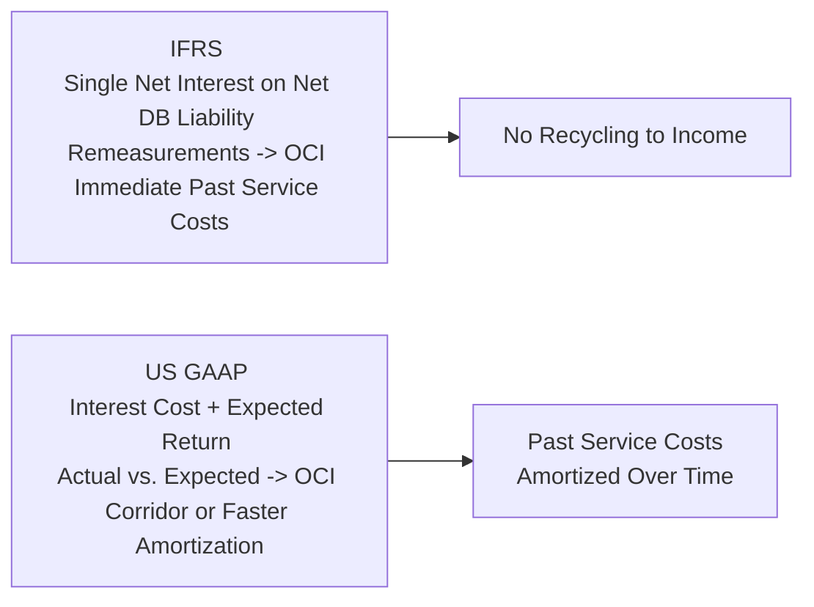

High-Level Overview  
You know, for many years in practice, pension accounting was like this big old puzzle—especially when I first dug into the differences between IFRS and US GAAP. I remember handling a client file and thinking, “Wait, under IFRS it’s one line, but under US GAAP we have all these separate pieces.” It felt like traveling between two countries that both speak English but use totally different slang. This section will help you navigate that landscape, focusing on how IFRS and US GAAP differ when it comes to recognizing and measuring defined benefit pension liabilities. Ultimately, understanding these differences matters because pension costs can significantly affect a company’s reported earnings, equity, and, oddly enough, how stable or volatile those earnings appear over time.

Background and Context  
Before we dive in, remember that we introduced basic pension concepts in earlier sections of Chapter 7.2, including how a defined benefit obligation (DBO) arises from the promise to pay employees in the future. We also touched on the typical components of pension expense—service cost, interest cost, and the return on plan assets. Now we’ll get into the specifics of how IFRS and US GAAP treat each of these elements differently.

IFRS Approach: Net Interest and Remeasurements  
Under IFRS, the focus is on a streamlined view of the pension’s net funded status—basically, the difference between the present value of the defined benefit obligation and the fair value of plan assets. IFRS lumps interest cost on the obligation and the expected return on assets into a single net interest component, which is calculated by applying the plan’s discount rate to the net pension liability (or asset). Also:

• Remeasurements (which include actuarial gains and losses on liabilities plus any difference between the actual and net interest-based return on plan assets) go straight to Other Comprehensive Income (OCI).  
• Once these remeasurements are in OCI, they stay there. There’s no “recycling” them back into the income statement in later periods.  
• Past service costs are recognized immediately in the income statement. No messing around, no waiting. IFRS basically says: “If you change the benefits retroactively, it hits your income statement that period.”

US GAAP Approach: Expected Return and “Smoothing”  
Meanwhile, US GAAP tries to show interest cost and an “expected” return on plan assets in pension expense. The difference between this expected return and the actual return on plan assets winds up in OCI. Over time, these differences, along with actuarial gains and losses from changes in assumptions, can be funneled back through the income statement—but not necessarily right away:

• The corridor approach is a well-known GAAP concept that tries to limit how much volatility hits your income statement from these changes. In short, if the cumulative net unrecognized gains/losses exceed 10% of the greater of the plan assets or obligation, the excess is amortized.  
• Companies might also choose faster recognition policies, but typically many stick with the corridor to smooth out big swings.  
• Additional nuance: Past service costs (such as when a plan is amended) don’t show up as an immediate expense in the income statement for the entire amount. They’re usually amortized over the future service periods of employees who are affected by the amendment—unless they’re already vested employees, in which case it might be recognized more quickly.

Diagram: IFRS vs. US GAAP Pension Structure  
Below is a simple Mermaid diagram that tries to illustrate this high-level structure. This might help you “see” the difference in a single snapshot.

As you can see, IFRS tries to keep it all in a single “net” calculation for interest, while US GAAP splits it up. IFRS lumps all remeasurements into OCI (forever, basically), whereas US GAAP can later pull some portion of it out of OCI and into the income statement via amortization.

Impact on Earnings Volatility  
So which method is more “volatile”? Well, IFRS is arguably more direct in that your net interest always reflects the discount rate times your net liability or asset. Then, any surprises or differences go right to OCI. Because IFRS doesn’t reclassify remeasurements from OCI back to the income statement, the main hits to earnings show up as:

• Current service cost (in operating expenses or employee benefit expense line in the income statement).  
• Past service cost (immediately recognized if there’s a plan amendment).  
• Net interest cost (the discount rate multiplied by net liability/asset).

Under US GAAP, the actual income statement effect can be smoothed over time due to the corridor approach or other policies. That means you could see relatively stable reported pension expense from year to year, even if the plan’s actual returns jump up and down. Meanwhile, the more extreme changes accumulate in Accumulated Other Comprehensive Income (AOCI) and pop back into the income statement only if they exceed certain thresholds. So you can guess that IFRS data might show bigger swings in the statement of comprehensive income (especially within OCI) from year to year, while US GAAP’s approach might keep net income more consistent, or at least more “predictable” from a short-term perspective.

Past Service Costs: A Deeper Look  
We alluded to past service costs briefly, but it’s worth emphasizing because exam questions often zero in on this point. Let’s say a company decides to improve pension benefits retroactively—maybe they decide employees deserve a bit more credit for prior years of service. Under IFRS, that’s recognized in the income statement right away. No slowly dribbling it out. In US GAAP, though, you typically spread (amortize) that cost out over the future working lifetimes of the relevant employees. Of course, if the employees are fully or mostly vested, your “remaining service life” might be quite short, so you could see a big chunk recognized quickly anyway, but it’s still not quite as immediate as IFRS demands.

Real-World Scenario  
Imagine you have two global companies in the same industry:  
• Company A follows IFRS. They run into big changes in discount rates and see higher-than-expected returns on plan assets this year. They post a large gain in OCI labeled as “Remeasurements of Defined Benefit Plans,” which will stay there. Because IFRS lumps interest on obligations and expected asset return into one net figure, you see a single line item that maybe looks bigger than you’d expect.  
• Company B uses US GAAP. They show separate line items for interest cost and expected return on assets in the income statement, and a big portion of the difference between the expected and actual returns is recognized in OCI. If they have a corridor approach, maybe only a small portion of that big difference gets recognized in the coming year’s income statement. Over time, they’ll amortize the rest.  

So in year one, you might look at Company A and say, “Wow, they took a huge hit to their comprehensive income,” while Company B’s net income remains surprisingly stable. But watch out—B could carry some big unrecognized losses (or gains) hidden away in AOCI. If market conditions keep messing around with plan values, they might eventually have to release those amounts from AOCI into profit or loss, leading to a delayed but still very real impact on net income.

Presentation and Disclosure Effects on Analysis  
From a ratio analysis perspective, IFRS recognition will typically reflect more timely changes in the plan’s funded status, which can cause equity (via OCI) to fluctuate a bit more. Also, because IFRS lumps net interest into a single figure, it might make it slightly easier to see the net liability/asset cost in one number instead of trying to piece it together from multiple lines.

Under US GAAP, watch out for those large amounts sitting in AOCI—it can distort your analysis of equity, leverage, and profitability measures unless you do your due diligence to figure out how much of the corridor might get recognized in the near future. Some analysts will even perform “what if” scenarios, imagining full recognition of those unamortized gains or losses to see the potential worst-case scenario for the income statement.

Comparability Considerations  
One of the biggest takeaways is that you can’t just look at a pension expense line under IFRS and compare it directly to the same line under US GAAP. You might need to do some adjusting to put both sets of numbers on the same footing. You might attempt to remove smoothing effects from the US GAAP results or allocate IFRS remeasurements in a way that better matches the recognition pattern in US GAAP, depending on which approach you prefer. The key point: Pension accounting differences can significantly affect net income, OCI, and equity, so be careful when you’re comparing two companies. There’s always a risk you’ll misinterpret which set of numbers best represents the economic realities of the company’s pension plan.

Common Pitfalls and Best Practices  
• Pitfall: Focusing only on the income statement. Some folks forget to track the pension’s funded status in the balance sheet or the accumulated net losses in OCI.  
• Pitfall: Assuming IFRS is “more aggressive.” It’s not necessarily more or less conservative—just more immediate in certain respects (like past service costs). That can make IFRS appear more volatile, but it also means IFRS statements might reflect changes more in real time.  
• Best Practice: Adjust the financials for your analysis. For instance, if you want an apples-to-apples ratio comparison, consider how corridor amortizations might eventually hit the income statement if you’re analyzing multiple years.  
• Best Practice: Keep an eye on interest rates. Both standards rely on discount rates, but IFRS uses that discount rate to compute net interest on the net obligation, while US GAAP separates interest on the obligation from an “expected” return on assets, which might be based on a different assumption.  

Glossary  
Net Interest (IFRS)  
A single metric that represents interest on the defined benefit obligation, offset by the expected return on plan assets, both calculated using the discount rate.  

Remeasurements (IFRS)  
Actuarial gains and losses plus any difference between actual return on plan assets and the net interest on the net defined benefit liability or asset. These go to OCI and stay there—never reclassified to profit or loss.  

Amortization of Actuarial Gains/Losses (US GAAP)  
Unrecognized actuarial gains and losses that can be gradually recognized in the income statement over several years.  

Corridor Approach (US GAAP)  
A method that requires annual recognition of gains and losses only if they exceed 10% of the greater of (a) plan assets or (b) the defined benefit obligation. Any excess is typically amortized over a specified period.  

OCI (Other Comprehensive Income)  
The section of equity (and comprehensive income) that captures certain gains and losses bypassing the income statement. IFRS and US GAAP both use OCI, but the rules for recycling or not recycling these amounts differ.  

Practical Tips for the Exam  
• Know how to compute pension expense under each regime. You might be asked to split service cost, interest cost, and returns on assets. Under IFRS, you’d combine interest on the liability with the asset return.  
• Understand where remeasurements (IFRS) and actuarial gains/losses (US GAAP) go, who recycles and who doesn’t.  
• Past service cost: IFRS recognizes immediately, US GAAP is typically an amortization game.  
• Expect item set questions where a vignette might sneak in details about discount rate changes, plan amendments, or big differences in expected vs. actual returns, and ask you to determine how it flows through the statements under each standard.  

References  
• IAS 19 (IFRS), “Recognition of Actuarial Gains and Losses,” IFRS Foundation  
• FASB ASC 715-20, “Disclosures about Postretirement Benefit Plans,” https://www.fasb.org  
• Research Article: “Pension Accounting under IFRS and US GAAP—A Comparative Analysis,” Accounting and Finance Journal  

Anyway, that’s the core of it. Now, let’s reinforce your understanding with some practice questions. And trust me: These differences come up all the time in real life—and exam life too. Being on top of it can help you sidestep a ton of confusion down the road!

## Test Your Knowledge: IFRS vs. US GAAP Pension Liability Reporting



### Under IFRS, which of the following statements best describes how “net interest” is determined for a defined benefit plan?

- [ ] It is based on the actual return on plan assets.  
- [x] It reflects interest on the net pension liability or asset, calculated using the discount rate.  
- [ ] It is the difference between the actuarial gains and losses.  
- [ ] It is the service cost that arises from the current period's employee services.  

> **Explanation:** IFRS combines interest cost on the defined benefit obligation and the expected return on plan assets into one “net interest” figure, calculated by applying the discount rate to the plan’s net pension liability or asset.  

### Under US GAAP, the difference between a plan’s expected return on assets and its actual return on assets is primarily:

- [ ] Recycled immediately to the income statement.  
- [x] Recorded in OCI and potentially subject to future amortization via the corridor approach.  
- [ ] Booked as part of the net interest component.  
- [ ] Recognized as revenue in the statement of financial position.  

> **Explanation:** Under US GAAP, the difference between expected and actual returns is included in OCI. Over time, a portion of these unrecognized gains or losses may be amortized into the income statement if they exceed certain thresholds (e.g., the corridor).  

### Which of the following can cause greater volatility in reported comprehensive income under IFRS compared to US GAAP?

- [ ] IFRS does not allow the use of discount rates.  
- [x] IFRS immediately recognizes past service costs and remeasurements in OCI without reclassification.  
- [ ] IFRS uses a separate line item for expected return on plan assets.  
- [ ] IFRS does not incorporate actuarial gains and losses.  

> **Explanation:** IFRS sends remeasurements (actuarial gains/losses) directly to OCI without reclassification to profit or loss later. Additionally, IFRS immediately recognizes past service costs through the income statement.  

### Under US GAAP, the corridor approach is:

- [ ] A method of calculating net interest based on discount rates.  
- [ ] A full expensing of past service cost in the income statement.  
- [x] A limit on how much actuarial gain or loss needs to be recognized in a given period.  
- [ ] A process for determining the present value of future pension obligations.  

> **Explanation:** The corridor approach only requires recognition of gains or losses that exceed 10% of the greater of the defined benefit obligation or plan assets, spreading out the recognition in the income statement.  

### Past service costs under IFRS:

- [x] Are recognized immediately in the income statement.  
- [ ] Are always recognized through OCI.  
- [ ] Must be amortized using the corridor approach.  
- [ ] Are not recognized if a plan is fully funded.  

> **Explanation:** IFRS requires immediate recognition of past service cost in the income statement for the period in which the plan amendment or curtailment occurs.  

### Under US GAAP, how does the expected return on plan assets factor into pension expense?

- [x] It is subtracted from the total cost to arrive at pension expense.  
- [ ] It is not considered in the calculation of pension expense.  
- [ ] It is added to OCI without impacting pension expense.  
- [ ] It is recognized only in the footnotes.  

> **Explanation:** US GAAP includes an expected return-related offset in pension expense, reducing the net pension cost recognized in the income statement.  

### A company using IFRS has an actuarial gain due to changes in demographic assumptions. How will this gain be presented?

- [ ] It is recognized immediately in the income statement.  
- [ ] It remains off-balance-sheet.  
- [ ] It is deferred until it reaches the corridor threshold.  
- [x] It is recorded in OCI and not recycled to the income statement.  

> **Explanation:** IFRS recognizes actuarial gains and losses in OCI. Once in OCI, they stay there (i.e., no subsequent reclassification to profit or loss).  

### Which best describes the objective of the corridor approach?

- [x] To reduce volatility in the income statement by limiting the recognition of actuarial gains and losses.  
- [ ] To consolidate the net interest and expected return on assets into a single line item.  
- [ ] To allow full immediate recognition of remeasurements.  
- [ ] To deny offsetting of past service costs.  

> **Explanation:** The corridor approach is used under US GAAP to mitigate large swings in pension expense by imposing a threshold before recognition of actuarial gains/losses in income.  

### How do remeasurements differ from expected asset return in IFRS pension reporting?

- [ ] Remeasurements are recognized in the income statement, while expected asset return is in OCI.  
- [ ] Both are always amortized based on future service lives of employees.  
- [ ] Remeasurements only apply to plan assets, not the defined benefit obligation.  
- [x] Remeasurements represent actual deviations and go directly to OCI, whereas net interest uses the discount rate as the assumed return.  

> **Explanation:** IFRS calculates net interest at the discount rate on the net pension liability (or asset). The difference between actual return and that assumed rate (plus any actuarial adjustments) is captured in remeasurements, recognized in OCI.  

### True or False: Under US GAAP, a company must immediately recognize all unrecognized actuarial losses when they exceed the corridor threshold.

- [x] True  
- [ ] False  

> **Explanation:** Once actuarial losses exceed the corridor threshold, that excess is amortized to pension expense over time. While it’s not recognized all at once in the same period, the requirement to start recognizing it is triggered immediately if it exceeds the threshold.  


